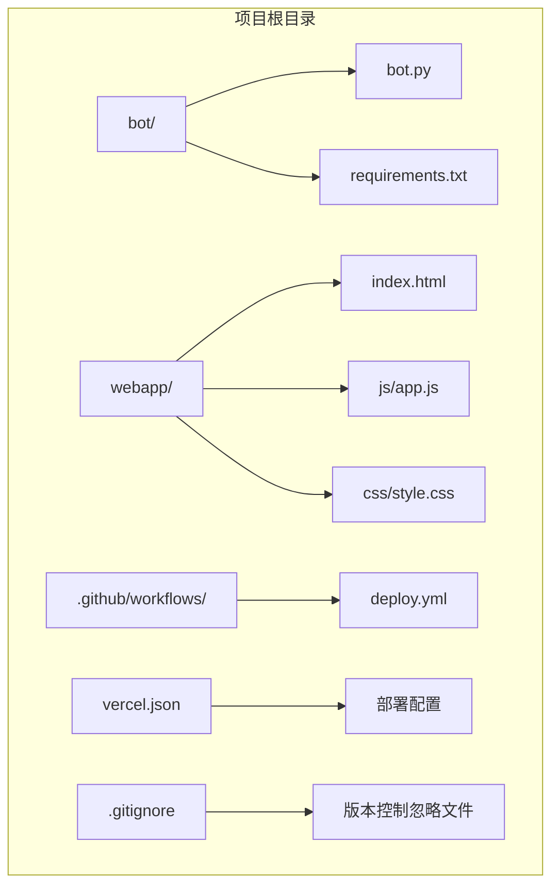
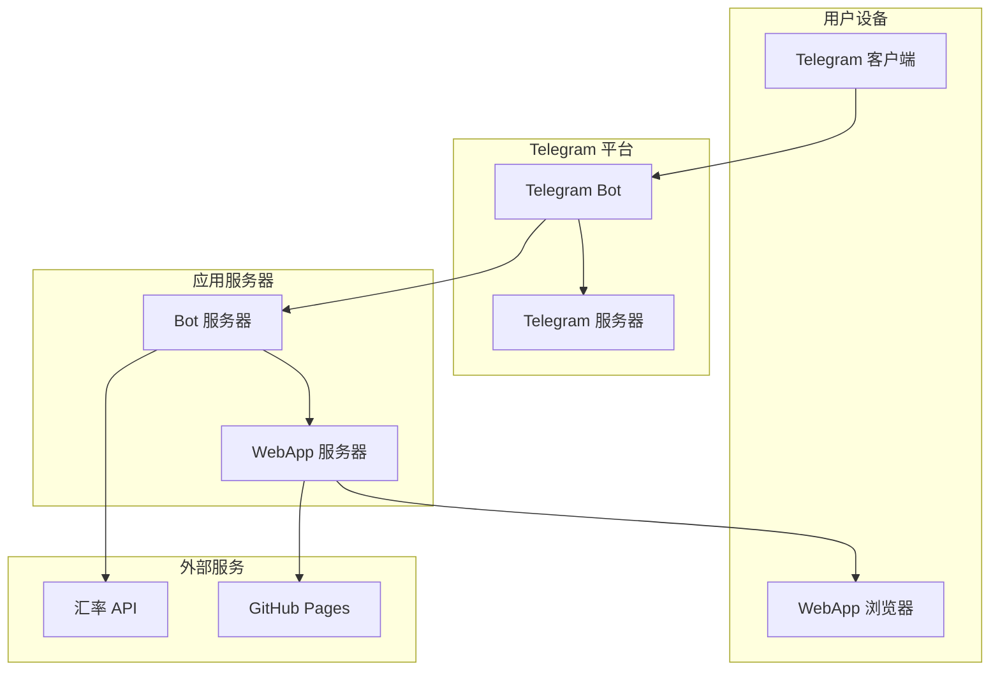
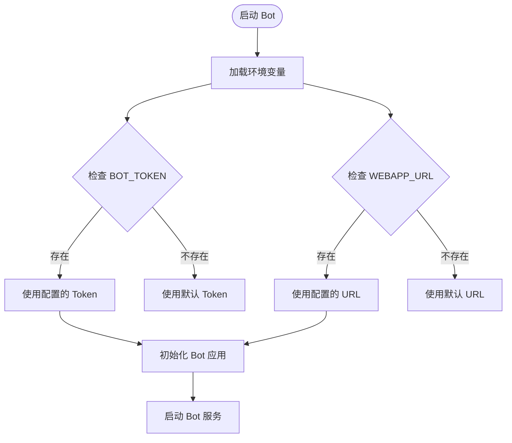
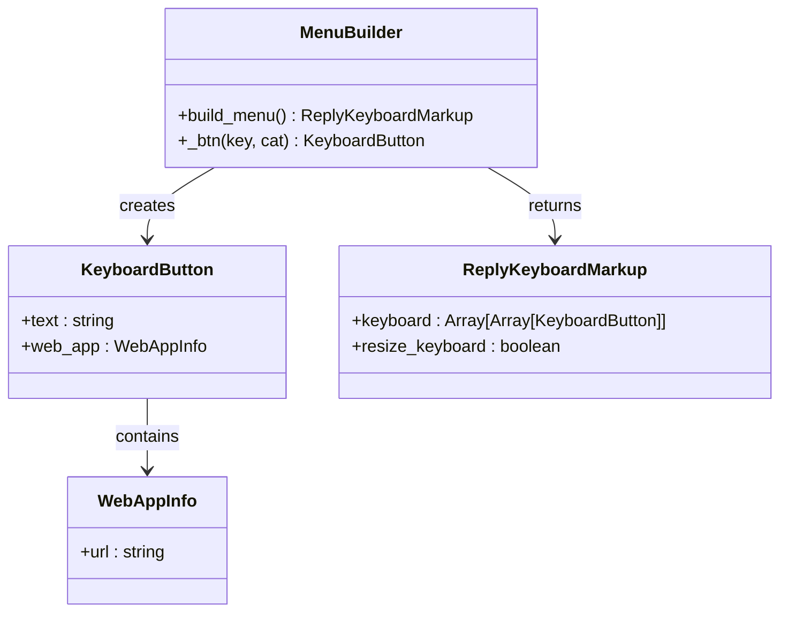
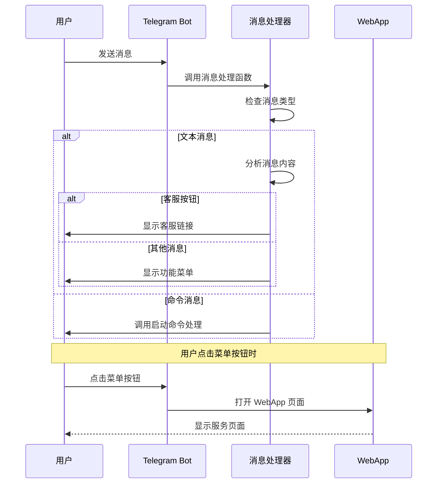
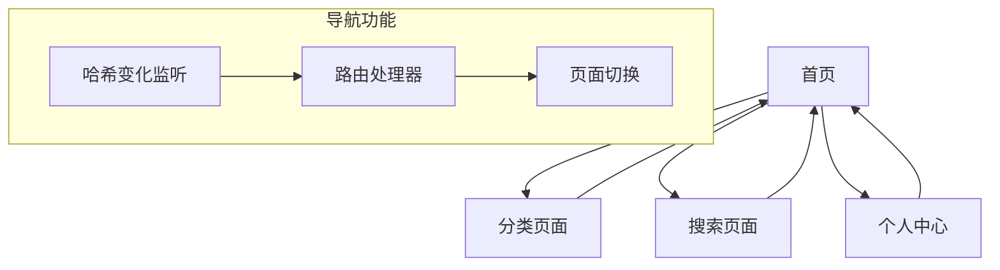
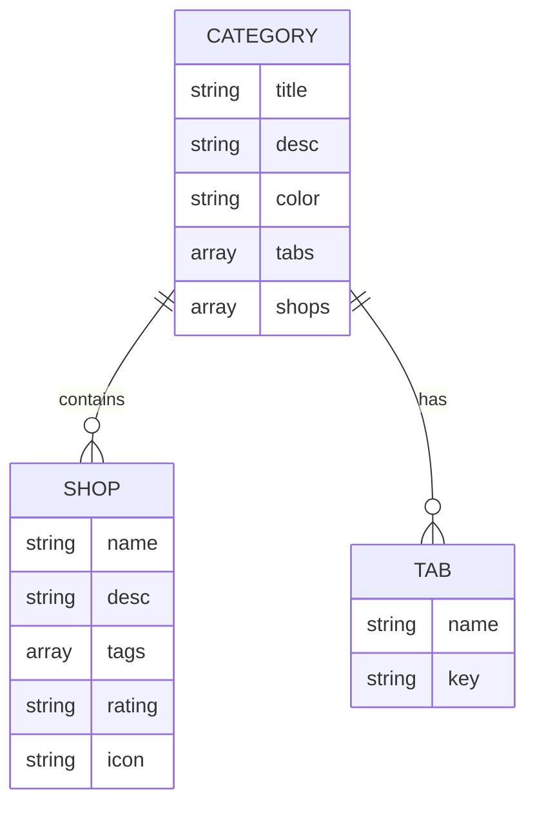
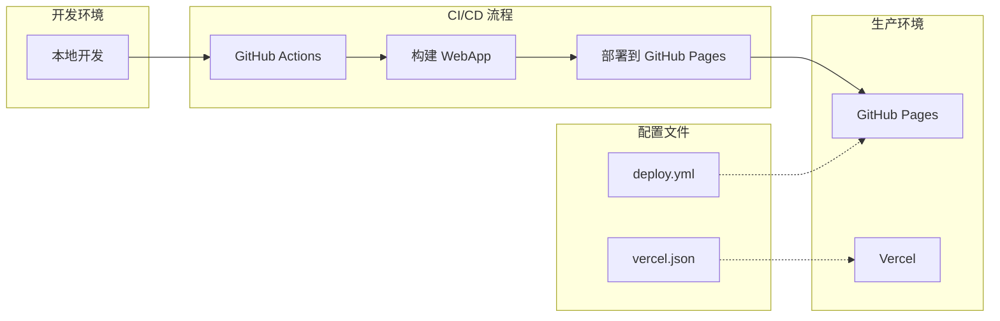

# Bot 创建与配置

<cite>
**本文档引用的文件**
- [bot.py](file://bot/bot.py)
- [requirements.txt](file://bot/requirements.txt)
- [index.html](file://webapp/index.html)
- [app.js](file://webapp/js/app.js)
- [style.css](file://webapp/css/style.css)
- [vercel.json](file://vercel.json)
- [deploy.yml](file://.github/workflows/deploy.yml)
</cite>

## 目录
1. [简介](#简介)
2. [项目结构](#项目结构)
3. [核心组件](#核心组件)
4. [架构概览](#架构概览)
5. [详细组件分析](#详细组件分析)
6. [依赖分析](#依赖分析)
7. [性能考虑](#性能考虑)
8. [故障排除指南](#故障排除指南)
9. [结论](#结论)

## 简介

本项目是一个基于 Telegram 的木姐同城生活助手 Bot，集成了 WebApp 功能，为用户提供本地生活服务信息查询、商户推荐、便民服务等功能。该项目采用 Python Telegram Bot 库构建后端 Bot，使用纯前端技术构建 WebApp，实现了 Bot 与 WebApp 的无缝集成。

## 项目结构

项目采用模块化组织方式，主要分为三个核心部分：

**图表来源**
- [bot.py:1-88](file://bot/bot.py#L1-L88)
- [index.html:1-145](file://webapp/index.html#L1-L145)
- [app.js:1-87](file://webapp/js/app.js#L1-L87)

**章节来源**
- [bot.py:1-88](file://bot/bot.py#L1-L88)
- [index.html:1-145](file://webapp/index.html#L1-L145)
- [app.js:1-87](file://webapp/js/app.js#L1-L87)

## 核心组件

### Bot 核心功能

Bot 主要包含以下核心功能模块：

1. **启动命令处理** - 处理 `/start` 命令，向用户发送欢迎消息和功能菜单
2. **文本消息处理** - 处理用户输入的文本消息，提供相应的服务响应
3. **WebApp 集成** - 通过内联键盘按钮集成 WebApp 功能
4. **客户服务** - 提供在线客服联系方式

### WebApp 组件

WebApp 采用单页应用架构，包含以下页面：

1. **首页** - 展示轮播广告、搜索栏、服务分类网格
2. **分类页面** - 按服务类型展示商户信息
3. **搜索页面** - 支持关键词搜索功能
4. **跑腿服务页面** - 提供同城跑腿服务
5. **曝光台页面** - 用户举报不良商家功能
6. **活动页面** - 展示同城活动信息
7. **个人中心页面** - 用户个人信息和设置

**章节来源**
- [bot.py:45-75](file://bot/bot.py#L45-L75)
- [index.html:21-145](file://webapp/index.html#L21-L145)
- [app.js:1-87](file://webapp/js/app.js#L1-L87)

## 架构概览

系统采用客户端-服务器架构，Bot 作为 Telegram 平台的客户端，WebApp 作为独立的网页应用：

**图表来源**
- [bot.py:77-83](file://bot/bot.py#L77-L83)
- [index.html:9-9](file://webapp/index.html#L9-L9)
- [vercel.json:1-8](file://vercel.json#L1-L8)

## 详细组件分析

### Bot 核心实现

Bot 的核心逻辑集中在 `bot.py` 文件中，采用异步编程模式：

#### 环境变量配置

Bot 使用环境变量进行配置管理：

**图表来源**
- [bot.py:9-11](file://bot/bot.py#L9-L11)
- [bot.py:77-83](file://bot/bot.py#L77-L83)

#### 菜单构建系统

Bot 提供动态菜单构建功能，支持多行多列的键盘布局：

**图表来源**
- [bot.py:14-42](file://bot/bot.py#L14-L42)

#### 消息处理流程

Bot 的消息处理采用异步函数模式：

**图表来源**
- [bot.py:45-75](file://bot/bot.py#L45-L75)

**章节来源**
- [bot.py:14-88](file://bot/bot.py#L14-L88)

### WebApp 核心功能

WebApp 采用现代前端技术栈，实现丰富的用户体验：

#### 导航系统

WebApp 使用哈希路由实现 SPA 导航：

**图表来源**
- [app.js:64-76](file://webapp/js/app.js#L64-L76)

#### 数据模型

WebApp 使用结构化数据存储各类服务信息：

**图表来源**
- [app.js:1-49](file://webapp/js/app.js#L1-L49)

**章节来源**
- [app.js:1-87](file://webapp/js/app.js#L1-L87)
- [style.css:1-80](file://webapp/css/style.css#L1-L80)

### 部署配置

项目支持多种部署方式，包括 GitHub Pages 和 Vercel：

**图表来源**
- [vercel.json:1-8](file://vercel.json#L1-L8)
- [deploy.yml:1-31](file://.github/workflows/deploy.yml#L1-L31)

**章节来源**
- [vercel.json:1-8](file://vercel.json#L1-L8)
- [deploy.yml:1-31](file://.github/workflows/deploy.yml#L1-L31)

## 依赖分析

### Python 依赖

项目使用以下核心依赖包：

| 依赖包 | 版本要求 | 用途 | 重要性 |
|--------|----------|------|--------|
| python-telegram-bot | 20.7 | Telegram Bot API 客户端 | 核心依赖 |
| requests | 2.31.0 | HTTP 请求处理 | 外部 API 调用 |

**章节来源**
- [requirements.txt:1-3](file://bot/requirements.txt#L1-L3)

### WebApp 依赖

WebApp 依赖 Telegram 官方 WebApp SDK：

| 依赖项 | 来源 | 用途 |
|--------|------|------|
| telegram-web-app.js | Telegram 官方 CDN | WebApp SDK |
| 内置样式表 | 本地 CSS 文件 | 页面样式 |

## 性能考虑

### Bot 性能优化

1. **异步处理** - 使用异步函数处理消息，提高并发性能
2. **内存管理** - 合理使用环境变量，避免硬编码敏感信息
3. **网络请求优化** - 对外部 API 请求进行错误处理和降级策略

### WebApp 性能优化

1. **懒加载** - 图片和内容按需加载
2. **缓存策略** - 利用浏览器缓存机制
3. **响应式设计** - 适配不同屏幕尺寸

## 故障排除指南

### 常见配置问题

#### Bot Token 配置问题

**问题症状**：Bot 无法启动或连接失败
**解决方法**：
1. 确认 BOT_TOKEN 环境变量正确设置
2. 检查 Token 格式是否正确（应包含冒号分隔符）
3. 验证 Token 是否具有相应权限

#### WebApp URL 配置问题

**问题症状**：菜单按钮无法打开 WebApp
**解决方法**：
1. 确认 WEBAPP_URL 环境变量指向正确的 WebApp 地址
2. 验证 WebApp 已成功部署
3. 检查跨域访问设置

#### 部署问题

**问题症状**：WebApp 无法访问或显示空白页面
**解决方法**：
1. 检查 GitHub Pages 部署状态
2. 验证 vercel.json 配置正确性
3. 确认域名解析正常

### 最佳实践建议

1. **环境变量管理**
   - 在生产环境中使用加密的环境变量管理工具
   - 定期轮换 Bot Token
   - 使用不同的 Token 进行开发和生产环境隔离

2. **安全性考虑**
   - 不要在代码中硬编码敏感信息
   - 实施适当的输入验证和清理
   - 使用 HTTPS 协议保护数据传输

3. **监控和日志**
   - 实施详细的日志记录
   - 设置错误通知机制
   - 监控 Bot 的运行状态和性能指标

4. **备份和恢复**
   - 定期备份配置文件和数据
   - 制定灾难恢复计划
   - 测试备份数据的可用性

**章节来源**
- [bot.py:9-11](file://bot/bot.py#L9-L11)
- [bot.py:77-83](file://bot/bot.py#L77-L83)

## 结论

本项目成功实现了 Telegram Bot 与 WebApp 的集成，为用户提供了一站式的本地生活信息服务。通过模块化的架构设计和清晰的职责分离，项目具备良好的可维护性和扩展性。

关键优势包括：
- 完整的 Bot 功能实现
- 丰富的 WebApp 用户界面
- 灵活的部署选项
- 良好的性能表现

未来可以考虑的功能增强：
- 添加数据库支持以持久化用户数据
- 实现更复杂的业务逻辑和数据处理
- 增加多语言支持
- 实现更高级的用户交互功能