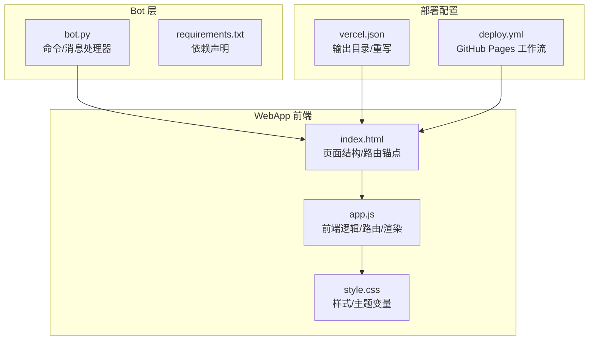
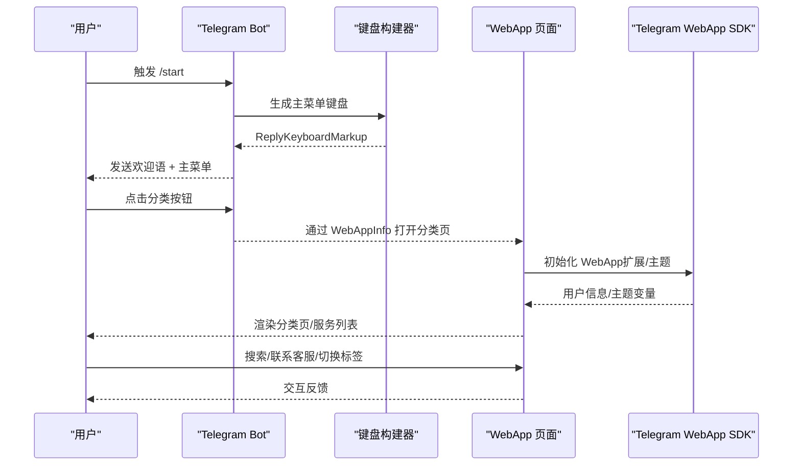
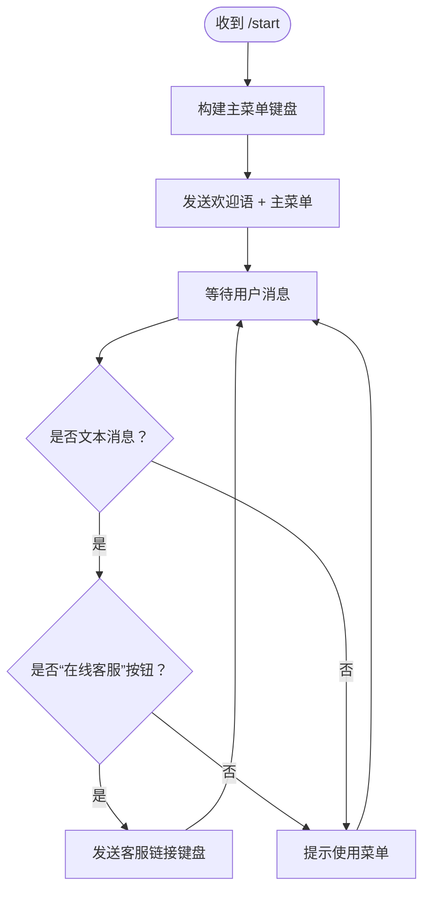
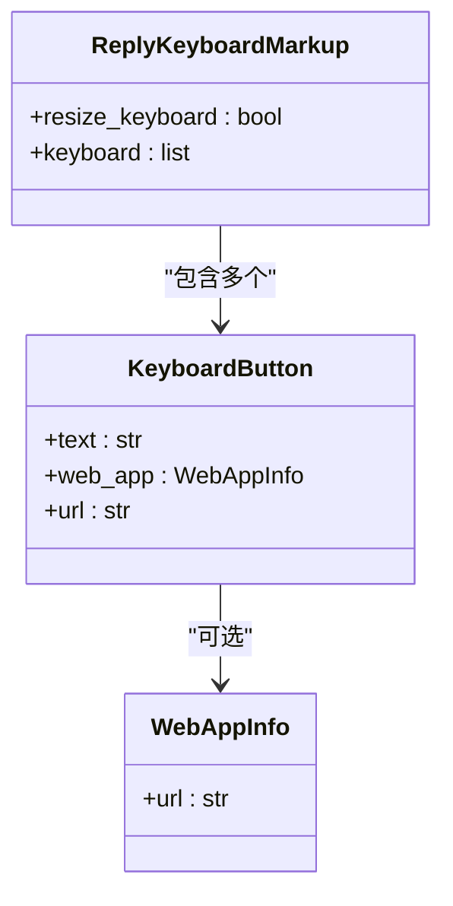
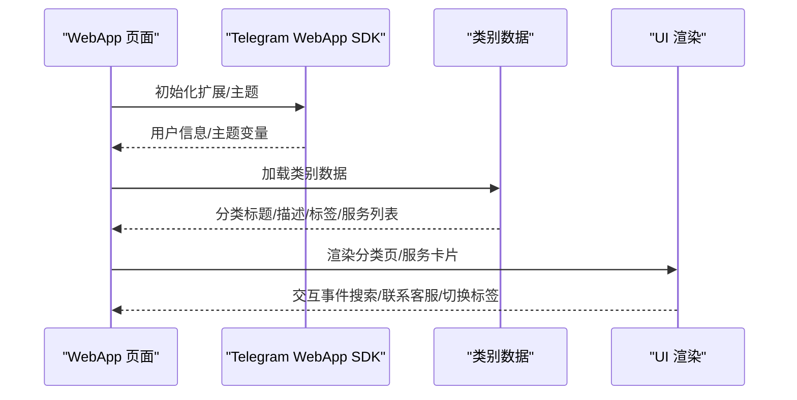
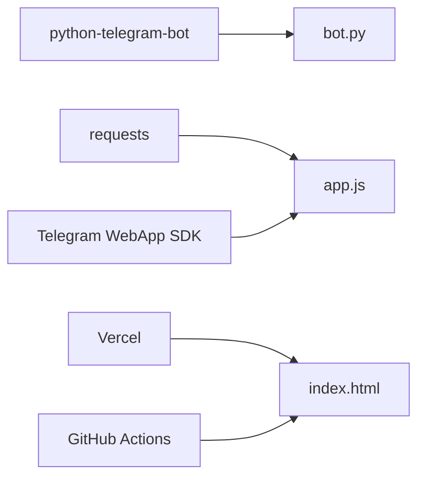

# Telegram Bot 开发

<cite>
**本文引用的文件**
- [bot.py](file://bot/bot.py)
- [requirements.txt](file://bot/requirements.txt)
- [index.html](file://webapp/index.html)
- [app.js](file://webapp/js/app.js)
- [style.css](file://webapp/css/style.css)
- [vercel.json](file://vercel.json)
- [deploy.yml](file://.github/workflows/deploy.yml)
</cite>

## 目录
1. [简介](#简介)
2. [项目结构](#项目结构)
3. [核心组件](#核心组件)
4. [架构总览](#架构总览)
5. [详细组件分析](#详细组件分析)
6. [依赖分析](#依赖分析)
7. [性能考虑](#性能考虑)
8. [故障排查指南](#故障排查指南)
9. [结论](#结论)
10. [附录](#附录)

## 简介
本项目是一个基于 Telegram Bot 的“木姐同城生活助手”，通过 Python-Telegram-Bot 框架实现消息处理与键盘交互，并结合 Telegram WebApp 在 Bot 内嵌入网页应用，提供分类服务导航、实时汇率查询、搜索与联系客服等功能。项目采用轮询模式运行，支持环境变量配置 Bot Token 与 WebApp URL，并在 GitHub Actions 中实现自动化部署至 GitHub Pages 或 Vercel。

## 项目结构
- bot：Bot 核心逻辑与依赖
  - bot.py：主程序入口，包含命令处理器、消息处理器、键盘构建器与启动流程
  - requirements.txt：Python 依赖清单
- webapp：WebApp 前端页面
  - index.html：页面结构与路由锚点
  - js/app.js：前端逻辑（路由、分类页渲染、轮播图、汇率请求等）
  - css/style.css：样式与主题变量
- 部署配置
  - vercel.json：Vercel 输出目录与重写规则
  - .github/workflows/deploy.yml：GitHub Actions 工作流，用于部署到 GitHub Pages

图表来源
- [bot.py:1-88](file://bot/bot.py#L1-L88)
- [requirements.txt:1-3](file://bot/requirements.txt#L1-L3)
- [index.html:1-145](file://webapp/index.html#L1-L145)
- [app.js:1-87](file://webapp/js/app.js#L1-L87)
- [style.css:1-80](file://webapp/css/style.css#L1-L80)
- [vercel.json:1-8](file://vercel.json#L1-L8)
- [.github/workflows/deploy.yml:1-31](file://.github/workflows/deploy.yml#L1-L31)

章节来源
- [bot.py:1-88](file://bot/bot.py#L1-L88)
- [requirements.txt:1-3](file://bot/requirements.txt#L1-L3)
- [index.html:1-145](file://webapp/index.html#L1-L145)
- [app.js:1-87](file://webapp/js/app.js#L1-L87)
- [style.css:1-80](file://webapp/css/style.css#L1-L80)
- [vercel.json:1-8](file://vercel.json#L1-L8)
- [.github/workflows/deploy.yml:1-31](file://.github/workflows/deploy.yml#L1-L31)

## 核心组件
- Bot 主程序
  - 环境变量读取：BOT_TOKEN、WEBAPP_URL
  - 键盘构建器：ReplyKeyboardMarkup 动态生成四行多列按钮，部分按钮集成 WebApp
  - 命令处理器：/start 初始化欢迎语与主菜单
  - 文本消息处理器：识别“在线客服”按钮并返回跳转链接；否则提示使用菜单
  - 运行模式：轮询（drop_pending_updates=True）
- WebApp 前端
  - 页面结构：首页、跑腿、曝光、活动、我的、分类页、搜索页
  - 路由：基于 URL hash 的 SPA 导航
  - 渲染：分类页按类别数据渲染卡片，支持标签筛选
  - 交互：轮播图、热门搜索、联系客服、汇率查询
- 部署配置
  - Vercel：输出目录指向 webapp，重写规则保证前端路由可用
  - GitHub Pages：工作流上传 webapp 目录并部署

章节来源
- [bot.py:9-88](file://bot/bot.py#L9-L88)
- [index.html:1-145](file://webapp/index.html#L1-L145)
- [app.js:1-87](file://webapp/js/app.js#L1-L87)
- [vercel.json:1-8](file://vercel.json#L1-L8)
- [.github/workflows/deploy.yml:1-31](file://.github/workflows/deploy.yml#L1-L31)

## 架构总览
Bot 与 WebApp 的交互通过 Telegram WebApp 机制实现：Bot 侧发送带 WebApp 的键盘按钮，用户点击后在 Telegram 客户端内打开 WebApp 页面，WebApp 通过 Telegram WebApp SDK 获取用户信息并扩展全屏显示，前端根据 URL hash 切换页面并渲染内容。

图表来源
- [bot.py:14-42](file://bot/bot.py#L14-L42)
- [bot.py:45-58](file://bot/bot.py#L45-L58)
- [index.html:1-145](file://webapp/index.html#L1-L145)
- [app.js:51-84](file://webapp/js/app.js#L51-L84)

## 详细组件分析

### Bot 主程序与消息处理
- 环境变量
  - BOT_TOKEN：Bot 认证令牌
  - WEBAPP_URL：WebApp 部署地址
- 键盘构建器
  - 动态生成四行菜单：首页、美食、酒店、购物、换汇、签证、打车、租房、医院、娱乐、美容、工具、车行、快递、在线客服
  - 部分按钮使用 WebAppInfo 打开指定分类页
  - resize_keyboard=True 自适应键盘尺寸
- 命令处理器 /start
  - 组装欢迎语与功能介绍
  - 返回主菜单键盘
- 文本消息处理器
  - 识别“在线客服”按钮，返回联系客服链接
  - 其他情况提示使用菜单
- 运行模式
  - Application.builder().token(...) 构建应用
  - 添加 CommandHandler 与 MessageHandler
  - run_polling(drop_pending_updates=True) 启动轮询

图表来源
- [bot.py:45-58](file://bot/bot.py#L45-L58)
- [bot.py:61-74](file://bot/bot.py#L61-L74)

章节来源
- [bot.py:9-88](file://bot/bot.py#L9-L88)

### 键盘构建器与 WebApp 集成
- 键盘按钮类型
  - KeyboardButton：普通按钮
  - WebAppInfo：嵌入 WebApp 的按钮
- 动态菜单生成
  - 四行多列布局，首行包含“网页版”入口
  - 每个分类按钮对应 WebApp 的分类页路径
- WebApp 集成方式
  - 通过 WebAppInfo(url=...) 将 Bot 消息与 WebApp 页面关联
  - WebApp 通过 Telegram WebApp SDK 初始化并扩展全屏显示

图表来源
- [bot.py:3-42](file://bot/bot.py#L3-L42)

章节来源
- [bot.py:14-42](file://bot/bot.py#L14-L42)

### WebApp 前端逻辑与页面渲染
- 页面结构
  - 首页：轮播图、搜索栏、分类网格、汇率区、热门推荐
  - 分类页：分类标题/描述、标签页、服务列表
  - 搜索页：输入框与热门标签
  - 底部导航：首页、跑腿、曝光、活动、我的
- 路由与导航
  - 基于 URL hash 的 SPA 导航
  - switchTab、navigateTo、goBack 控制页面切换
- 数据与渲染
  - 类别数据集中存储，按类别渲染卡片
  - 支持标签筛选与评分展示
- 交互与主题
  - 轮播图自动播放与手动切换
  - Telegram WebApp SDK 初始化主题与用户信息
  - 联系客服统一跳转到外部链接

图表来源
- [index.html:1-145](file://webapp/index.html#L1-L145)
- [app.js:51-84](file://webapp/js/app.js#L51-L84)

章节来源
- [index.html:1-145](file://webapp/index.html#L1-L145)
- [app.js:1-87](file://webapp/js/app.js#L1-L87)
- [style.css:1-80](file://webapp/css/style.css#L1-L80)

### 部署与环境配置
- Vercel 配置
  - 输出目录：webapp
  - 重写规则：将所有路径映射到前端路由
- GitHub Pages 工作流
  - 上传 webapp 目录并部署到 Pages
- 环境变量
  - BOT_TOKEN：从环境变量读取
  - WEBAPP_URL：从环境变量读取，若未设置则使用默认值

章节来源
- [vercel.json:1-8](file://vercel.json#L1-L8)
- [.github/workflows/deploy.yml:1-31](file://.github/workflows/deploy.yml#L1-L31)
- [bot.py:9-11](file://bot/bot.py#L9-L11)

## 依赖分析
- Python 依赖
  - python-telegram-bot==20.7：Bot 核心库，提供 Update、Application、Handler 等能力
  - requests==2.31.0：用于 WebApp 中的汇率 API 请求
- 前端依赖
  - Telegram WebApp SDK：通过 CDN 引入，提供 WebApp 初始化与主题支持
- 部署依赖
  - Vercel：静态站点托管
  - GitHub Actions：自动化部署到 Pages

图表来源
- [requirements.txt:1-3](file://bot/requirements.txt#L1-L3)
- [app.js](file://webapp/js/app.js#L9)
- [vercel.json:1-8](file://vercel.json#L1-L8)
- [.github/workflows/deploy.yml:1-31](file://.github/workflows/deploy.yml#L1-L31)

章节来源
- [requirements.txt:1-3](file://bot/requirements.txt#L1-L3)
- [app.js](file://webapp/js/app.js#L9)
- [vercel.json:1-8](file://vercel.json#L1-L8)
- [.github/workflows/deploy.yml:1-31](file://.github/workflows/deploy.yml#L1-L31)

## 性能考虑
- 轮询模式
  - 使用 run_polling(drop_pending_updates=True) 避免重复处理历史消息，减少启动时压力
- 键盘构建
  - build_menu 动态生成，避免硬编码，便于扩展新分类
- WebApp 加载
  - 首页轮播图定时切换，建议控制图片数量与大小以降低加载时间
- API 请求
  - 汇率接口采用异步 fetch，失败时回退默认值，提升稳定性
- 部署优化
  - Vercel 输出目录与重写规则确保前端路由正常工作，减少 404 与重定向开销

章节来源
- [bot.py:77-83](file://bot/bot.py#L77-L83)
- [app.js:62-84](file://webapp/js/app.js#L62-L84)
- [vercel.json:1-8](file://vercel.json#L1-L8)

## 故障排查指南
- Bot 无法启动或报错
  - 检查 BOT_TOKEN 是否正确设置
  - 确认 Telegram Bot 服务器可达
- WebApp 无法打开或空白
  - 检查 WEBAPP_URL 是否正确且可访问
  - 确认 Vercel 或 Pages 部署成功
- 键盘按钮无效
  - 确认 KeyboardButton 的 web_app.url 正确拼接
  - 检查 ReplyKeyboardMarkup 的 resize_keyboard 参数
- 汇率不更新
  - 检查汇率 API 可用性与网络连通性
  - 查看前端异常日志与浏览器控制台
- GitHub Pages 部署失败
  - 检查工作流权限与 artifact 路径
  - 确认输出目录与重写规则配置正确

章节来源
- [bot.py:9-11](file://bot/bot.py#L9-L11)
- [bot.py:14-42](file://bot/bot.py#L14-L42)
- [app.js](file://webapp/js/app.js#L84)
- [vercel.json:1-8](file://vercel.json#L1-L8)
- [.github/workflows/deploy.yml:1-31](file://.github/workflows/deploy.yml#L1-L31)

## 结论
本项目通过 Telegram Bot 与 WebApp 的组合，实现了“同城生活助手”的完整功能链：Bot 负责消息与键盘交互，WebApp 提供丰富的页面与数据渲染。项目结构清晰、扩展性强，适合在此基础上新增服务分类、自定义 UI 与集成更多 Telegram 功能。建议后续关注 Webhook 部署、异步处理与错误监控，以进一步提升性能与稳定性。

## 附录

### Bot 创建与配置步骤
- 在 BotFather 创建 Bot 并获取 Token
- 在 Bot 设置中开启 Webhook（可选，当前项目使用轮询）
- 配置环境变量：
  - BOT_TOKEN：Bot 认证令牌
  - WEBAPP_URL：WebApp 部署地址
- 部署 WebApp 至 Vercel 或 GitHub Pages
- 启动 Bot：运行主程序

章节来源
- [bot.py:9-11](file://bot/bot.py#L9-L11)
- [vercel.json:1-8](file://vercel.json#L1-L8)
- [.github/workflows/deploy.yml:1-31](file://.github/workflows/deploy.yml#L1-L31)

### 扩展新服务分类的步骤
- 在 Bot 侧
  - 在 build_menu 中添加新的 KeyboardButton，并设置 WebAppInfo.url 指向新分类页
- 在 WebApp 侧
  - 在 app.js 的类别数据集中新增分类项，包含标题、描述、颜色、标签与服务列表
  - 在 index.html 中补充分类页结构（如需要）
- 部署更新
  - 更新 WebApp 并重新部署
  - 验证 Bot 键盘按钮与 WebApp 页面联动

章节来源
- [bot.py:14-42](file://bot/bot.py#L14-L42)
- [app.js:1-49](file://webapp/js/app.js#L1-L49)
- [index.html:118-124](file://webapp/index.html#L118-L124)

### 自定义用户界面与样式
- 使用 style.css 中的主题变量与布局类名
- 通过 Telegram WebApp 主题变量覆盖默认样式
- 保持移动端适配与触摸交互体验

章节来源
- [style.css:1-80](file://webapp/css/style.css#L1-L80)
- [app.js](file://webapp/js/app.js#L54)

### 集成更多 Telegram 功能的建议
- Webhook 部署：替换轮询模式，提升响应速度与资源利用率
- Inline Keyboard：为更复杂的交互场景提供内联按钮
- Callback Query：处理按钮点击回调，实现状态机与上下文管理
- 文件/媒体：支持图片、视频、语音等多媒体消息
- 错误监控：记录异常日志并上报，保障服务稳定性

章节来源
- [bot.py:77-83](file://bot/bot.py#L77-L83)
- [requirements.txt:1-3](file://bot/requirements.txt#L1-L3)