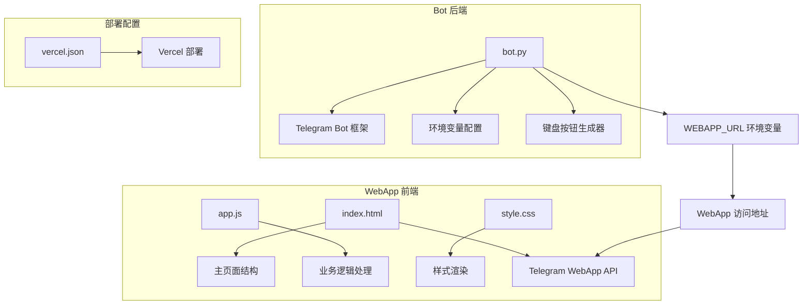
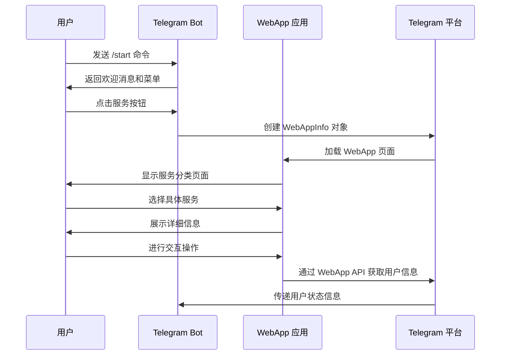
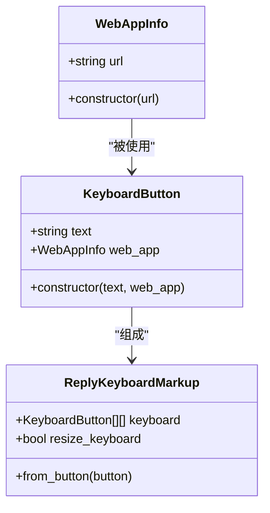
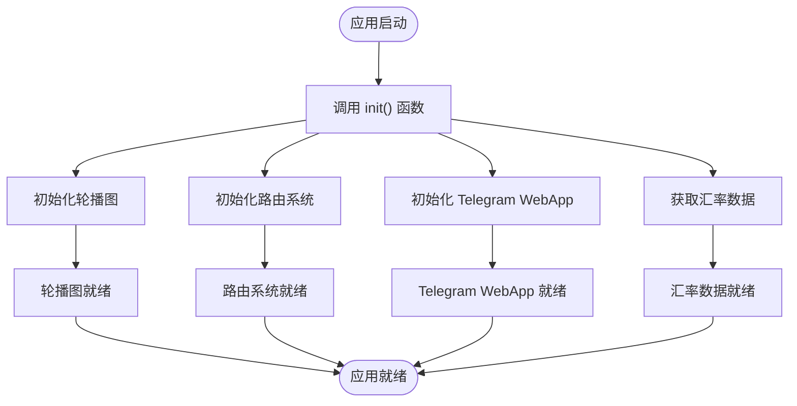
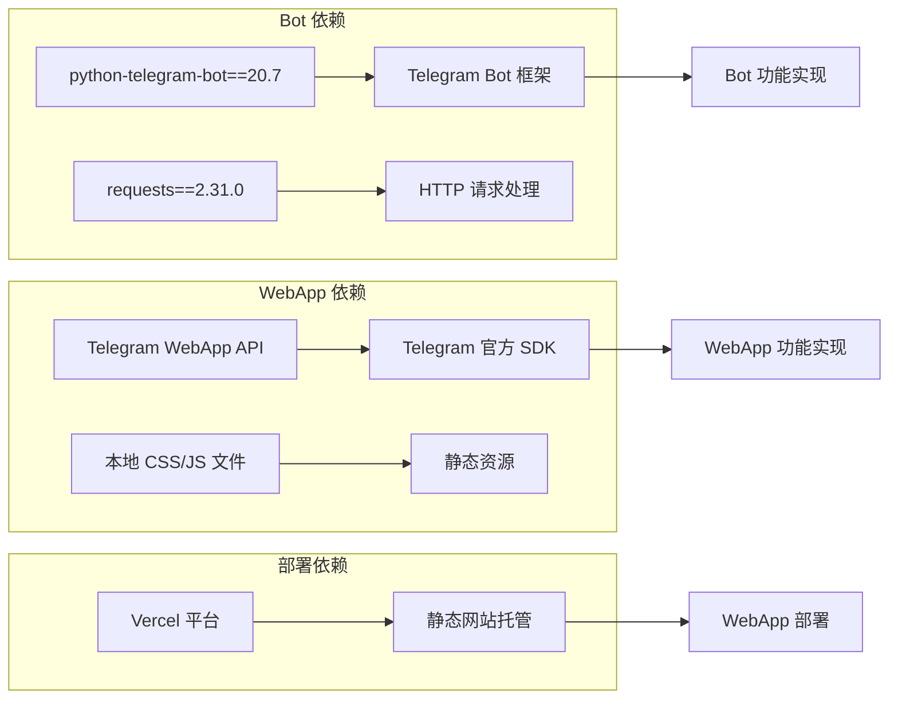

# WebApp 集成详解

<cite>
**本文档引用的文件**
- [bot.py](file://bot/bot.py)
- [app.js](file://webapp/js/app.js)
- [index.html](file://webapp/index.html)
- [style.css](file://webapp/css/style.css)
- [vercel.json](file://vercel.json)
- [requirements.txt](file://bot/requirements.txt)
</cite>

## 目录
1. [简介](#简介)
2. [项目结构](#项目结构)
3. [核心组件](#核心组件)
4. [架构概览](#架构概览)
5. [详细组件分析](#详细组件分析)
6. [依赖关系分析](#依赖关系分析)
7. [性能考虑](#性能考虑)
8. [故障排除指南](#故障排除指南)
9. [结论](#结论)
10. [附录](#附录)

## 简介

本项目是一个完整的 Telegram Bot WebApp 集成解决方案，实现了 Bot 与 Web 应用之间的无缝连接。该项目提供了木姐同城生活助手的服务分类页面，包括美食推荐、酒店住宿、购物指南、换汇服务等多个功能模块，为用户提供便捷的生活信息服务。

项目采用 Python Telegram Bot 框架构建后端 Bot，前端使用纯 JavaScript 实现 WebApp，通过 Telegram WebApp API 实现 Bot 与 Web 应用的深度集成。

## 项目结构

项目采用清晰的分层架构，分为 Bot 后端和 WebApp 前端两个主要部分：

**图表来源**
- [bot.py:1-88](file://bot/bot.py#L1-L88)
- [index.html:1-145](file://webapp/index.html#L1-L145)
- [vercel.json:1-8](file://vercel.json#L1-L8)

**章节来源**
- [bot.py:1-88](file://bot/bot.py#L1-L88)
- [index.html:1-145](file://webapp/index.html#L1-L145)
- [vercel.json:1-8](file://vercel.json#L1-L8)

## 核心组件

### Bot 核心组件

Bot 组件负责处理用户交互、生成 WebApp 按钮菜单、管理用户状态等核心功能。

**章节来源**
- [bot.py:9-11](file://bot/bot.py#L9-L11)
- [bot.py:14-42](file://bot/bot.py#L14-L42)
- [bot.py:45-74](file://bot/bot.py#L45-L74)

### WebApp 核心组件

WebApp 组件提供完整的用户界面和交互功能，包括服务分类、数据展示、用户交互等。

**章节来源**
- [app.js:1-87](file://webapp/js/app.js#L1-L87)
- [index.html:118-124](file://webapp/index.html#L118-L124)

## 架构概览

系统采用客户端-服务器架构，Bot 作为服务器端控制器，WebApp 作为客户端应用：

**图表来源**
- [bot.py:14-21](file://bot/bot.py#L14-L21)
- [app.js:51-54](file://webapp/js/app.js#L51-L54)

## 详细组件分析

### Bot 组件分析

#### WebAppInfo 类使用详解

Bot 使用 `WebAppInfo` 类来创建 WebApp 按钮，这是实现 Bot 与 WebApp 集成的核心机制。

**图表来源**
- [bot.py:3](file://bot/bot.py#L3)
- [bot.py:14-21](file://bot/bot.py#L14-L21)
- [bot.py:18-42](file://bot/bot.py#L18-L42)

#### 环境变量配置

Bot 使用环境变量来配置 WebApp URL 和其他参数：

**章节来源**
- [bot.py:9-11](file://bot/bot.py#L9-L11)

#### 菜单生成器

Bot 提供了灵活的菜单生成器，支持动态创建不同类别的服务按钮：

**章节来源**
- [bot.py:14-42](file://bot/bot.py#L14-L42)

### WebApp 组件分析

#### 初始化流程

WebApp 通过初始化函数设置整个应用的基础配置：

**图表来源**
- [app.js:51-54](file://webapp/js/app.js#L51-L54)

#### 路由系统

WebApp 使用哈希路由实现 SPA 导航：

**章节来源**
- [app.js:64-76](file://webapp/js/app.js#L64-L76)

#### 数据模型

WebApp 定义了完整的服务数据结构：

**章节来源**
- [app.js:1-49](file://webapp/js/app.js#L1-L49)

### Telegram WebApp 集成

#### WebApp API 使用

WebApp 通过 Telegram WebApp API 实现与 Telegram 平台的深度集成：

**章节来源**
- [app.js:51-54](file://webapp/js/app.js#L51-L54)
- [index.html:9](file://webapp/index.html#L9)

## 依赖关系分析

项目依赖关系清晰明确，遵循单一职责原则：

**图表来源**
- [requirements.txt:1-3](file://bot/requirements.txt#L1-L3)
- [index.html:9](file://webapp/index.html#L9)

**章节来源**
- [requirements.txt:1-3](file://bot/requirements.txt#L1-L3)

## 性能考虑

### 前端性能优化

1. **懒加载策略**：WebApp 仅在需要时加载特定功能模块
2. **缓存机制**：利用浏览器缓存减少重复请求
3. **响应式设计**：适配不同屏幕尺寸，提升用户体验

### 后端性能优化

1. **环境变量配置**：避免硬编码，便于部署和配置管理
2. **异步处理**：Bot 使用异步框架提高并发处理能力
3. **资源复用**：菜单按钮模板化，减少重复代码

## 故障排除指南

### 常见问题及解决方案

#### WebApp 无法加载

**症状**：点击 Bot 按钮后 WebApp 无法打开

**可能原因**：
1. WEBAPP_URL 环境变量配置错误
2. WebApp 服务器未正确部署
3. Telegram WebApp API 加载失败

**解决步骤**：
1. 检查 WEBAPP_URL 是否指向正确的部署地址
2. 验证 Vercel 部署状态
3. 确认 Telegram WebApp API 脚本加载成功

#### 按钮点击无响应

**症状**：Bot 按钮点击后无任何反应

**可能原因**：
1. WebAppInfo URL 格式不正确
2. 路由配置错误
3. JavaScript 错误阻止了正常执行

**解决步骤**：
1. 验证 WebApp URL 格式符合要求
2. 检查路由系统是否正确初始化
3. 查看浏览器控制台错误信息

#### 用户状态显示异常

**症状**：WebApp 无法正确显示用户信息

**可能原因**：
1. Telegram WebApp API 初始化失败
2. initDataUnsafe 对象格式变化
3. 用户权限问题

**解决步骤**：
1. 确认 Telegram WebApp API 正确加载
2. 检查用户对象结构是否符合预期
3. 验证 Bot 权限配置

**章节来源**
- [bot.py:9-11](file://bot/bot.py#L9-L11)
- [app.js:51-54](file://webapp/js/app.js#L51-L54)

## 结论

本项目成功实现了 Telegram Bot 与 WebApp 的深度集成，提供了完整的同城生活服务解决方案。通过合理的设计架构和最佳实践，项目具备了良好的可扩展性和维护性。

主要优势包括：
- 清晰的分层架构，职责分离明确
- 完善的错误处理和故障排除机制
- 优秀的用户体验设计和性能优化
- 灵活的配置管理和部署方案

建议后续改进方向：
- 添加更多的服务类别和功能模块
- 实现用户个性化推荐算法
- 增强数据统计和分析功能
- 优化移动端用户体验

## 附录

### 配置参考

#### 环境变量配置

| 变量名 | 默认值 | 说明 |
|--------|--------|------|
| BOT_TOKEN | 7965227435:AAFVkenCU8mvMMc_JZ4XGD3T56Tfl1y_pLU | Telegram Bot API 密钥 |
| WEBAPP_URL | https://huaxiashanghui-a11y.github.io/wysz01/webapp | WebApp 部署地址 |

#### 部署配置

**章节来源**
- [vercel.json:1-8](file://vercel.json#L1-L8)