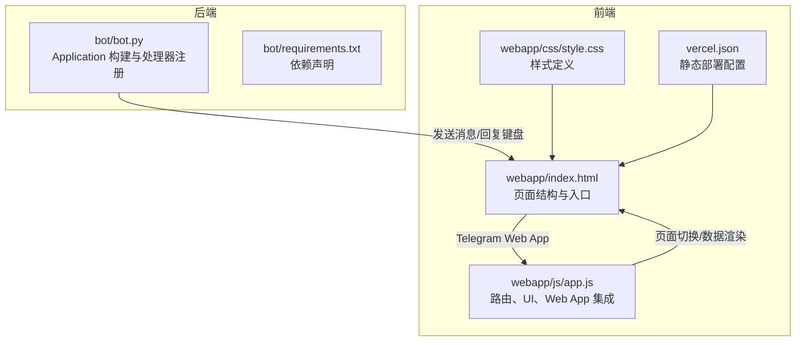
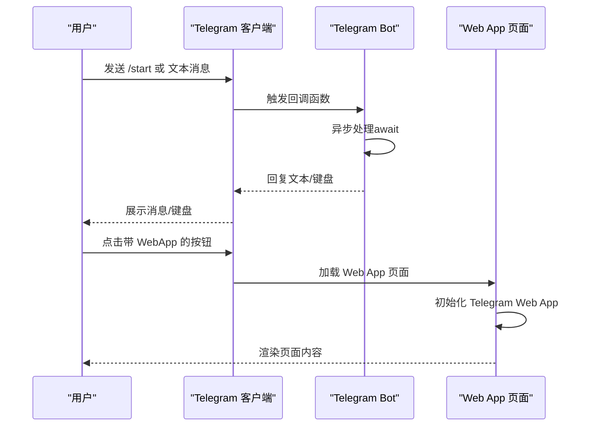
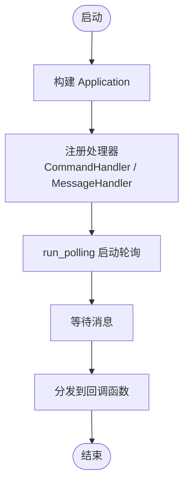
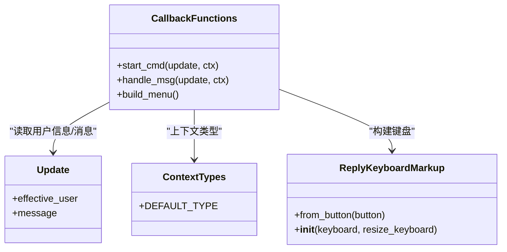
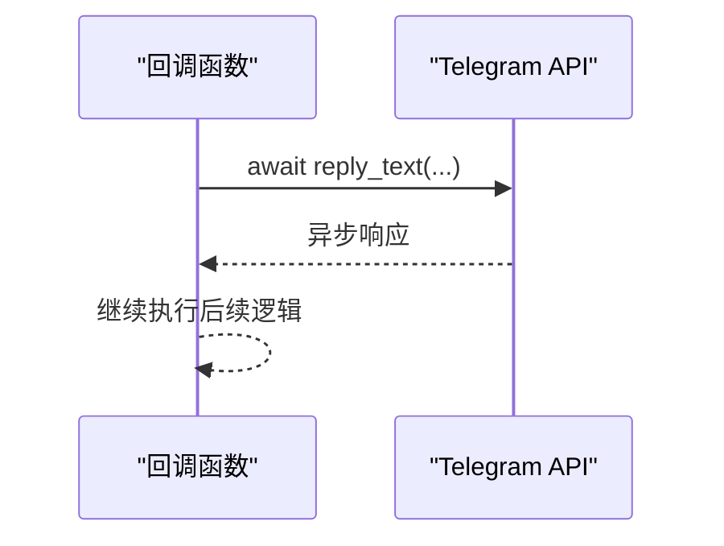
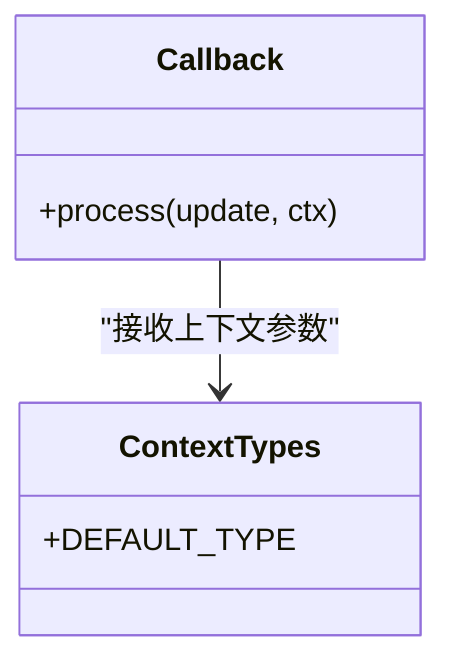
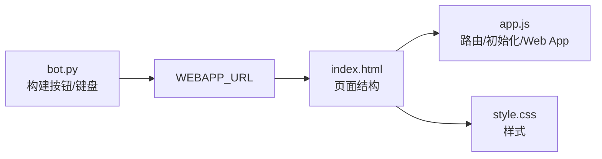
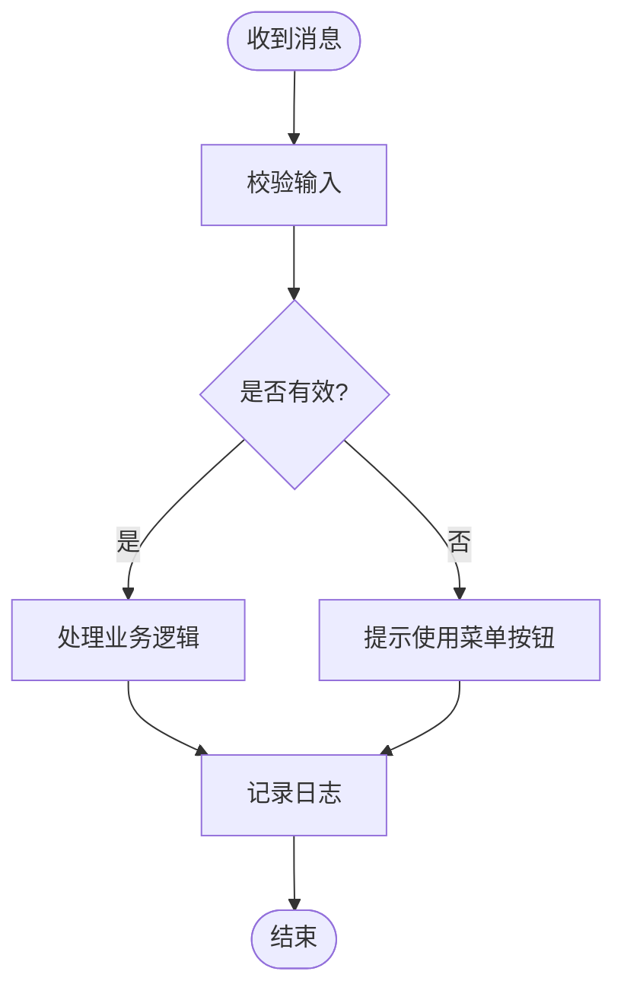
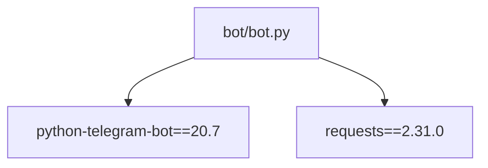

# 回调函数模式与异步处理

<cite>
**本文档引用的文件**
- [bot.py](file://bot/bot.py)
- [requirements.txt](file://bot/requirements.txt)
- [index.html](file://webapp/index.html)
- [app.js](file://webapp/js/app.js)
- [style.css](file://webapp/css/style.css)
- [vercel.json](file://vercel.json)
</cite>

## 目录
1. [简介](#简介)
2. [项目结构](#项目结构)
3. [核心组件](#核心组件)
4. [架构总览](#架构总览)
5. [详细组件分析](#详细组件分析)
6. [依赖关系分析](#依赖关系分析)
7. [性能考虑](#性能考虑)
8. [故障排除指南](#故障排除指南)
9. [结论](#结论)
10. [附录](#附录)

## 简介
本技术文档围绕 Telegram Bot 的回调函数模式与异步处理展开，结合项目中的实际实现，系统阐述以下主题：
- 回调函数设计模式：函数签名、参数传递、返回值处理
- 异步处理机制：python-telegram-bot 的异步模型、协程函数与 await 的使用
- ContextTypes 上下文对象：属性访问、数据传递、状态管理
- 错误处理策略：异常捕获、日志记录、用户友好提示
- 复杂业务逻辑实现：用户输入验证、数据持久化（可扩展）
- 性能优化与内存管理最佳实践、调试技巧

本项目采用 python-telegram-bot v20.7，通过 Application.builder 构建应用，注册命令处理器与消息处理器，使用异步函数处理用户交互，并通过 Telegram Web App 提供前端界面。

## 项目结构
该项目由两大部分组成：
- 后端 Telegram Bot：负责接收用户消息、构建菜单、响应用户操作
- 前端 Web App：通过 Telegram Web App 协议在 Telegram 内嵌入，提供丰富的页面与交互

图表来源
- [bot.py:1-88](file://bot/bot.py#L1-L88)
- [requirements.txt:1-3](file://bot/requirements.txt#L1-L3)
- [index.html:1-145](file://webapp/index.html#L1-L145)
- [app.js:1-87](file://webapp/js/app.js#L1-L87)
- [style.css:1-80](file://webapp/css/style.css#L1-L80)
- [vercel.json:1-8](file://vercel.json#L1-L8)

章节来源
- [bot.py:1-88](file://bot/bot.py#L1-L88)
- [requirements.txt:1-3](file://bot/requirements.txt#L1-L3)
- [index.html:1-145](file://webapp/index.html#L1-L145)
- [app.js:1-87](file://webapp/js/app.js#L1-L87)
- [style.css:1-80](file://webapp/css/style.css#L1-L80)
- [vercel.json:1-8](file://vercel.json#L1-L8)

## 核心组件
本项目的核心组件包括：
- Application 与处理器：Application.builder 创建应用实例，注册 CommandHandler 与 MessageHandler
- 回调函数：start_cmd 与 handle_msg，均为异步函数，接收 Update 与 ContextTypes.DEFAULT_TYPE 参数
- 上下文对象：ContextTypes.DEFAULT_TYPE 提供上下文访问能力（如存储临时数据）
- Web App 集成：通过 KeyboardButton 的 WebAppInfo 将用户引导至 webapp 页面

关键实现要点：
- 函数签名：回调函数形参为 update: Update, ctx: ContextTypes.DEFAULT_TYPE
- 参数传递：update.effective_user 获取用户信息；update.message 获取消息内容
- 返回值处理：通过 await update.message.reply_text(...) 进行异步回复
- 异步模型：所有回调函数均使用 async def 定义，内部使用 await 关键字等待 I/O 操作

章节来源
- [bot.py:45-83](file://bot/bot.py#L45-L83)

## 架构总览
整体架构采用“后端 Bot + 前端 Web App”的组合模式：
- 用户在 Telegram 中与 Bot 交互，Bot 通过 Application 接收消息并分发给对应处理器
- 处理器根据用户输入构建键盘或直接回复文本
- 当用户点击带 WebApp 的按钮时，Telegram Web App 在内嵌环境中加载 webapp 页面
- Web App 通过 Telegram Web App JS SDK 初始化并渲染页面内容

图表来源
- [bot.py:45-83](file://bot/bot.py#L45-L83)
- [index.html:1-145](file://webapp/index.html#L1-L145)
- [app.js:51-87](file://webapp/js/app.js#L51-L87)

## 详细组件分析

### 组件一：Application 与处理器注册
- Application.builder().token(...) 创建应用实例
- app.add_handler(...) 注册处理器：
  - CommandHandler("start", start_cmd)：处理 /start 命令
  - MessageHandler(filters.TEXT & ~filters.COMMAND, handle_msg)：处理普通文本消息
- app.run_polling(drop_pending_updates=True) 启动轮询模式

图表来源
- [bot.py:77-83](file://bot/bot.py#L77-L83)

章节来源
- [bot.py:77-83](file://bot/bot.py#L77-L83)

### 组件二：回调函数设计模式
- 函数签名：async def start_cmd(update: Update, ctx: ContextTypes.DEFAULT_TYPE)
- 参数传递：
  - update.effective_user 获取用户信息
  - update.message.text 获取用户输入文本
- 返回值处理：await update.message.reply_text(...) 异步发送消息
- 键盘构建：build_menu() 使用 ReplyKeyboardMarkup 生成多行按钮

图表来源
- [bot.py:14-42](file://bot/bot.py#L14-L42)
- [bot.py:45-75](file://bot/bot.py#L45-L75)

章节来源
- [bot.py:14-42](file://bot/bot.py#L14-L42)
- [bot.py:45-75](file://bot/bot.py#L45-L75)

### 组件三：异步处理机制与协程
- 回调函数均使用 async def 定义，内部使用 await 关键字等待 I/O 操作
- 示例：await update.message.reply_text(...) 实现非阻塞回复
- 轮询模式：app.run_polling(drop_pending_updates=True) 以轮询方式接收消息

图表来源
- [bot.py:45-75](file://bot/bot.py#L45-L75)
- [bot.py:77-83](file://bot/bot.py#L77-L83)

章节来源
- [bot.py:45-75](file://bot/bot.py#L45-L75)
- [bot.py:77-83](file://bot/bot.py#L77-L83)

### 组件四：ContextTypes 上下文对象
- 类型：ContextTypes.DEFAULT_TYPE
- 作用：作为回调函数的上下文参数，用于存储临时数据、会话状态等
- 使用场景：可在 ctx 中保存用户状态、中间结果，以便后续回调使用

图表来源
- [bot.py:45-75](file://bot/bot.py#L45-L75)

章节来源
- [bot.py:45-75](file://bot/bot.py#L45-L75)

### 组件五：Web App 集成与前端页面
- 后端通过 KeyboardButton 的 WebAppInfo 将用户引导至 WEBAPP_URL
- 前端页面通过 Telegram Web App JS SDK 初始化并渲染页面
- 页面包含首页、分类页、搜索页、个人中心等多个页面，支持路由切换

图表来源
- [bot.py:14-42](file://bot/bot.py#L14-L42)
- [index.html:1-145](file://webapp/index.html#L1-L145)
- [app.js:51-87](file://webapp/js/app.js#L51-L87)
- [style.css:1-80](file://webapp/css/style.css#L1-L80)

章节来源
- [bot.py:14-42](file://bot/bot.py#L14-L42)
- [index.html:1-145](file://webapp/index.html#L1-L145)
- [app.js:51-87](file://webapp/js/app.js#L51-L87)
- [style.css:1-80](file://webapp/css/style.css#L1-L80)

### 组件六：错误处理策略
- 日志记录：使用 logging.basicConfig(level=logging.INFO) 记录启动与运行信息
- 异常捕获：当前实现未显式 try/except，建议在回调函数中增加异常捕获与日志记录
- 用户友好提示：当用户输入不在预期范围内时，提示使用下方菜单按钮

图表来源
- [bot.py:61-75](file://bot/bot.py#L61-L75)

章节来源
- [bot.py:61-75](file://bot/bot.py#L61-L75)

### 组件七：复杂业务逻辑与数据持久化（可扩展）
- 输入验证：检查 update.message.text 是否为特定按钮文本
- 数据持久化：当前未实现数据库或文件存储，可通过 ctx 或外部存储（如数据库）扩展
- 状态管理：利用 ContextTypes.DEFAULT_TYPE 存储用户状态，实现多步对话流程

章节来源
- [bot.py:61-75](file://bot/bot.py#L61-L75)

## 依赖关系分析
- python-telegram-bot==20.7：提供 Application、Update、ContextTypes、Handler 等核心组件
- requests==2.31.0：用于 HTTP 请求（可在 Web App 中扩展使用）

图表来源
- [requirements.txt:1-3](file://bot/requirements.txt#L1-L3)
- [bot.py:1-10](file://bot/bot.py#L1-L10)

章节来源
- [requirements.txt:1-3](file://bot/requirements.txt#L1-L3)
- [bot.py:1-10](file://bot/bot.py#L1-L10)

## 性能考虑
- 异步模型：使用 async/await 避免阻塞，提高并发处理能力
- 轮询模式：run_polling 适合小型 Bot，高并发场景建议使用 webhook
- 资源管理：合理关闭连接、避免重复创建对象
- 前端性能：Web App 使用轻量级路由与动画，减少不必要的重绘

## 故障排除指南
- 启动失败：检查 BOT_TOKEN 与 WEBAPP_URL 环境变量是否正确设置
- 消息不回：确认 handlers 已正确注册且 filters 条件匹配
- Web App 无法加载：检查 WEBAPP_URL 与 vercel.json 的输出目录配置
- 日志问题：确保 logging 配置生效，查看控制台输出

章节来源
- [bot.py:77-83](file://bot/bot.py#L77-L83)
- [vercel.json:1-8](file://vercel.json#L1-L8)

## 结论
本项目展示了 Telegram Bot 的回调函数模式与异步处理的典型实现，通过 Application 构建应用、注册处理器、使用异步回调函数处理用户交互，并结合 Telegram Web App 提供丰富的前端体验。建议在现有基础上增强错误处理、日志记录与状态管理，以支撑更复杂的业务逻辑与更高的可靠性。

## 附录
- 代码示例路径（不直接展示代码内容）：
  - 回调函数定义与调用：[bot.py:45-83](file://bot/bot.py#L45-L83)
  - 键盘构建与按钮点击：[bot.py:14-42](file://bot/bot.py#L14-L42)
  - Web App 页面结构与路由：[index.html:1-145](file://webapp/index.html#L1-L145)
  - Web App 初始化与交互：[app.js:51-87](file://webapp/js/app.js#L51-L87)
  - 样式与主题适配：[style.css:1-80](file://webapp/css/style.css#L1-L80)
  - 依赖声明：[requirements.txt:1-3](file://bot/requirements.txt#L1-L3)
  - 静态部署配置：[vercel.json:1-8](file://vercel.json#L1-L8)