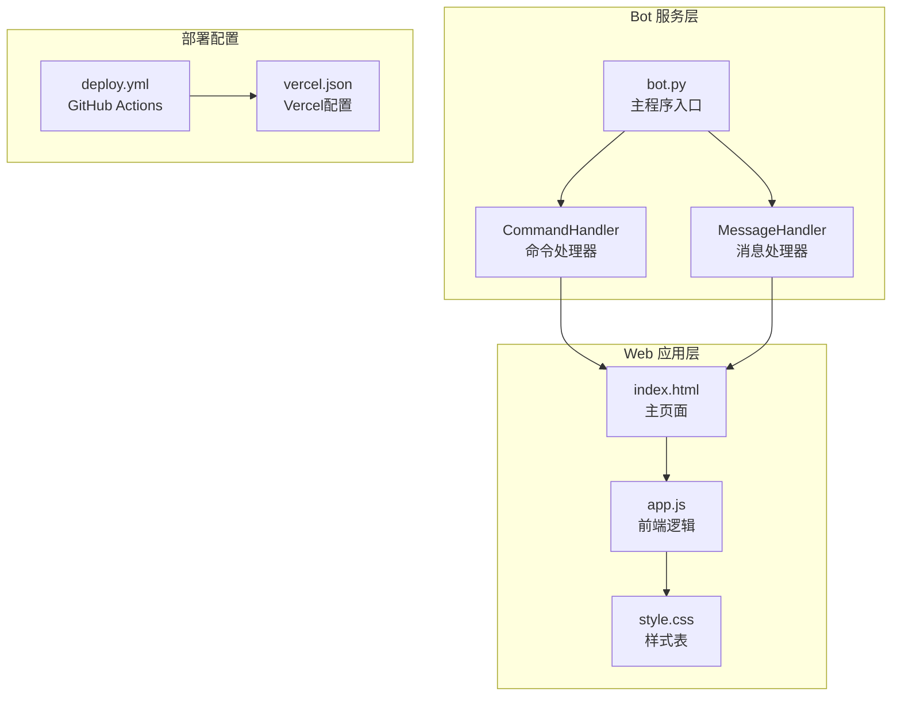
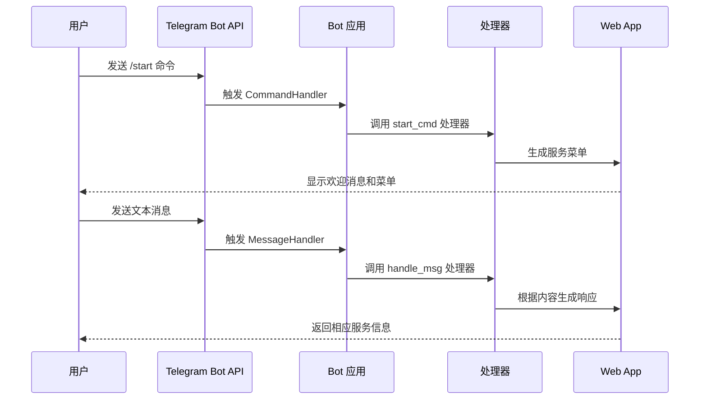
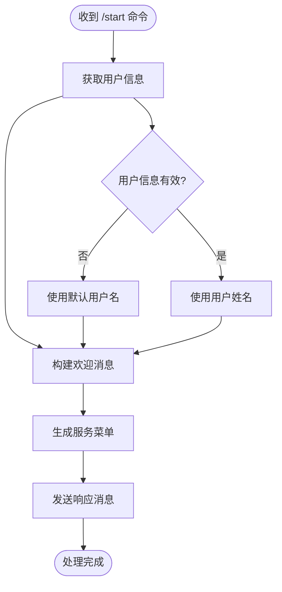
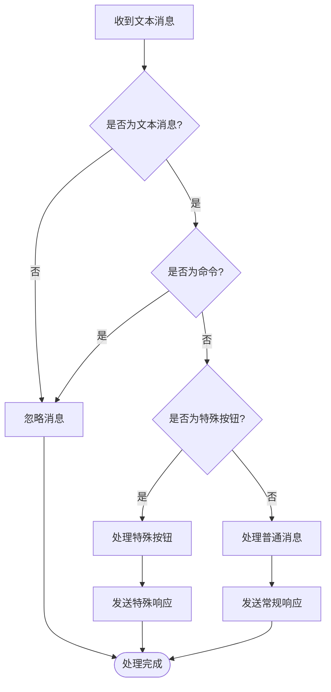
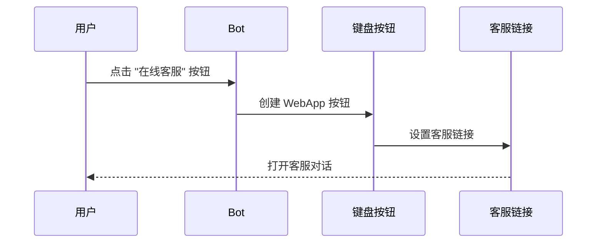
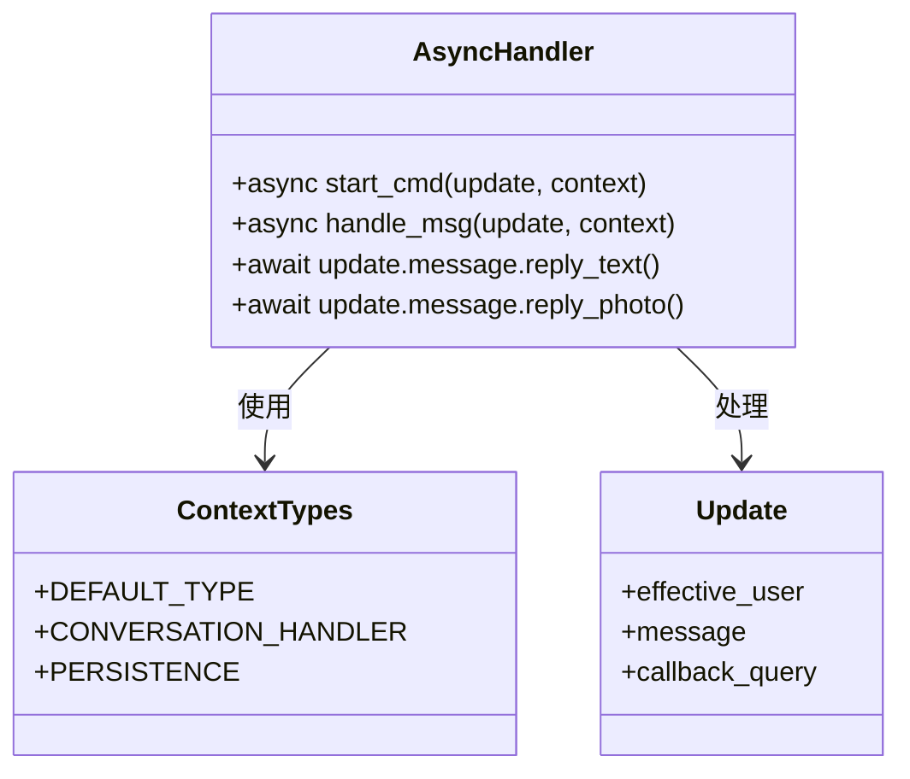
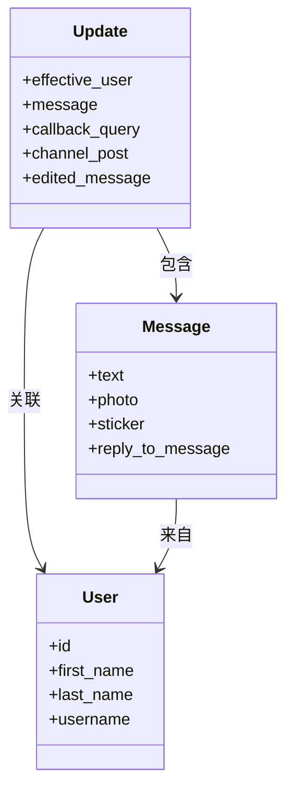
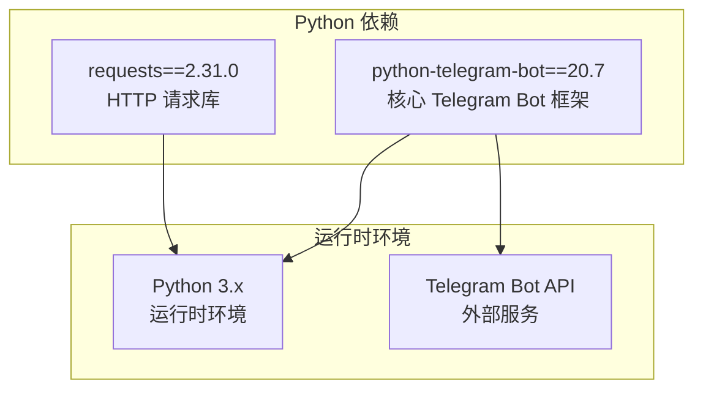
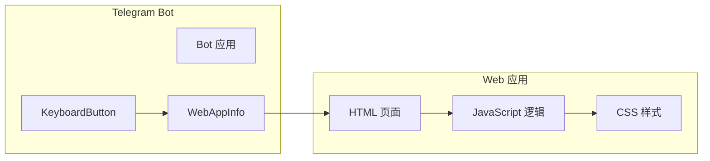
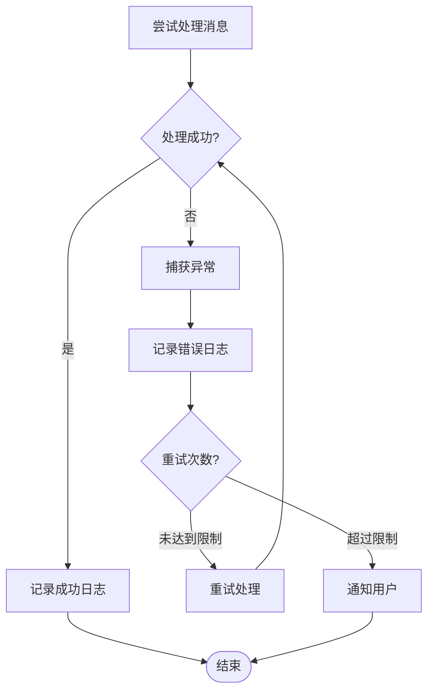

# 消息处理机制

<cite>
**本文档引用的文件**
- [bot.py](file://bot/bot.py)
- [requirements.txt](file://bot/requirements.txt)
- [index.html](file://webapp/index.html)
- [app.js](file://webapp/js/app.js)
- [style.css](file://webapp/css/style.css)
- [deploy.yml](file://.github/workflows/deploy.yml)
- [vercel.json](file://vercel.json)
</cite>

## 目录
1. [简介](#简介)
2. [项目结构](#项目结构)
3. [核心组件](#核心组件)
4. [架构概览](#架构概览)
5. [详细组件分析](#详细组件分析)
6. [依赖关系分析](#依赖关系分析)
7. [性能考虑](#性能考虑)
8. [故障排除指南](#故障排除指南)
9. [结论](#结论)

## 简介

本项目是一个基于 Python Telegram Bot 框架构建的智能生活助手机器人。该系统实现了完整的消息处理机制，包括命令处理器和文本消息处理器，为用户提供便捷的生活服务信息查询和业务办理功能。

系统采用现代化的架构设计，结合 Telegram Web App 技术，为用户提供了丰富的交互体验。项目支持多种服务类别，包括美食推荐、酒店住宿、换汇服务、签证办理等，并通过键盘按钮和 Web 应用集成的方式提供无缝的服务体验。

## 项目结构

该项目采用分层架构设计，主要分为三个核心部分：



**图表来源**
- [bot.py:1-88](file://bot/bot.py#L1-L88)
- [index.html:1-145](file://webapp/index.html#L1-L145)
- [app.js:1-87](file://webapp/js/app.js#L1-L87)

**章节来源**
- [bot.py:1-88](file://bot/bot.py#L1-L88)
- [requirements.txt:1-3](file://bot/requirements.txt#L1-L3)

## 核心组件

### 命令处理器（CommandHandler）

命令处理器是 Telegram Bot 的核心组件之一，负责处理用户的命令输入。在本项目中，主要实现了 `/start` 命令的处理逻辑。

#### 主要特性
- **异步处理**：使用 `async/await` 语法确保非阻塞操作
- **用户信息获取**：通过 `update.effective_user` 获取用户基本信息
- **动态菜单生成**：根据用户偏好生成个性化的键盘菜单
- **多语言支持**：支持中文问候语和界面文本

#### 关键实现细节
- 使用 `ReplyKeyboardMarkup` 构建响应式键盘布局
- 支持 4 行 4 列的按钮网格，包含各种生活服务类别
- 集成 Web App 功能，通过 `WebAppInfo` 实现页面跳转

**章节来源**
- [bot.py:45-58](file://bot/bot.py#L45-L58)
- [bot.py:14-42](file://bot/bot.py#L14-L42)

### 文本消息处理器（MessageHandler）

文本消息处理器负责处理用户发送的普通文本消息，实现了智能的消息过滤和响应机制。

#### 过滤器机制
- **类型判断**：使用 `filters.TEXT` 确保只处理文本消息
- **命令排除**：通过 `~filters.COMMAND` 排除命令消息
- **组合过滤**：使用 `&` 操作符组合多个过滤条件

#### 智能响应逻辑
- **客服连接**：特殊按钮触发客服链接跳转
- **菜单恢复**：默认情况下返回服务菜单
- **用户体验优化**：提供清晰的导航指示

**章节来源**
- [bot.py:61-74](file://bot/bot.py#L61-L74)
- [bot.py:77-83](file://bot/bot.py#L77-L83)

## 架构概览

系统采用事件驱动的异步架构，通过 Telegram Bot API 实现与用户的实时交互：



**图表来源**
- [bot.py:77-83](file://bot/bot.py#L77-L83)
- [bot.py:45-58](file://bot/bot.py#L45-L58)
- [bot.py:61-74](file://bot/bot.py#L61-L74)

## 详细组件分析

### 命令处理器实现分析

#### /start 命令处理流程



**图表来源**
- [bot.py:45-58](file://bot/bot.py#L45-L58)

#### 欢迎消息构建机制

欢迎消息采用了多层次的信息组织结构：

1. **个性化问候**：根据用户姓名生成定制化问候语
2. **功能介绍**：简要说明机器人的服务范围
3. **服务分类**：提供主要服务类别的概览
4. **操作引导**：通过向下箭头指示下一步操作

**章节来源**
- [bot.py:47-57](file://bot/bot.py#L47-L57)

### 文本消息处理器实现分析

#### 消息过滤和路由机制



**图表来源**
- [bot.py:61-74](file://bot/bot.py#L61-L74)

#### 客服连接功能实现

当用户点击"在线客服"按钮时，系统会生成一个包含客服链接的键盘按钮：



**图表来源**
- [bot.py:62-69](file://bot/bot.py#L62-L69)

**章节来源**
- [bot.py:61-74](file://bot/bot.py#L61-L74)

### 异步处理机制详解

#### async/await 语法应用

系统广泛使用异步编程模式来提高并发处理能力：



**图表来源**
- [bot.py:45-58](file://bot/bot.py#L45-L58)
- [bot.py:61-74](file://bot/bot.py#L61-L74)

#### 上下文类型的作用

`ContextTypes.DEFAULT_TYPE` 提供了统一的上下文接口，确保所有处理器都能访问相同的 API：

- **类型安全**：编译时检查参数类型
- **扩展性**：支持自定义上下文类型
- **兼容性**：与 Telegram Bot API 版本保持同步

**章节来源**
- [bot.py:4](file://bot/bot.py#L4)
- [bot.py:45-58](file://bot/bot.py#L45-L58)

### 更新对象属性访问

#### Update 对象的关键属性



**图表来源**
- [bot.py:45-58](file://bot/bot.py#L45-L58)
- [bot.py:61-74](file://bot/bot.py#L61-L74)

**章节来源**
- [bot.py:45-58](file://bot/bot.py#L45-L58)
- [bot.py:61-74](file://bot/bot.py#L61-L74)

## 依赖关系分析

### 外部依赖管理

项目使用 pip 管理外部依赖，主要依赖项包括：



**图表来源**
- [requirements.txt:1-3](file://bot/requirements.txt#L1-L3)

### Web 应用集成

系统集成了 Telegram Web App 技术，提供原生应用体验：



**图表来源**
- [bot.py:14-42](file://bot/bot.py#L14-L42)
- [index.html:1-145](file://webapp/index.html#L1-L145)
- [app.js:1-87](file://webapp/js/app.js#L1-L87)

**章节来源**
- [requirements.txt:1-3](file://bot/requirements.txt#L1-L3)
- [bot.py:14-42](file://bot/bot.py#L14-L42)

## 性能考虑

### 异步处理优势

系统采用异步架构的主要优势：

1. **高并发处理**：能够同时处理多个用户的请求
2. **资源优化**：避免阻塞操作影响整体性能
3. **响应速度**：提升用户交互体验

### 内存管理策略

- **及时释放**：异步函数执行完毕后自动释放内存
- **缓存机制**：合理使用缓存减少重复计算
- **资源清理**：定期清理不再使用的资源

### 网络通信优化

- **批量请求**：合并相似的网络请求
- **超时控制**：设置合理的请求超时时间
- **重试机制**：实现智能的失败重试策略

## 故障排除指南

### 常见问题诊断

#### 令牌配置问题

**症状**：Bot 无法启动或连接失败
**解决方案**：
1. 检查环境变量 `BOT_TOKEN` 是否正确设置
2. 验证 Bot 令牌的有效性
3. 确认网络连接正常

#### Web App URL 配置

**症状**：键盘按钮无法跳转到 Web 应用
**解决方案**：
1. 验证 `WEBAPP_URL` 环境变量设置
2. 检查 Web 应用的可用性和域名配置
3. 确认 CORS 配置允许跨域访问

#### 消息处理异常

**症状**：用户消息无法正确响应
**排查步骤**：
1. 检查过滤器配置是否正确
2. 验证消息类型判断逻辑
3. 确认回调函数的异常处理

### 调试技巧

#### 日志记录

系统使用 Python 标准库的日志模块进行调试：

```python
# 基本日志配置
logging.basicConfig(level=logging.INFO)
logger = logging.getLogger(__name__)

# 添加调试信息
logger.info("Bot started successfully")
logger.warning("Potential issue detected")
logger.error("Processing failed: %s", error_message)
```

#### 错误处理策略



**章节来源**
- [bot.py:6](file://bot/bot.py#L6)
- [bot.py:77-83](file://bot/bot.py#L77-L83)

## 结论

本项目展示了现代 Telegram Bot 开发的最佳实践，通过精心设计的消息处理机制和异步架构，为用户提供了高效、流畅的交互体验。

### 主要成就

1. **完整的命令处理体系**：实现了从简单问候到复杂业务逻辑的完整覆盖
2. **智能的消息过滤机制**：通过精确的过滤器确保消息处理的准确性
3. **现代化的异步架构**：充分利用 async/await 提升系统性能
4. **无缝的 Web 应用集成**：通过 Telegram Web App 技术提供原生体验

### 技术亮点

- **模块化设计**：清晰的组件分离便于维护和扩展
- **类型安全**：利用 Python 类型注解提升代码质量
- **错误处理**：完善的异常处理机制确保系统稳定性
- **性能优化**：异步处理和资源管理策略提升系统效率

### 未来发展方向

1. **功能扩展**：增加更多生活服务类别和业务功能
2. **智能化升级**：引入 AI 技术提供更智能的问答能力
3. **多语言支持**：扩展国际化功能支持更多语言
4. **数据分析**：集成用户行为分析优化服务推荐

该系统为类似的生活服务类 Telegram Bot 提供了优秀的参考模板，其设计理念和实现方式值得在相关项目中借鉴和应用。