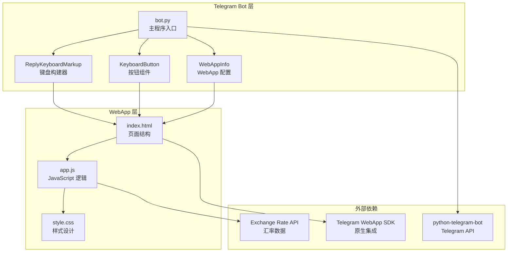
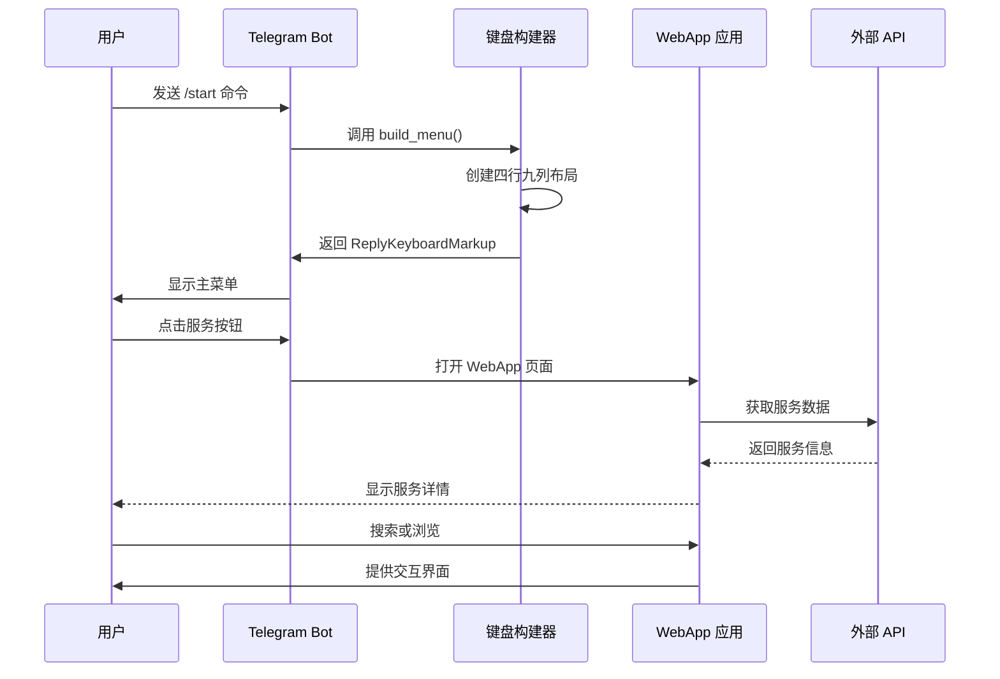
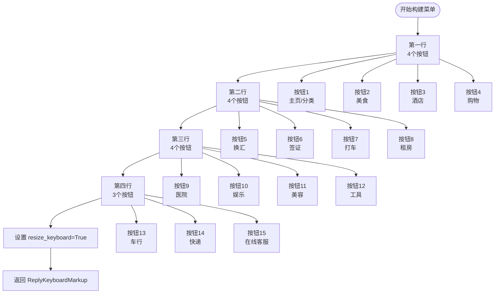
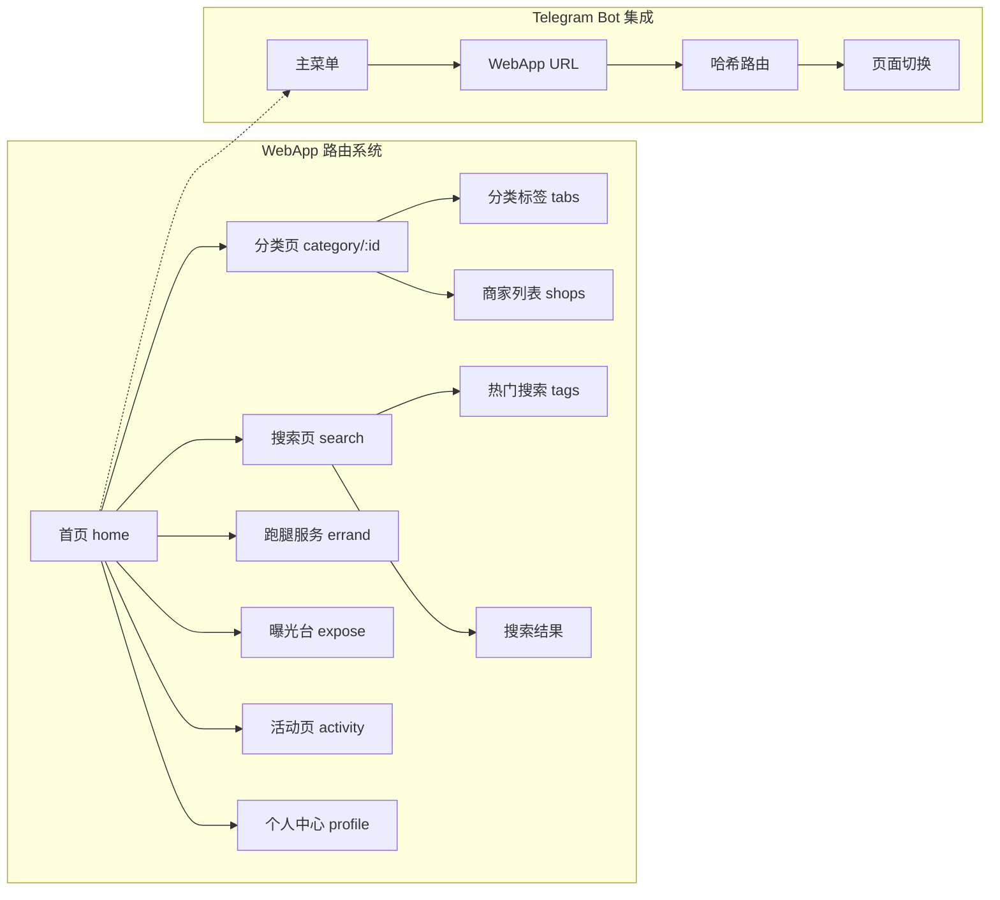
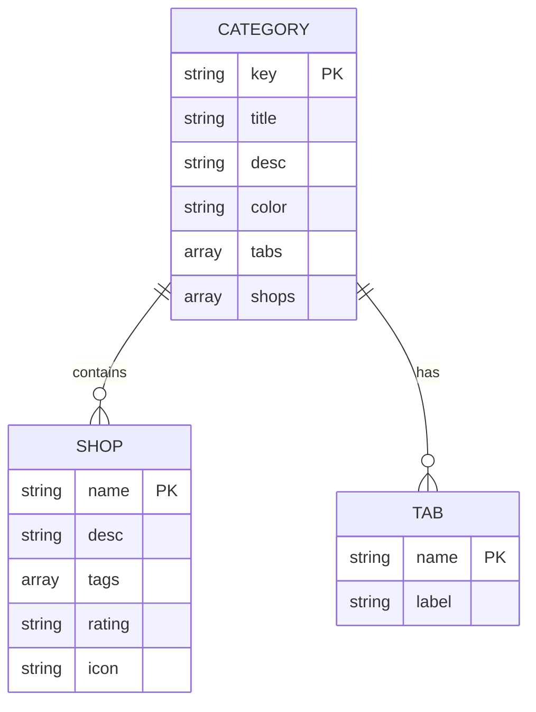
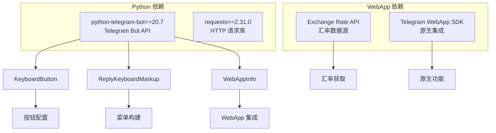

# 键盘构建器与菜单系统

<cite>
**本文档引用的文件**
- [bot.py](file://bot/bot.py)
- [requirements.txt](file://bot/requirements.txt)
- [index.html](file://webapp/index.html)
- [app.js](file://webapp/js/app.js)
- [style.css](file://webapp/css/style.css)
</cite>

## 目录
1. [简介](#简介)
2. [项目结构](#项目结构)
3. [核心组件](#核心组件)
4. [架构概览](#架构概览)
5. [详细组件分析](#详细组件分析)
6. [依赖关系分析](#依赖关系分析)
7. [性能考虑](#性能考虑)
8. [故障排除指南](#故障排除指南)
9. [结论](#结论)

## 简介

本项目是一个基于 Telegram Bot 的键盘构建器与菜单系统，集成了 WebApp 功能，为用户提供了一个完整的本地生活服务平台。系统通过 ReplyKeyboardMarkup 构建了四行九列的智能菜单布局，支持多种服务分类，包括美食、酒店、购物、换汇、签证、交通等服务类别。

该系统的核心特色在于：
- **动态键盘构建**：使用 ReplyKeyboardMarkup 和 KeyboardButton 创建响应式菜单
- **WebApp 集成**：通过 WebAppInfo 实现 Telegram Bot 与 Web 应用的无缝连接
- **多级导航**：从主菜单到具体服务分类的层级化导航结构
- **用户体验优化**：支持 Unicode 图标、响应式设计和流畅的动画效果

## 项目结构

项目采用分层架构设计，主要分为两个核心部分：



**图表来源**
- [bot.py:1-88](file://bot/bot.py#L1-L88)
- [index.html:1-145](file://webapp/index.html#L1-L145)
- [app.js:1-87](file://webapp/js/app.js#L1-L87)

**章节来源**
- [bot.py:1-88](file://bot/bot.py#L1-L88)
- [requirements.txt:1-3](file://bot/requirements.txt#L1-L3)

## 核心组件

### ReplyKeyboardMarkup 键盘构建器

ReplyKeyboardMarkup 是 Telegram Bot 中用于创建自定义键盘的主要组件。在本项目中，它被用来构建四行九列的菜单布局。

**主要特性：**
- **动态布局**：支持运行时动态生成键盘布局
- **尺寸控制**：通过 `resize_keyboard=True` 自适应设备屏幕
- **响应式设计**：根据设备类型自动调整按钮大小和间距

### _btn() 辅助函数

_btn() 函数是键盘构建系统的核心辅助函数，负责创建统一格式的 WebApp 按钮。

**函数签名与参数：**
- 参数：`key`（按钮文本）、`cat`（服务分类标识）
- 返回值：配置好的 KeyboardButton 对象
- WebAppInfo 配置：动态拼接分类 URL

### build_menu() 主菜单生成器

build_menu() 函数实现了完整的四行菜单布局，每行包含不同数量的按钮，形成九宫格的视觉效果。

**布局特点：**
- **第一行**：包含特殊功能按钮和四个服务分类
- **第二行**：涵盖金融和商务服务
- **第三行**：提供医疗和娱乐服务
- **第四行**：包含交通和物流服务

**章节来源**
- [bot.py:14-42](file://bot/bot.py#L14-L42)

## 架构概览

系统采用客户端-服务器架构，结合 Telegram Bot 和 WebApp 技术：



**图表来源**
- [bot.py:45-74](file://bot/bot.py#L45-L74)
- [app.js:51-84](file://webapp/js/app.js#L51-L84)

## 详细组件分析

### 键盘按钮类型与实现

系统实现了三种主要类型的键盘按钮：

#### 1. WebApp 按钮（主要服务按钮）

WebApp 按钮是最常用的按钮类型，用于打开特定的服务分类页面。

**实现细节：**
- 使用 `KeyboardButton(text=key, web_app=WebAppInfo(url=url))`
- 动态生成分类 URL：`{WEBAPP_URL}/#/category/{cat}`
- 支持 Unicode 图标与中文标签的组合显示

#### 2. 普通文本按钮

普通文本按钮主要用于特殊功能，如在线客服。

**实现示例：**
- 文本内容："客服"
- URL 指向 Telegram 联系页面
- 用于直接跳转到人工客服

#### 3. URL 按钮

URL 按钮用于跳转到外部链接或特定功能。

**实现特点：**
- 简单的文本按钮配置
- 直接跳转到指定 URL
- 适用于外部资源访问

### 菜单布局设计

#### 四行九列布局算法



**图表来源**
- [bot.py:18-42](file://bot/bot.py#L18-L42)

#### Unicode 图标集成

系统广泛使用 Unicode 字符作为按钮图标，提升视觉效果和用户体验：

**图标使用规范：**
- **美食**：🍜 🍜 🥘 🍲 🍜
- **酒店**：🏨 🏨 🏠 🏢 🏡
- **购物**：🛒 🛍️ 🏪 💎 📱
- **换汇**：💱 💰 💵 💳 💱
- **签证**：📋 ✈️ 🛂 📍 🏛️
- **交通**：🚕 🚌 🚐 🚗 🚘
- **医疗**：🏥 🩺 💊 🩹 🩺
- **娱乐**：🎮 🎤 🎵 🕺 🛁
- **美容**：💇 💆 💍 💅 💈
- **工具**：🔧 📱 🌐 🔢 🧮
- **车行**：🚗 🚘 🚐 🚙 🚛
- **快递**：📦 🚚 🚛 🚐 🚐

### WebApp 集成机制

#### URL 路由系统

WebApp 采用基于哈希的路由系统，支持深层链接和状态保持：



**图表来源**
- [app.js:64-76](file://webapp/js/app.js#L64-L76)
- [bot.py:14-15](file://bot/bot.py#L14-L15)

#### Telegram WebApp SDK 集成

系统集成了 Telegram WebApp SDK，提供原生应用体验：

**SDK 功能特性：**
- **主题适配**：自动适配 Telegram 主题颜色
- **全屏显示**：扩展到全屏模式
- **用户信息**：获取 Telegram 用户基本信息
- **安全通信**：验证消息来源和用户身份

**章节来源**
- [app.js:54](file://webapp/js/app.js#L54)
- [bot.py:3](file://bot/bot.py#L3)

### 数据模型与服务分类

#### 服务分类数据结构

每个服务分类都包含完整的信息结构：



**图表来源**
- [app.js:1-49](file://webapp/js/app.js#L1-L49)

#### 具体服务分类实现

**美食分类（food）：**
- 主题色：渐变橙色 (#ff6b35, #ff9a56)
- 包含：火锅、缅餐、烧烤、奶茶等
- 特色：评分系统、标签分类、图标展示

**酒店分类（hotel）：**
- 主题色：渐变蓝色 (#4facfe, #00f2fe)
- 包含：经济型、舒适型、豪华型、民宿
- 特色：设施描述、价格区间、用户评价

**换汇分类（exchange）：**
- 主题色：渐变红色 (#f5576c, #ff6b81)
- 实时汇率：集成外部 API 获取最新汇率
- 特色：双向汇率显示、汇率趋势

**章节来源**
- [app.js:1-49](file://webapp/js/app.js#L1-L49)

## 依赖关系分析

### 外部依赖管理

系统使用 Python-Telegram-Bot 库作为核心依赖：



**图表来源**
- [requirements.txt:1-3](file://bot/requirements.txt#L1-L3)

### 内部模块依赖

```mermaid
graph TD
subgraph "主程序模块"
A[bot.py]
end
subgraph "键盘构建模块"
B[_btn() 函数]
C[build_menu() 函数]
end
subgraph "WebApp 集成模块"
D[Telegram WebApp SDK]
E[URL 路由系统]
F[主题适配系统]
end
subgraph "数据处理模块"
G[服务分类数据]
H[用户交互处理]
I[消息响应处理]
end
A --> B
A --> C
A --> D
A --> E
A --> F
A --> G
A --> H
A --> I
```

**图表来源**
- [bot.py:14-42](file://bot/bot.py#L14-L42)
- [app.js:51-84](file://webapp/js/app.js#L51-L84)

**章节来源**
- [requirements.txt:1-3](file://bot/requirements.txt#L1-L3)
- [bot.py:1-88](file://bot/bot.py#L1-L88)

## 性能考虑

### 键盘构建性能优化

1. **内存效率**：使用工厂函数减少重复对象创建
2. **网络优化**：延迟加载外部数据，优先显示基础界面
3. **缓存策略**：合理利用浏览器缓存和 Telegram 缓存机制

### WebApp 性能优化

1. **懒加载**：按需加载页面内容和图片资源
2. **虚拟滚动**：对长列表使用虚拟滚动技术
3. **资源压缩**：CSS 和 JavaScript 文件压缩优化

### 用户体验优化

1. **响应速度**：确保键盘响应时间小于 100ms
2. **错误处理**：优雅处理网络请求失败情况
3. **加载指示**：为异步操作提供进度反馈

## 故障排除指南

### 常见问题及解决方案

#### 键盘按钮点击无响应

**可能原因：**
- WebApp URL 配置错误
- Telegram WebApp SDK 未正确初始化
- 网络连接问题

**解决步骤：**
1. 检查 WEBAPP_URL 环境变量配置
2. 验证 WebApp 是否正常运行
3. 确认网络连接稳定

#### 菜单布局异常

**可能原因：**
- ReplyKeyboardMarkup 配置错误
- 设备屏幕尺寸不兼容
- Unicode 字符显示问题

**解决步骤：**
1. 验证按钮文本编码
2. 测试不同设备上的显示效果
3. 检查字体支持情况

#### WebApp 页面无法加载

**可能原因：**
- 路由配置错误
- JavaScript 执行错误
- API 接口不可用

**解决步骤：**
1. 检查 URL 路由配置
2. 查看浏览器控制台错误信息
3. 验证 API 接口可用性

**章节来源**
- [bot.py:61-74](file://bot/bot.py#L61-L74)
- [app.js:51-84](file://webapp/js/app.js#L51-L84)

## 结论

本键盘构建器与菜单系统成功实现了以下目标：

### 技术成就

1. **完整的键盘构建系统**：实现了四行九列的智能菜单布局
2. **无缝的 WebApp 集成**：提供了原生应用级别的用户体验
3. **丰富的服务分类**：涵盖了本地生活的各个方面
4. **优秀的用户体验**：通过 Unicode 图标和响应式设计提升了用户满意度

### 最佳实践总结

1. **模块化设计**：将键盘构建逻辑封装在独立函数中，便于维护和扩展
2. **配置驱动**：通过环境变量管理配置，支持多环境部署
3. **错误处理**：完善的异常处理机制，确保系统稳定性
4. **性能优化**：合理的资源管理和加载策略

### 未来发展方向

1. **国际化支持**：增加多语言支持功能
2. **个性化定制**：允许用户自定义菜单布局
3. **数据分析**：集成用户行为分析功能
4. **扩展服务**：增加更多本地服务类别

该系统为 Telegram Bot 开发提供了优秀的参考模板，展示了如何构建功能完整、用户体验良好的聊天机器人应用。