# Telegram WebApp 集成

<cite>
**本文档引用的文件**
- [index.html](file://webapp/index.html)
- [app.js](file://webapp/js/app.js)
- [style.css](file://webapp/css/style.css)
- [bot.py](file://bot/bot.py)
- [requirements.txt](file://bot/requirements.txt)
- [vercel.json](file://vercel.json)
</cite>

## 目录
1. [简介](#简介)
2. [项目结构](#项目结构)
3. [核心组件](#核心组件)
4. [架构概览](#架构概览)
5. [详细组件分析](#详细组件分析)
6. [依赖关系分析](#依赖关系分析)
7. [性能考虑](#性能考虑)
8. [故障排除指南](#故障排除指南)
9. [结论](#结论)

## 简介

本项目是一个完整的 Telegram WebApp 集成解决方案，为用户提供木姐地区的同城生活服务。该系统结合了 Telegram Bot 和 WebApp 技术，为用户提供了丰富的本地化服务体验，包括美食推荐、酒店预订、换汇服务、活动信息等。

系统采用前后端分离架构，前端使用纯 JavaScript 和 HTML/CSS 构建响应式 WebApp，后端使用 Python Telegram Bot 库提供机器人服务和键盘菜单。

## 项目结构

项目采用清晰的分层结构，主要包含以下组件：

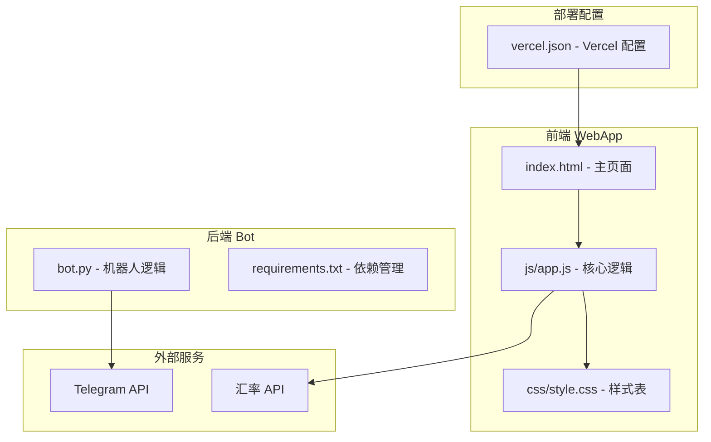

**图表来源**
- [index.html:1-145](file://webapp/index.html#L1-L145)
- [app.js:1-87](file://webapp/js/app.js#L1-L87)
- [bot.py:1-88](file://bot/bot.py#L1-L88)

**章节来源**
- [index.html:1-145](file://webapp/index.html#L1-L145)
- [app.js:1-87](file://webapp/js/app.js#L1-L87)
- [bot.py:1-88](file://bot/bot.py#L1-L88)
- [vercel.json:1-8](file://vercel.json#L1-L8)

## 核心组件

### WebApp SDK 初始化

系统实现了完整的 Telegram WebApp SDK 初始化流程：

1. **SDK 加载**：通过 CDN 引入 Telegram WebApp SDK
2. **初始化配置**：设置应用主题、扩展全屏显示
3. **API 访问权限**：检查并使用用户数据

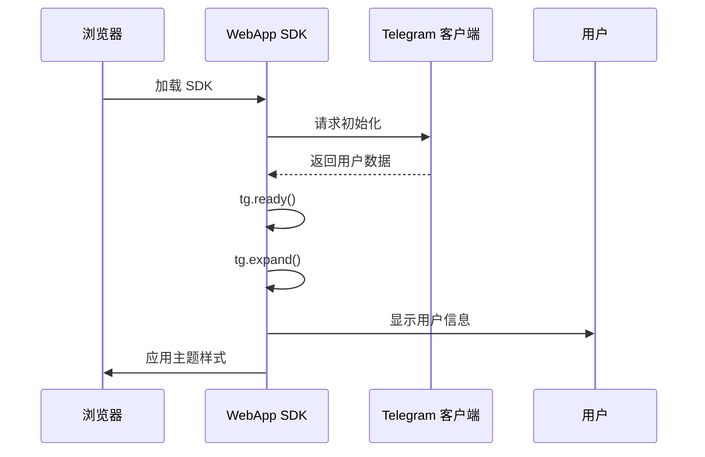

**图表来源**
- [app.js:51-54](file://webapp/js/app.js#L51-L54)

### 参数传递机制

系统支持多种参数传递方式：

- **用户信息**：通过 `initDataUnsafe.user` 获取用户数据
- **聊天信息**：通过 `initDataUnsafe.chat` 获取聊天上下文
- **回调参数**：通过 URL 参数传递业务数据

**章节来源**
- [app.js:51-54](file://webapp/js/app.js#L51-L54)
- [index.html:9](file://webapp/index.html#L9)

### 生命周期管理

WebApp 支持完整的生命周期管理：

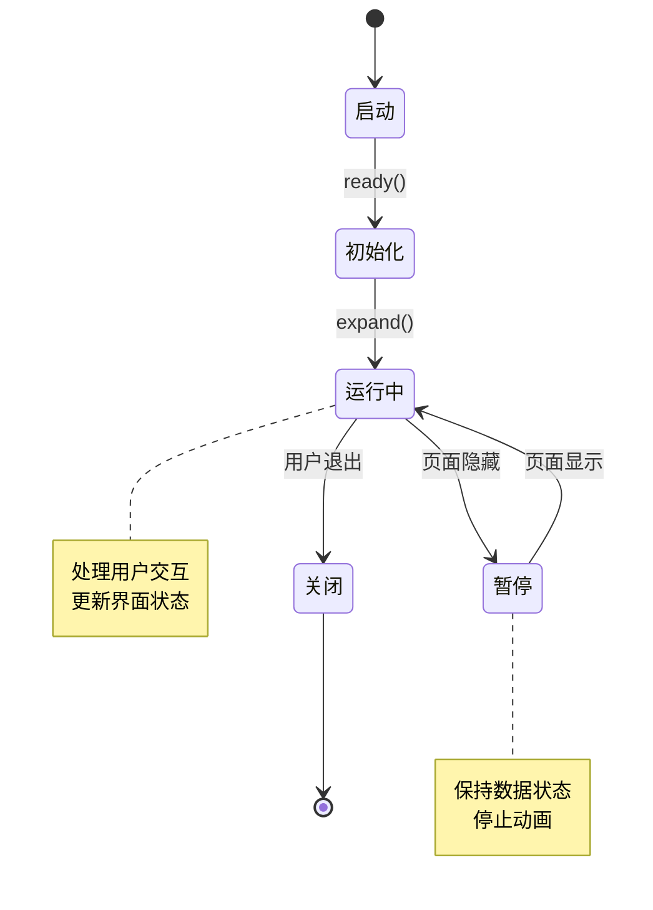

**图表来源**
- [app.js:51-54](file://webapp/js/app.js#L51-L54)

**章节来源**
- [app.js:51-54](file://webapp/js/app.js#L51-L54)

## 架构概览

系统采用客户端-服务器混合架构，结合 Telegram 的原生 WebApp 功能：

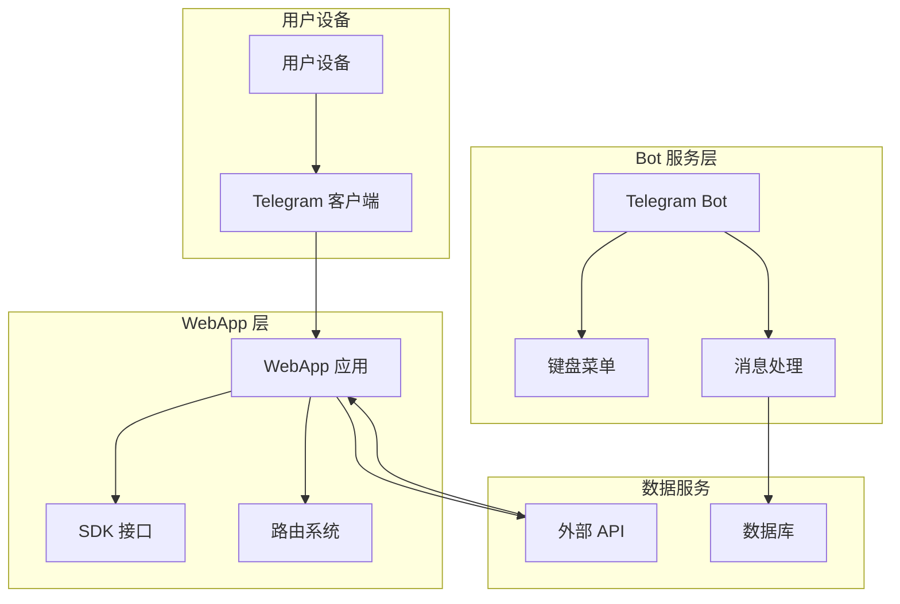

**图表来源**
- [bot.py:14-42](file://bot/bot.py#L14-L42)
- [app.js:51-54](file://webapp/js/app.js#L51-L54)

## 详细组件分析

### WebApp 核心逻辑组件

#### 初始化系统

WebApp 的初始化过程包含多个关键步骤：

1. **SDK 检测**：检查 Telegram WebApp 是否可用
2. **就绪通知**：向 Telegram 客户端发送就绪信号
3. **界面扩展**：扩展应用到全屏显示
4. **用户数据处理**：获取并显示用户信息
5. **主题应用**：应用 Telegram 主题样式

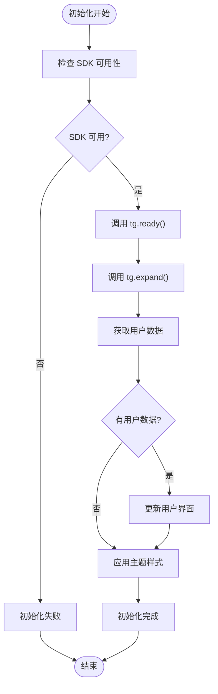

**图表来源**
- [app.js:51-54](file://webapp/js/app.js#L51-L54)

**章节来源**
- [app.js:51-54](file://webapp/js/app.js#L51-L54)

#### 路由系统

系统实现了基于 URL Hash 的单页应用路由：

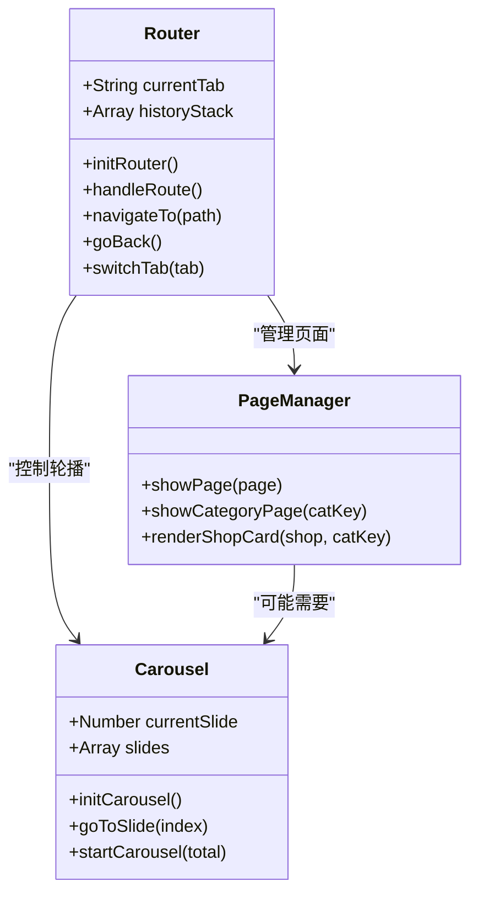

**图表来源**
- [app.js:64-78](file://webapp/js/app.js#L64-L78)

**章节来源**
- [app.js:64-78](file://webapp/js/app.js#L64-L78)

#### 数据管理系统

系统使用本地数据结构管理各类服务信息：

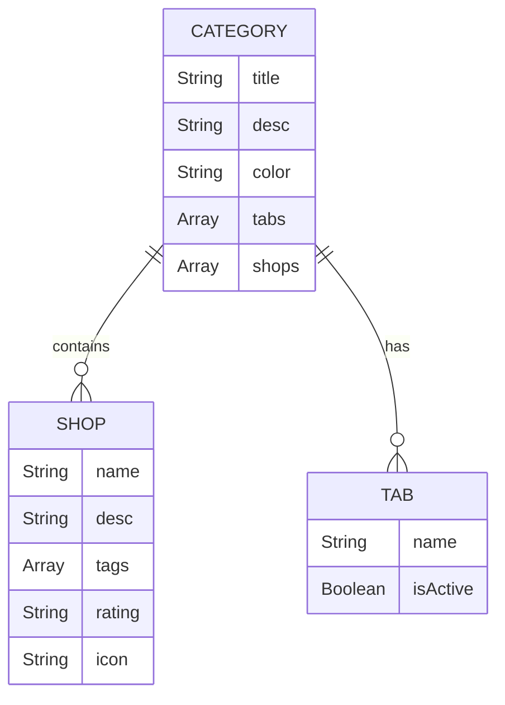

**图表来源**
- [app.js:1-49](file://webapp/js/app.js#L1-L49)

**章节来源**
- [app.js:1-49](file://webapp/js/app.js#L1-L49)

### Bot 服务组件

#### 键盘菜单构建

Bot 服务提供了完整的键盘菜单系统，支持多种服务类型：

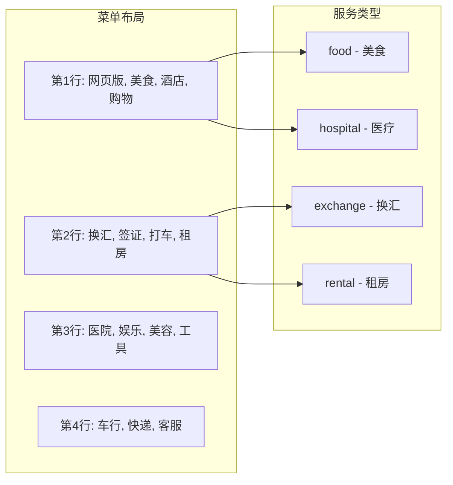

**图表来源**
- [bot.py:18-42](file://bot/bot.py#L18-L42)

**章节来源**
- [bot.py:18-42](file://bot/bot.py#L18-L42)

#### 消息处理系统

Bot 提供了智能的消息处理机制：

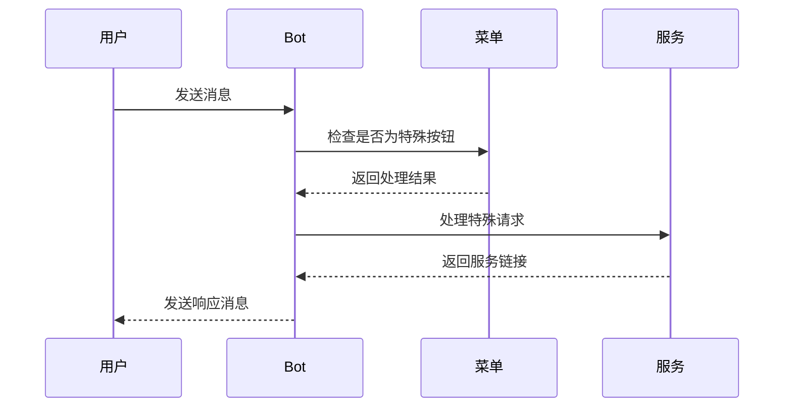

**图表来源**
- [bot.py:61-74](file://bot/bot.py#L61-L74)

**章节来源**
- [bot.py:61-74](file://bot/bot.py#L61-L74)

### 样式系统

#### 主题系统

系统实现了完整的 Telegram 主题适配：

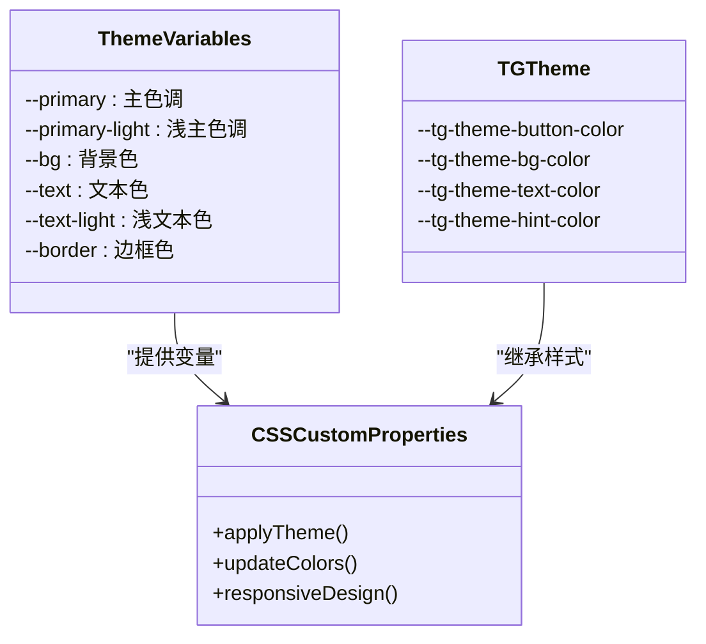

**图表来源**
- [style.css:1-80](file://webapp/css/style.css#L1-L80)

**章节来源**
- [style.css:1-80](file://webapp/css/style.css#L1-L80)

## 依赖关系分析

### 外部依赖

系统的主要外部依赖包括：

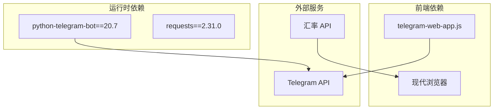

**图表来源**
- [requirements.txt:1-3](file://bot/requirements.txt#L1-L3)

**章节来源**
- [requirements.txt:1-3](file://bot/requirements.txt#L1-L3)

### 内部模块依赖

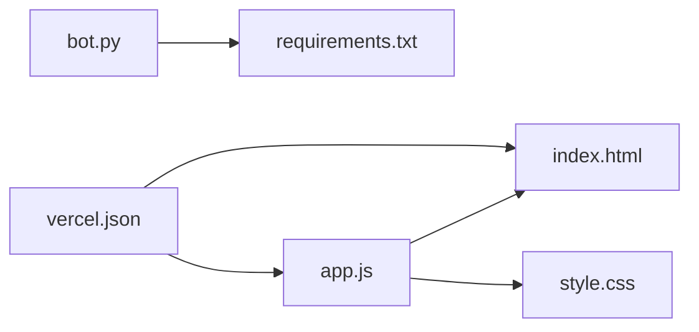

**图表来源**
- [bot.py:1-88](file://bot/bot.py#L1-L88)
- [app.js:1-87](file://webapp/js/app.js#L1-L87)

**章节来源**
- [bot.py:1-88](file://bot/bot.py#L1-L88)
- [app.js:1-87](file://webapp/js/app.js#L1-L87)

## 性能考虑

### 前端性能优化

1. **懒加载策略**：仅在需要时加载轮播图和分类数据
2. **内存管理**：及时清理定时器和事件监听器
3. **渲染优化**：使用 CSS3 动画替代 JavaScript 动画
4. **缓存策略**：复用 DOM 元素，避免频繁创建销毁

### 后端性能优化

1. **异步处理**：使用异步消息处理避免阻塞
2. **连接池**：合理管理外部 API 连接
3. **错误重试**：实现智能的 API 调用重试机制

### 网络性能

1. **CDN 加速**：使用 Telegram 官方 CDN 加载 SDK
2. **资源压缩**：确保静态资源经过压缩处理
3. **缓存策略**：合理设置 HTTP 缓存头

## 故障排除指南

### 常见问题诊断

#### WebApp 初始化失败

**症状**：WebApp 无法正常显示或功能异常

**排查步骤**：
1. 检查网络连接是否正常
2. 验证 Telegram 客户端版本
3. 确认 SDK 加载是否成功
4. 检查用户数据获取是否正常

**解决方法**：
- 确保从正确的 CDN 地址加载 SDK
- 检查初始化函数的执行顺序
- 验证用户数据字段的存在性

#### 路由系统问题

**症状**：页面切换异常或导航失效

**排查步骤**：
1. 检查 URL Hash 变更事件监听
2. 验证页面元素的可见性控制
3. 确认历史栈的状态管理

**解决方法**：
- 重新绑定路由事件监听器
- 检查 DOM 元素的选择器
- 验证页面切换的逻辑流程

#### Bot 服务问题

**症状**：Bot 无法接收消息或菜单不显示

**排查步骤**：
1. 验证 Bot Token 的正确性
2. 检查网络连接和防火墙设置
3. 确认消息处理器的注册

**解决方法**：
- 重新生成并配置 Bot Token
- 检查网络代理设置
- 验证消息处理函数的实现

### 安全考虑

#### 参数验证

系统应实施严格的参数验证机制：

1. **输入验证**：验证所有用户输入的数据格式
2. **URL 参数验证**：检查 WebApp URL 参数的有效性
3. **用户数据验证**：验证 Telegram 返回的用户数据完整性

#### XSS 防护

```javascript
// 示例：安全的字符串处理
function sanitizeInput(input) {
    // 移除潜在的恶意脚本
    return input
        .replace(/<script[^>]*>.*?<\/script>/gi, '')
        .replace(/on\w+="[^"]*"/gi, '');
}

// 示例：安全的 HTML 插入
function safeHTMLInsert(element, content) {
    element.textContent = content; // 使用 textContent 而非 innerHTML
}
```

#### CSRF 防护

虽然 WebApp 通常不需要 CSRF 防护，但在某些场景下仍需考虑：

1. **令牌验证**：为敏感操作添加一次性令牌
2. **来源检查**：验证请求的来源合法性
3. **时间戳验证**：检查请求的时间有效性

### 调试方法

#### 前端调试

1. **浏览器开发者工具**：使用 Console 查看错误信息
2. **Network 面板**：监控 API 请求和响应
3. **Elements 面板**：检查 DOM 结构和样式应用
4. **Sources 面板**：设置断点调试 JavaScript 代码

#### 后端调试

1. **日志记录**：启用详细的日志输出
2. **错误追踪**：使用异常追踪工具
3. **API 测试**：使用 Postman 或 curl 测试接口
4. **监控工具**：设置性能指标监控

## 结论

本 Telegram WebApp 集成项目展示了如何构建一个功能完整、用户体验优秀的移动应用。系统通过精心设计的架构和实现，成功地将 Telegram 的原生功能与自定义 WebApp 结合，为用户提供了一站式的同城生活服务。

### 主要优势

1. **完整的功能覆盖**：涵盖了从基础导航到专业服务的全方位功能
2. **优秀的用户体验**：响应式设计和流畅的交互体验
3. **可扩展的架构**：模块化的代码结构便于功能扩展
4. **完善的错误处理**：健壮的错误处理和用户反馈机制

### 技术亮点

1. **WebApp SDK 集成**：充分利用 Telegram WebApp 的原生能力
2. **智能路由系统**：基于 URL Hash 的单页应用架构
3. **主题适配系统**：完全兼容 Telegram 的主题系统
4. **Bot 服务集成**：提供丰富的键盘菜单和消息处理

### 改进建议

1. **增加离线支持**：实现 PWA 功能支持离线访问
2. **增强数据持久化**：添加本地存储和同步机制
3. **优化性能监控**：集成性能监控和错误报告系统
4. **国际化支持**：添加多语言支持功能

该系统为类似的应用开发提供了良好的参考模板，展示了如何有效地利用现代 Web 技术和 Telegram 平台特性来构建高质量的移动应用。