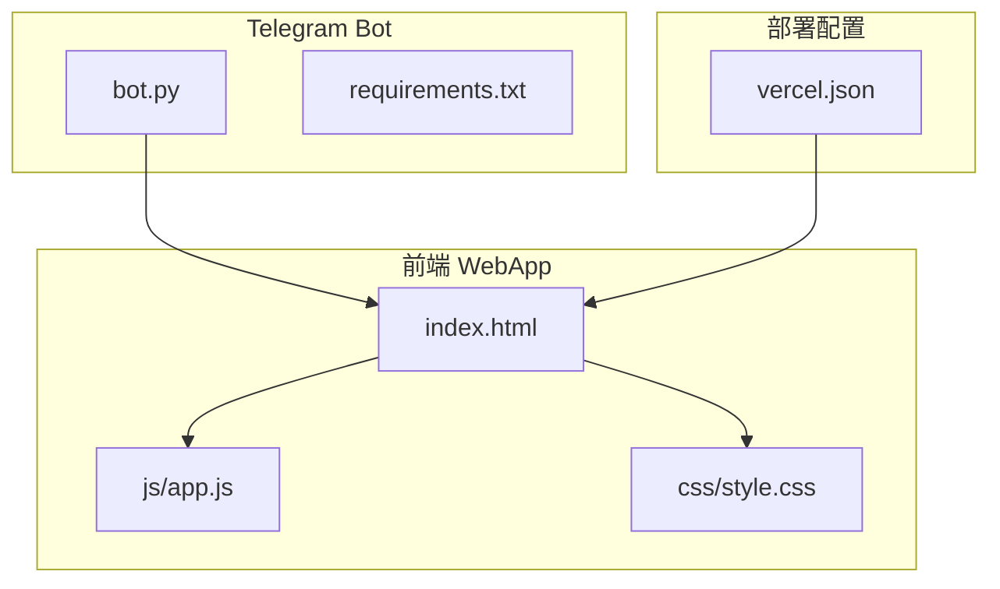
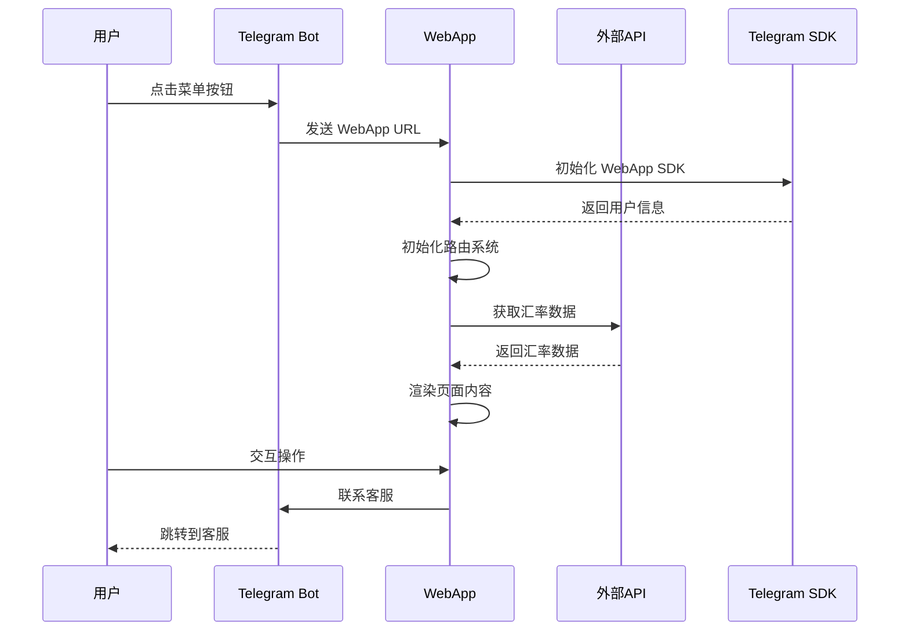
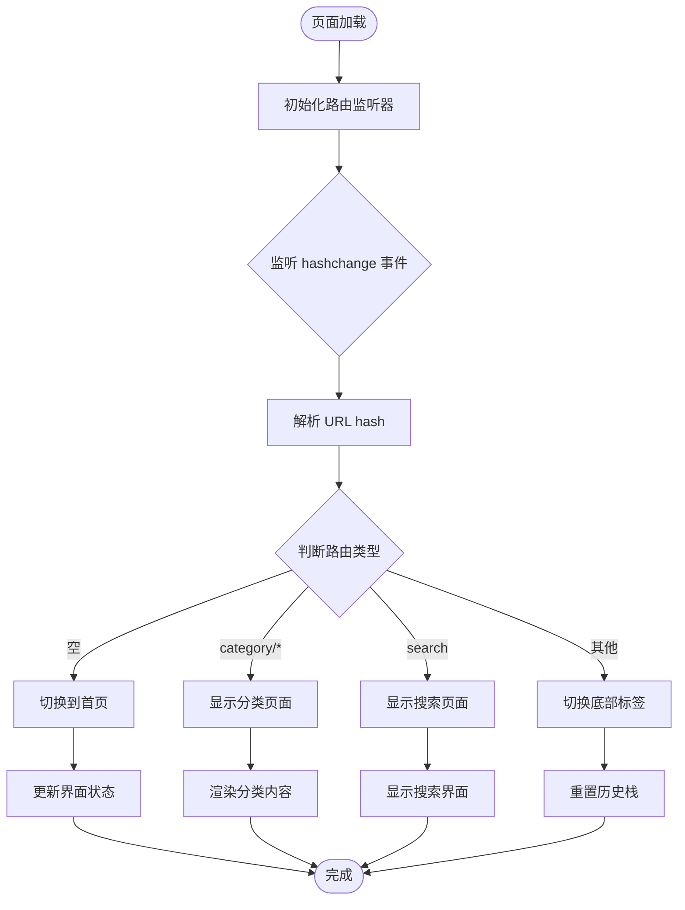
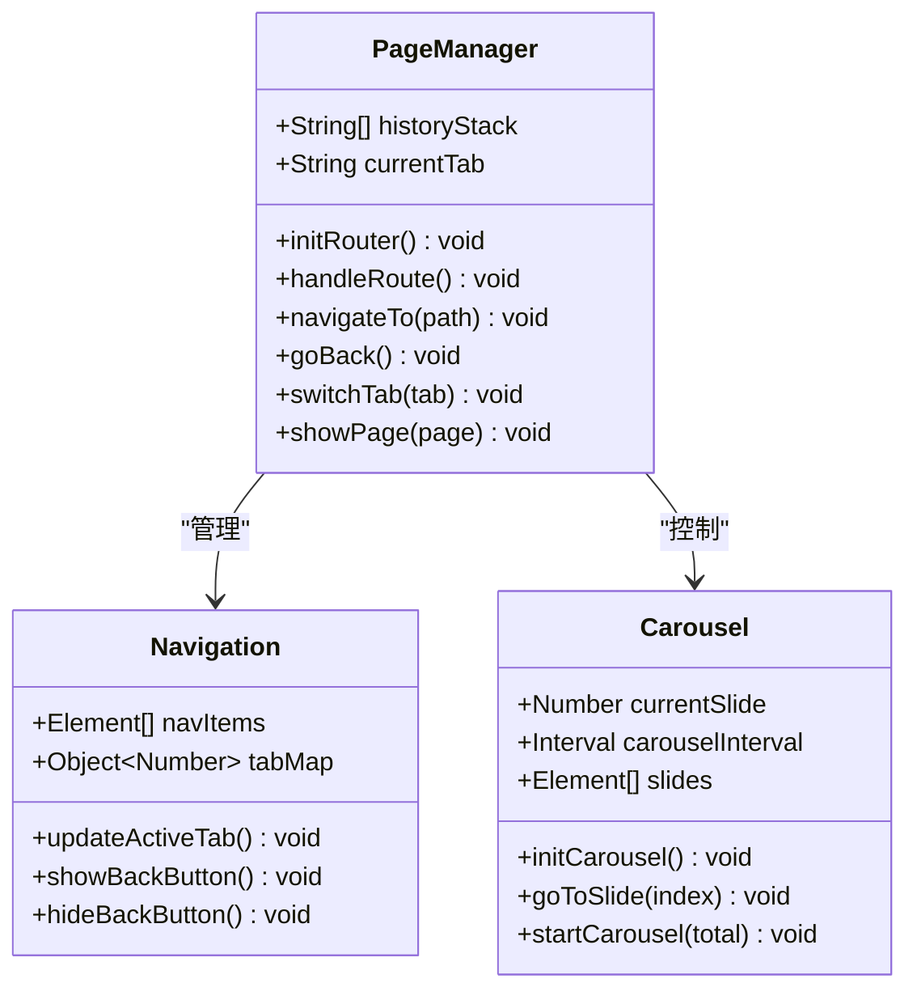
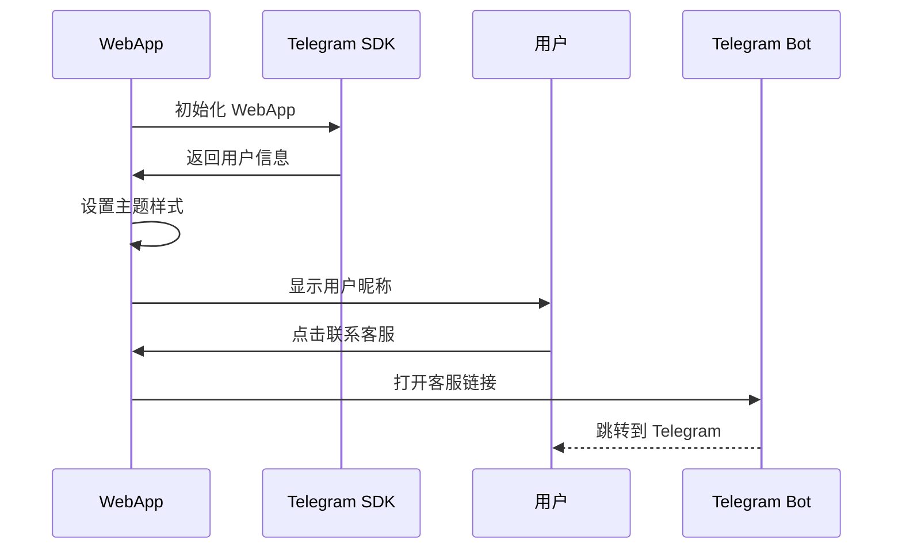
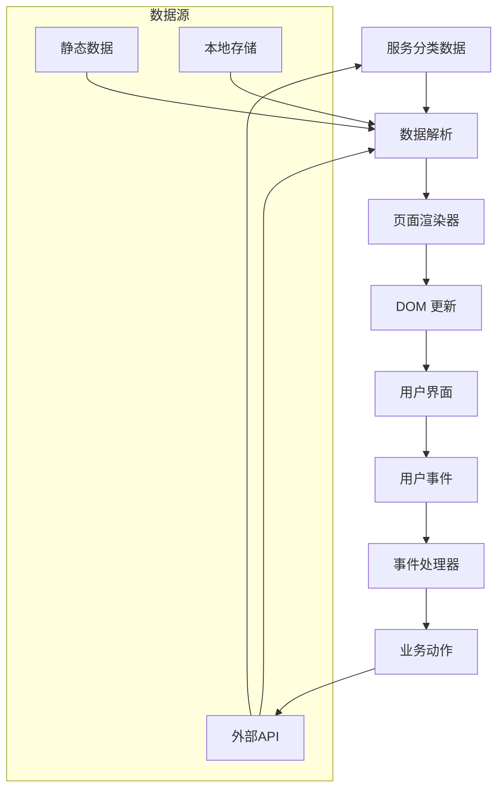
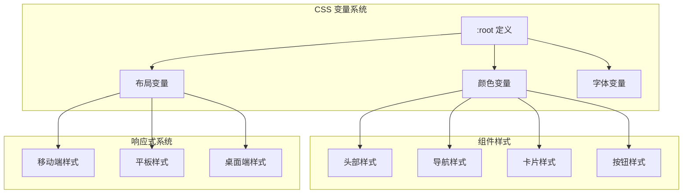
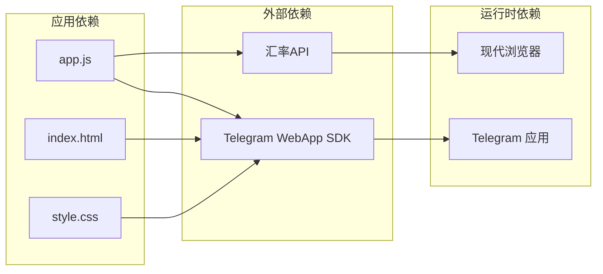
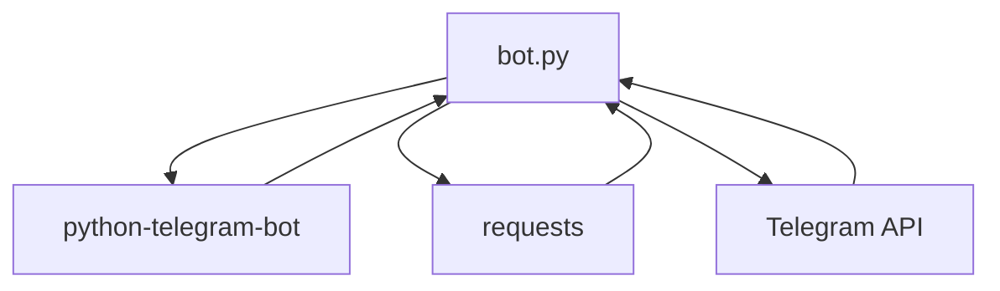

# Web 应用架构

<cite>
**本文档引用的文件**
- [index.html](file://webapp/index.html)
- [app.js](file://webapp/js/app.js)
- [style.css](file://webapp/css/style.css)
- [bot.py](file://bot/bot.py)
- [requirements.txt](file://bot/requirements.txt)
- [vercel.json](file://vercel.json)
</cite>

## 目录
1. [简介](#简介)
2. [项目结构](#项目结构)
3. [核心组件](#核心组件)
4. [架构概览](#架构概览)
5. [详细组件分析](#详细组件分析)
6. [依赖分析](#依赖分析)
7. [性能考虑](#性能考虑)
8. [故障排除指南](#故障排除指南)
9. [结论](#结论)

## 简介

这是一个基于 Telegram WebApp SDK 构建的单页应用（SPA），为木姐地区的用户提供本地生活服务信息。应用采用 Hash 路由实现页面切换，集成了 Telegram WebApp 功能，支持实时汇率查询、服务分类浏览、搜索功能等核心特性。

## 项目结构

项目采用典型的前端单页应用架构，主要分为三个部分：

**图表来源**
- [index.html:1-145](file://webapp/index.html#L1-L145)
- [app.js:1-87](file://webapp/js/app.js#L1-L87)
- [style.css:1-80](file://webapp/css/style.css#L1-L80)
- [bot.py:1-88](file://bot/bot.py#L1-L88)
- [vercel.json:1-8](file://vercel.json#L1-L8)

**章节来源**
- [index.html:1-145](file://webapp/index.html#L1-L145)
- [app.js:1-87](file://webapp/js/app.js#L1-L87)
- [style.css:1-80](file://webapp/css/style.css#L1-L80)
- [bot.py:1-88](file://bot/bot.py#L1-L88)
- [vercel.json:1-8](file://vercel.json#L1-L8)

## 核心组件

### 前端技术栈

应用使用现代前端技术构建：

- **HTML5**: 语义化标签和响应式布局
- **JavaScript ES6+**: 模块化开发和现代语法
- **CSS3**: 变量、动画、网格布局和媒体查询
- **Telegram WebApp SDK**: 原生应用集成

### 主要功能模块

1. **Hash 路由系统**: 基于 URL hash 的页面导航
2. **页面管理系统**: 多页面切换和状态管理
3. **组件化设计**: 可复用的 UI 组件
4. **主题系统**: 基于 CSS 变量的主题定制
5. **响应式设计**: 移动优先的设计理念

**章节来源**
- [app.js:1-87](file://webapp/js/app.js#L1-L87)
- [style.css:1-80](file://webapp/css/style.css#L1-L80)

## 架构概览

应用采用客户端-服务器混合架构，通过 Telegram Bot 作为入口点：

**图表来源**
- [bot.py:14-42](file://bot/bot.py#L14-L42)
- [app.js:51-54](file://webapp/js/app.js#L51-L54)
- [app.js:84-84](file://webapp/js/app.js#L84-L84)

## 详细组件分析

### Hash 路由系统

应用实现了完整的 Hash 路由机制，支持页面导航和历史管理：

**图表来源**
- [app.js:64-66](file://webapp/js/app.js#L64-L66)
- [app.js:72-72](file://webapp/js/app.js#L72-L72)

#### 路由实现细节

- **导航函数**: `navigateTo(path)` - 推入历史栈并设置 hash
- **返回函数**: `goBack()` - 弹出历史栈并回退
- **标签切换**: `switchTab(tab)` - 切换底部导航标签
- **页面显示**: `showPage(page)` - 显示指定页面

**章节来源**
- [app.js:68-74](file://webapp/js/app.js#L68-L74)

### 页面管理系统

应用采用页面切换模式，每个页面独立管理：

**图表来源**
- [app.js:64-72](file://webapp/js/app.js#L64-L72)
- [app.js:56-62](file://webapp/js/app.js#L56-L62)

#### 页面类型

1. **首页 (home)**: 展示轮播图、搜索栏、分类网格
2. **跑腿服务 (errand)**: 提供同城跑腿服务
3. **曝光台 (expose)**: 不良商家曝光平台
4. **活动 (activity)**: 同城活动展示
5. **个人中心 (profile)**: 用户信息和设置
6. **分类页面 (category)**: 服务分类详情
7. **搜索页面 (search)**: 搜索功能

**章节来源**
- [index.html:22-131](file://webapp/index.html#L22-L131)

### Telegram WebApp 集成

应用深度集成了 Telegram WebApp SDK：

**图表来源**
- [app.js:54-54](file://webapp/js/app.js#L54-L54)
- [index.html:9-9](file://webapp/index.html#L9-L9)

#### 集成特性

- **用户信息获取**: 自动获取 Telegram 用户信息
- **主题适配**: 根据 Telegram 主题动态调整颜色
- **全屏显示**: 自动扩展到全屏模式
- **生命周期管理**: 正确的 SDK 初始化和扩展

**章节来源**
- [app.js:54-54](file://webapp/js/app.js#L54-L54)
- [style.css:79-79](file://webapp/css/style.css#L79-L79)

### 数据流架构

应用采用服务分类数据驱动的渲染模式：

**图表来源**
- [app.js:1-49](file://webapp/js/app.js#L1-L49)
- [app.js:76-78](file://webapp/js/app.js#L76-L78)

#### 数据结构设计

应用使用统一的数据结构管理所有服务分类：

- **分类对象**: 包含标题、描述、颜色、标签数组、商店列表
- **商店对象**: 包含名称、描述、标签、评分、图标
- **动态渲染**: 通过模板字符串生成 HTML 结构

**章节来源**
- [app.js:1-49](file://webapp/js/app.js#L1-L49)
- [app.js:76-78](file://webapp/js/app.js#L76-L78)

### 样式架构

应用采用 CSS 变量和模块化设计：

**图表来源**
- [style.css:2-2](file://webapp/css/style.css#L2-L2)
- [style.css:5-79](file://webapp/css/style.css#L5-L79)

#### 样式特性

- **CSS 变量**: 支持主题定制和动态切换
- **Flexbox/Grid**: 现代布局系统
- **动画效果**: 平滑的过渡和交互动画
- **响应式设计**: 移动优先的自适应布局

**章节来源**
- [style.css:1-80](file://webapp/css/style.css#L1-L80)

## 依赖分析

### 前端依赖

**图表来源**
- [app.js:9-9](file://webapp/js/app.js#L9-L9)
- [app.js:84-84](file://webapp/js/app.js#L84-L84)
- [index.html:9-9](file://webapp/index.html#L9-L9)

### 后端依赖

**图表来源**
- [bot.py:3-4](file://bot/bot.py#L3-L4)
- [requirements.txt:1-2](file://bot/requirements.txt#L1-L2)

**章节来源**
- [requirements.txt:1-3](file://bot/requirements.txt#L1-L3)

## 性能考虑

### 加载优化

1. **资源压缩**: 使用 CDN 加速 Telegram WebApp SDK
2. **懒加载**: 轮播图自动播放，减少初始渲染压力
3. **缓存策略**: 利用浏览器缓存机制
4. **按需加载**: 页面切换时只加载必要资源

### 运行时优化

1. **事件委托**: 减少事件监听器数量
2. **虚拟滚动**: 对于大量数据采用虚拟滚动
3. **防抖节流**: 搜索和滚动操作的性能优化
4. **内存管理**: 及时清理定时器和事件监听器

### 移动端优化

1. **触摸优化**: 适配触摸设备的交互
2. **电池优化**: 减少后台任务和网络请求
3. **带宽优化**: 压缩图片和资源文件
4. **离线支持**: 基础功能的离线可用性

## 故障排除指南

### 常见问题

#### Telegram WebApp 集成问题

**症状**: WebApp 无法正确初始化或主题不匹配

**解决方案**:
1. 检查 Telegram WebApp SDK 是否正确加载
2. 验证 `window.Telegram.WebApp` 对象是否存在
3. 确认 `initDataUnsafe` 中的用户信息是否可用
4. 检查 `tg.expand()` 是否成功执行

**章节来源**
- [app.js:54-54](file://webapp/js/app.js#L54-L54)

#### Hash 路由问题

**症状**: 页面切换异常或历史记录错误

**解决方案**:
1. 检查 `hashchange` 事件监听器是否正常工作
2. 验证 `navigateTo` 和 `goBack` 函数的实现
3. 确认 `historyStack` 数组的状态管理
4. 检查页面元素的 ID 是否正确

**章节来源**
- [app.js:68-74](file://webapp/js/app.js#L68-L74)

#### 数据渲染问题

**症状**: 分类页面内容不显示或显示异常

**解决方案**:
1. 验证分类数据结构是否完整
2. 检查 `renderShopCard` 函数的实现
3. 确认 DOM 元素的选择器是否正确
4. 验证 CSS 类名的匹配情况

**章节来源**
- [app.js:76-78](file://webapp/js/app.js#L76-L78)

### 调试技巧

1. **浏览器开发者工具**: 使用 Console 查看错误信息
2. **Network 面板**: 监控 API 请求和响应
3. **Elements 面板**: 检查 DOM 结构和样式应用
4. **Sources 面板**: 设置断点调试 JavaScript 代码

## 结论

这个 Web 应用展现了现代前端开发的最佳实践，成功地将 Telegram WebApp SDK 与传统 SPA 架构相结合。应用具有以下特点：

### 技术优势

1. **架构清晰**: 模块化的代码组织和职责分离
2. **用户体验**: 流畅的页面切换和丰富的交互效果
3. **可维护性**: 标准化的代码风格和注释规范
4. **扩展性**: 灵活的数据结构支持新功能添加

### 改进建议

1. **状态管理**: 考虑引入更完善的状态管理库
2. **测试覆盖**: 添加单元测试和集成测试
3. **错误处理**: 增强错误边界和降级处理
4. **性能监控**: 集成性能监控和用户行为分析

该应用为 Telegram 生态系统中的本地生活服务提供了优秀的解决方案，展现了跨平台应用开发的技术可能性。