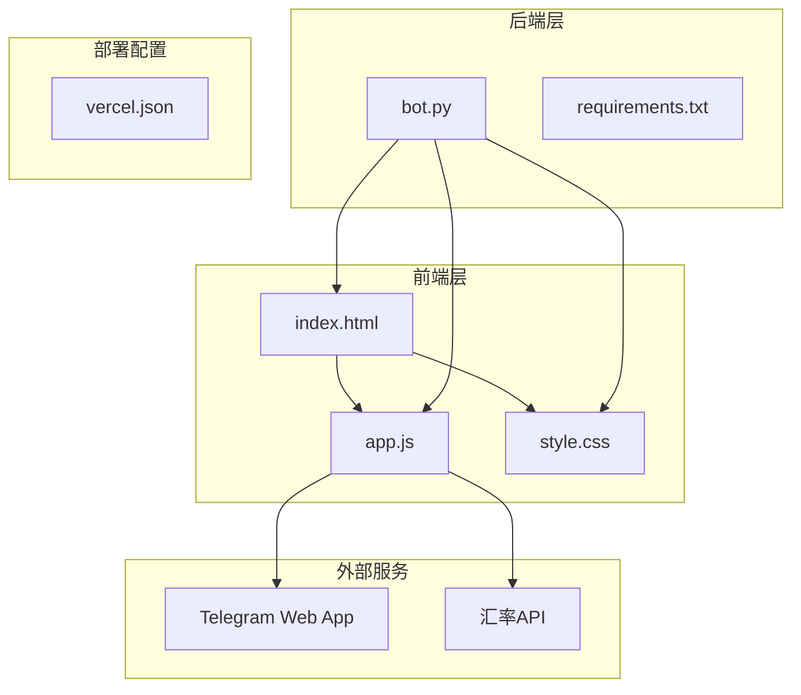
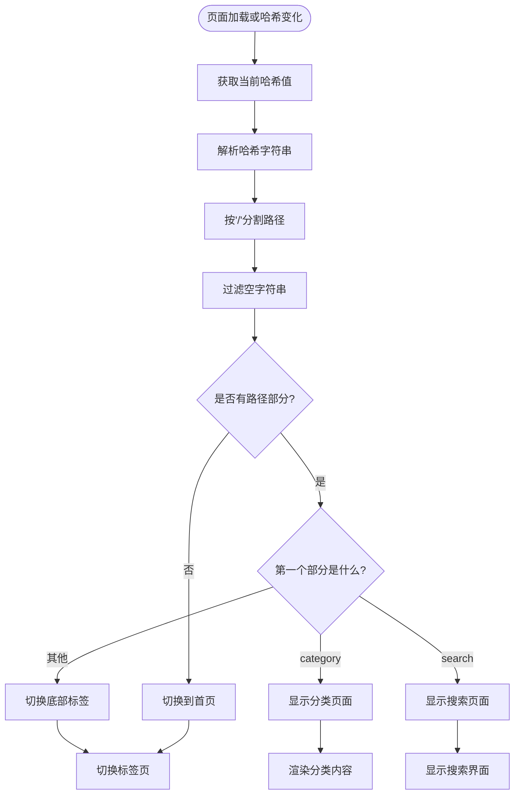
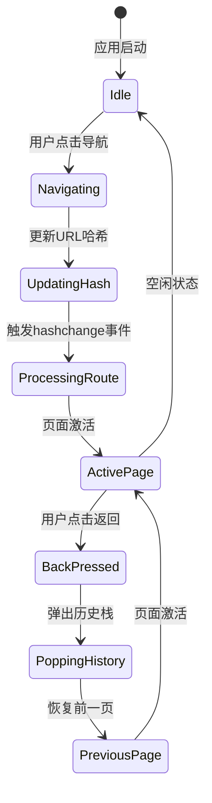
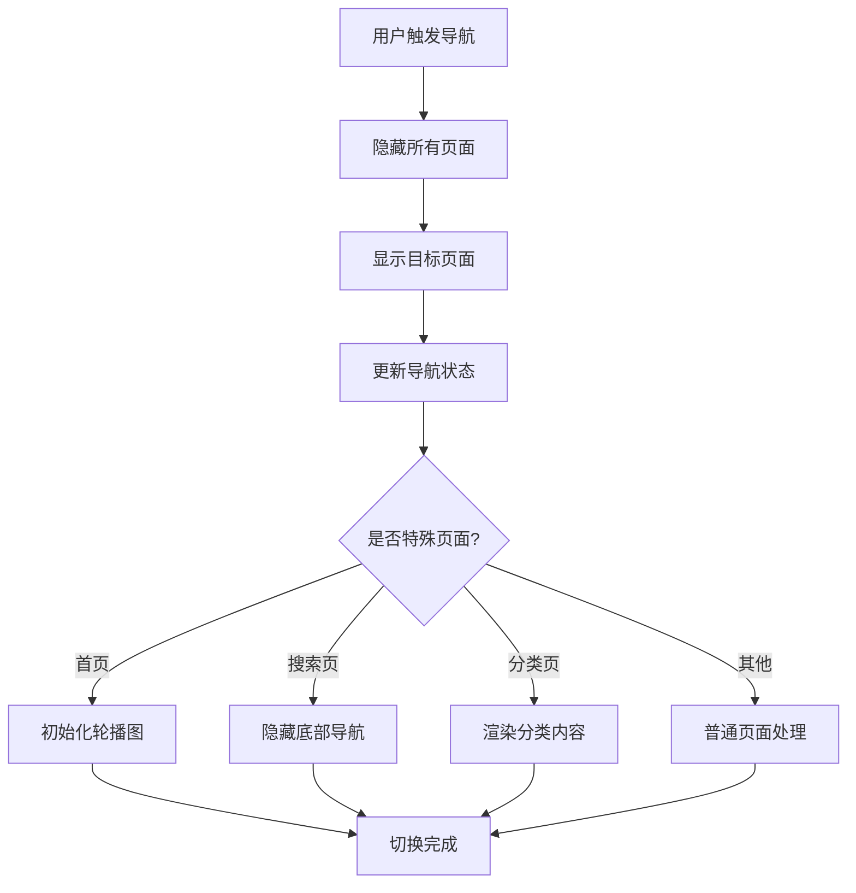
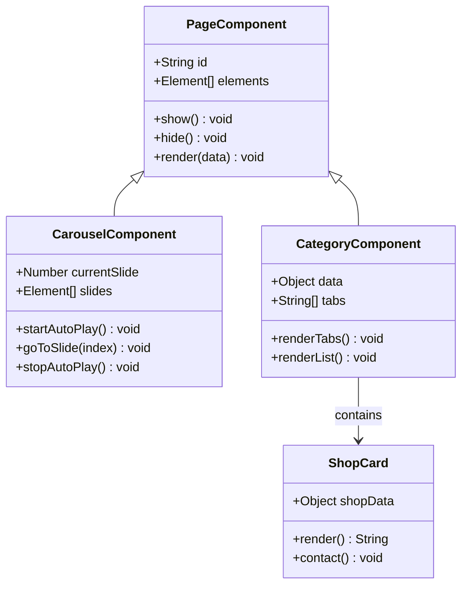
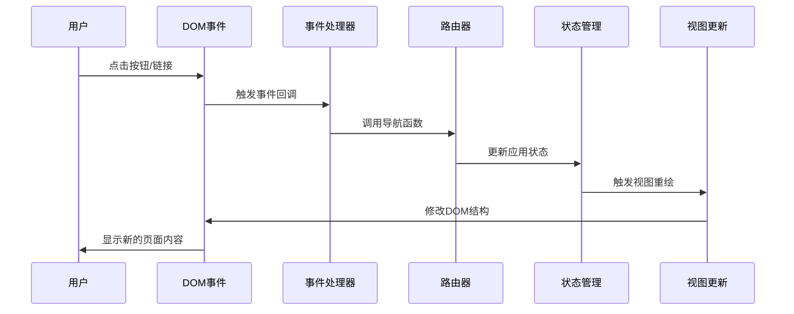
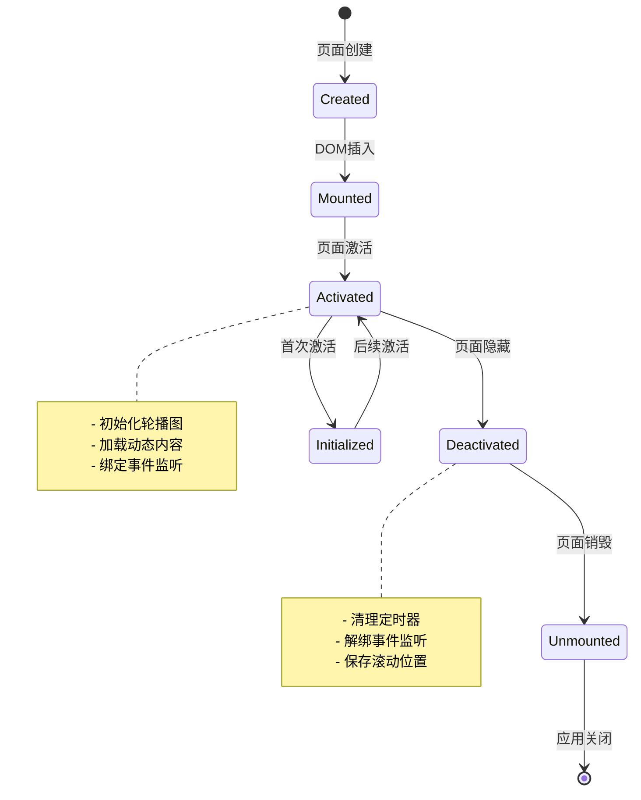
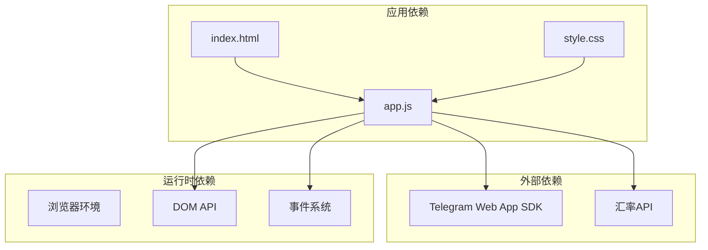
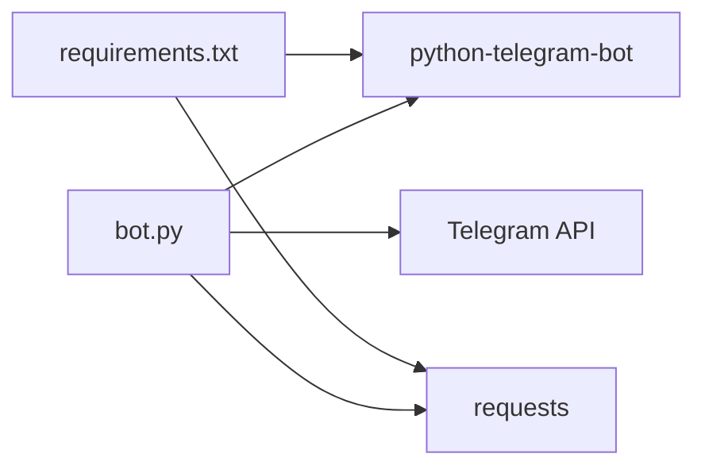

# 单页应用架构设计

<cite>
**本文档引用的文件**
- [index.html](file://webapp/index.html)
- [app.js](file://webapp/js/app.js)
- [style.css](file://webapp/css/style.css)
- [bot.py](file://bot/bot.py)
- [requirements.txt](file://bot/requirements.txt)
- [vercel.json](file://vercel.json)
</cite>

## 目录
1. [简介](#简介)
2. [项目结构](#项目结构)
3. [核心组件](#核心组件)
4. [架构概览](#架构概览)
5. [详细组件分析](#详细组件分析)
6. [依赖关系分析](#依赖关系分析)
7. [性能考虑](#性能考虑)
8. [故障排除指南](#故障排除指南)
9. [结论](#结论)

## 简介

这是一个基于 Telegram Web App 的单页应用（SPA），为木姐地区用户提供本地生活服务信息。应用采用 Hash 路由实现页面切换，结合 Telegram Web App 提供原生移动应用体验。系统包含首页、跑腿服务、曝光台、活动信息和用户个人中心等模块，支持分类浏览、搜索功能和实时汇率查询。

## 项目结构

项目采用典型的前端 SPA 架构，主要分为三个层次：

**图表来源**
- [index.html:1-145](file://webapp/index.html#L1-L145)
- [app.js:1-87](file://webapp/js/app.js#L1-L87)
- [bot.py:1-88](file://bot/bot.py#L1-L88)

**章节来源**
- [index.html:1-145](file://webapp/index.html#L1-L145)
- [app.js:1-87](file://webapp/js/app.js#L1-L87)
- [style.css:1-80](file://webapp/css/style.css#L1-L80)
- [bot.py:1-88](file://bot/bot.py#L1-L88)
- [vercel.json:1-8](file://vercel.json#L1-L8)

## 核心组件

### 页面容器系统

应用使用 CSS 类 `.page` 和 `.page.active` 来控制页面显示状态：

- **页面容器**：每个页面都封装在独立的 `div` 容器中，具有唯一 ID
- **激活状态**：通过添加/移除 `active` 类来控制页面可见性
- **动画效果**：使用 CSS 动画实现页面切换的淡入效果

### 导航系统

应用实现了底部导航栏和顶部返回按钮的双重导航机制：

- **底部导航**：五个主要功能模块的快捷入口
- **顶部返回**：用于子页面的返回操作
- **标签高亮**：当前激活的导航项会显示高亮状态

### 内容管理系统

应用内置了丰富的本地服务数据，包括：

- **分类数据**：美食、酒店、购物、换汇等12个服务类别
- **商户信息**：每个类别包含多个商户的详细信息
- **标签系统**：为商户添加分类标签便于筛选

**章节来源**
- [index.html:12-140](file://webapp/index.html#L12-L140)
- [app.js:1-87](file://webapp/js/app.js#L1-L87)
- [style.css:1-80](file://webapp/css/style.css#L1-L80)

## 架构概览

应用采用事件驱动的架构模式，主要组件之间的交互关系如下：

```mermaid
sequenceDiagram
participant User as 用户
participant Header as 顶部导航
participant BottomNav as 底部导航
participant Router as 路由器
participant Page as 页面组件
participant Carousel as 轮播组件
participant History as 历史栈
User->>Header : 点击返回按钮
Header->>Router : 调用 goBack()
Router->>History : 弹出历史记录
History-->>Router : 返回上一个URL
Router->>Router : 处理哈希变化
Router->>Page : 切换页面显示
User->>BottomNav : 点击导航项
BottomNav->>Router : 调用 switchTab()
Router->>History : 清空历史栈
Router->>Page : 显示目标页面
Router->>Carousel : 初始化轮播图
User->>Page : 点击分类链接
Page->>Router : 调用 navigateTo()
Router->>History : 推入新记录
Router->>Router : 更新哈希值
Router->>Page : 显示分类页面
```

**图表来源**
- [app.js:64-72](file://webapp/js/app.js#L64-L72)
- [index.html:134-140](file://webapp/index.html#L134-L140)

## 详细组件分析

### Hash 路由实现

应用使用浏览器的 `hashchange` 事件实现客户端路由：

#### URL 解析机制

**图表来源**
- [app.js:64-66](file://webapp/js/app.js#L64-L66)

#### 页面状态管理

应用通过以下机制管理页面状态：

- **DOM 元素切换**：直接操作页面元素的 `active` 类属性
- **历史记录管理**：维护 `historyStack` 数组跟踪导航历史
- **轮播图状态**：在首页切换时自动初始化轮播组件

#### 历史记录处理

**图表来源**
- [app.js:68-72](file://webapp/js/app.js#L68-L72)

**章节来源**
- [app.js:64-72](file://webapp/js/app.js#L64-L72)

### 页面切换机制

#### DOM 操作流程

页面切换采用直接 DOM 操作的方式，避免了复杂的虚拟 DOM 比较：

1. **隐藏所有页面**：遍历所有 `.page` 元素并移除 `active` 类
2. **显示目标页面**：为目标页面添加 `active` 类
3. **更新导航状态**：根据目标页面更新底部导航的激活状态
4. **处理特殊页面**：首页需要初始化轮播图，搜索页需要隐藏底部导航

#### 页面元素显示隐藏

**图表来源**
- [app.js:72-76](file://webapp/js/app.js#L72-L76)

**章节来源**
- [app.js:72-76](file://webapp/js/app.js#L72-L76)

### 组件化设计模式

#### 页面组件组织

应用采用模块化的页面组件设计：

- **页面容器**：每个页面都有独立的容器元素
- **功能模块**：首页包含轮播图、搜索栏、分类网格等功能模块
- **响应式布局**：使用 CSS Grid 和 Flexbox 实现自适应布局

#### 公共组件

应用实现了可复用的通用组件：

- **轮播图组件**：支持自动播放和手动切换
- **分类标签组件**：动态生成分类标签和筛选功能
- **商户卡片组件**：统一的商户信息展示格式

#### 数据驱动渲染

**图表来源**
- [app.js:1-49](file://webapp/js/app.js#L1-L49)
- [app.js:76-78](file://webapp/js/app.js#L76-L78)

**章节来源**
- [app.js:1-49](file://webapp/js/app.js#L1-L49)
- [app.js:76-78](file://webapp/js/app.js#L76-L78)

### 事件驱动架构

#### 用户交互到页面更新的数据流

#### 事件处理机制

应用使用传统的 DOM 事件监听机制：

- **点击事件**：通过 `onclick` 属性绑定事件处理器
- **哈希变化**：监听 `hashchange` 事件实现路由切换
- **页面加载**：在 `DOMContentLoaded` 事件中初始化应用

**章节来源**
- [index.html:14-140](file://webapp/index.html#L14-L140)
- [app.js:64-66](file://webapp/js/app.js#L64-L66)

### 路由配置与页面生命周期

#### 路由配置

应用的路由配置相对简单，主要基于 URL 哈希：

- **首页**：`#/` 或空哈希
- **分类页面**：`#/category/:categoryId`
- **搜索页面**：`#/search`
- **功能页面**：`#/home`, `#/errand`, `#/expose`, `#/activity`, `#/profile`

#### 页面生命周期管理

**图表来源**
- [app.js:51-52](file://webapp/js/app.js#L51-L52)
- [app.js:62-63](file://webapp/js/app.js#L62-L63)

**章节来源**
- [app.js:51-52](file://webapp/js/app.js#L51-L52)
- [app.js:62-63](file://webapp/js/app.js#L62-L63)

### 内存优化策略

#### DOM 元素管理

应用采用了高效的 DOM 元素管理策略：

- **元素复用**：同一页面内的元素在切换时保持不变
- **事件解绑**：页面切换时清理相关的事件监听器
- **定时器清理**：轮播图的定时器在页面切换时自动清理

#### 数据缓存机制

- **静态数据**：分类和商户数据存储在 JavaScript 对象中
- **API 缓存**：汇率数据通过网络请求获取并显示
- **状态持久化**：历史栈状态在页面切换时得到维护

**章节来源**
- [app.js:62-63](file://webapp/js/app.js#L62-L63)
- [app.js:84-84](file://webapp/js/app.js#L84-L84)

## 依赖关系分析

### 前端依赖

**图表来源**
- [app.js:9-9](file://webapp/js/app.js#L9-L9)
- [app.js:84-84](file://webapp/js/app.js#L84-L84)

### 后端依赖

应用的后端依赖关系相对简单：

**图表来源**
- [bot.py:3-4](file://bot/bot.py#L3-L4)
- [requirements.txt:1-3](file://bot/requirements.txt#L1-L3)

**章节来源**
- [bot.py:1-88](file://bot/bot.py#L1-L88)
- [requirements.txt:1-3](file://bot/requirements.txt#L1-L3)

## 性能考虑

### 加载性能优化

1. **资源压缩**：CSS 和 JavaScript 文件经过压缩处理
2. **图片优化**：使用渐变背景替代大量图片资源
3. **懒加载**：轮播图采用延迟初始化策略

### 运行时性能

1. **事件委托**：使用事件冒泡机制减少事件监听器数量
2. **DOM 操作最小化**：批量更新 DOM 元素
3. **动画性能**：使用 CSS3 transform 实现硬件加速

### 内存管理

1. **定时器清理**：页面切换时自动清理轮播图定时器
2. **事件监听器解绑**：避免内存泄漏
3. **对象池模式**：复用 DOM 元素和数据对象

## 故障排除指南

### 常见问题及解决方案

#### Hash 路由问题

**问题**：页面无法正确识别当前路由状态
**解决方案**：
1. 检查 `hashchange` 事件监听器是否正常工作
2. 验证 URL 哈希格式是否正确
3. 确认 `handleRoute` 函数的路径解析逻辑

#### 页面切换异常

**问题**：页面切换后样式或功能异常
**解决方案**：
1. 检查目标页面的 `active` 类是否正确添加
2. 验证页面元素的可见性状态
3. 确认导航状态的同步更新

#### 轮播图不工作

**问题**：首页轮播图无法自动播放
**解决方案**：
1. 检查轮播图元素是否存在
2. 验证定时器是否正确初始化
3. 确认轮播图索引状态的同步

#### Telegram Web App 集成问题

**问题**：Telegram 主题样式不生效
**解决方案**：
1. 确认 Telegram Web App SDK 正确加载
2. 检查主题类名的添加时机
3. 验证主题变量的兼容性

**章节来源**
- [app.js:51-52](file://webapp/js/app.js#L51-L52)
- [app.js:54-54](file://webapp/js/app.js#L54-L54)
- [app.js:62-63](file://webapp/js/app.js#L62-L63)

## 结论

这个单页应用展现了现代前端开发的最佳实践：

1. **简洁高效**：采用原生 JavaScript 实现，避免了复杂框架的开销
2. **用户体验优秀**：结合 Telegram Web App 提供原生应用体验
3. **组件化设计**：清晰的模块划分和可复用的组件结构
4. **性能优化**：合理的内存管理和 DOM 操作策略
5. **扩展性强**：模块化的架构便于功能扩展和维护

应用成功地将传统 Web 开发与现代移动应用体验相结合，为用户提供了一个功能丰富、性能优异的本地生活服务平台。通过合理的架构设计和优化策略，该应用能够在不同设备和网络环境下提供稳定的服务。