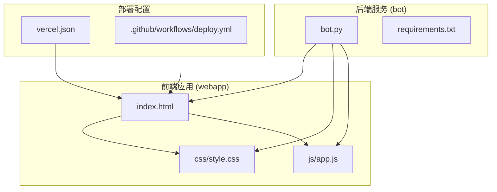
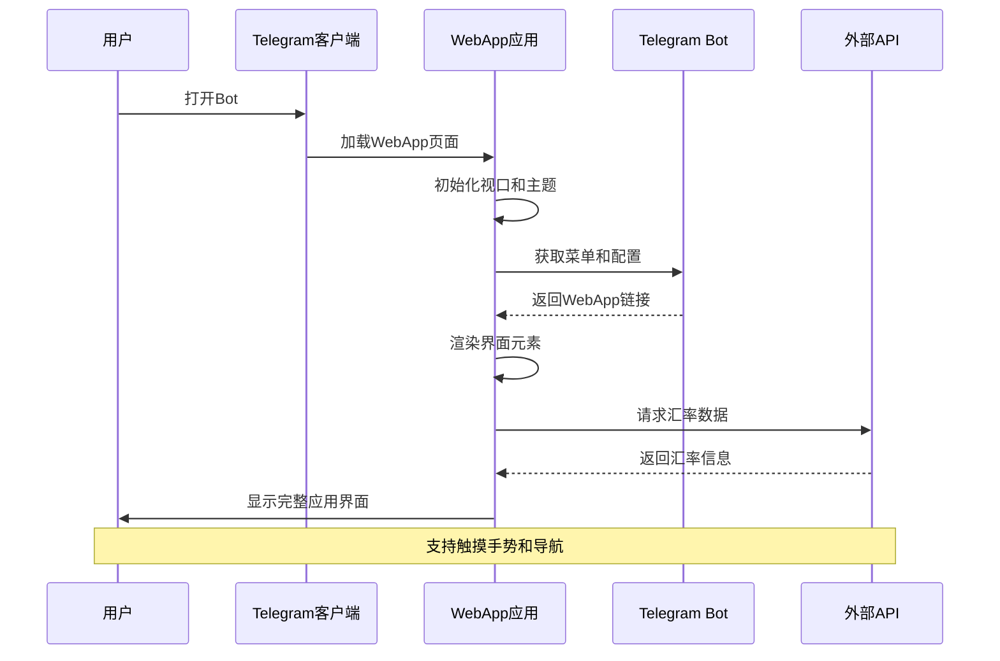
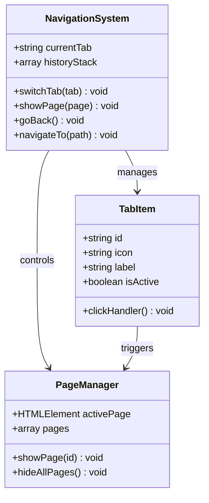
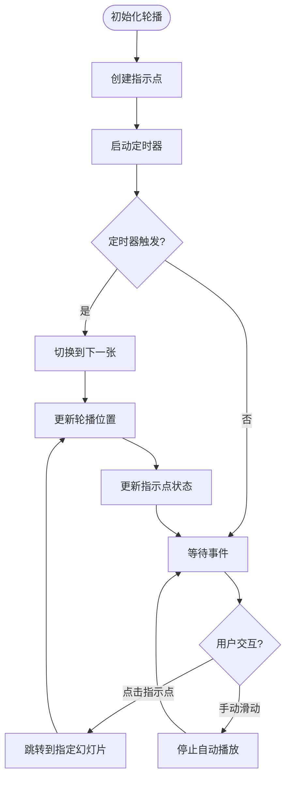
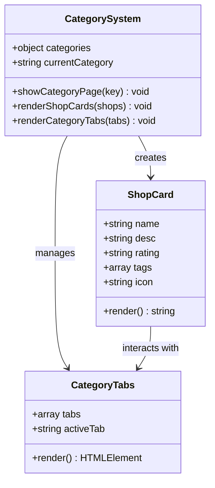
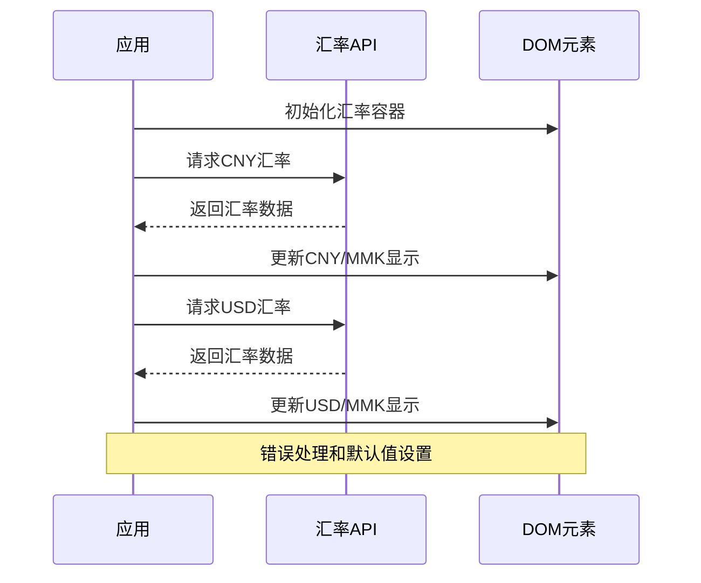
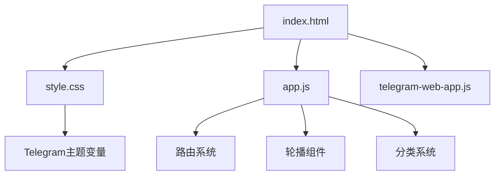
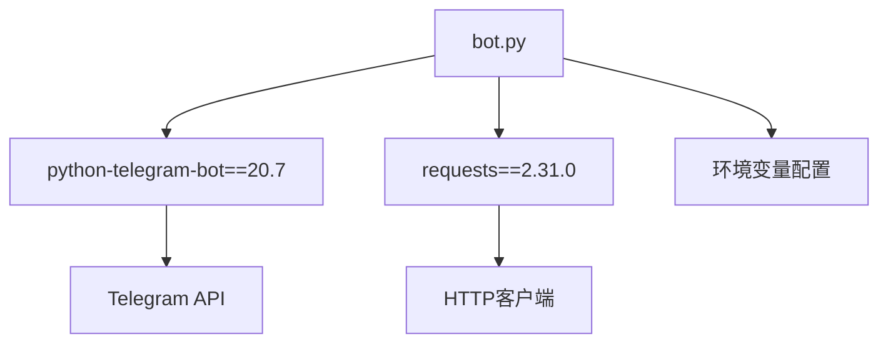

# 响应式设计实现

<cite>
**本文档引用的文件**
- [index.html](file://webapp/index.html)
- [style.css](file://webapp/css/style.css)
- [app.js](file://webapp/js/app.js)
- [bot.py](file://bot/bot.py)
- [requirements.txt](file://bot/requirements.txt)
- [vercel.json](file://vercel.json)
- [deploy.yml](file://.github/workflows/deploy.yml)
</cite>

## 目录
1. [简介](#简介)
2. [项目结构](#项目结构)
3. [核心组件](#核心组件)
4. [架构概览](#架构概览)
5. [详细组件分析](#详细组件分析)
6. [依赖关系分析](#依赖关系分析)
7. [性能考虑](#性能考虑)
8. [故障排除指南](#故障排除指南)
9. [结论](#结论)

## 简介

这是一个基于 Telegram Web App 的移动端优先响应式设计应用，名为"木姐同城生活助手"。该项目采用移动端优先的设计理念，通过精心设计的视口配置、像素比处理和触摸交互优化，为用户提供流畅的移动设备体验。应用实现了完整的弹性布局系统，包括 Flexbox、Grid 和流式布局策略，并提供了完善的断点设计系统和触摸手势支持。

## 项目结构

该项目采用清晰的模块化组织结构，主要分为前端展示层和后端服务层：

**图表来源**
- [index.html:1-145](file://webapp/index.html#L1-L145)
- [style.css:1-80](file://webapp/css/style.css#L1-L80)
- [app.js:1-87](file://webapp/js/app.js#L1-L87)
- [bot.py:1-88](file://bot/bot.py#L1-L88)

**章节来源**
- [index.html:1-145](file://webapp/index.html#L1-L145)
- [style.css:1-80](file://webapp/css/style.css#L1-L80)
- [app.js:1-87](file://webapp/js/app.js#L1-L87)

## 核心组件

### 视口配置与移动端优化

项目在 HTML 头部配置了关键的视口参数，确保在移动设备上的正确显示：

- `width=device-width`: 设置视口宽度等于设备屏幕宽度
- `initial-scale=1`: 初始缩放比例为1
- `maximum-scale=1`: 最大缩放比例限制
- `user-scalable=no`: 禁止用户手动缩放

这些配置确保了应用在不同设备上的一致显示效果，避免了移动端常见的缩放问题。

### 主题色彩系统

应用使用 CSS 变量定义了完整的主题色彩系统，支持 Telegram Web App 的动态主题适配：

- 主色调：`--primary: #ff6b35`
- 辅助色调：`--primary-light: #ff9a56`
- 背景色：`--bg: #f5f5f5`
- 文字颜色：`--text: #333`
- 危险色：`--danger: #f5576c`
- 成功色：`--success: #43e97b`
- 信息色：`--info: #4facfe`

**章节来源**
- [index.html:5-6](file://webapp/index.html#L5-L6)
- [style.css:2-3](file://webapp/css/style.css#L2-L3)

### 弹性布局系统

应用实现了多层次的弹性布局策略：

1. **Flexbox 布局**：用于导航栏、搜索栏、推荐列表等
2. **CSS Grid 布局**：用于分类网格、服务列表等
3. **流式布局**：通过百分比和弹性单位实现自适应

**章节来源**
- [style.css:18-39](file://webapp/css/style.css#L18-L39)
- [style.css:29-34](file://webapp/css/style.css#L29-L34)

## 架构概览

应用采用前后端分离的架构模式，通过 Telegram Web App 提供统一的用户体验：

**图表来源**
- [bot.py:14-42](file://bot/bot.py#L14-L42)
- [app.js:51-54](file://webapp/js/app.js#L51-L54)
- [app.js:84-84](file://webapp/js/app.js#L84-L84)

## 详细组件分析

### 导航系统

应用实现了底部固定导航栏，支持五种主要功能页面：

**图表来源**
- [app.js:72-72](file://webapp/js/app.js#L72-L72)
- [app.js:74-74](file://webapp/js/app.js#L74-L74)
- [app.js:70-70](file://webapp/js/app.js#L70-L70)

### 轮播图组件

实现了自动轮播的横幅展示系统：

**图表来源**
- [app.js:56-62](file://webapp/js/app.js#L56-L62)
- [app.js:58-60](file://webapp/js/app.js#L58-L60)

### 分类页面系统

支持多级分类的页面渲染机制：

**图表来源**
- [app.js:76-78](file://webapp/js/app.js#L76-L78)
- [app.js:78-78](file://webapp/js/app.js#L78-L78)

### 触摸交互优化

应用实现了多项触摸交互优化：

1. **触摸反馈**：使用 `:active` 伪类提供即时视觉反馈
2. **滚动优化**：启用 `-webkit-overflow-scrolling: touch`
3. **手势支持**：为导航项设置 `touch-action: manipulation`
4. **点击区域优化**：确保最小点击目标尺寸

**章节来源**
- [style.css:19-21](file://webapp/css/style.css#L19-L21)
- [style.css:37-39](file://webapp/css/style.css#L37-L39)
- [style.css:62-62](file://webapp/css/style.css#L62-L62)

### 数据获取与处理

应用集成了外部汇率数据获取功能：

**图表来源**
- [app.js:84-84](file://webapp/js/app.js#L84-L84)
- [app.js:84-84](file://webapp/js/app.js#L84-L84)

**章节来源**
- [app.js:84-84](file://webapp/js/app.js#L84-L84)

## 依赖关系分析

### 前端依赖

应用的前端依赖关系相对简单，主要依赖于 Telegram Web App SDK：

**图表来源**
- [index.html:8-9](file://webapp/index.html#L8-L9)
- [style.css:79-80](file://webapp/css/style.css#L79-L80)
- [app.js:51-54](file://webapp/js/app.js#L51-L54)

### 后端依赖

后端服务依赖于 Python Telegram Bot 框架：

**图表来源**
- [bot.py:1-11](file://bot/bot.py#L1-L11)
- [requirements.txt:1-2](file://bot/requirements.txt#L1-L2)

**章节来源**
- [bot.py:1-11](file://bot/bot.py#L1-L11)
- [requirements.txt:1-3](file://bot/requirements.txt#L1-L3)

## 性能考虑

### 图片优化策略

虽然当前项目中图片主要通过 CSS 渐变实现，但建议的优化策略包括：

1. **懒加载实现**：为图片资源添加 `loading="lazy"` 属性
2. **格式优化**：使用现代图片格式如 WebP
3. **尺寸适配**：根据设备像素比提供合适尺寸的图片
4. **缓存策略**：合理设置 HTTP 缓存头

### CSS 优化技巧

应用已经采用了多项 CSS 优化技术：

1. **CSS 变量复用**：统一管理色彩和间距
2. **媒体查询优化**：针对不同设备优化布局
3. **硬件加速**：利用 `transform` 和 `opacity` 属性
4. **选择器优化**：避免深层嵌套选择器

### JavaScript 优化策略

1. **模块化加载**：按需加载非关键功能
2. **事件委托**：减少事件监听器数量
3. **虚拟滚动**：对于大量数据使用虚拟化
4. **内存管理**：及时清理定时器和事件监听器

## 故障排除指南

### 常见问题诊断

1. **视口显示异常**
   - 检查 `viewport` 元标签配置
   - 确认 `user-scalable=no` 设置是否影响用户体验

2. **触摸交互失效**
   - 验证 `-webkit-tap-highlight-color` 设置
   - 检查 CSS `:active` 伪类样式

3. **布局错乱问题**
   - 确认 `max-width: 480px` 设置
   - 检查 CSS Grid 和 Flexbox 的兼容性

4. **主题适配问题**
   - 验证 Telegram Web App 主题变量
   - 检查 CSS 变量降级处理

**章节来源**
- [index.html:5-5](file://webapp/index.html#L5-L5)
- [style.css:79-80](file://webapp/css/style.css#L79-L80)

### 调试工具使用

1. **移动端调试**：使用 Chrome DevTools 的设备模拟器
2. **网络监控**：观察 API 请求和响应时间
3. **性能分析**：使用 Performance 面板分析渲染性能
4. **内存检测**：监控内存泄漏和垃圾回收

## 结论

本项目成功实现了移动端优先的响应式设计，通过精心设计的视口配置、弹性布局系统和触摸交互优化，为用户提供了优质的移动设备体验。项目的核心优势包括：

1. **完整的移动端优化**：从视口配置到触摸交互的全方位优化
2. **灵活的主题系统**：支持 Telegram Web App 的动态主题适配
3. **高效的布局策略**：结合 Flexbox、Grid 和流式布局的优势
4. **可扩展的架构**：模块化的组件设计便于功能扩展

未来可以考虑的改进方向包括：引入更完善的断点系统、增强离线缓存能力、优化首屏加载性能等。整体而言，这是一个设计精良的移动端应用，为类似项目提供了良好的参考模板。