# 样式系统架构

<cite>
**本文档引用的文件**
- [style.css](file://webapp/css/style.css)
- [app.js](file://webapp/js/app.js)
- [index.html](file://webapp/index.html)
- [bot.py](file://bot/bot.py)
- [vercel.json](file://vercel.json)
</cite>

## 目录
1. [简介](#简介)
2. [项目结构](#项目结构)
3. [核心组件](#核心组件)
4. [架构概览](#架构概览)
5. [详细组件分析](#详细组件分析)
6. [依赖关系分析](#依赖关系分析)
7. [性能考虑](#性能考虑)
8. [故障排除指南](#故障排除指南)
9. [结论](#结论)

## 简介

这是一个基于 Telegram WebApp 的移动应用样式系统，采用现代化的 CSS 架构设计。该系统实现了完整的主题系统、响应式布局、动画效果和交互设计，为用户提供流畅的移动端体验。

## 项目结构

该项目采用简洁的三层架构：HTML 结构层、CSS 样式层和 JavaScript 逻辑层。

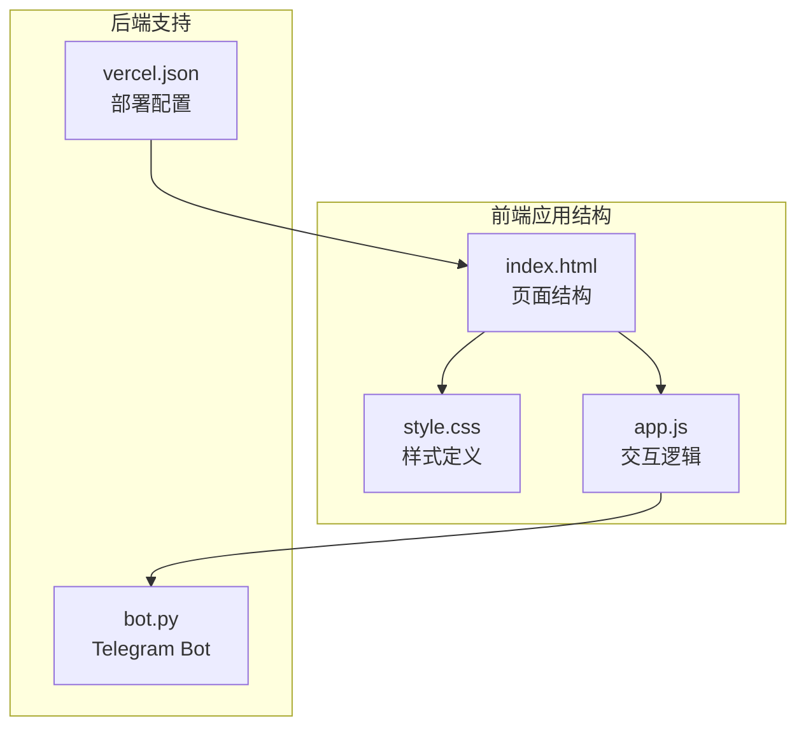

**图表来源**
- [index.html:1-145](file://webapp/index.html#L1-L145)
- [style.css:1-80](file://webapp/css/style.css#L1-L80)
- [app.js:1-87](file://webapp/js/app.js#L1-L87)

**章节来源**
- [index.html:1-145](file://webapp/index.html#L1-L145)
- [style.css:1-80](file://webapp/css/style.css#L1-L80)
- [app.js:1-87](file://webapp/js/app.js#L1-L87)

## 核心组件

### 主题系统架构

该样式系统采用 CSS 自定义属性（CSS Variables）实现主题系统，提供了完整的颜色、字体和间距规范。

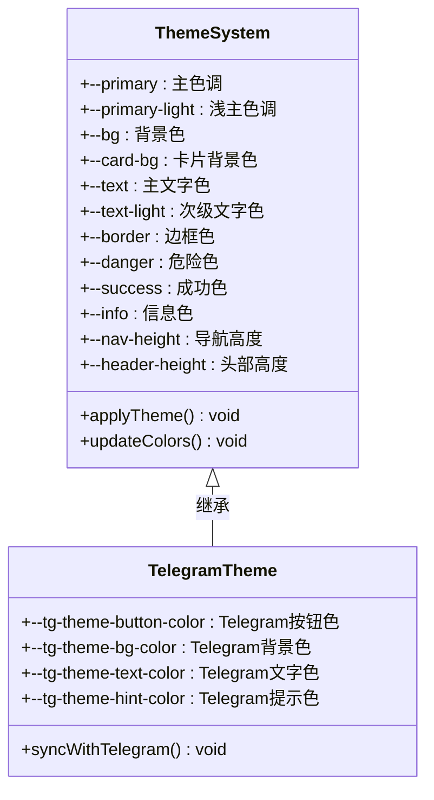

**图表来源**
- [style.css:2-2](file://webapp/css/style.css#L2-L2)
- [style.css:79-79](file://webapp/css/style.css#L79-L79)

### 响应式设计体系

系统采用移动优先的设计理念，通过固定的最大宽度和相对单位实现跨设备适配。

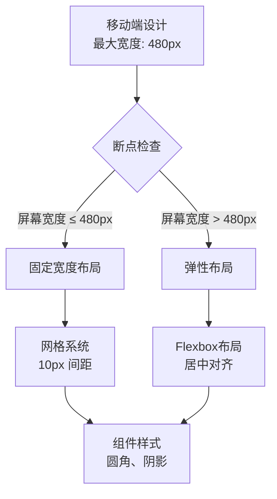

**图表来源**
- [style.css:4-4](file://webapp/css/style.css#L4-L4)
- [style.css:18-18](file://webapp/css/style.css#L18-L18)

**章节来源**
- [style.css:1-80](file://webapp/css/style.css#L1-L80)

## 架构概览

该样式系统采用模块化的 CSS 架构，将功能相关的样式组织在一起，形成清晰的层次结构。

```mermaid
graph TB
subgraph "基础层"
Reset[重置样式<br/>*{margin:0;padding:0}]
Root[根元素变量<br/>:root --colors]
end
subgraph "布局层"
Body[主体样式<br/>font-family, background]
Container[容器样式<br/>#app max-width: 480px]
Header[头部样式<br/>#header fixed position]
Navigation[底部导航<br/>#bottomNav fixed bottom]
end
subgraph "组件层"
Carousel[轮播图<br/>.banner-carousel]
Category[分类网格<br/>.category-grid]
Section[区块样式<br/>.section]
Card[卡片组件<br/>.shop-card, .service-card]
Form[表单组件<br/>.search-bar, .search-input-wrap]
end
subgraph "交互层"
Animations[动画效果<br/>@keyframes fadeIn]
Transitions[过渡效果<br/>.transition classes]
ActiveStates[激活状态<br/>.active classes]
end
Reset --> Root
Root --> Body
Body --> Container
Container --> Header
Container --> Navigation
Container --> Section
Section --> Category
Section --> Carousel
Section --> Card
Section --> Form
Animations --> Transitions
Transitions --> ActiveStates
```

**图表来源**
- [style.css:1-80](file://webapp/css/style.css#L1-L80)

## 详细组件分析

### 轮播图系统

轮播图组件实现了自动播放、手动切换和指示器功能，采用 CSS 过渡动画提供流畅的用户体验。

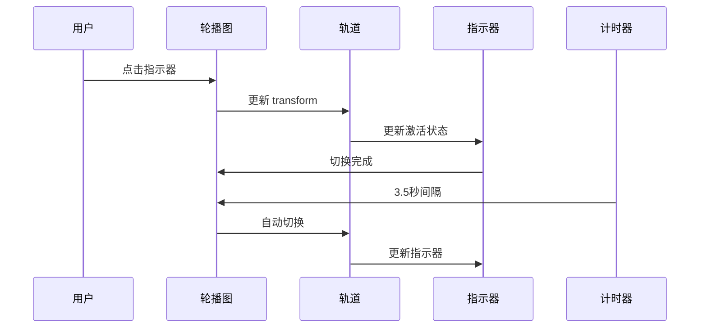

**图表来源**
- [style.css:9-15](file://webapp/css/style.css#L9-L15)
- [app.js:56-62](file://webapp/js/app.js#L56-L62)

#### 轮播图数据结构

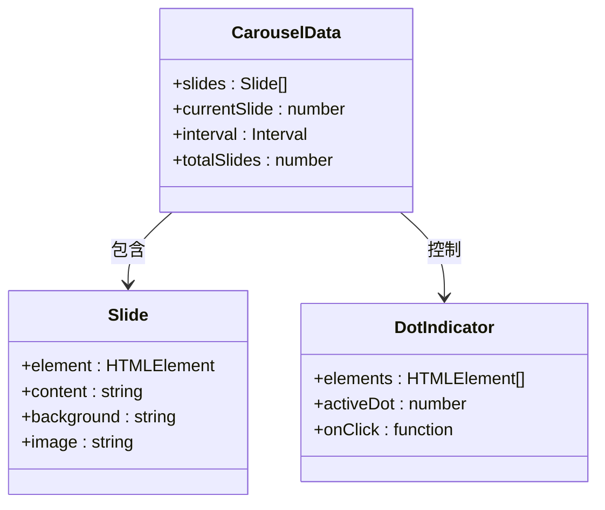

**图表来源**
- [app.js:1-49](file://webapp/js/app.js#L1-L49)

**章节来源**
- [style.css:9-15](file://webapp/css/style.css#L9-L15)
- [app.js:56-62](file://webapp/js/app.js#L56-L62)

### 分类网格系统

分类网格采用 CSS Grid 实现响应式布局，支持 4 列显示和自动换行。

```mermaid
flowchart LR
Grid[Grid 容器<br/>repeat(4, 1fr)] --> Item[网格项<br/>.category-item]
Item --> Icon[图标<br/>.cat-icon]
Item --> Text[文本<br/>12px 字体]
Icon --> Gradient[渐变背景<br/>48px × 48px]
Text --> Center[垂直居中<br/>align-items: center]
Grid --> Responsive[响应式<br/>10px 间距]
Responsive --> Touch[触摸反馈<br/>:active scale(.92)]
```

**图表来源**
- [style.css:18-22](file://webapp/css/style.css#L18-L22)

**章节来源**
- [style.css:18-22](file://webapp/css/style.css#L18-L22)

### 卡片组件系统

系统实现了多种卡片组件，包括商店卡片、服务卡片和推荐卡片，统一了视觉风格和交互行为。

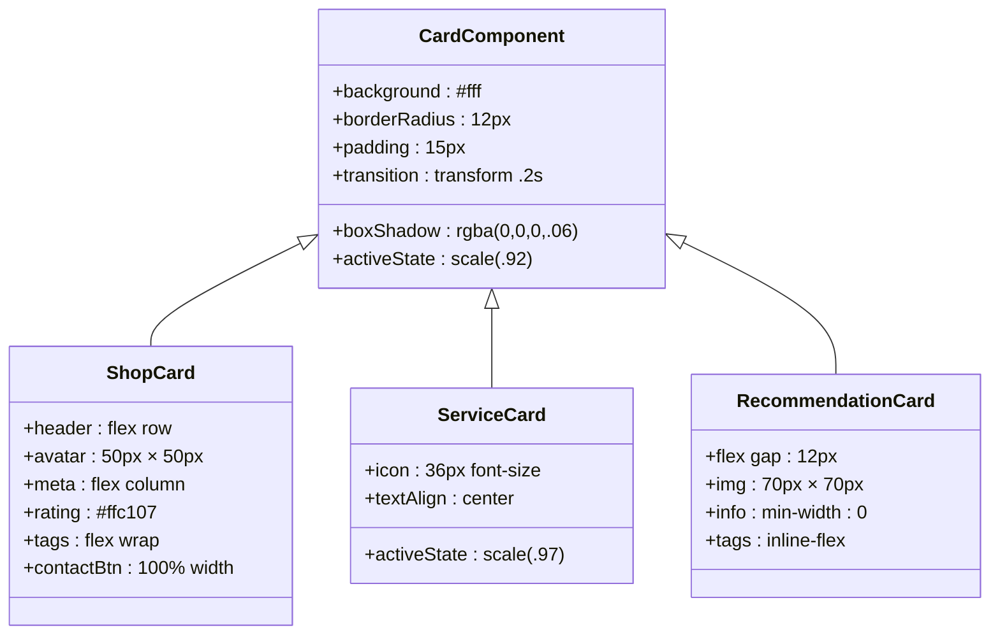

**图表来源**
- [style.css:30-33](file://webapp/css/style.css#L30-L33)
- [style.css:37-38](file://webapp/css/style.css#L37-L38)
- [style.css:59-63](file://webapp/css/style.css#L59-L63)

**章节来源**
- [style.css:30-33](file://webapp/css/style.css#L30-L33)
- [style.css:37-38](file://webapp/css/style.css#L37-L38)
- [style.css:59-63](file://webapp/css/style.css#L59-L63)

### 导航系统

底部导航采用固定定位，提供五个主要功能区域，支持激活状态切换和图标动画。

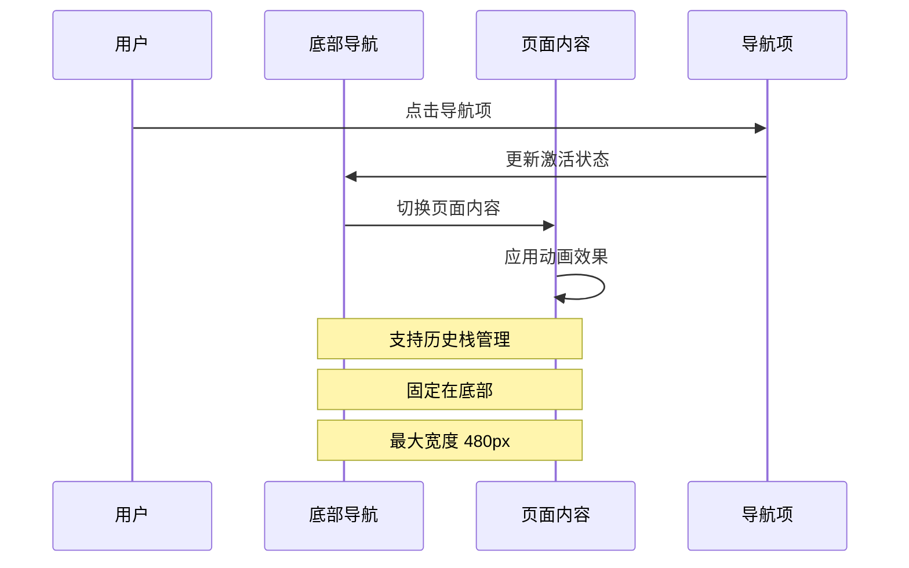

**图表来源**
- [style.css:58-61](file://webapp/css/style.css#L58-L61)
- [app.js:64-72](file://webapp/js/app.js#L64-L72)

**章节来源**
- [style.css:58-61](file://webapp/css/style.css#L58-L61)
- [app.js:64-72](file://webapp/js/app.js#L64-L72)

### 搜索系统

搜索功能集成了热门标签、搜索输入和结果展示，提供了完整的搜索体验。

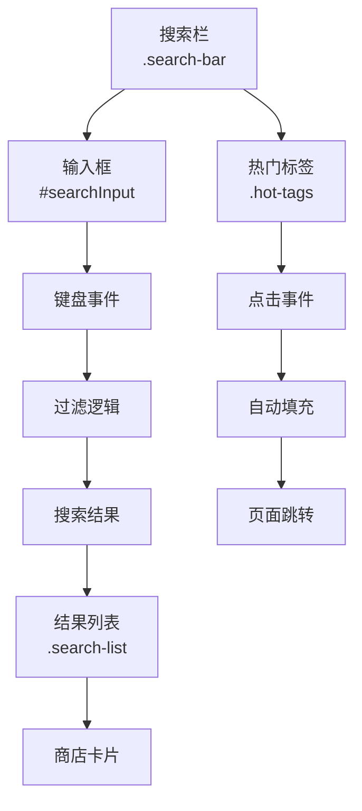

**图表来源**
- [style.css:16-17](file://webapp/css/style.css#L16-L17)
- [style.css:72-77](file://webapp/css/style.css#L72-L77)

**章节来源**
- [style.css:16-17](file://webapp/css/style.css#L16-L17)
- [style.css:72-77](file://webapp/css/style.css#L72-L77)
- [app.js:82-82](file://webapp/js/app.js#L82-L82)

## 依赖关系分析

样式系统与 JavaScript 逻辑之间存在紧密的依赖关系，形成了完整的前端架构。

```mermaid
graph TB
subgraph "样式依赖"
Style[style.css<br/>样式定义]
Variables[CSS变量<br/>主题系统]
Animations[动画<br/>@keyframes]
Layout[布局<br/>Grid/Flexbox]
end
subgraph "逻辑依赖"
App[app.js<br/>应用逻辑]
Router[路由控制<br/>hashchange]
Components[组件操作<br/>DOM操作]
Events[事件处理<br/>click/touch]
end
subgraph "外部依赖"
Telegram[Telegram WebApp<br/>theme-color]
ExchangeAPI[汇率API<br/>exchangerate-api.com]
end
Style --> Variables
Style --> Animations
Style --> Layout
App --> Router
App --> Components
App --> Events
Variables --> Telegram
Components --> ExchangeAPI
```

**图表来源**
- [style.css:1-80](file://webapp/css/style.css#L1-L80)
- [app.js:1-87](file://webapp/js/app.js#L1-L87)

### 数据流分析

系统中的数据流主要体现在页面切换、内容加载和用户交互三个层面。

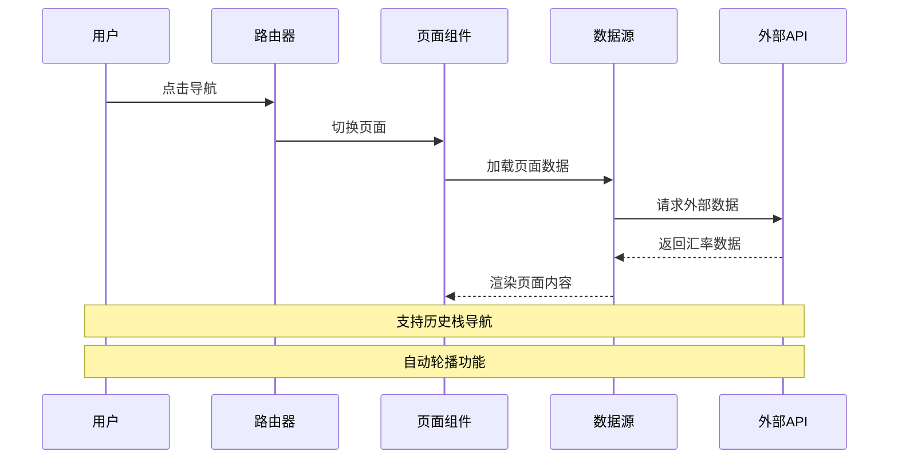

**图表来源**
- [app.js:64-84](file://webapp/js/app.js#L64-L84)

**章节来源**
- [app.js:1-87](file://webapp/js/app.js#L1-L87)

## 性能考虑

### CSS 性能优化

该样式系统采用了多项性能优化策略：

1. **CSS 变量缓存**：使用 `:root` 定义全局变量，避免重复计算
2. **硬件加速**：利用 `transform` 和 `opacity` 属性触发 GPU 加速
3. **简化解析**：避免复杂的 CSS 选择器，提高渲染性能
4. **最小化重绘**：通过 `will-change` 属性提示浏览器优化

### JavaScript 性能优化

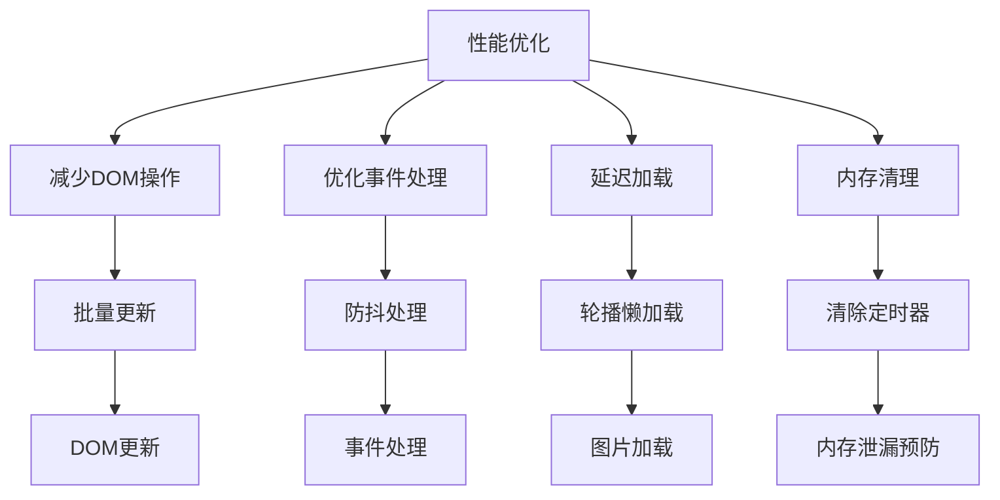

**图表来源**
- [app.js:56-62](file://webapp/js/app.js#L56-L62)
- [app.js:84-84](file://webapp/js/app.js#L84-L84)

### 响应式性能

系统通过以下方式优化移动端性能：
- 使用 `transform` 替代改变布局属性
- 避免使用昂贵的 CSS 属性如 `box-shadow` 在大量元素上
- 采用 `will-change` 提示浏览器优化动画

**章节来源**
- [style.css:1-80](file://webapp/css/style.css#L1-L80)
- [app.js:56-62](file://webapp/js/app.js#L56-L62)

## 故障排除指南

### 常见问题诊断

1. **样式不生效**
   - 检查 CSS 文件路径是否正确
   - 确认 `:root` 变量定义完整
   - 验证浏览器兼容性支持

2. **轮播图不工作**
   - 检查 `#carouselTrack` 元素是否存在
   - 确认 `transform` 属性值正确
   - 验证定时器是否正常启动

3. **导航切换异常**
   - 检查 `hashchange` 事件监听
   - 确认页面元素 ID 正确
   - 验证 `active` 类名切换逻辑

### 调试工具建议

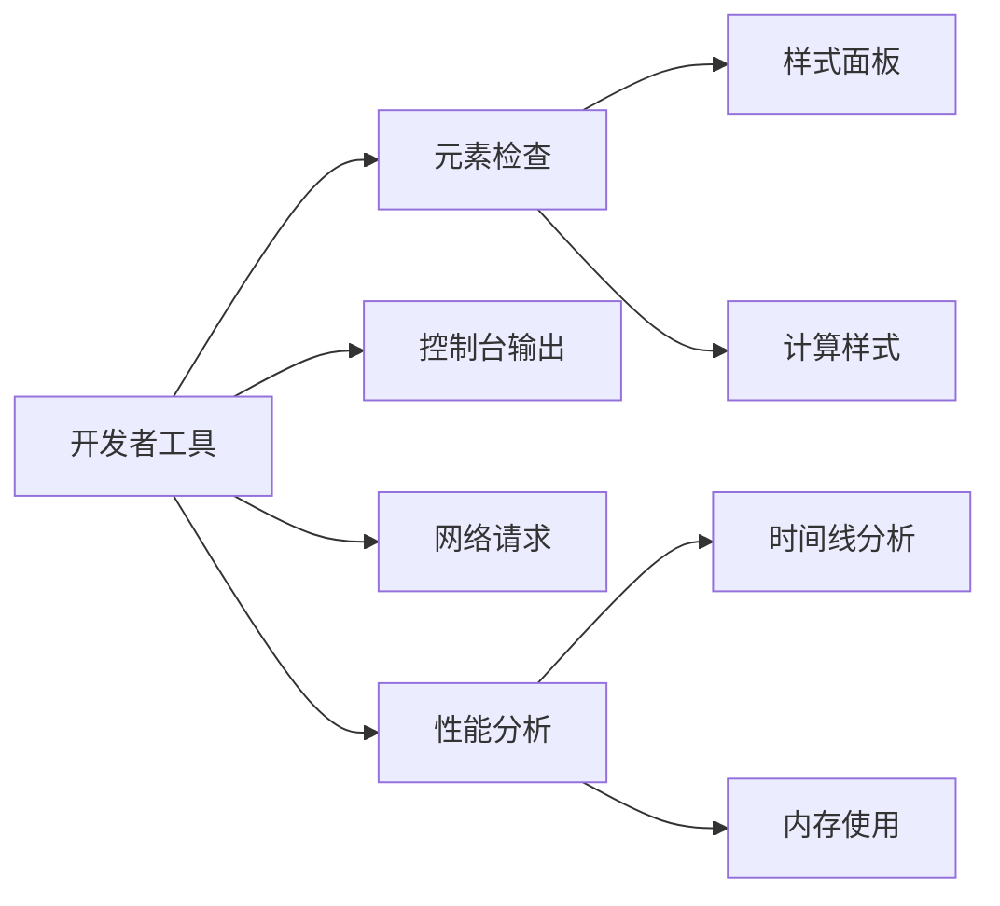

**章节来源**
- [style.css:1-80](file://webapp/css/style.css#L1-L80)
- [app.js:1-87](file://webapp/js/app.js#L1-L87)

## 结论

该样式系统展现了现代前端开发的最佳实践，通过模块化的 CSS 架构、完善的主题系统和优化的性能策略，为用户提供了优秀的移动端体验。系统的主要优势包括：

1. **模块化设计**：清晰的组件分离和职责划分
2. **主题系统**：灵活的颜色和字体管理
3. **响应式布局**：适应不同设备尺寸的设计
4. **性能优化**：合理的动画和交互设计
5. **可维护性**：简洁的代码结构和注释

该系统为类似的移动应用提供了良好的参考模板，特别是在 Telegram WebApp 生态系统中的应用实践。