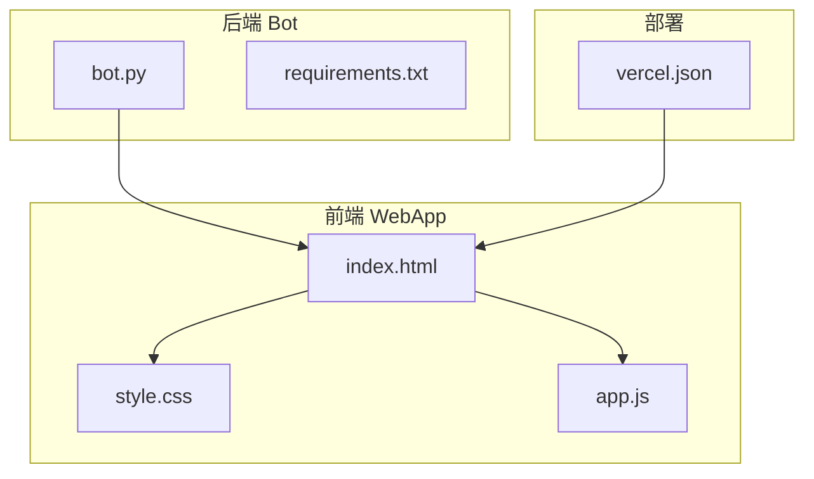
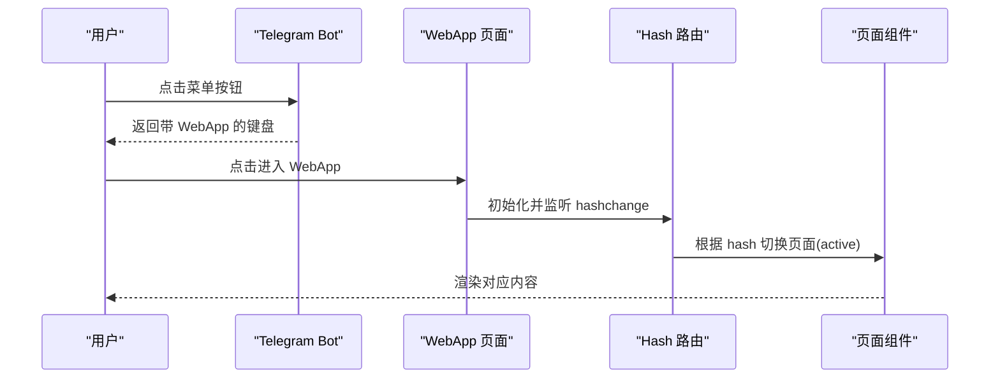
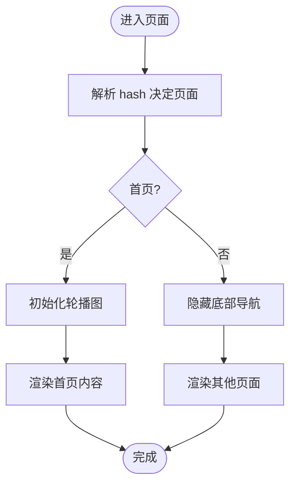
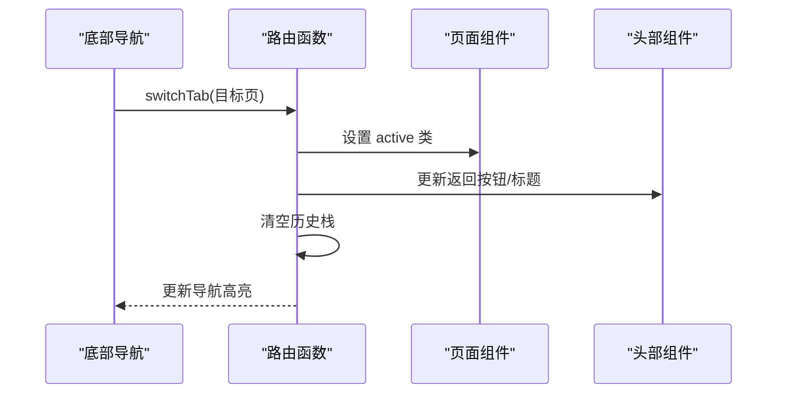
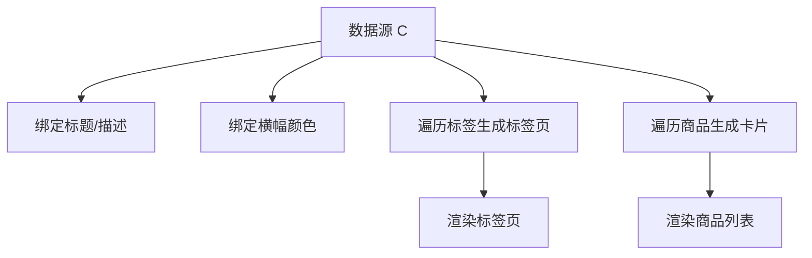
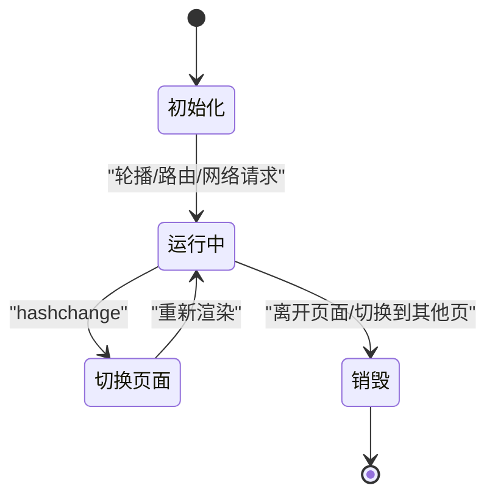
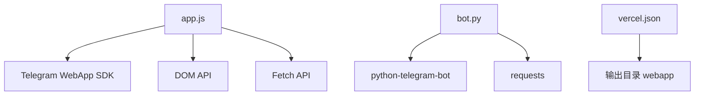

# 组件设计模式

<cite>
**本文引用的文件**
- [index.html](file://webapp/index.html)
- [app.js](file://webapp/js/app.js)
- [style.css](file://webapp/css/style.css)
- [bot.py](file://bot/bot.py)
- [requirements.txt](file://bot/requirements.txt)
- [vercel.json](file://vercel.json)
</cite>

## 目录
1. [简介](#简介)
2. [项目结构](#项目结构)
3. [核心组件](#核心组件)
4. [架构总览](#架构总览)
5. [详细组件分析](#详细组件分析)
6. [依赖分析](#依赖分析)
7. [性能考虑](#性能考虑)
8. [故障排查指南](#故障排查指南)
9. [结论](#结论)
10. [附录](#附录)

## 简介
本文件系统性梳理该项目的前端组件设计模式，聚焦页面组件结构（首页、分类页、搜索页等）、组件间通信机制（父子/兄弟/全局）、模板渲染模式（数据绑定、条件渲染、列表渲染）、组件复用策略（通用组件提取、配置化组件、动态组件加载）、生命周期与事件处理模式、性能优化方案，并给出组件测试方法与最佳实践建议。由于项目采用纯前端单页应用与 Telegram WebApp 集成，本文以“页面组件”和“交互逻辑”为核心分析对象，辅以后端 Bot 的路由与入口集成说明。

## 项目结构
项目由三部分组成：
- 前端 WebApp：HTML 页面、CSS 样式、JS 逻辑，负责页面渲染与交互。
- 后端 Bot：Telegram Bot，负责引导用户进入 WebApp 并提供菜单入口。
- 部署配置：Vercel 配置，指定输出目录与重写规则。

图表来源
- [index.html](file://webapp/index.html)
- [app.js](file://webapp/js/app.js)
- [style.css](file://webapp/css/style.css)
- [bot.py](file://bot/bot.py)
- [vercel.json](file://vercel.json)

章节来源
- [index.html](file://webapp/index.html)
- [app.js](file://webapp/js/app.js)
- [style.css](file://webapp/css/style.css)
- [bot.py](file://bot/bot.py)
- [vercel.json](file://vercel.json)

## 核心组件
本项目采用“页面级组件”设计，每个页面是一个独立的容器元素，通过切换 active 类名控制显示隐藏；导航栏与头部标题根据当前页面动态更新。核心组件包括：
- 首页组件：轮播图、搜索条、分类网格、汇率展示、热门推荐。
- 分类页组件：分类横幅、标签页、商品列表。
- 搜索页组件：搜索输入、热门标签。
- 底部导航组件：首页、跑腿、曝光、活动、我的。
- 头部组件：返回按钮、标题、返回逻辑。
- 通用交互组件：联系商家按钮、浮动操作按钮。

章节来源
- [index.html](file://webapp/index.html)
- [app.js](file://webapp/js/app.js)
- [style.css](file://webapp/css/style.css)

## 架构总览
前端采用“单页应用 + Hash 路由”的轻量架构，页面通过 hash 变更驱动切换；Bot 提供入口与快捷按钮，点击后在 Telegram WebApp 中打开对应页面。整体流程如下：

图表来源
- [bot.py](file://bot/bot.py)
- [app.js](file://webapp/js/app.js)
- [index.html](file://webapp/index.html)

## 详细组件分析

### 页面组件结构与模板渲染
- 页面容器：每个页面使用独立的 div 容器，通过 active 类控制显示隐藏；默认首页激活。
- 条件渲染：根据当前页面显示/隐藏底部导航、返回按钮、标题文本。
- 列表渲染：分类页的商品列表通过循环生成卡片；轮播图的圆点通过循环生成。
- 数据绑定：页面标题、横幅背景色、商品评分、标签等均来自数据源对象 C。
- 动态内容：汇率通过外部 API 获取并更新 DOM；搜索结果根据关键词匹配跳转至分类页。

图表来源
- [app.js](file://webapp/js/app.js)
- [index.html](file://webapp/index.html)

章节来源
- [index.html](file://webapp/index.html)
- [app.js](file://webapp/js/app.js)

### 组件间通信机制
- 父子组件通信：页面容器作为父容器，内部子元素（如轮播项、商品卡片）通过父容器统一管理显示/隐藏与样式。
- 兄弟组件通信：通过全局状态（当前页、历史栈、轮播索引）在多个函数之间共享，避免跨层级传递。
- 全局状态管理：使用全局变量保存当前页、历史栈、轮播定时器与当前索引，所有页面切换与交互逻辑集中于 app.js。
- 事件分发：点击事件通过内联 onclick 或在初始化时绑定，调用统一的导航与渲染函数。

图表来源
- [app.js](file://webapp/js/app.js)
- [index.html](file://webapp/index.html)

章节来源
- [app.js](file://webapp/js/app.js)
- [index.html](file://webapp/index.html)

### 模板渲染模式
- 数据绑定：页面标题、横幅颜色、商品评分、标签等直接从数据源对象 C 读取并注入到 DOM。
- 条件渲染：根据当前页面决定是否显示底部导航、返回按钮、标题文案；轮播图仅在首页初始化。
- 列表渲染：分类页的标签与商品列表通过遍历数组生成；轮播点通过遍历 slide 数组生成。
- 动态组件加载：分类页根据分类键动态设置横幅颜色、标题、描述与标签；商品列表按分类键渲染。

图表来源
- [app.js](file://webapp/js/app.js)
- [index.html](file://webapp/index.html)

章节来源
- [app.js](file://webapp/js/app.js)
- [index.html](file://webapp/index.html)

### 组件复用策略
- 通用组件提取：轮播图、商品卡片、标签页、联系按钮等可抽象为可复用的渲染函数，便于在多页面复用。
- 配置化组件：数据源对象 C 将页面配置与业务数据解耦，通过分类键映射标题、描述、颜色、标签与商品列表。
- 动态组件加载：根据 hash 动态切换页面，结合数据源动态渲染，减少重复代码。

章节来源
- [app.js](file://webapp/js/app.js)
- [index.html](file://webapp/index.html)

### 生命周期管理与事件处理
- 初始化：页面加载完成后初始化轮播图、路由、Telegram WebApp、汇率请求。
- 事件处理：hashchange 事件驱动页面切换；点击事件触发导航与渲染；轮播自动播放定时器在组件销毁前清理。
- 销毁与清理：轮播定时器在切换页面或离开首页时清理，避免内存泄漏。

图表来源
- [app.js](file://webapp/js/app.js)

章节来源
- [app.js](file://webapp/js/app.js)

### 性能优化方案
- DOM 操作最小化：批量更新 DOM（如轮播点、商品列表），避免频繁重排。
- 轮播性能：使用 transform 进行位移，配合过渡动画；定时器在组件不可见时停止。
- 网络请求：汇率接口异步请求，失败时回退默认值，避免阻塞 UI。
- 样式优化：使用 CSS 变量与阴影、渐变等视觉效果提升性能；移动端适配良好。

章节来源
- [app.js](file://webapp/js/app.js)
- [style.css](file://webapp/css/style.css)

## 依赖分析
- 前端依赖：Telegram WebApp SDK（用于主题与扩展）、浏览器原生 API（DOM、fetch、定时器）。
- 后端依赖：python-telegram-bot、requests。
- 部署依赖：Vercel 输出目录与重写规则。

图表来源
- [app.js](file://webapp/js/app.js)
- [bot.py](file://bot/bot.py)
- [requirements.txt](file://bot/requirements.txt)
- [vercel.json](file://vercel.json)

章节来源
- [app.js](file://webapp/js/app.js)
- [bot.py](file://bot/bot.py)
- [requirements.txt](file://bot/requirements.txt)
- [vercel.json](file://vercel.json)

## 性能考虑
- 减少重绘与回流：使用 transform 与 CSS 动画替代布局变更。
- 懒加载与延迟初始化：轮播图仅在首页初始化，避免不必要的资源占用。
- 请求缓存：汇率接口可增加缓存策略，降低请求频率。
- 图片与图标：SVG 图标内联，减少额外请求；渐变背景由 CSS 控制，无需图片资源。
- 移动端优化：使用固定头部与底部导航，避免滚动抖动；触摸反馈明确。

## 故障排查指南
- 页面无法切换：检查 hashchange 事件绑定与路由处理逻辑，确认当前页与历史栈状态。
- 轮播不工作：确认轮播容器存在且有 slide 子元素，定时器是否被清理或重复启动。
- 汇率不更新：检查网络请求与回调逻辑，确保异常时有默认值回退。
- Telegram 主题不生效：确认 Telegram WebApp SDK 已正确加载并设置主题类名。
- Bot 菜单无效：检查 Bot 的 WebApp URL 与按钮构造逻辑，确认 hash 路径正确。

章节来源
- [app.js](file://webapp/js/app.js)
- [bot.py](file://bot/bot.py)

## 结论
本项目以“页面组件 + 配置化数据 + Hash 路由”的轻量架构实现了清晰的组件设计模式。通过全局状态管理与统一的渲染函数，实现了父子/兄弟组件间的高效协作；通过条件渲染与列表渲染满足了多样化的页面需求；通过 Telegram WebApp 集成提供了良好的移动端体验。后续可在组件抽象、状态管理、测试覆盖等方面进一步增强工程化能力。

## 附录

### 组件测试方法与最佳实践
- 单元测试
  - 使用浏览器环境下的测试框架（如 Jest + jsdom）模拟 DOM 与事件。
  - 测试点：路由切换函数、轮播控制函数、渲染函数、搜索匹配逻辑。
- 集成测试
  - 使用 Puppeteer 或 Playwright 在真实浏览器中运行，验证页面切换、轮播、搜索与联系按钮行为。
- 端到端测试
  - 模拟 Telegram WebApp 环境，验证 Bot 菜单到 WebApp 页面的完整链路。
- 最佳实践
  - 将渲染函数拆分为纯函数，便于测试与复用。
  - 使用常量与枚举管理页面键与状态，避免魔法字符串。
  - 对外暴露的全局函数命名规范，避免污染全局作用域。
  - 对定时器与事件监听器进行统一管理与清理。