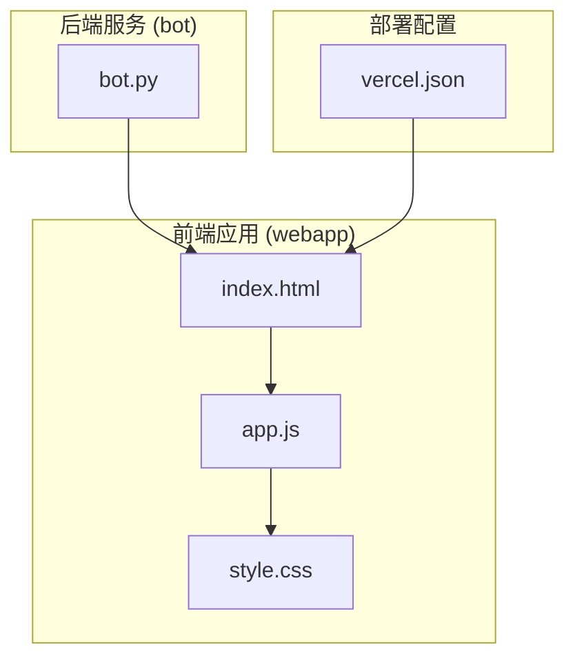
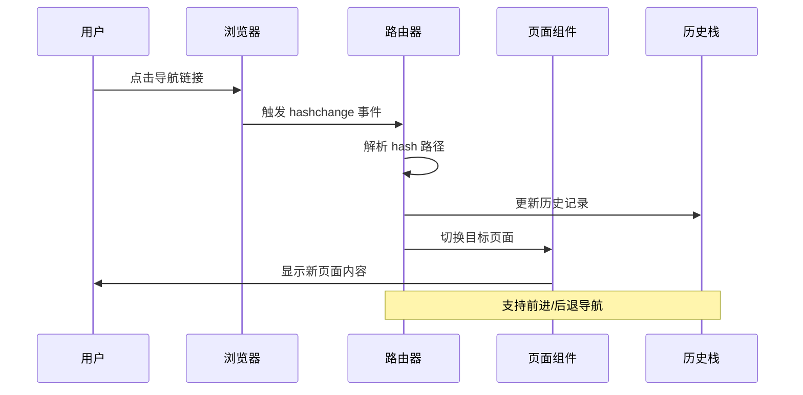
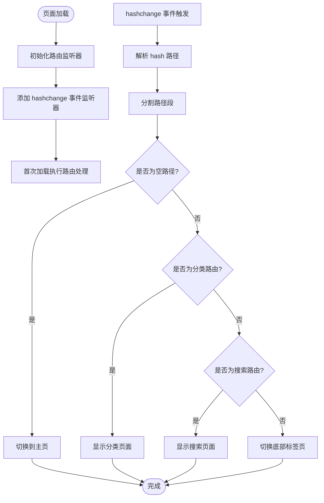
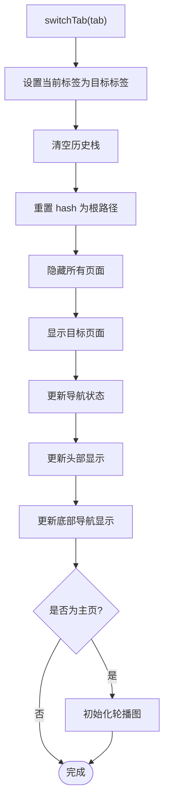
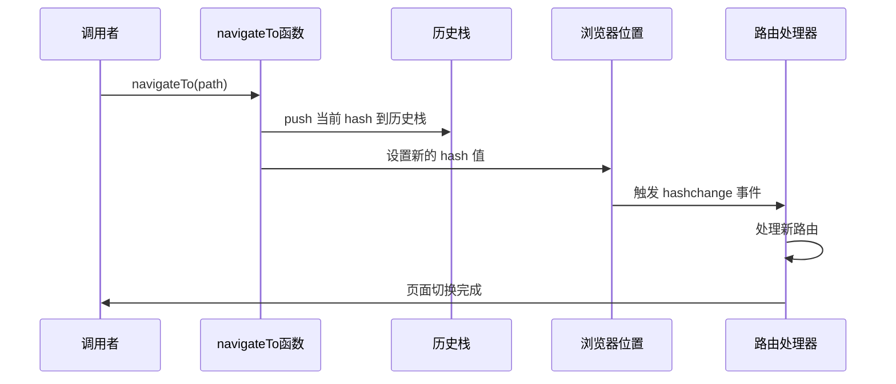
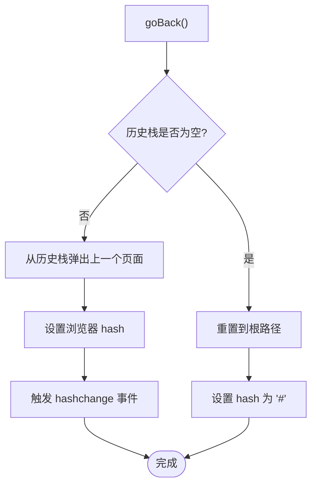
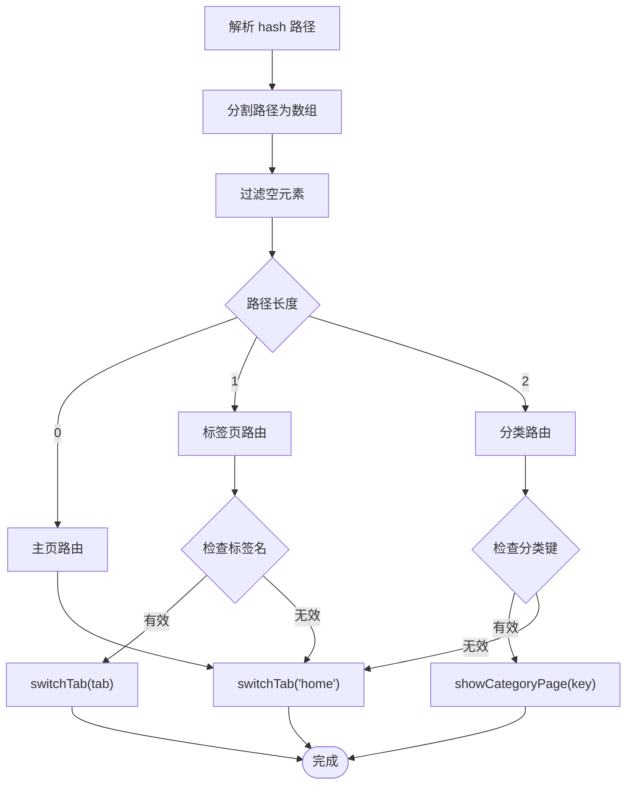
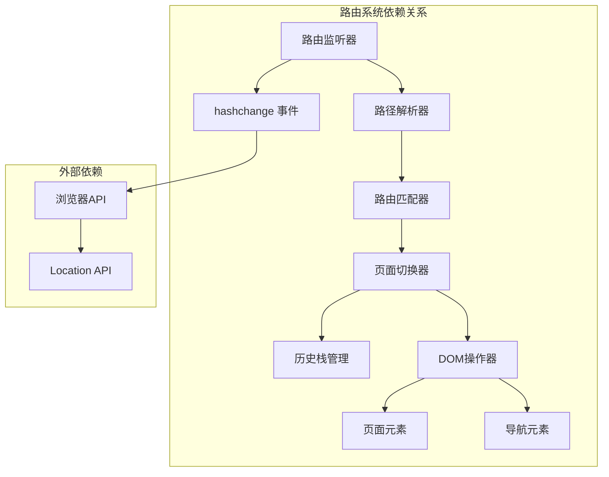

# 路由系统实现

<cite>
**本文档引用的文件**
- [app.js](file://webapp/js/app.js)
- [index.html](file://webapp/index.html)
- [style.css](file://webapp/css/style.css)
- [bot.py](file://bot/bot.py)
- [vercel.json](file://vercel.json)
</cite>

## 目录
1. [简介](#简介)
2. [项目结构](#项目结构)
3. [核心组件](#核心组件)
4. [架构概览](#架构概览)
5. [详细组件分析](#详细组件分析)
6. [依赖关系分析](#依赖关系分析)
7. [性能考虑](#性能考虑)
8. [故障排除指南](#故障排除指南)
9. [结论](#结论)

## 简介

本项目是一个基于 Telegram WebApp 的木姐同城生活助手应用，采用纯前端实现的 Hash 路由系统。该路由系统通过监听 URL hash 变化来实现页面导航，支持页面切换、参数解析、历史记录管理等功能。系统包含完整的页面导航函数、路由匹配算法和页面切换逻辑。

## 项目结构

该项目采用简洁的三层结构设计：

**图表来源**
- [index.html:1-145](file://webapp/index.html#L1-L145)
- [app.js:1-87](file://webapp/js/app.js#L1-L87)
- [bot.py:1-88](file://bot/bot.py#L1-L88)
- [vercel.json:1-8](file://vercel.json#L1-L8)

**章节来源**
- [index.html:1-145](file://webapp/index.html#L1-L145)
- [app.js:1-87](file://webapp/js/app.js#L1-L87)
- [bot.py:1-88](file://bot/bot.py#L1-L88)
- [vercel.json:1-8](file://vercel.json#L1-L8)

## 核心组件

### Hash 路由系统

Hash 路由系统是整个应用的核心，负责处理页面导航和状态管理。主要组件包括：

- **路由监听器**: 监听 URL hash 变化事件
- **路由处理器**: 解析 hash 并执行相应的页面切换
- **导航函数**: 提供程序化的页面跳转能力
- **历史栈**: 管理页面导航历史

### 页面管理系统

系统包含以下页面类型：
- 主页 (home): 展示轮播图和快捷入口
- 跑腿服务 (errand): 提供同城跑腿服务
- 曝光台 (expose): 不良商家曝光平台
- 活动 (activity): 同城活动信息展示
- 个人中心 (profile): 用户个人信息管理
- 分类页面 (category): 商家和服务分类展示
- 搜索页面 (search): 全局搜索功能

**章节来源**
- [app.js:51-87](file://webapp/js/app.js#L51-L87)
- [index.html:21-131](file://webapp/index.html#L21-L131)

## 架构概览

**图表来源**
- [app.js:63-72](file://webapp/js/app.js#L63-L72)
- [app.js:67-71](file://webapp/js/app.js#L67-L71)

### 路由配置结构

路由系统采用简单的路径映射机制：

| 路由路径 | 页面类型 | 功能描述 |
|---------|----------|----------|
| `/#/` | 主页 | 应用默认页面，展示轮播图和快捷入口 |
| `/#/category/:key` | 分类页面 | 展示指定类别的商家和服务 |
| `/#/search` | 搜索页面 | 全局搜索功能 |
| `/#/errand` | 跑腿服务 | 同城跑腿服务页面 |
| `/#/expose` | 曝光台 | 不良商家曝光平台 |
| `/#/activity` | 活动 | 同城活动信息展示 |
| `/#/profile` | 个人中心 | 用户个人信息管理 |

**章节来源**
- [app.js:64-66](file://webapp/js/app.js#L64-L66)
- [app.js:76-76](file://webapp/js/app.js#L76-L76)

## 详细组件分析

### Hash 路由监听器

路由监听器负责监听浏览器的 hashchange 事件，并在事件触发时执行相应的处理逻辑。

**图表来源**
- [app.js:63-66](file://webapp/js/app.js#L63-L66)

**章节来源**
- [app.js:63-66](file://webapp/js/app.js#L63-L66)

### 页面切换逻辑

页面切换逻辑通过 `switchTab` 函数实现，负责管理页面显示状态和导航状态。

**图表来源**
- [app.js:72-72](file://webapp/js/app.js#L72-L72)

**章节来源**
- [app.js:72-72](file://webapp/js/app.js#L72-L72)

### 导航函数实现

导航函数提供了两种主要的导航方式：程序化导航和历史回退。

#### navigateTo() 函数

`navigateTo()` 函数实现了程序化的页面跳转功能：

**图表来源**
- [app.js:67-67](file://webapp/js/app.js#L67-L67)

#### goBack() 函数

`goBack()` 函数实现了历史回退功能：

**图表来源**
- [app.js:69-70](file://webapp/js/app.js#L69-L70)

**章节来源**
- [app.js:67-70](file://webapp/js/app.js#L67-L70)

### 路由匹配算法

路由匹配算法采用简单的字符串匹配策略，支持以下路由模式：

**图表来源**
- [app.js:65-66](file://webapp/js/app.js#L65-L66)

**章节来源**
- [app.js:65-66](file://webapp/js/app.js#L65-L66)

### 参数解析机制

参数解析机制相对简单，主要处理分类页面的参数传递：

- **分类参数**: 通过 `category/:key` 模式传递分类键
- **搜索参数**: 通过 `search` 路由触发搜索功能
- **历史参数**: 通过历史栈管理页面导航历史

**章节来源**
- [app.js:65-66](file://webapp/js/app.js#L65-L66)
- [app.js:76-76](file://webapp/js/app.js#L76-L76)

## 依赖关系分析

**图表来源**
- [app.js:63-72](file://webapp/js/app.js#L63-L72)

### 组件耦合度分析

路由系统具有良好的模块化设计，各组件之间的耦合度较低：

- **路由监听器**与**路由处理器**通过事件机制解耦
- **页面切换器**与**DOM操作器**职责分离
- **历史栈**独立于页面切换逻辑
- **路径解析器**与**路由匹配器**功能明确

**章节来源**
- [app.js:63-72](file://webapp/js/app.js#L63-L72)

## 性能考虑

### 内存管理

路由系统采用了有效的内存管理策略：

- **历史栈**: 使用数组存储导航历史，支持回退功能
- **轮播图**: 在主页激活时启动，离开时自动清理
- **事件监听**: 仅在需要时添加监听器，避免重复绑定

### DOM 操作优化

- **批量更新**: 页面切换时一次性更新多个元素状态
- **条件渲染**: 仅在必要时更新页面内容
- **CSS 动画**: 使用硬件加速的 CSS 过渡效果

### 缓存策略

系统实现了简单的缓存机制：

- **轮播图缓存**: 首次加载后保持状态
- **页面内容缓存**: 页面切换时保留 DOM 结构
- **分类数据缓存**: 分类页面数据在切换时复用

**章节来源**
- [app.js:56-62](file://webapp/js/app.js#L56-L62)
- [app.js:72-72](file://webapp/js/app.js#L72-L72)

## 故障排除指南

### 常见问题及解决方案

#### Hash 路由不工作

**问题症状**: 点击导航链接但页面不切换

**可能原因**:
- JavaScript 文件未正确加载
- 事件监听器未正确绑定
- 浏览器兼容性问题

**解决方案**:
1. 检查控制台是否有 JavaScript 错误
2. 确认 `app.js` 文件路径正确
3. 验证 `DOMContentLoaded` 事件是否触发

#### 页面切换异常

**问题症状**: 页面切换后状态混乱

**可能原因**:
- 历史栈管理错误
- DOM 元素查找失败
- CSS 样式冲突

**解决方案**:
1. 检查 `switchTab` 函数中的 DOM 操作
2. 验证页面元素 ID 是否正确
3. 确认 CSS 类名匹配

#### 搜索功能失效

**问题症状**: 搜索按钮点击无响应

**可能原因**:
- `doSearch` 函数未正确绑定
- 搜索输入框元素不存在
- 分类数据结构变化

**解决方案**:
1. 检查 `doSearch` 函数绑定
2. 验证搜索输入框 ID
3. 确认分类数据完整性

**章节来源**
- [app.js:67-82](file://webapp/js/app.js#L67-L82)
- [index.html:127-131](file://webapp/index.html#L127-L131)

### 调试方法

#### 开发者工具使用

1. **控制台调试**: 使用 `console.log()` 输出关键变量值
2. **断点调试**: 在关键函数处设置断点
3. **网络监控**: 检查 API 请求状态
4. **元素检查**: 验证 DOM 结构和样式

#### 路由调试技巧

1. **Hash 监听**: 在 `handleRoute` 函数中添加日志输出
2. **路径验证**: 检查解析后的路径格式
3. **页面状态**: 验证页面切换后的状态一致性

**章节来源**
- [app.js:63-66](file://webapp/js/app.js#L63-L66)

## 结论

该 Hash 路由系统实现了简洁而高效的页面导航功能，具有以下特点：

### 优势

- **轻量级**: 无需服务器端配置，纯前端实现
- **易维护**: 代码结构清晰，逻辑简单明了
- **兼容性好**: 支持所有现代浏览器
- **可扩展性强**: 易于添加新的路由和页面

### 局限性

- **SEO 不友好**: Hash 路由对搜索引擎不友好
- **深度链接限制**: 无法直接访问深层页面
- **历史记录有限**: 仅支持基本的前进后退功能

### 改进建议

1. **添加路由守卫**: 实现权限验证和页面预加载
2. **增强错误处理**: 添加更完善的错误处理机制
3. **性能优化**: 实现页面懒加载和资源预加载
4. **SEO 支持**: 考虑添加服务器端渲染选项

该路由系统为移动 Web 应用提供了一个可靠的导航解决方案，特别适合 Telegram WebApp 环境下的单页应用开发。