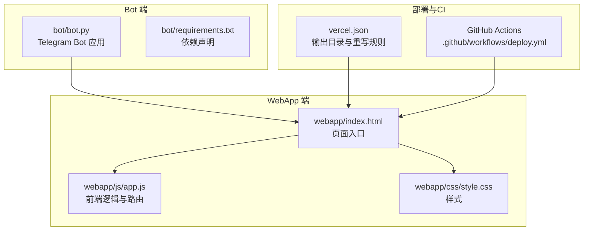
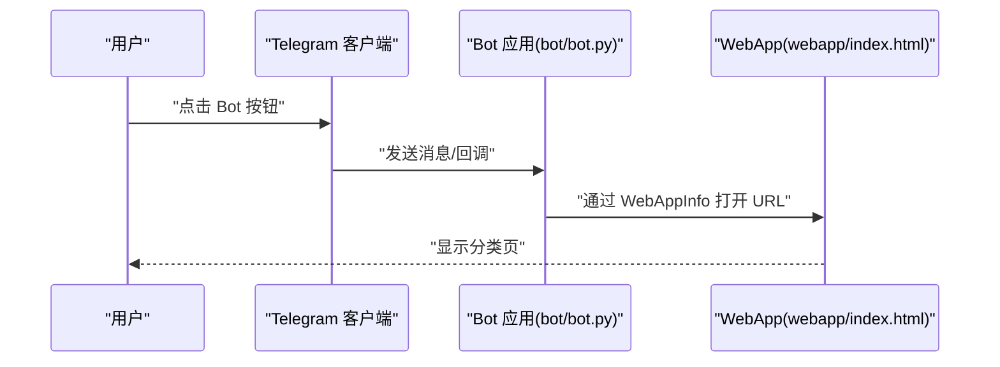
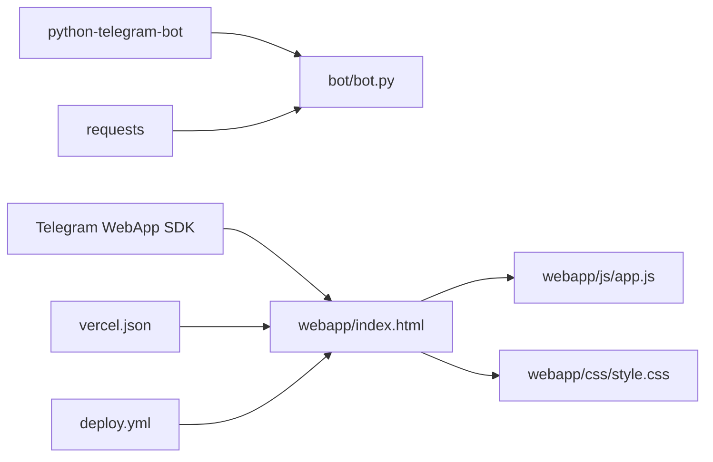

# 快速开始

<cite>
**本文引用的文件**
- [bot/bot.py](file://bot/bot.py)
- [bot/requirements.txt](file://bot/requirements.txt)
- [webapp/index.html](file://webapp/index.html)
- [webapp/js/app.js](file://webapp/js/app.js)
- [webapp/css/style.css](file://webapp/css/style.css)
- [vercel.json](file://vercel.json)
- [.github/workflows/deploy.yml](file://.github/workflows/deploy.yml)
- [.gitignore](file://.gitignore)
</cite>

## 目录
1. [简介](#简介)
2. [项目结构](#项目结构)
3. [核心组件](#核心组件)
4. [架构总览](#架构总览)
5. [详细组件分析](#详细组件分析)
6. [依赖分析](#依赖分析)
7. [性能考虑](#性能考虑)
8. [故障排除指南](#故障排除指南)
9. [结论](#结论)
10. [附录](#附录)

## 简介
本指南面向新手开发者，帮助你在约 30 分钟内完成 wyszbot 的本地环境准备、Telegram Bot 创建与配置、本地开发与部署，并通过 Telegram Bot 访问 WebApp 的服务分类页面。项目由两部分组成：
- Telegram Bot：负责接收用户消息、构建键盘菜单并打开 WebApp 页面。
- WebApp：提供服务分类、搜索、联系客服等前端页面，支持 Telegram WebApp 原生集成。

## 项目结构
项目采用“Bot + WebApp”的双端架构，Bot 通过按钮打开 WebApp 的不同页面，WebApp 内部通过路由切换页面并渲染内容。

图表来源
- [bot/bot.py:1-88](file://bot/bot.py#L1-L88)
- [bot/requirements.txt:1-3](file://bot/requirements.txt#L1-L3)
- [webapp/index.html:1-145](file://webapp/index.html#L1-L145)
- [webapp/js/app.js:1-87](file://webapp/js/app.js#L1-L87)
- [webapp/css/style.css:1-80](file://webapp/css/style.css#L1-L80)
- [vercel.json:1-8](file://vercel.json#L1-L8)
- [.github/workflows/deploy.yml:1-31](file://.github/workflows/deploy.yml#L1-L31)

章节来源
- [bot/bot.py:1-88](file://bot/bot.py#L1-L88)
- [bot/requirements.txt:1-3](file://bot/requirements.txt#L1-L3)
- [webapp/index.html:1-145](file://webapp/index.html#L1-L145)
- [webapp/js/app.js:1-87](file://webapp/js/app.js#L1-L87)
- [webapp/css/style.css:1-80](file://webapp/css/style.css#L1-L80)
- [vercel.json:1-8](file://vercel.json#L1-L8)
- [.github/workflows/deploy.yml:1-31](file://.github/workflows/deploy.yml#L1-L31)

## 核心组件
- Telegram Bot（Python）：负责启动应用、注册命令处理器与消息处理器，构建键盘菜单并通过 WebApp 打开指定页面。
- WebApp（HTML/JS/CSS）：提供首页、分类页、搜索页、个人中心等页面；通过路由切换页面；集成 Telegram WebApp 主题与交互。
- 部署配置：Vercel 输出目录指向 webapp；GitHub Actions 将 webapp 构建产物上传至 GitHub Pages。

章节来源
- [bot/bot.py:45-83](file://bot/bot.py#L45-L83)
- [webapp/index.html:118-124](file://webapp/index.html#L118-L124)
- [webapp/js/app.js:64-76](file://webapp/js/app.js#L64-L76)
- [vercel.json:1-8](file://vercel.json#L1-8)
- [.github/workflows/deploy.yml:14-31](file://.github/workflows/deploy.yml#L14-L31)

## 架构总览
下图展示了从用户在 Telegram 中点击 Bot 按钮到打开 WebApp 分类页的完整流程。

图表来源
- [bot/bot.py:14-42](file://bot/bot.py#L14-L42)
- [bot/bot.py:77-83](file://bot/bot.py#L77-L83)
- [webapp/index.html:118-124](file://webapp/index.html#L118-L124)

## 详细组件分析

### 环境准备与依赖安装
- Python 环境
  - 使用 Python 3.x（建议 3.8+），确保 pip 可用。
  - 在 bot 目录创建虚拟环境并激活。
  - 安装依赖：参考 [bot/requirements.txt:1-3](file://bot/requirements.txt#L1-L3)。
- 依赖说明
  - python-telegram-bot：用于构建 Telegram Bot。
  - requests：用于网络请求（如汇率接口）。

章节来源
- [bot/requirements.txt:1-3](file://bot/requirements.txt#L1-L3)

### Telegram Bot 创建与配置
- 创建 Bot
  - 通过 @BotFather 创建新 Bot，获取 BOT_TOKEN。
- 配置 WebApp URL
  - 在 BotFather 中为 Bot 配置 WebApp URL，或在本地开发时使用自定义域名/静态托管地址。
  - 项目默认读取 WEBAPP_URL 环境变量，若未设置则使用内置默认值。
- 运行 Bot
  - 设置环境变量：BOT_TOKEN、WEBAPP_URL。
  - 运行入口脚本：参考 [bot/bot.py:77-83](file://bot/bot.py#L77-L83)。

章节来源
- [bot/bot.py:9-11](file://bot/bot.py#L9-L11)
- [bot/bot.py:77-83](file://bot/bot.py#L77-L83)

### 本地开发环境搭建
- 设置环境变量
  - BOT_TOKEN：你的 Telegram Bot Token。
  - WEBAPP_URL：WebApp 的可访问地址（例如本地服务器地址或已部署的静态站点）。
- 启动开发服务器
  - 本地可使用任意静态服务器提供 webapp 目录（例如 Python http.server 或 Node http-server）。
  - 确保 WEBAPP_URL 指向该服务器地址。
- 运行 Bot
  - 在 bot 目录执行入口脚本，Bot 将监听消息并根据键盘按钮打开对应 WebApp 页面。

章节来源
- [bot/bot.py:9-11](file://bot/bot.py#L9-L11)
- [bot/bot.py:77-83](file://bot/bot.py#L77-L83)

### 基本使用示例
- 启动 Bot 并输入 /start，Bot 会发送带菜单的欢迎消息。
- 点击“美食”、“酒店”、“购物”等按钮，Bot 会通过 WebApp 打开对应分类页。
- 分类页支持标签切换与商家列表展示，点击“联系商家”可跳转到客服链接。

章节来源
- [bot/bot.py:45-58](file://bot/bot.py#L45-L58)
- [bot/bot.py:14-42](file://bot/bot.py#L14-L42)
- [webapp/index.html:118-124](file://webapp/index.html#L118-L124)
- [webapp/js/app.js:76-78](file://webapp/js/app.js#L76-L78)

### WebApp 页面与路由
- 页面结构
  - 首页：轮播图、搜索栏、分类网格、热门推荐、汇率卡片。
  - 分类页：分类标题、分类描述、标签页、商家列表。
  - 搜索页：搜索输入与热门标签。
  - 个人中心：菜单项与联系客服。
- 路由机制
  - 通过 URL Hash 切换页面，例如 #/category/food。
  - 初始化时根据当前哈希决定显示哪个页面。

章节来源
- [webapp/index.html:22-124](file://webapp/index.html#L22-L124)
- [webapp/js/app.js:64-76](file://webapp/js/app.js#L64-L76)
- [webapp/js/app.js:76-78](file://webapp/js/app.js#L76-L78)

### Telegram WebApp 集成
- WebApp SDK
  - 页面引入 Telegram WebApp SDK 脚本，初始化主题与用户信息。
  - 支持展开全屏、读取用户数据、应用 Telegram 主题色。
- 客服跳转
  - 点击“联系客服”按钮时，打开预设的客服链接。

章节来源
- [webapp/index.html:9](file://webapp/index.html#L9)
- [webapp/js/app.js:54](file://webapp/js/app.js#L54)
- [webapp/js/app.js:80](file://webapp/js/app.js#L80)

### Bot 键盘与按钮
- 构建菜单
  - 通过 ReplyKeyboardMarkup 生成多行按钮，每行包含多个服务分类按钮。
  - 每个按钮使用 WebAppInfo 打开 WEBAPP_URL 下的特定路径。
- 客服按钮
  - “在线客服”按钮直接打开客服链接。

章节来源
- [bot/bot.py:14-42](file://bot/bot.py#L14-L42)
- [bot/bot.py:61-74](file://bot/bot.py#L61-L74)

## 依赖分析
- Bot 依赖
  - python-telegram-bot：构建应用、注册处理器、发送消息与键盘。
  - requests：用于调用外部汇率 API 获取实时汇率。
- WebApp 依赖
  - Telegram WebApp SDK：提供主题、用户信息、全屏扩展能力。
  - 自身资源：HTML、CSS、JS 文件构成完整前端应用。
- 部署依赖
  - Vercel：输出目录为 webapp，重写规则将所有路径映射到 index.html。
  - GitHub Actions：将 webapp 目录上传并部署到 GitHub Pages。

图表来源
- [bot/requirements.txt:1-3](file://bot/requirements.txt#L1-L3)
- [bot/bot.py:3-4](file://bot/bot.py#L3-L4)
- [webapp/index.html:9](file://webapp/index.html#L9)
- [vercel.json:1-8](file://vercel.json#L1-L8)
- [.github/workflows/deploy.yml:14-31](file://.github/workflows/deploy.yml#L14-L31)

章节来源
- [bot/requirements.txt:1-3](file://bot/requirements.txt#L1-L3)
- [bot/bot.py:3-4](file://bot/bot.py#L3-L4)
- [webapp/index.html:9](file://webapp/index.html#L9)
- [vercel.json:1-8](file://vercel.json#L1-L8)
- [.github/workflows/deploy.yml:14-31](file://.github/workflows/deploy.yml#L14-L31)

## 性能考虑
- Bot 端
  - 使用 polling 模式监听消息，适合小规模使用；生产环境建议使用 webhook。
  - 避免在消息处理中执行耗时操作，必要时异步化。
- WebApp 端
  - 首屏加载优化：合并与压缩 CSS/JS，减少请求数量。
  - 轮播图自动播放使用定时器，注意在不可见时暂停以节省资源。
  - 汇率接口调用使用缓存策略，避免频繁请求外部 API。
- 部署
  - 使用 CDN 加速静态资源，缩短首屏时间。
  - GitHub Pages 与 Vercel 均具备较好的全球分发能力。

## 故障排除指南
- 无法启动 Bot
  - 检查 BOT_TOKEN 是否正确设置。
  - 确认网络可访问 Telegram API。
- WebApp 无法打开
  - 检查 WEBAPP_URL 是否可访问，确保协议为 https。
  - 若使用本地地址，需保证外网可访问或使用内网穿透工具。
- 汇率不显示
  - 外部汇率 API 可能受限或失败，检查网络与跨域策略。
  - WebApp 已提供降级显示，可在错误时显示默认值。
- 按钮无效
  - 确认键盘按钮的 WebApp URL 正确拼接了分类路径。
  - 检查 Bot 日志是否正常接收消息与发送键盘。
- 客服链接无效
  - 确认 CS_TELEGRAM 链接有效，或在部署前替换为真实链接。

章节来源
- [bot/bot.py:9-11](file://bot/bot.py#L9-L11)
- [bot/bot.py:77-83](file://bot/bot.py#L77-L83)
- [webapp/js/app.js:84](file://webapp/js/app.js#L84)
- [webapp/js/app.js:80](file://webapp/js/app.js#L80)

## 结论
通过本指南，你可以在 30 分钟内完成环境准备、Bot 创建与配置、本地开发与部署，并成功通过 Telegram Bot 访问 WebApp 的服务分类页面。建议在本地验证后再部署到 GitHub Pages/Vercel，以便用户稳定访问。

## 附录
- 开发与调试建议
  - 使用 .env 文件管理环境变量（已在 .gitignore 中忽略）。
  - 在本地使用简单静态服务器提供 webapp，便于快速迭代。
  - 关注 Bot 日志输出，定位消息处理与 WebApp 打开的问题。
- 部署参考
  - Vercel：输出目录为 webapp，重写规则将所有路径映射到 index.html。
  - GitHub Actions：将 webapp 目录上传并部署到 GitHub Pages。

章节来源
- [.gitignore:1-9](file://.gitignore#L1-L9)
- [vercel.json:1-8](file://vercel.json#L1-L8)
- [.github/workflows/deploy.yml:14-31](file://.github/workflows/deploy.yml#L14-L31)