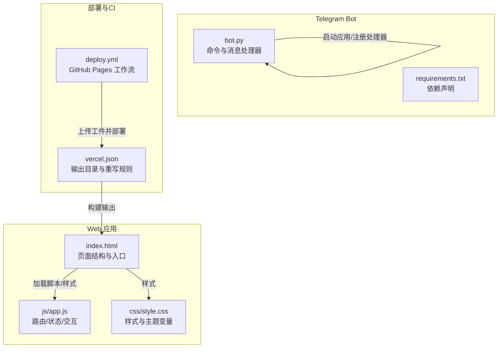
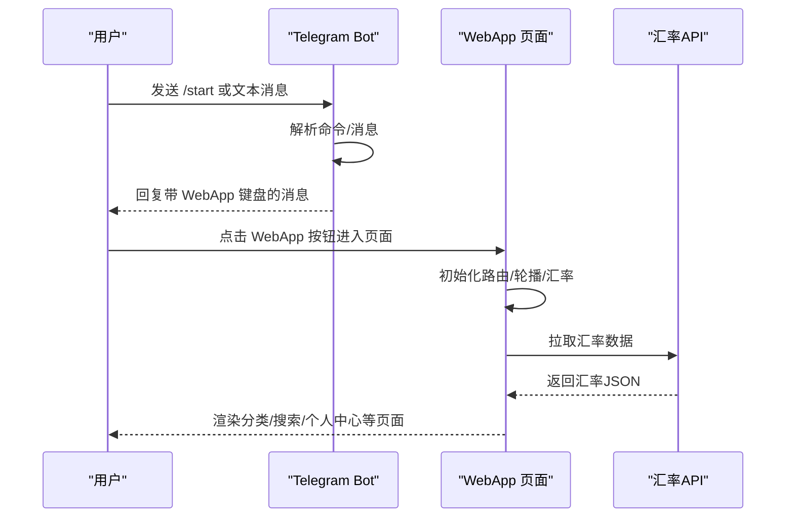
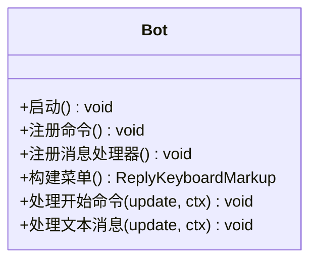
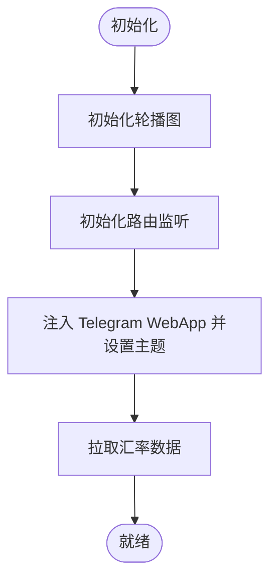
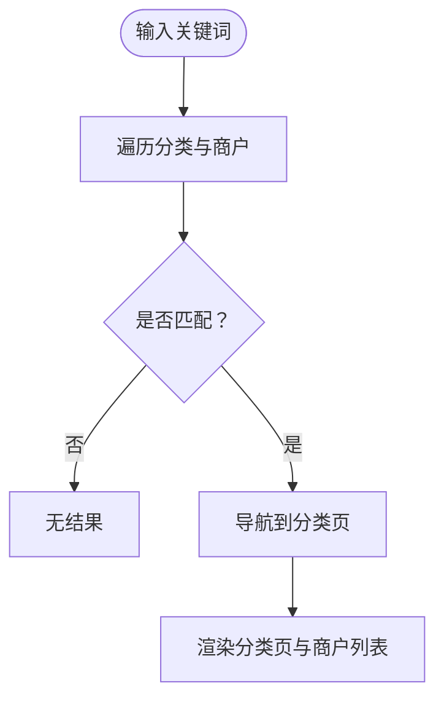
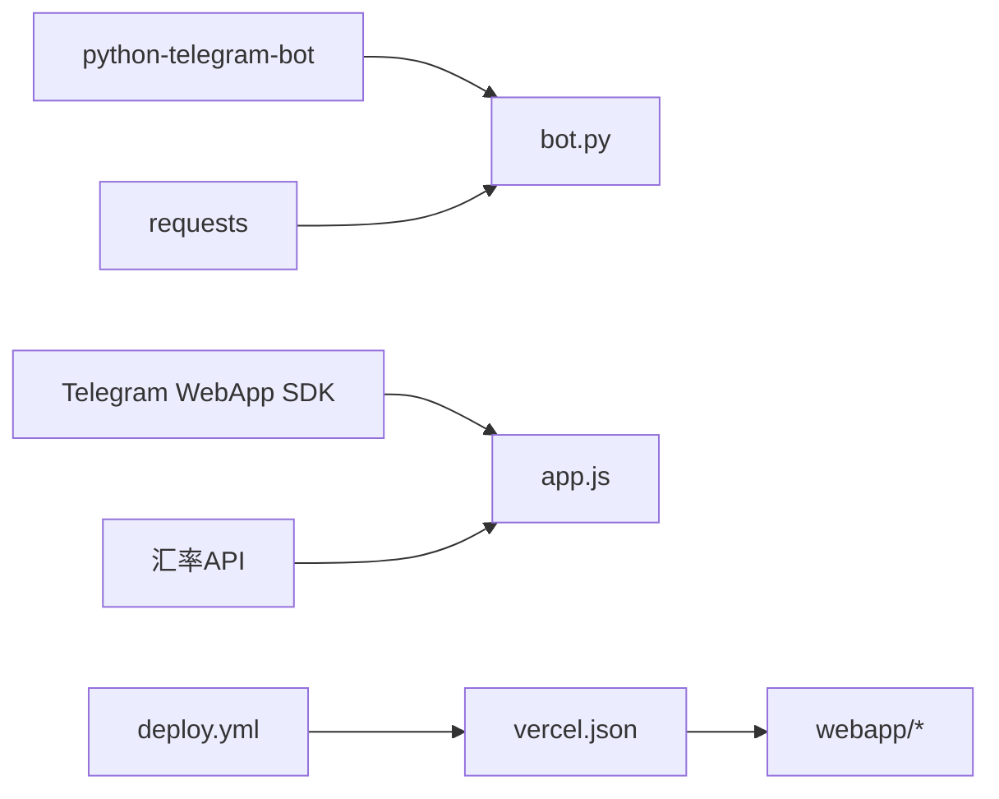

# 功能增强

<cite>
**本文引用的文件**
- [bot.py](file://bot/bot.py)
- [requirements.txt](file://bot/requirements.txt)
- [index.html](file://webapp/index.html)
- [app.js](file://webapp/js/app.js)
- [style.css](file://webapp/css/style.css)
- [vercel.json](file://vercel.json)
- [deploy.yml](file://.github/workflows/deploy.yml)
</cite>

## 目录
1. [简介](#简介)
2. [项目结构](#项目结构)
3. [核心组件](#核心组件)
4. [架构总览](#架构总览)
5. [详细组件分析](#详细组件分析)
6. [依赖分析](#依赖分析)
7. [性能考虑](#性能考虑)
8. [故障排查指南](#故障排查指南)
9. [结论](#结论)
10. [附录](#附录)

## 简介
本指南面向在现有 wyszbot 项目基础上进行功能增强的开发者，目标是帮助你：
- 在 Telegram Bot 中新增命令处理与消息处理逻辑
- 扩展 Web 应用页面与交互流程
- 新增搜索、用户反馈、数据统计等功能模块
- 规范代码结构：函数模块化、组件复用、状态管理
- 安全地集成第三方 API（如汇率接口）
- 制定功能测试策略与性能优化建议
- 处理版本管理与向后兼容性

本项目由两部分组成：
- Telegram Bot：负责引导用户、生成菜单、转发到 WebApp
- Web 应用：提供首页、分类、搜索、个人中心等页面，内置路由与状态管理

## 项目结构
项目采用“前端静态站点 + 后端 Bot”的分层架构，前端通过 Vercel 部署，Bot 使用 python-telegram-bot 运行于本地或服务器环境。

**图表来源**
- [bot.py:77-88](file://bot/bot.py#L77-L88)
- [index.html:1-145](file://webapp/index.html#L1-L145)
- [app.js:1-87](file://webapp/js/app.js#L1-L87)
- [style.css:1-80](file://webapp/css/style.css#L1-L80)
- [vercel.json:1-8](file://vercel.json#L1-L8)
- [.github/workflows/deploy.yml:1-31](file://.github/workflows/deploy.yml#L1-L31)

**章节来源**
- [bot.py:1-88](file://bot/bot.py#L1-L88)
- [index.html:1-145](file://webapp/index.html#L1-L145)
- [app.js:1-87](file://webapp/js/app.js#L1-L87)
- [style.css:1-80](file://webapp/css/style.css#L1-L80)
- [vercel.json:1-8](file://vercel.json#L1-L8)
- [.github/workflows/deploy.yml:1-31](file://.github/workflows/deploy.yml#L1-L31)

## 核心组件
- Bot 启动与路由
  - 初始化应用、注册命令与消息处理器
  - 提供“开始”引导与键盘菜单
- Web 应用路由与状态
  - 基于 URL hash 的单页路由
  - 页面切换、返回栈、轮播图、分类页渲染
- 数据模型
  - 分类数据结构（标题、描述、颜色、标签、商户列表）
  - 汇率数据拉取与展示
- 集成点
  - Telegram WebApp SDK 注入与主题适配
  - 外部汇率 API 调用

**章节来源**
- [bot.py:77-88](file://bot/bot.py#L77-L88)
- [app.js:51-86](file://webapp/js/app.js#L51-L86)
- [index.html:118-131](file://webapp/index.html#L118-L131)

## 架构总览
整体交互流程如下：用户在 Telegram 中与 Bot 对话，Bot 返回带 WebApp 按钮的键盘；点击按钮进入 WebApp；WebApp 内部通过 hash 路由切换页面，使用内置数据与外部 API 展示内容。

**图表来源**
- [bot.py:45-74](file://bot/bot.py#L45-L74)
- [app.js:51-86](file://webapp/js/app.js#L51-L86)
- [index.html:1-145](file://webapp/index.html#L1-L145)

## 详细组件分析

### Bot 组件分析
Bot 负责：
- 启动应用并注册命令与消息处理器
- 生成多行 WebApp 按钮的键盘菜单
- 处理“在线客服”快捷入口与默认消息提示

**图表来源**
- [bot.py:14-43](file://bot/bot.py#L14-L43)
- [bot.py:45-74](file://bot/bot.py#L45-L74)
- [bot.py:77-88](file://bot/bot.py#L77-L88)

**章节来源**
- [bot.py:14-43](file://bot/bot.py#L14-L43)
- [bot.py:45-74](file://bot/bot.py#L45-L74)
- [bot.py:77-88](file://bot/bot.py#L77-L88)

### Web 应用组件分析
Web 应用采用模块化与状态管理思路：
- 初始化：轮播图、路由、Telegram 主题、汇率拉取
- 路由：hash 变化驱动页面切换与返回栈
- 页面：首页、分类、搜索、个人中心等
- 数据：分类数据内嵌在 JS 中，支持按关键词搜索跳转到对应分类
- 交互：联系客服、热门搜索标签、分类标签筛选

**图表来源**
- [app.js:51-86](file://webapp/js/app.js#L51-L86)

**章节来源**
- [app.js:51-86](file://webapp/js/app.js#L51-L86)
- [index.html:118-131](file://webapp/index.html#L118-L131)
- [style.css:1-80](file://webapp/css/style.css#L1-L80)

### 数据模型与渲染
- 分类数据结构：每个分类包含标题、描述、颜色、标签数组、商户列表
- 商户卡片渲染：头像背景色来自分类颜色，评分与标签动态拼接
- 搜索逻辑：根据关键词在所有分类的商户名称与标签中匹配，定位到首个匹配分类并跳转

**图表来源**
- [app.js:76-78](file://webapp/js/app.js#L76-L78)
- [app.js:82-82](file://webapp/js/app.js#L82-L82)

**章节来源**
- [app.js:1-49](file://webapp/js/app.js#L1-L49)
- [app.js:76-82](file://webapp/js/app.js#L76-L82)

## 依赖分析
- Bot 依赖
  - python-telegram-bot：构建应用、注册处理器
  - requests：HTTP 请求（可选，用于 Bot 调用外部 API）
- Web 应用
  - Telegram WebApp SDK：注入主题与用户信息
  - 外部汇率 API：实时汇率查询
- 部署
  - Vercel：输出目录为 webapp，重写规则保证 SPA 正常工作
  - GitHub Actions：将 webapp 目录打包并部署到 GitHub Pages

**图表来源**
- [requirements.txt:1-3](file://bot/requirements.txt#L1-L3)
- [app.js:54-84](file://webapp/js/app.js#L54-L84)
- [vercel.json:1-8](file://vercel.json#L1-L8)
- [.github/workflows/deploy.yml:1-31](file://.github/workflows/deploy.yml#L1-L31)

**章节来源**
- [requirements.txt:1-3](file://bot/requirements.txt#L1-L3)
- [app.js:54-84](file://webapp/js/app.js#L54-L84)
- [vercel.json:1-8](file://vercel.json#L1-L8)
- [.github/workflows/deploy.yml:1-31](file://.github/workflows/deploy.yml#L1-L31)

## 性能考虑
- Bot
  - 使用轮询模式，适合小规模部署；若并发高，建议改为 webhook 并配合反向代理
  - 将菜单构建逻辑拆分为独立函数，避免重复构造
- Web 应用
  - 轮播图自动播放使用定时器，注意在页面不可见时暂停，恢复可见时再启动
  - 搜索与分类渲染使用虚拟滚动或分页，减少 DOM 节点数量
  - 汇率 API 请求增加缓存与失败回退，避免频繁请求导致延迟
- 部署
  - 使用 CDN 加速静态资源
  - 将样式与脚本合并压缩，减少请求数量

[本节为通用指导，无需特定文件引用]

## 故障排查指南
- Bot 无法启动
  - 检查环境变量是否正确设置（Bot Token、WebApp URL）
  - 确认依赖安装完成
- WebApp 无法显示内容
  - 检查 Telegram WebApp SDK 是否成功注入
  - 检查网络访问权限与跨域策略
- 汇率接口异常
  - 检查外部 API 可用性与响应格式
  - 增加错误处理与降级显示
- 路由问题
  - 确认 hash 变化事件绑定正确
  - 检查页面元素 ID 与类名一致性

**章节来源**
- [bot.py:9-11](file://bot/bot.py#L9-L11)
- [app.js:54-84](file://webapp/js/app.js#L54-L84)
- [index.html:1-145](file://webapp/index.html#L1-L145)

## 结论
通过模块化与清晰的职责划分，本项目具备良好的扩展性。新增功能时应遵循：
- Bot：命令与消息处理器分离，菜单与业务解耦
- Web 应用：路由与状态管理清晰，数据与视图分离
- 第三方集成：统一错误处理与降级策略
- 测试与部署：自动化测试与 CI/CD 流程

[本节为总结，无需特定文件引用]

## 附录

### 如何新增 Bot 命令处理
- 新增命令处理器
  - 在 Bot 中注册新的 CommandHandler
  - 在回调中解析参数并生成回复
- 新增消息处理逻辑
  - 扩展 MessageHandler 的过滤条件
  - 在回调中根据消息类型与内容分支处理
- 菜单扩展
  - 在构建菜单函数中追加新的按钮
  - 为新按钮提供对应的 WebApp URL

参考路径
- [bot.py:77-88](file://bot/bot.py#L77-L88)
- [bot.py:14-43](file://bot/bot.py#L14-L43)

**章节来源**
- [bot.py:77-88](file://bot/bot.py#L77-L88)
- [bot.py:14-43](file://bot/bot.py#L14-L43)

### 如何扩展 Web 页面与交互
- 新增页面
  - 在 HTML 中添加页面容器与结构
  - 在 JS 中新增路由处理与页面切换逻辑
- 组件复用
  - 将公共 UI 组件抽象为函数，传入数据与回调
- 状态管理
  - 使用全局状态对象管理当前页面、历史栈、用户信息
  - 通过事件驱动更新视图

参考路径
- [index.html:118-131](file://webapp/index.html#L118-L131)
- [app.js:64-82](file://webapp/js/app.js#L64-L82)

**章节来源**
- [index.html:118-131](file://webapp/index.html#L118-L131)
- [app.js:64-82](file://webapp/js/app.js#L64-L82)

### 新增搜索功能
- 关键词匹配
  - 在分类数据中遍历商户名称与标签
  - 找到首个匹配分类并跳转
- 热门搜索
  - 点击标签直接触发搜索
- 搜索结果页
  - 显示匹配的商户列表与分类标签

参考路径
- [app.js:82-82](file://webapp/js/app.js#L82-L82)

**章节来源**
- [app.js:82-82](file://webapp/js/app.js#L82-L82)

### 用户反馈与数据统计
- 用户反馈
  - 在个人中心添加“意见反馈”入口，打开客服链接
- 数据统计
  - 增加埋点上报（如页面浏览、按钮点击）
  - 使用本地存储或后端接口记录统计数据

参考路径
- [index.html:109-113](file://webapp/index.html#L109-L113)
- [app.js:80-80](file://webapp/js/app.js#L80-L80)

**章节来源**
- [index.html:109-113](file://webapp/index.html#L109-L113)
- [app.js:80-80](file://webapp/js/app.js#L80-L80)

### 第三方 API 集成
- 外部服务调用
  - 在 Bot 中使用 requests 调用外部 API
  - 在 Web 应用中使用 fetch 获取数据
- 数据处理
  - 统一解析 JSON 响应，提取所需字段
- 错误处理
  - 捕获异常并提供降级显示
  - 记录错误日志便于排查

参考路径
- [requirements.txt:1-3](file://bot/requirements.txt#L1-L3)
- [app.js:84-84](file://webapp/js/app.js#L84-L84)

**章节来源**
- [requirements.txt:1-3](file://bot/requirements.txt#L1-L3)
- [app.js:84-84](file://webapp/js/app.js#L84-L84)

### 功能测试策略
- 单元测试
  - 对路由与数据渲染函数进行断言
- 集成测试
  - 模拟 Telegram 与 WebApp 的交互流程
- 端到端测试
  - 使用浏览器自动化工具验证页面行为
- 性能测试
  - 使用 Lighthouse 或 WebPageTest 评估加载性能

[本节为通用指导，无需特定文件引用]

### 版本管理与向后兼容
- 版本号管理
  - 在 Bot 与 Web 应用中分别维护版本号
- 兼容性
  - 保持 API 响应结构稳定，新增字段时提供默认值
- 部署策略
  - 使用 CI/CD 自动化部署，确保前后端一致上线

参考路径
- [vercel.json:1-8](file://vercel.json#L1-L8)
- [.github/workflows/deploy.yml:1-31](file://.github/workflows/deploy.yml#L1-L31)

**章节来源**
- [vercel.json:1-8](file://vercel.json#L1-L8)
- [.github/workflows/deploy.yml:1-31](file://.github/workflows/deploy.yml#L1-L31)