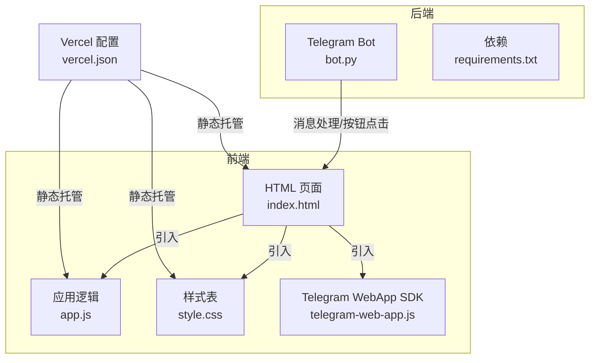
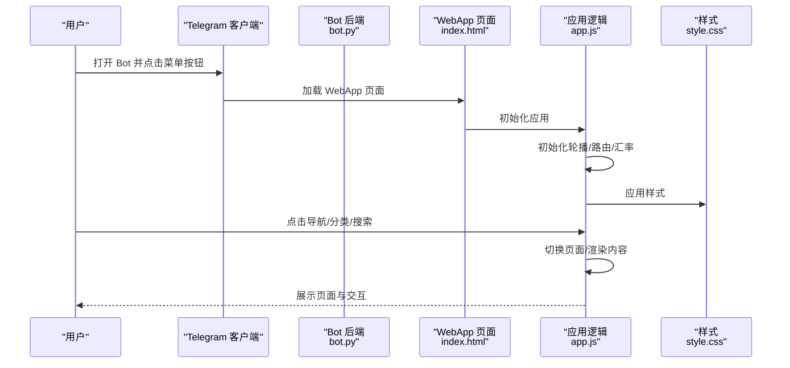
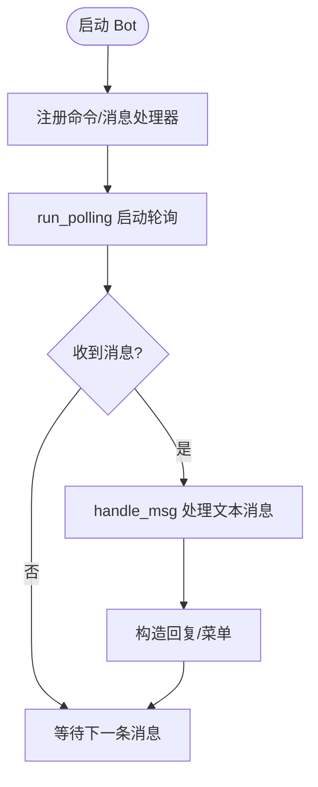
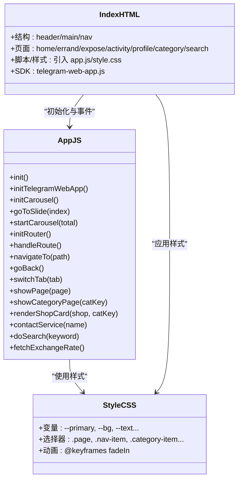
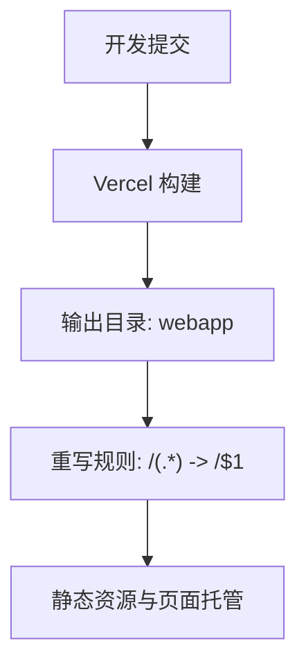
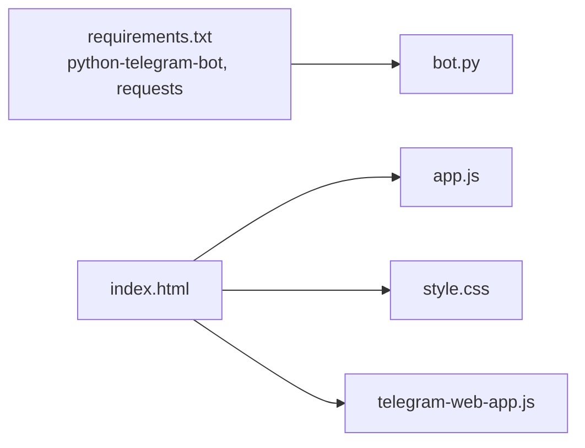

# 性能优化

<cite>
**本文引用的文件**
- [bot.py](file://bot/bot.py)
- [requirements.txt](file://bot/requirements.txt)
- [index.html](file://webapp/index.html)
- [app.js](file://webapp/js/app.js)
- [style.css](file://webapp/css/style.css)
- [vercel.json](file://vercel.json)
</cite>

## 目录
1. [简介](#简介)
2. [项目结构](#项目结构)
3. [核心组件](#核心组件)
4. [架构总览](#架构总览)
5. [详细组件分析](#详细组件分析)
6. [依赖分析](#依赖分析)
7. [性能考量](#性能考量)
8. [故障排查指南](#故障排查指南)
9. [结论](#结论)
10. [附录](#附录)

## 简介
本指南围绕当前仓库中的 Telegram WebApp 前端与 Telegram Bot 后端，系统性梳理前端性能优化策略（代码分割、资源压缩、缓存策略）、JavaScript 优化方法（异步加载、事件委托、内存管理）、CSS 优化技巧（样式合并、选择器优化、动画性能）、网络优化方案（CDN 使用、预加载策略、连接池管理）、性能监控与分析工具、移动端性能优化的特殊考虑与最佳实践，以及性能测试与基准测试的实施方法。文档以仓库现有实现为基础，结合通用工程化最佳实践，给出可落地的优化建议与可视化图示。

## 项目结构
该项目采用“Bot 后端 + WebApp 前端”的双端结构：
- 后端：基于 Python 的 Telegram Bot，负责消息路由与交互入口。
- 前端：单页 WebApp，通过 Telegram WebApp SDK 注入到 Telegram 客户端内，提供首页、分类、搜索、个人中心等页面与导航。

图表来源
- [bot.py:1-88](file://bot/bot.py#L1-L88)
- [requirements.txt:1-3](file://bot/requirements.txt#L1-L3)
- [index.html:1-145](file://webapp/index.html#L1-L145)
- [app.js:1-87](file://webapp/js/app.js#L1-L87)
- [style.css:1-80](file://webapp/css/style.css#L1-L80)
- [vercel.json:1-8](file://vercel.json#L1-L8)

章节来源
- [bot.py:1-88](file://bot/bot.py#L1-L88)
- [index.html:1-145](file://webapp/index.html#L1-L145)
- [app.js:1-87](file://webapp/js/app.js#L1-L87)
- [style.css:1-80](file://webapp/css/style.css#L1-L80)
- [vercel.json:1-8](file://vercel.json#L1-L8)

## 核心组件
- Telegram Bot 后端：负责启动、注册命令处理器与文本消息处理器，构建菜单按钮并响应用户交互。
- WebApp 前端：单页应用，使用哈希路由切换页面；集成 Telegram WebApp SDK，扩展全屏、主题注入等能力；包含轮播图、分类页、搜索页、底部导航等模块。
- 静态资源：HTML 引入 CSS 与 JS，并通过 Vercel 进行静态托管与重写规则配置。

章节来源
- [bot.py:45-83](file://bot/bot.py#L45-L83)
- [index.html:11-142](file://webapp/index.html#L11-L142)
- [app.js:51-86](file://webapp/js/app.js#L51-L86)
- [style.css:1-80](file://webapp/css/style.css#L1-L80)
- [vercel.json:1-8](file://vercel.json#L1-L8)

## 架构总览
前端通过 Telegram WebApp SDK 注入到 Telegram 客户端，页面由哈希路由驱动，页面切换与交互通过事件绑定完成；Bot 后端负责消息入口与菜单按钮生成，引导用户进入 WebApp。

图表来源
- [bot.py:18-42](file://bot/bot.py#L18-L42)
- [index.html:8-9](file://webapp/index.html#L8-L9)
- [app.js:51-86](file://webapp/js/app.js#L51-L86)
- [style.css:1-80](file://webapp/css/style.css#L1-L80)

## 详细组件分析

### 组件一：Bot 后端（Telegram）
- 职责：启动应用、注册命令与消息处理器、构建键盘菜单、回复用户消息。
- 关键点：使用异步回调处理消息，避免阻塞主线程；菜单按钮通过 WebAppInfo 指向 WebApp URL，实现前后端联动。
- 性能关注：消息处理链路应保持轻量，避免在回调中执行耗时操作；必要时将长任务放入后台队列或外部服务。

图表来源
- [bot.py:77-83](file://bot/bot.py#L77-L83)
- [bot.py:61-74](file://bot/bot.py#L61-L74)
- [bot.py:45-58](file://bot/bot.py#L45-L58)

章节来源
- [bot.py:18-42](file://bot/bot.py#L18-L42)
- [bot.py:45-83](file://bot/bot.py#L45-L83)
- [requirements.txt:1-3](file://bot/requirements.txt#L1-L3)

### 组件二：WebApp 前端（HTML/CSS/JS）
- HTML：定义页面结构与导航，引入样式与脚本；通过 Telegram WebApp SDK 注入运行环境。
- CSS：使用 CSS 变量统一主题色，采用阴影、圆角等视觉效果；针对 Telegram 主题注入变量覆盖。
- JS：初始化轮播图、路由、汇率数据拉取；通过事件委托与哈希路由实现页面切换；与 Telegram WebApp SDK 协作扩展界面。

图表来源
- [app.js:51-86](file://webapp/js/app.js#L51-L86)
- [style.css:1-80](file://webapp/css/style.css#L1-L80)
- [index.html:11-142](file://webapp/index.html#L11-L142)

章节来源
- [index.html:11-142](file://webapp/index.html#L11-L142)
- [app.js:51-86](file://webapp/js/app.js#L51-L86)
- [style.css:1-80](file://webapp/css/style.css#L1-L80)

### 组件三：静态托管与重写（Vercel）
- 输出目录：webapp
- 重写规则：将所有路径源映射到目标路径，便于前端路由与静态资源访问。

图表来源
- [vercel.json:1-8](file://vercel.json#L1-L8)

章节来源
- [vercel.json:1-8](file://vercel.json#L1-L8)

## 依赖分析
- 后端依赖：python-telegram-bot、requests，用于与 Telegram API 通信与网络请求。
- 前端依赖：Telegram WebApp SDK 通过外链引入，样式与脚本通过本地静态资源提供。

图表来源
- [requirements.txt:1-3](file://bot/requirements.txt#L1-L3)
- [index.html:8-9](file://webapp/index.html#L8-L9)
- [app.js:1-87](file://webapp/js/app.js#L1-L87)
- [style.css:1-80](file://webapp/css/style.css#L1-L80)

章节来源
- [requirements.txt:1-3](file://bot/requirements.txt#L1-L3)
- [index.html:8-9](file://webapp/index.html#L8-L9)

## 性能考量

### 前端性能优化策略
- 代码分割
  - 将大型页面按需加载，例如分类页与搜索页仅在需要时渲染；当前路由已基于哈希切换，可进一步拆分模块并在首次访问时懒加载。
  - 参考路径：[app.js:64-66](file://webapp/js/app.js#L64-L66)，[app.js:72](file://webapp/js/app.js#L72)。
- 资源压缩
  - 对 CSS/JS 进行压缩与最小化，启用 Gzip/Brotli；在 Vercel 上默认支持静态资源压缩，可配合 CDN 提升边缘缓存命中率。
  - 参考路径：[vercel.json:1-8](file://vercel.json#L1-L8)。
- 缓存策略
  - 使用 Cache-Control/ETag/Last-Modified 控制静态资源缓存；对不常变动的资源设置较长缓存周期。
  - 参考路径：[vercel.json:1-8](file://vercel.json#L1-L8)。

### JavaScript 优化方法
- 异步加载
  - 将第三方 SDK（如 Telegram WebApp SDK）标记为 defer 或动态加载，避免阻塞首屏渲染。
  - 参考路径：[index.html:9](file://webapp/index.html#L9)。
- 事件委托
  - 使用事件委托减少事件监听器数量，提升交互性能与内存占用控制。
  - 当前页面元素较多，建议将点击事件委托到父容器，减少重复绑定。
  - 参考路径：[index.html:33-36](file://webapp/index.html#L33-L36)，[index.html:134-140](file://webapp/index.html#L134-L140)。
- 内存管理
  - 轮播定时器应在页面切换或卸载时清理，避免内存泄漏。
  - 参考路径：[app.js:62](file://webapp/js/app.js#L62)，[app.js:56-60](file://webapp/js/app.js#L56-L60)。

### CSS 优化技巧
- 样式合并
  - 将重复样式抽离为公共类，减少 DOM 结构复杂度与渲染成本。
  - 参考路径：[style.css:18-23](file://webapp/css/style.css#L18-L23)，[style.css:63-64](file://webapp/css/style.css#L63-L64)。
- 选择器优化
  - 避免深层嵌套与通配符选择器，优先使用类选择器与低权重组合。
  - 参考路径：[style.css:1-2](file://webapp/css/style.css#L1-L2)。
- 动画性能
  - 使用 transform/opacity 控制动画，避免频繁触发布局与绘制；当前淡入动画使用 transform/opacity，性能良好。
  - 参考路径：[style.css:7-8](file://webapp/css/style.css#L7-L8)，[style.css:10-11](file://webapp/css/style.css#L10-L11)。

### 网络优化方案
- CDN 使用
  - 将 Telegram WebApp SDK 等第三方资源指向 CDN，缩短首字节时间；同时在 Vercel 上利用边缘节点就近分发。
  - 参考路径：[index.html:9](file://webapp/index.html#L9)，[vercel.json:1-8](file://vercel.json#L1-L8)。
- 预加载策略
  - 对关键资源（如首页轮播图背景、图标字体）使用 prefetch/early-hints；对后续页面资源使用预连接（preconnect）。
  - 参考路径：[index.html:8](file://webapp/index.html#L8)。
- 连接池管理
  - 合理复用 HTTP 连接，避免过多并发请求导致拥塞；对第三方 API（如汇率接口）增加超时与重试策略。
  - 参考路径：[app.js:84](file://webapp/js/app.js#L84)。

### 性能监控与分析工具
- 浏览器开发者工具
  - 使用 Performance/Network/Timeline 分析首屏渲染、资源加载与脚本执行瓶颈。
- Lighthouse
  - 定期运行 Lighthouse 评估 PWA 指标（首屏渲染、交互延迟、可访问性等）。
- Sentry/LogRocket
  - 在生产环境接入错误与会话回放，定位用户侧性能问题。
- Vercel 分析
  - 利用 Vercel 的边缘分析与日志聚合，观察静态资源访问与错误分布。

### 移动端性能优化的特殊考虑与最佳实践
- 触摸反馈与点击延迟
  - 使用 CSS :active 或 JavaScript touch 事件优化点击反馈；避免 300ms 点击延迟。
- 滚动性能
  - 使用 will-change/transform3d 提升滚动流畅度；避免在滚动过程中触发重排。
- 电池与流量
  - 减少不必要的网络请求与动画；在弱网环境下降级图片质量或延迟加载。
- Telegram WebApp 适配
  - 使用 Telegram WebApp SDK 的 expand/ready 方法确保全屏与主题一致；避免固定定位导致的滚动遮挡。
  - 参考路径：[app.js:54](file://webapp/js/app.js#L54)，[index.html:5](file://webapp/index.html#L5)。

### 性能测试与基准测试的实施方法
- 首屏指标
  - 使用 Navigation Timing API 记录 FCP/LCP/INP 等指标；在 Vercel 上结合浏览器性能面板对比优化前后的变化。
- 压力测试
  - 使用 k6/JMeter 对 Bot 后端的消息处理能力进行压力测试，验证高并发下的稳定性。
- 回归测试
  - 建立自动化基准测试流水线，定期比较关键性能指标，防止回归。

## 故障排查指南
- 页面无法显示或样式异常
  - 检查静态资源是否正确部署至输出目录；确认重写规则未拦截关键资源。
  - 参考路径：[vercel.json:1-8](file://vercel.json#L1-L8)。
- 轮播图不自动播放或点击无效
  - 确认轮播初始化函数已调用且定时器未被清理；检查页面可见性与事件绑定。
  - 参考路径：[app.js:56-62](file://webapp/js/app.js#L56-L62)。
- 汇率接口失败
  - 检查第三方 API 的可用性与跨域策略；为接口添加超时与降级提示。
  - 参考路径：[app.js:84](file://webapp/js/app.js#L84)。
- Telegram 主题不生效
  - 确认 Telegram WebApp SDK 已正确注入并读取主题变量；检查 CSS 变量覆盖顺序。
  - 参考路径：[app.js:54](file://webapp/js/app.js#L54)，[style.css:79-80](file://webapp/css/style.css#L79-L80)。

章节来源
- [vercel.json:1-8](file://vercel.json#L1-L8)
- [app.js:54-86](file://webapp/js/app.js#L54-L86)
- [style.css:79-80](file://webapp/css/style.css#L79-L80)

## 结论
本项目在前端层面已具备良好的基础：简洁的页面结构、合理的路由与交互、Telegram WebApp SDK 的集成。为进一步提升性能，建议从代码分割、资源压缩与缓存、事件委托与内存管理、CSS 选择器与动画优化、网络 CDN 与预加载、移动端专项优化以及持续的性能监控与测试等方面入手，形成系统化的优化闭环。

## 附录
- 术语
  - CDN：内容分发网络，用于加速静态资源分发。
  - ETag：HTTP 缓存校验头，用于判断资源是否更新。
  - Lighthouse：Google 开源的网页质量评估工具。
  - INP：交互到下一个输入的时间，衡量交互延迟。
- 参考实现路径
  - [bot.py:77-83](file://bot/bot.py#L77-L83)
  - [index.html:11-142](file://webapp/index.html#L11-L142)
  - [app.js:51-86](file://webapp/js/app.js#L51-L86)
  - [style.css:1-80](file://webapp/css/style.css#L1-80)
  - [vercel.json:1-8](file://vercel.json#L1-L8)