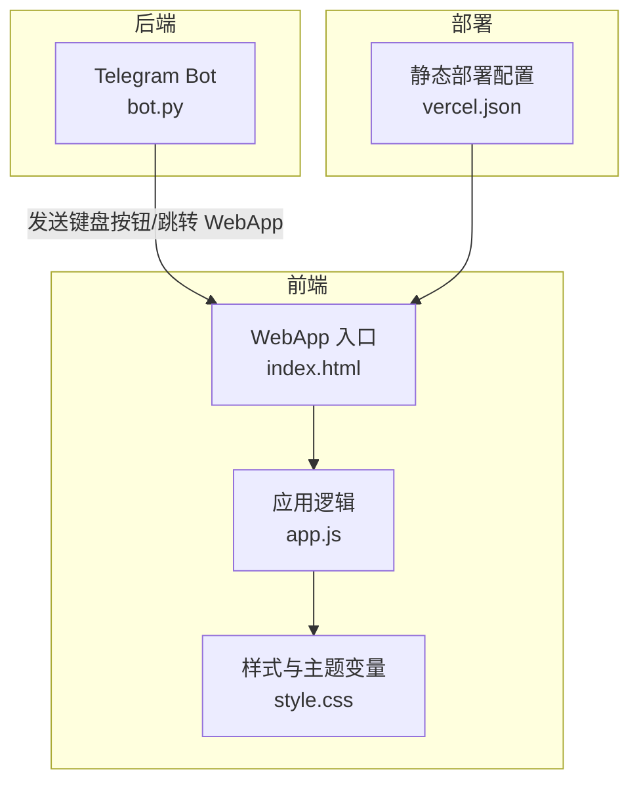
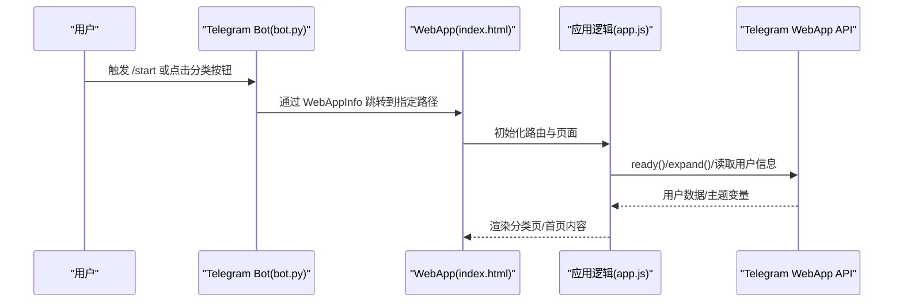
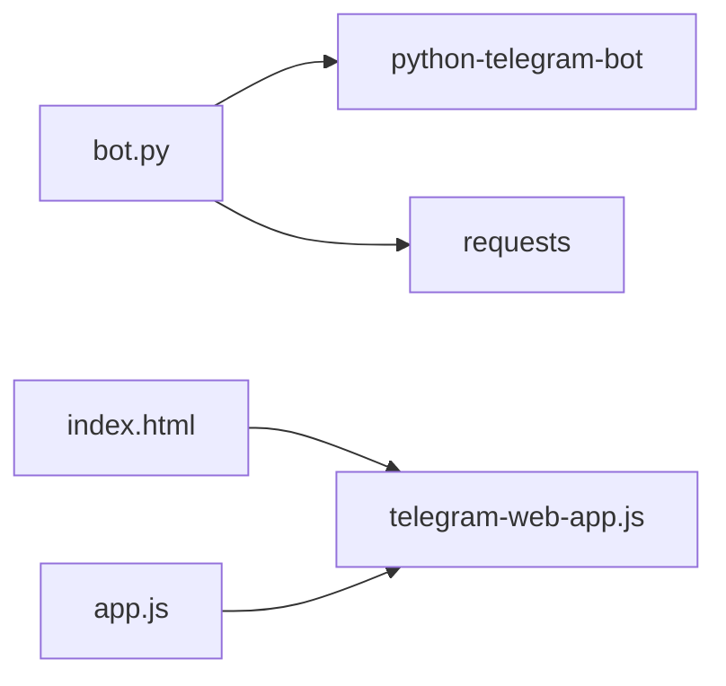

# 扩展与定制

<cite>
**本文引用的文件**
- [bot.py](file://bot/bot.py)
- [requirements.txt](file://bot/requirements.txt)
- [index.html](file://webapp/index.html)
- [app.js](file://webapp/js/app.js)
- [style.css](file://webapp/css/style.css)
- [vercel.json](file://vercel.json)
</cite>

## 目录
1. [简介](#简介)
2. [项目结构](#项目结构)
3. [核心组件](#核心组件)
4. [架构总览](#架构总览)
5. [详细组件分析](#详细组件分析)
6. [依赖分析](#依赖分析)
7. [性能考虑](#性能考虑)
8. [故障排查指南](#故障排查指南)
9. [结论](#结论)
10. [附录](#附录)

## 简介
本指南面向需要对“木姐同城生活助手”项目进行扩展与定制的开发者，覆盖以下目标：
- 新增服务分类：从代码、数据配置、样式三方面给出完整流程
- 主题系统定制：颜色方案、字体、布局的可定制化路径
- 功能扩展：新增页面、自定义组件、API 集成的实践步骤
- 第三方服务集成：支付系统、数据分析、推送通知等的接入思路
- 性能优化：代码分割、缓存策略、资源压缩的建议
- 安全加固：输入验证、权限控制、数据加密的要点
- 最佳实践、常见陷阱与维护成本控制

## 项目结构
该项目由 Telegram Bot 与前端 WebApp 组成，采用静态站点部署于 Vercel，通过 Telegram WebApp 协议在 Telegram 内嵌展示。

图表来源
- [bot.py:14-42](file://bot/bot.py#L14-L42)
- [index.html:1-145](file://webapp/index.html#L1-L145)
- [app.js:1-87](file://webapp/js/app.js#L1-L87)
- [style.css:1-80](file://webapp/css/style.css#L1-L80)
- [vercel.json:1-8](file://vercel.json#L1-L8)

章节来源
- [bot.py:1-88](file://bot/bot.py#L1-L88)
- [index.html:1-145](file://webapp/index.html#L1-L145)
- [app.js:1-87](file://webapp/js/app.js#L1-L87)
- [style.css:1-80](file://webapp/css/style.css#L1-L80)
- [vercel.json:1-8](file://vercel.json#L1-L8)

## 核心组件
- Telegram Bot（Python）：负责启动命令、消息处理、生成分类菜单并跳转至 WebApp 对应分类页
- WebApp（HTML/JS/CSS）：首页轮播、分类页、搜索页、底部导航、主题变量与 Telegram WebApp 集成
- 部署配置（Vercel）：输出目录、重写规则

章节来源
- [bot.py:45-83](file://bot/bot.py#L45-L83)
- [index.html:21-124](file://webapp/index.html#L21-L124)
- [app.js:51-86](file://webapp/js/app.js#L51-L86)
- [style.css:1-80](file://webapp/css/style.css#L1-L80)
- [vercel.json:1-8](file://vercel.json#L1-L8)

## 架构总览
整体交互流程：用户在 Telegram 中打开 Bot，Bot 展示分类菜单；点击按钮后通过 WebAppInfo 跳转到 WebApp 的对应分类页或首页；WebApp 使用路由与主题变量渲染界面，并通过 Telegram WebApp API 获取用户信息与主题。

图表来源
- [bot.py:14-42](file://bot/bot.py#L14-L42)
- [index.html:11-141](file://webapp/index.html#L11-L141)
- [app.js:51-86](file://webapp/js/app.js#L51-L86)

## 详细组件分析

### Telegram Bot（新增服务分类）
- 菜单构建：通过 build_menu() 生成多行分类按钮，每个按钮使用 WebAppInfo 指向 WebApp 的分类路径
- 命令与消息处理：/start 输出欢迎文本并附带菜单；普通文本消息处理“在线客服”入口
- 环境变量：BOT_TOKEN、WEBAPP_URL、CS_TELEGRAM 用于运行时配置

新增服务分类步骤（代码修改）：
1) 在 bot.py 的 build_menu() 中添加新的分类按钮，确保 WebApp URL 指向 “/#/category/{cat}”
2) 在 WebApp 数据配置中新增对应分类键值（见下文“数据配置”）
3) 如需样式差异化，可在 WebApp 中为新分类设置颜色与图标

章节来源
- [bot.py:14-42](file://bot/bot.py#L14-L42)
- [bot.py:45-83](file://bot/bot.py#L45-L83)
- [bot.py:9-11](file://bot/bot.py#L9-L11)

### WebApp（新增服务分类）
- 页面结构：首页、跑腿、曝光、活动、我的、分类、搜索等页面容器
- 路由与导航：基于 URL hash 的切换，支持返回栈与头部标题动态更新
- 分类页数据：所有分类的标题、描述、颜色、标签与商户列表集中存储在 app.js 的 C 对象中
- 主题变量：CSS 自定义属性统一管理主色、背景、文字、边框等；Telegram WebApp 主题会覆盖部分变量

新增服务分类步骤（数据配置）：
1) 在 app.js 的 C 对象中新增分类键，包含 title/desc/color/tabs/shops 字段
2) shops 数组中添加具体商户条目（名称、描述、标签、评分、图标）
3) 如需标签筛选，确保 tabs 中包含“全部”与业务标签

新增服务分类步骤（样式定制）：
1) 在 style.css 的 :root 中设置 --primary 及相关变量，或在分类页动态设置 banner 背景
2) 通过 .cat-icon/.page-banner 等类名控制图标与横幅样式
3) 若需 Telegram WebApp 主题适配，可利用 body.tg-theme 与 --tg-theme-* 变量

章节来源
- [index.html:21-124](file://webapp/index.html#L21-L124)
- [app.js:1-49](file://webapp/js/app.js#L1-L49)
- [app.js:76-78](file://webapp/js/app.js#L76-L78)
- [style.css:1-80](file://webapp/css/style.css#L1-L80)

### 主题系统定制（颜色、字体、布局）
- 颜色方案：通过 :root 自定义属性集中管理主色、背景、卡片背景、文字、危险/成功/信息色等
- Telegram 主题：当 WebApp 运行在 Telegram 环境时，body.tg-theme 生效，覆盖部分主题变量
- 字体配置：默认使用系统字体栈，可通过 :root 或具体选择器调整字号与行高
- 布局：固定头部、底部导航、页面切换动画、网格与卡片布局均以 CSS 变量与类名控制

定制步骤：
- 修改 :root 变量以统一调整主色与辅助色
- 在分类页动态设置 banner 背景（已内置 color 字段）
- 通过 .page、#header、#bottomNav 等选择器微调布局间距与阴影

章节来源
- [style.css:1-80](file://webapp/css/style.css#L1-L80)
- [app.js:54](file://webapp/js/app.js#L54)

### 功能扩展（新增页面、自定义组件、API 集成）
- 新增页面：在 index.html 中添加新的 page-* 容器，按现有结构编写内容与交互
- 自定义组件：复用现有卡片、标签、按钮等组件类名，保持一致风格
- API 集成：参考汇率接口 fetch 的模式，封装请求函数并在合适时机调用

扩展步骤：
- 在 index.html 添加页面结构
- 在 app.js 中注册路由与渲染逻辑，维护历史栈与头部标题
- 在 style.css 中补充必要的样式类

章节来源
- [index.html:68-116](file://webapp/index.html#L68-L116)
- [app.js:64-74](file://webapp/js/app.js#L64-L74)
- [app.js:84](file://webapp/js/app.js#L84)

### 第三方服务集成方案
- 支付系统：在“联系商家”或“我的订单”等场景中接入第三方支付 SDK；在 Telegram WebApp 中通过 open方式跳转到支付页
- 数据分析：在 app.js 初始化阶段引入分析 SDK，记录页面访问与用户行为
- 推送通知：通过 Telegram Bot 的消息通道或第三方推送服务实现消息触达

集成建议：
- 将第三方 SDK 初始化放在 init() 中，确保在 DOMContentLoaded 后执行
- 对外链跳转统一使用 window.open 并校验 URL 合法性
- 对敏感数据（如支付参数）仅在服务端生成与传输

章节来源
- [app.js:51-52](file://webapp/js/app.js#L51-L52)
- [app.js:80](file://webapp/js/app.js#L80)

### 性能优化策略
- 代码分割：将大型模块拆分为独立文件，按需加载（当前为单页应用，建议按页面拆分）
- 缓存策略：利用浏览器缓存与 CDN；静态资源版本化；对 API 结果做客户端缓存
- 资源压缩：启用 Gzip/Brotli；合并与压缩 CSS/JS；移除未使用样式
- 图片优化：懒加载、WebP 格式、响应式尺寸
- 路由与渲染：减少不必要的重绘，使用 transform/opacity 动画；对长列表使用虚拟滚动

章节来源
- [vercel.json:1-8](file://vercel.json#L1-L8)

### 安全加固建议
- 输入验证：对搜索关键词、表单字段进行白名单过滤与长度限制
- 权限控制：Bot 侧对消息来源进行校验；WebApp 外链跳转前进行 URL 校验
- 数据加密：敏感数据在传输层使用 HTTPS；客户端不存储明文密钥
- 内容安全：严格限制外部脚本与内联样式；使用 CSP 头部

章节来源
- [bot.py:9-11](file://bot/bot.py#L9-L11)
- [app.js:80](file://webapp/js/app.js#L80)

## 依赖分析
- 后端依赖：python-telegram-bot、requests
- 前端依赖：Telegram WebApp JS SDK（通过 CDN 引入）

图表来源
- [requirements.txt:1-3](file://bot/requirements.txt#L1-L3)
- [index.html:9](file://webapp/index.html#L9)
- [app.js:54](file://webapp/js/app.js#L54)

章节来源
- [requirements.txt:1-3](file://bot/requirements.txt#L1-L3)
- [index.html:9](file://webapp/index.html#L9)
- [app.js:54](file://webapp/js/app.js#L54)

## 性能考虑
- 静态资源：将 CSS/JS 与图片置于 CDN，启用缓存与压缩
- 渲染性能：使用 CSS 动画替代 JS 动画；避免强制同步布局
- 网络请求：对第三方 API 做超时与重试；合理缓存结果
- 首屏优化：关键 CSS 内联；非关键资源异步加载

章节来源
- [vercel.json:1-8](file://vercel.json#L1-L8)

## 故障排查指南
- Bot 无法启动：检查环境变量是否正确（TOKEN、WEBAPP_URL、CS_TELEGRAM）
- WebApp 无法显示：确认 Vercel 输出目录配置与重写规则
- 分类页空白：检查 app.js 中分类键是否存在，路由是否匹配
- 主题异常：确认 Telegram WebApp 是否可用，body.tg-theme 类是否生效
- 汇率接口失败：检查网络连通性与第三方 API 可用性

章节来源
- [bot.py:9-11](file://bot/bot.py#L9-L11)
- [vercel.json:1-8](file://vercel.json#L1-L8)
- [app.js:76](file://webapp/js/app.js#L76)
- [app.js:54](file://webapp/js/app.js#L54)
- [app.js:84](file://webapp/js/app.js#L84)

## 结论
本项目以 Telegram Bot 为入口、WebApp 为核心，结合 Telegram WebApp API 与静态部署，形成轻量级、可扩展的生活服务平台。通过统一的主题变量、集中化的分类数据与清晰的路由体系，开发者可以高效地新增服务分类、定制主题与布局，并按需集成第三方能力。建议在扩展过程中遵循统一的数据结构、样式规范与安全策略，以降低维护成本并提升用户体验。

## 附录

### 新增服务分类操作清单
- 在 bot.py 的 build_menu() 中添加分类按钮
- 在 app.js 的 C 对象中新增分类键与数据
- 在 style.css 中设置颜色或复用现有类名
- 在 index.html 中完善页面结构（如需）
- 在 vercel.json 中确认输出目录与重写规则

章节来源
- [bot.py:14-42](file://bot/bot.py#L14-L42)
- [app.js:1-49](file://webapp/js/app.js#L1-L49)
- [style.css:1-80](file://webapp/css/style.css#L1-L80)
- [vercel.json:1-8](file://vercel.json#L1-L8)