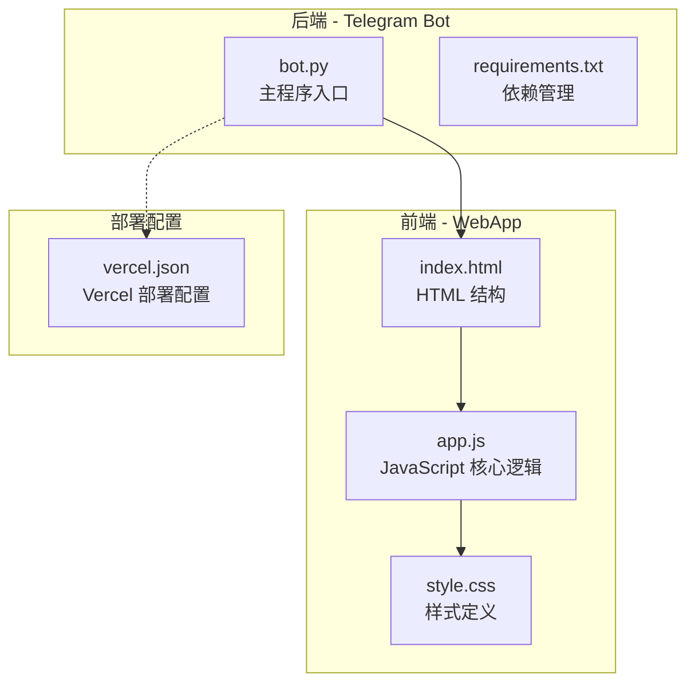
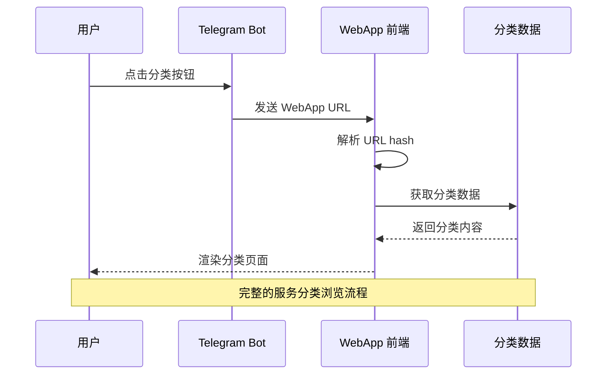
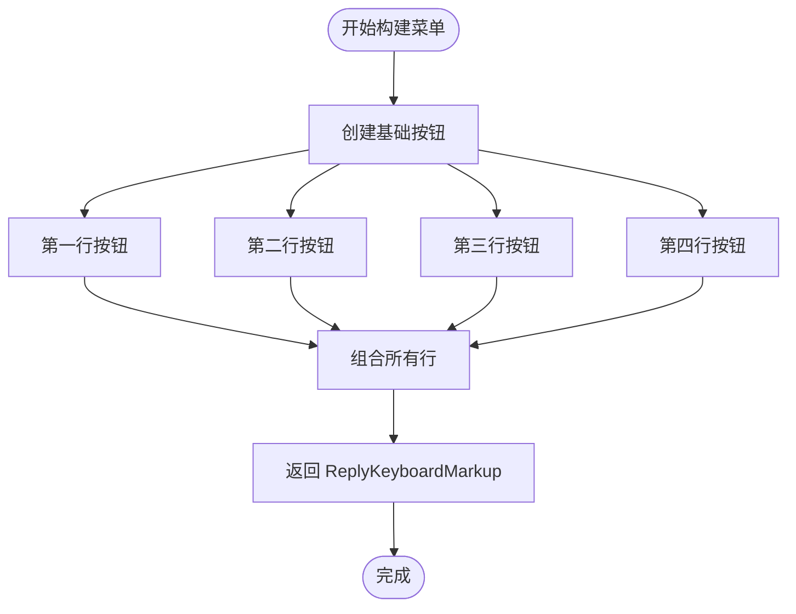
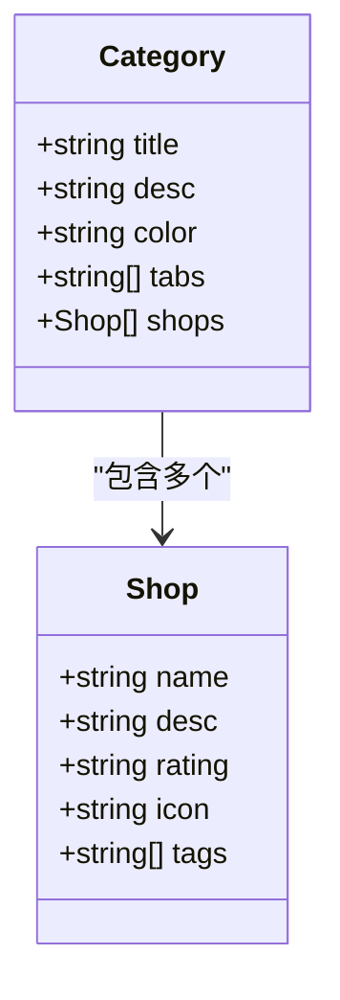
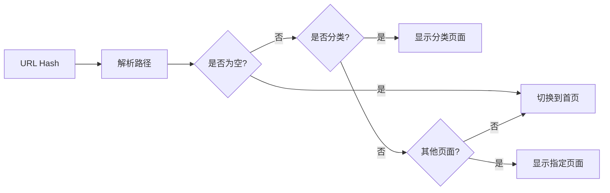
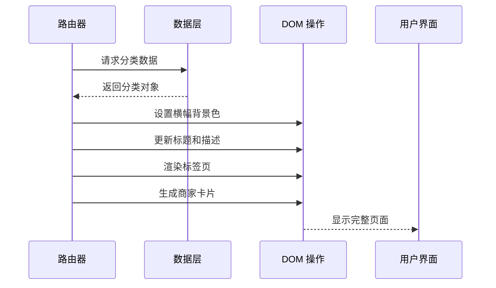
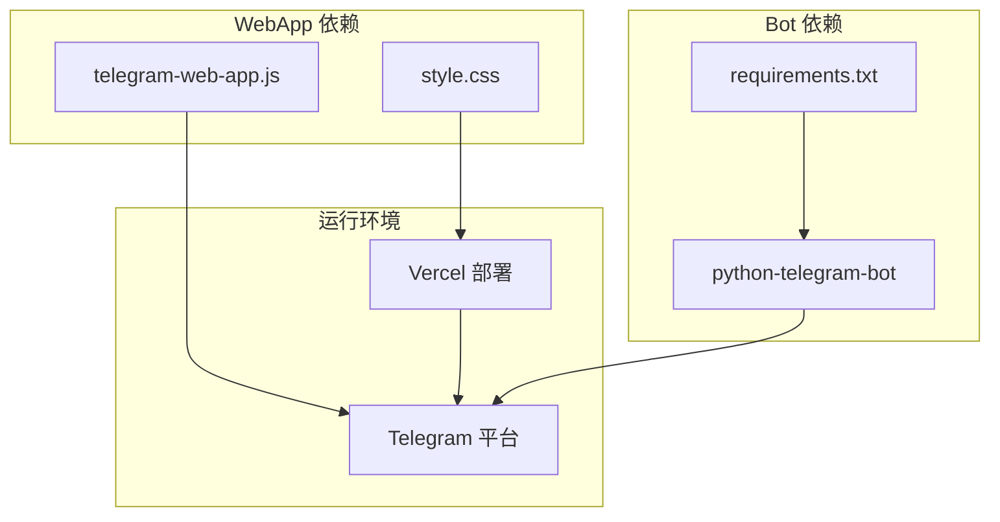

# 服务分类扩展

<cite>
**本文档引用的文件**
- [bot.py](file://bot/bot.py)
- [app.js](file://webapp/js/app.js)
- [index.html](file://webapp/index.html)
- [style.css](file://webapp/css/style.css)
- [requirements.txt](file://bot/requirements.txt)
- [vercel.json](file://vercel.json)
</cite>

## 目录
1. [简介](#简介)
2. [项目结构](#项目结构)
3. [核心组件](#核心组件)
4. [架构概览](#架构概览)
5. [详细组件分析](#详细组件分析)
6. [依赖关系分析](#依赖关系分析)
7. [性能考虑](#性能考虑)
8. [故障排除指南](#故障排除指南)
9. [结论](#结论)

## 简介

本指南详细说明了如何在 Telegram Bot 中新增服务分类扩展功能。该项目是一个基于 Telegram WebApp 的生活服务平台，提供了从 Bot 键盘按钮配置到前端页面渲染的完整实现流程。文档涵盖了从后端 Bot 配置到前端分类页面的完整技术栈，包括分类数据结构设计、路由配置、页面渲染逻辑等核心实现细节。

## 项目结构

项目采用前后端分离架构，包含 Telegram Bot 后端和 WebApp 前端两大部分：

**图表来源**
- [bot.py:1-88](file://bot/bot.py#L1-L88)
- [app.js:1-87](file://webapp/js/app.js#L1-L87)
- [index.html:1-145](file://webapp/index.html#L1-L145)

**章节来源**
- [bot.py:1-88](file://bot/bot.py#L1-L88)
- [app.js:1-87](file://webapp/js/app.js#L1-L87)
- [index.html:1-145](file://webapp/index.html#L1-L145)
- [vercel.json:1-8](file://vercel.json#L1-L8)

## 核心组件

### Bot 核心组件

Bot 组件负责处理 Telegram 交互，主要包含以下关键功能：

- **菜单构建器**: `build_menu()` 函数生成键盘按钮布局
- **分类按钮**: `_btn()` 辅助函数创建带 WebApp URL 的按钮
- **消息处理器**: `handle_msg()` 处理用户消息和导航
- **启动命令**: `start_cmd()` 初始化用户界面

### WebApp 核心组件

WebApp 组件提供完整的前端交互体验：

- **路由系统**: 基于 URL hash 的单页应用路由
- **分类数据**: `C` 对象存储所有分类的结构化数据
- **页面渲染**: 动态生成分类页面内容
- **主题适配**: Telegram WebApp 主题集成

**章节来源**
- [bot.py:14-42](file://bot/bot.py#L14-L42)
- [app.js:1-49](file://webapp/js/app.js#L1-L49)
- [app.js:64-76](file://webapp/js/app.js#L64-L76)

## 架构概览

系统采用客户端-服务器架构，通过 Telegram WebApp 协议实现无缝集成：

**图表来源**
- [bot.py:18-42](file://bot/bot.py#L18-L42)
- [app.js:64-76](file://webapp/js/app.js#L64-L76)

## 详细组件分析

### Bot 菜单构建器组件

Bot 的菜单构建器是服务分类扩展的核心组件，负责生成 Telegram 键盘按钮：

#### 构建函数分析

**图表来源**
- [bot.py:18-42](file://bot/bot.py#L18-L42)

#### 分类按钮配置

每个分类按钮都遵循统一的配置模式：

| 属性 | 描述 | 示例值 |
|------|------|--------|
| 文本 | 显示的按钮文本 | 🍜 美食 |
| 图标 | Emoji 图标 | 🏨 酒店 |
| WebApp URL | 分类页面 URL | `/#/category/food` |
| 颜色 | Telegram 主题颜色 | 自动继承 |

**章节来源**
- [bot.py:14-15](file://bot/bot.py#L14-L15)
- [bot.py:18-42](file://bot/bot.py#L18-L42)

### WebApp 分类页面组件

WebApp 的分类页面实现了完整的单页应用功能：

#### 数据结构设计

分类数据采用统一的对象结构：

**图表来源**
- [app.js:1-49](file://webapp/js/app.js#L1-L49)

#### 路由配置分析

路由系统支持多级路径解析：

**图表来源**
- [app.js:64-76](file://webapp/js/app.js#L64-L76)

**章节来源**
- [app.js:1-49](file://webapp/js/app.js#L1-L49)
- [app.js:64-76](file://webapp/js/app.js#L64-L76)

### 页面渲染逻辑

页面渲染系统实现了动态内容生成：

#### 分类页面渲染流程

**图表来源**
- [app.js:76-78](file://webapp/js/app.js#L76-L78)

#### 商家卡片渲染

每个商家卡片包含完整的展示信息：

| 元素 | 内容 | 样式 |
|------|------|------|
| 头像 | 分类图标 + 颜色背景 | 圆形头像 |
| 标题 | 商家名称 | 主标题 |
| 评分 | 星级评分 | 评分显示 |
| 描述 | 服务介绍 | 次级文本 |
| 标签 | 服务类型标签 | 彩色标签 |
| 联系按钮 | 联系商家 | 主色调按钮 |

**章节来源**
- [app.js:76-78](file://webapp/js/app.js#L76-L78)

## 依赖关系分析

系统依赖关系清晰明确，各组件职责分明：

**图表来源**
- [requirements.txt:1-3](file://bot/requirements.txt#L1-L3)
- [index.html:9](file://webapp/index.html#L9)

**章节来源**
- [requirements.txt:1-3](file://bot/requirements.txt#L1-L3)
- [vercel.json:1-8](file://vercel.json#L1-L8)

## 性能考虑

### 前端性能优化

- **懒加载**: 分类数据一次性加载，避免重复请求
- **缓存策略**: 使用内存缓存减少 DOM 操作
- **动画优化**: CSS3 硬件加速的过渡效果
- **响应式设计**: 移动端友好的布局适配

### 后端性能优化

- **静态资源**: WebApp 静态托管，减少服务器压力
- **连接池**: Telegram API 连接复用
- **错误处理**: 容错机制避免服务中断

## 故障排除指南

### 常见问题及解决方案

#### Bot 按钮无法点击

**症状**: Telegram 键盘按钮无响应
**可能原因**:
- WebApp URL 配置错误
- Bot Token 无效
- 网络连接问题

**解决步骤**:
1. 验证 WEBAPP_URL 环境变量
2. 检查 Bot Token 权限
3. 测试网络连通性

#### 分类页面显示异常

**症状**: 分类页面空白或内容缺失
**可能原因**:
- URL hash 解析失败
- 分类数据加载错误
- DOM 元素不存在

**解决步骤**:
1. 检查 URL 格式 `/#/category/{分类键}`
2. 验证分类数据完整性
3. 确认 DOM 元素存在

#### 样式显示问题

**症状**: 页面样式错乱或元素重叠
**可能原因**:
- CSS 文件加载失败
- Telegram 主题冲突
- 移动端适配问题

**解决步骤**:
1. 检查 CSS 文件路径
2. 验证 Telegram WebApp 主题变量
3. 测试不同设备显示效果

**章节来源**
- [bot.py:9-11](file://bot/bot.py#L9-L11)
- [app.js:54-56](file://webapp/js/app.js#L54-L56)

## 结论

本服务分类扩展方案提供了完整的 Telegram Bot 生活服务平台实现。通过精心设计的 Bot 键盘按钮配置和 WebApp 前端渲染逻辑，实现了从后端配置到前端展示的一体化解决方案。

### 关键优势

1. **一致性**: 统一的数据结构和渲染逻辑
2. **可扩展性**: 易于添加新分类和服务
3. **用户体验**: 流畅的导航和响应式设计
4. **维护性**: 清晰的代码结构和注释

### 最佳实践建议

1. **数据标准化**: 保持分类数据结构的一致性
2. **错误处理**: 完善的异常捕获和用户提示
3. **性能监控**: 定期检查页面加载性能
4. **兼容性测试**: 多平台和多设备验证

该方案为类似的生活服务平台开发提供了完整的参考模板，开发者可以根据具体需求进行定制和扩展。