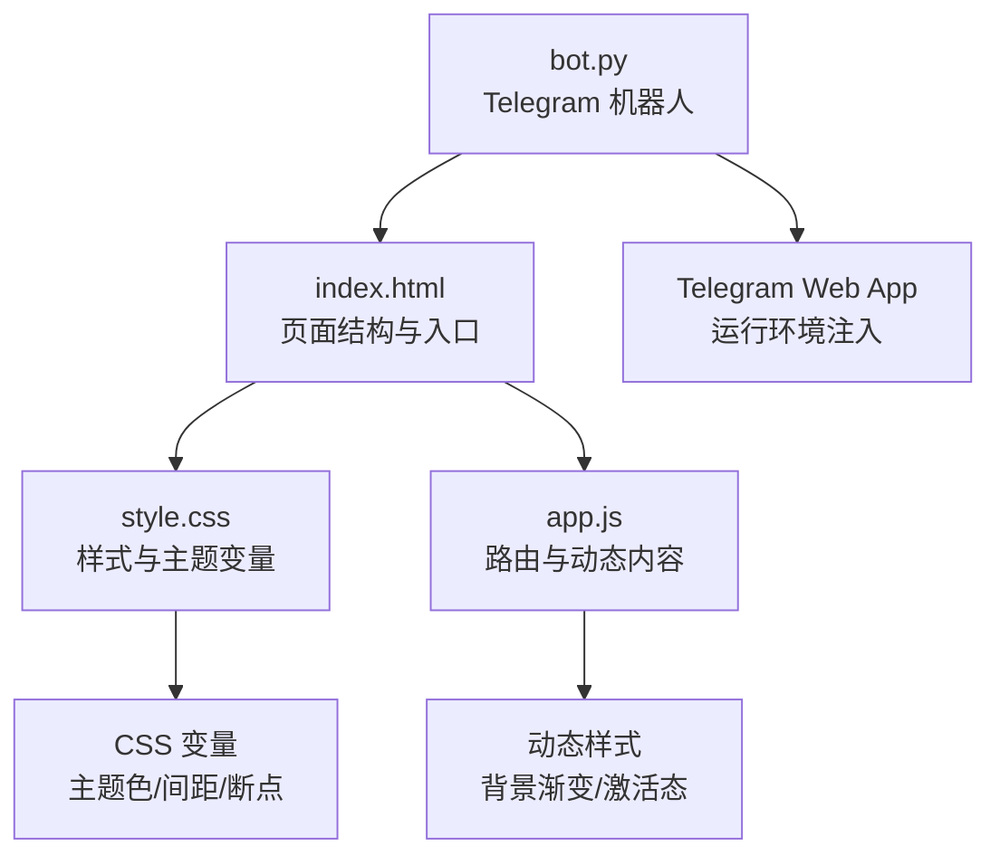
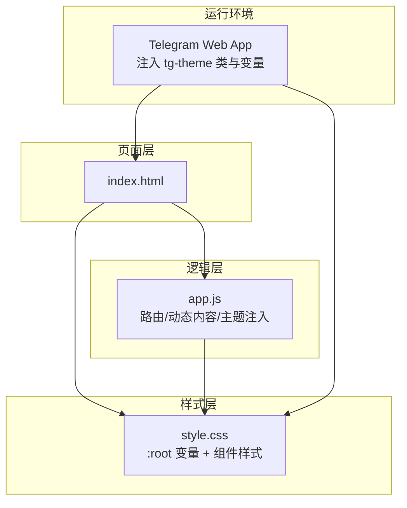
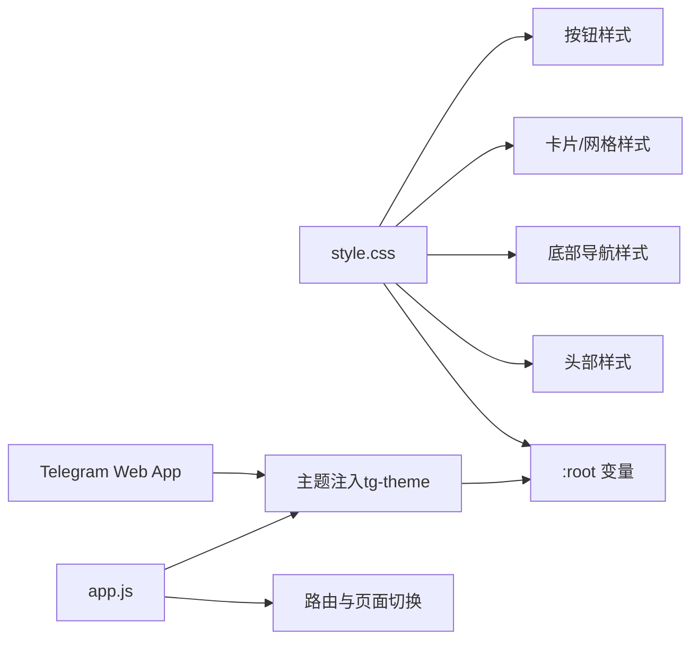
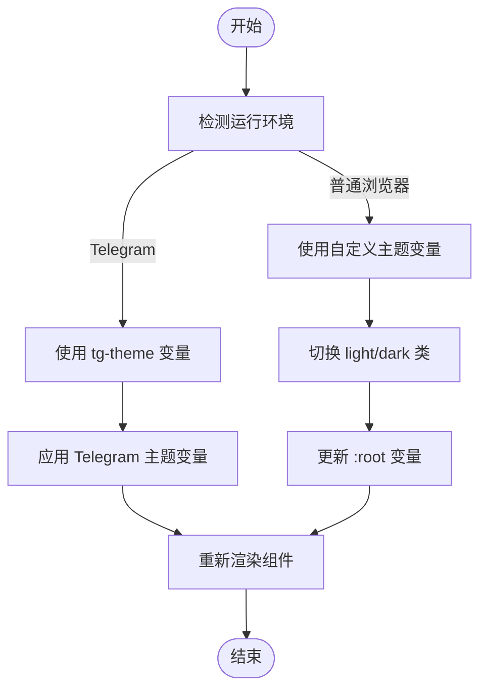

# 样式主题定制

<cite>
**本文档引用的文件**
- [style.css](file://webapp/css/style.css)
- [index.html](file://webapp/index.html)
- [app.js](file://webapp/js/app.js)
- [bot.py](file://bot/bot.py)
</cite>

## 目录
1. [简介](#简介)
2. [项目结构](#项目结构)
3. [核心组件](#核心组件)
4. [架构总览](#架构总览)
5. [详细组件分析](#详细组件分析)
6. [依赖关系分析](#依赖关系分析)
7. [性能考虑](#性能考虑)
8. [故障排除指南](#故障排除指南)
9. [结论](#结论)
10. [附录](#附录)

## 简介
本指南面向需要对 Web 应用进行样式主题定制的开发者与设计师，围绕当前仓库中的样式系统展开，重点说明：
- 如何通过 CSS 变量实现主题色、间距与色彩体系的统一管理
- 如何在现有布局基础上进行颜色方案、字体与布局优化
- 如何实现响应式设计与移动端适配
- 如何进行样式调试与浏览器兼容性处理
- 如何实现主题切换（明暗模式）的思路与最佳实践

本指南同时结合项目中 Telegram Web App 的集成方式，说明如何在第三方运行环境中保持一致的主题表现。

## 项目结构
该项目采用极简前端结构，样式集中在单个 CSS 文件中，HTML 页面负责内容与交互入口，JavaScript 控制路由与动态内容渲染，后端 Python Bot 提供 Telegram 机器人入口。

图表来源
- [index.html:1-145](file://webapp/index.html#L1-L145)
- [style.css:1-80](file://webapp/css/style.css#L1-L80)
- [app.js:1-87](file://webapp/js/app.js#L1-L87)
- [bot.py:1-88](file://bot/bot.py#L1-L88)

章节来源
- [index.html:1-145](file://webapp/index.html#L1-L145)
- [style.css:1-80](file://webapp/css/style.css#L1-L80)
- [app.js:1-87](file://webapp/js/app.js#L1-L87)
- [bot.py:1-88](file://bot/bot.py#L1-L88)

## 核心组件
- 主题变量层：集中于 `:root`，定义主色、辅助色、背景、文本、边框、状态色与导航高度等，便于全局替换与主题切换。
- 布局与容器：页面主体、头部、底部导航、内容区等，均以固定尺寸与相对单位配合 CSS 变量实现统一风格。
- 组件样式：轮播图、分类网格、卡片、标签、按钮等，均通过类名与变量组合实现一致的视觉语言。
- 动态样式：JavaScript 在运行时根据分类或页面动态设置背景渐变与激活态，增强主题一致性。

章节来源
- [style.css:1-80](file://webapp/css/style.css#L1-L80)
- [app.js:51-78](file://webapp/js/app.js#L51-L78)

## 架构总览
下图展示了样式系统的整体关系：HTML 结构承载内容，CSS 变量提供主题基础，JavaScript 控制页面切换与动态样式，Telegram Web App 注入主题变量以适配第三方运行环境。

图表来源
- [index.html:1-145](file://webapp/index.html#L1-L145)
- [style.css:1-80](file://webapp/css/style.css#L1-L80)
- [app.js:51-54](file://webapp/js/app.js#L51-L54)

## 详细组件分析

### 1) CSS 变量与主题系统
- 变量定义：`:root` 中集中定义主色、浅主色、背景、卡片背景、文本、浅文本、边框、危险/成功/信息状态色以及导航与头部高度等。
- 使用方式：通过 `var(--变量名)` 在各组件中引用，确保主题切换时可统一替换。
- Telegram 主题适配：当检测到 Telegram Web App 运行环境时，自动添加 `tg-theme` 类，并将部分变量映射到 Telegram 提供的主题变量，保证在 Telegram 内部的一致性。

建议的变量扩展清单（按需增补）：
- 字体族：如 `--font-primary`、`--font-heading`
- 字号层级：如 `--font-size-xs`、`--font-size-sm`、`--font-size-base`、`--font-size-lg`
- 行高：如 `--line-height-base`、`--line-height-heading`
- 圆角：如 `--radius-sm`、`--radius-base`、`--radius-lg`
- 阴影：如 `--shadow-sm`、`--shadow-base`、`--shadow-lg`
- 间距：如 `--spacing-xs`、`--spacing-sm`、`--spacing-base`、`--spacing-lg`、`--spacing-xl`
- 断点：如 `--breakpoint-mobile`、`--breakpoint-tablet`、`--breakpoint-desktop`

章节来源
- [style.css:1-2](file://webapp/css/style.css#L1-L2)
- [style.css:79-80](file://webapp/css/style.css#L79-L80)
- [app.js](file://webapp/js/app.js#L54)

### 2) 颜色方案调整
- 主色与状态色：主色用于强调元素（按钮、导航激活项），状态色用于不同业务状态（危险、成功、信息）。可通过替换 `--primary`、`--danger`、`--success`、`--info` 实现品牌化或节日主题。
- 文本与背景：通过 `--bg`、`--card-bg`、`--text`、`--text-light` 控制整体明暗对比度与可读性。
- 导航与头部：头部背景使用主色，底部导航文字使用浅色文本；激活态使用主色，未激活使用浅文本，形成清晰的层次感。

示例路径参考：
- [主色与状态色变量定义:1-2](file://webapp/css/style.css#L1-L2)
- [头部与导航使用主色:4-6](file://webapp/css/style.css#L4-L6)
- [导航激活态与文本色:58-61](file://webapp/css/style.css#L58-L61)

章节来源
- [style.css:1-2](file://webapp/css/style.css#L1-L2)
- [style.css:4-6](file://webapp/css/style.css#L4-L6)
- [style.css:58-61](file://webapp/css/style.css#L58-L61)

### 3) 字体配置
- 字体族：默认使用系统字体栈，确保跨平台一致性与性能。
- 字号与行高：通过变量控制字号与行高，便于统一调整阅读体验。
- 建议：新增 `--font-primary`、`--font-heading`、`--font-size-base`、`--line-height-base` 等变量，集中管理排版。

示例路径参考：
- [默认字体栈与字号:2-3](file://webapp/css/style.css#L2-L3)

章节来源
- [style.css:2-3](file://webapp/css/style.css#L2-L3)

### 4) 布局优化
- 容器宽度：页面最大宽度限制在 480px，居中显示，适合移动端优先的设计。
- 头部与导航：头部固定顶部，底部导航固定底部，内容区域通过 `padding-top` 与 `--header-height` 避免遮挡。
- 卡片与网格：卡片圆角、阴影与间距统一，网格布局用于分类展示，提升信息密度与可读性。

示例路径参考：
- [页面容器与最小高度:3-4](file://webapp/css/style.css#L3-L4)
- [头部与导航高度变量:1-2](file://webapp/css/style.css#L1-L2)
- [底部导航与固定定位:58-61](file://webapp/css/style.css#L58-L61)

章节来源
- [style.css:1-2](file://webapp/css/style.css#L1-L2)
- [style.css:3-4](file://webapp/css/style.css#L3-L4)
- [style.css:58-61](file://webapp/css/style.css#L58-L61)

### 5) 具体样式修改示例

#### 按钮样式
- 联系按钮：使用主色背景与白色文字，悬停/按下时透明度变化，体现交互反馈。
- 悬浮按钮：固定在右下角，带阴影与缩放反馈，提升可用性。

示例路径参考：
- [联系按钮样式:39-40](file://webapp/css/style.css#L39-L40)
- [悬浮按钮样式:57-58](file://webapp/css/style.css#L57-L58)

章节来源
- [style.css:39-40](file://webapp/css/style.css#L39-L40)
- [style.css:57-58](file://webapp/css/style.css#L57-L58)

#### 卡片设计
- 通用卡片：圆角、阴影、内边距统一，标题与描述分层清晰。
- 商家卡片：头像背景使用分类渐变，评分与标签增强信息密度。

示例路径参考：
- [通用卡片样式:23-24](file://webapp/css/style.css#L23-L24)
- [商家卡片与头像背景:65-71](file://webapp/css/style.css#L65-L71)

章节来源
- [style.css:23-24](file://webapp/css/style.css#L23-L24)
- [style.css:65-71](file://webapp/css/style.css#L65-L71)

#### 导航栏美化
- 底部导航：图标与文字垂直排列，激活态使用主色，未激活使用浅色文本。
- 头部：固定顶部，标题居中，支持返回按钮与标题切换。

示例路径参考：
- [底部导航与激活态:58-61](file://webapp/css/style.css#L58-L61)
- [头部结构与标题:13-18](file://webapp/css/style.css#L13-L18)

章节来源
- [style.css:58-61](file://webapp/css/style.css#L58-L61)
- [index.html:13-18](file://webapp/index.html#L13-L18)

### 6) 响应式设计与移动端适配
- 视口设置：页面已设置视口，确保在移动设备上正确缩放。
- 固定宽度容器：页面最大宽度 480px，适合移动端优先设计。
- 滚动与触摸：分类标签使用横向滚动与 `-webkit-overflow-scrolling: touch` 提升触控体验。
- 建议：新增媒体查询断点变量（如 `--breakpoint-mobile`），并在关键组件中使用 `clamp()` 或 `min/max` 控制字号与间距，提升多设备一致性。

示例路径参考：
- [视口 meta 标签](file://webapp/index.html#L5)
- [容器最大宽度](file://webapp/css/style.css#L3)
- [分类标签横向滚动:62-63](file://webapp/css/style.css#L62-L63)

章节来源
- [index.html](file://webapp/index.html#L5)
- [style.css](file://webapp/css/style.css#L3)
- [style.css:62-63](file://webapp/css/style.css#L62-L63)

### 7) 主题切换实现思路与最佳实践
- 明/暗主题：通过切换根元素类（如 `light`/`dark`）或替换 `:root` 变量值，实现全站主题切换。
- Telegram 适配：在检测到 Telegram Web App 时，保留 `tg-theme` 类，避免覆盖其注入的主题变量。
- 性能：尽量使用 CSS 变量而非重绘，减少 JavaScript 对 DOM 的直接样式操作。
- 渐进增强：先保证基础样式，再叠加动画与阴影，确保低性能设备也能流畅运行。

示例路径参考：
- [Telegram 主题注入逻辑](file://webapp/js/app.js#L54)
- [Telegram 主题变量映射:79-80](file://webapp/css/style.css#L79-L80)

章节来源
- [app.js](file://webapp/js/app.js#L54)
- [style.css:79-80](file://webapp/css/style.css#L79-L80)

## 依赖关系分析
样式系统与运行环境的耦合关系如下：

图表来源
- [style.css:1-80](file://webapp/css/style.css#L1-L80)
- [app.js:51-54](file://webapp/js/app.js#L51-L54)

章节来源
- [style.css:1-80](file://webapp/css/style.css#L1-L80)
- [app.js:51-54](file://webapp/js/app.js#L51-L54)

## 性能考虑
- 使用 CSS 变量替代硬编码颜色与尺寸，减少重复与维护成本。
- 将动画与阴影限制在必要组件，避免过度绘制导致卡顿。
- 使用相对单位（rem/em/%）与 clamp() 控制字号与间距，提升多设备一致性。
- 在 Telegram 环境中避免强制覆盖其主题变量，减少不必要的重排与重绘。

## 故障排除指南
- 主题变量未生效
  - 检查是否在 `:root` 中定义了对应变量，且组件中使用了 `var(--变量名)`。
  - 确认 Telegram 环境下未被 `tg-theme` 类覆盖。
  - 示例路径参考：[变量定义与使用:1-2](file://webapp/css/style.css#L1-L2)，[Telegram 主题注入](file://webapp/js/app.js#L54)
- 导航或头部遮挡内容
  - 确保内容区使用 `padding-top` 并等于 `--header-height`。
  - 示例路径参考：[头部高度变量与内容区 padding:3-6](file://webapp/css/style.css#L3-L6)
- 按钮点击无反馈
  - 检查 `:active` 或 `:hover` 样式是否被覆盖。
  - 示例路径参考：[按钮交互样式:39-40](file://webapp/css/style.css#L39-L40)
- 分类标签横向滚动异常
  - 确认 `-webkit-overflow-scrolling: touch` 已启用，且容器允许横向滚动。
  - 示例路径参考：[分类标签滚动:62-63](file://webapp/css/style.css#L62-L63)

章节来源
- [style.css:1-2](file://webapp/css/style.css#L1-L2)
- [app.js](file://webapp/js/app.js#L54)
- [style.css:3-6](file://webapp/css/style.css#L3-L6)
- [style.css:39-40](file://webapp/css/style.css#L39-L40)
- [style.css:62-63](file://webapp/css/style.css#L62-L63)

## 结论
本项目以 CSS 变量为核心构建了可扩展的主题系统，配合简洁的 HTML 结构与轻量的 JavaScript 逻辑，实现了良好的移动端体验与第三方运行环境适配。通过合理扩展变量体系、引入响应式断点与渐进增强策略，可在不破坏现有样式的前提下完成品牌化与功能迭代。

## 附录

### A. 常用变量对照表（建议）
- 颜色类：`--primary`、`--primary-light`、`--bg`、`--card-bg`、`--text`、`--text-light`、`--border`、`--danger`、`--success`、`--info`
- 尺寸类：`--nav-height`、`--header-height`
- 字体类：`--font-primary`、`--font-heading`、`--font-size-base`、`--line-height-base`
- 圆角与阴影：`--radius-base`、`--shadow-base`
- 间距类：`--spacing-base`、`--spacing-lg`
- 断点类：`--breakpoint-mobile`、`--breakpoint-tablet`

### B. 主题切换流程示意

图表来源
- [app.js](file://webapp/js/app.js#L54)
- [style.css:79-80](file://webapp/css/style.css#L79-L80)