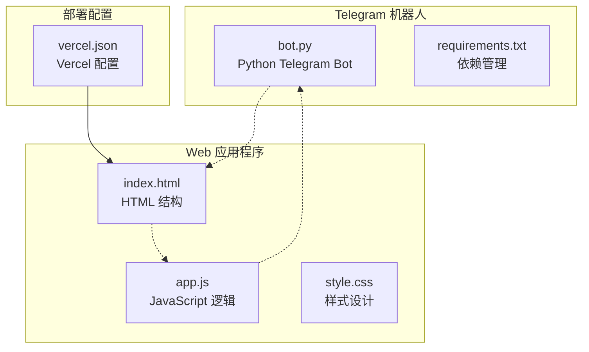
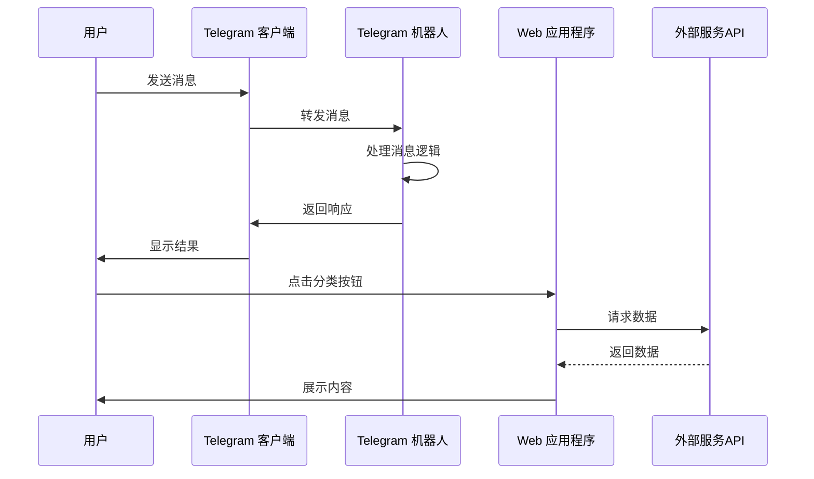
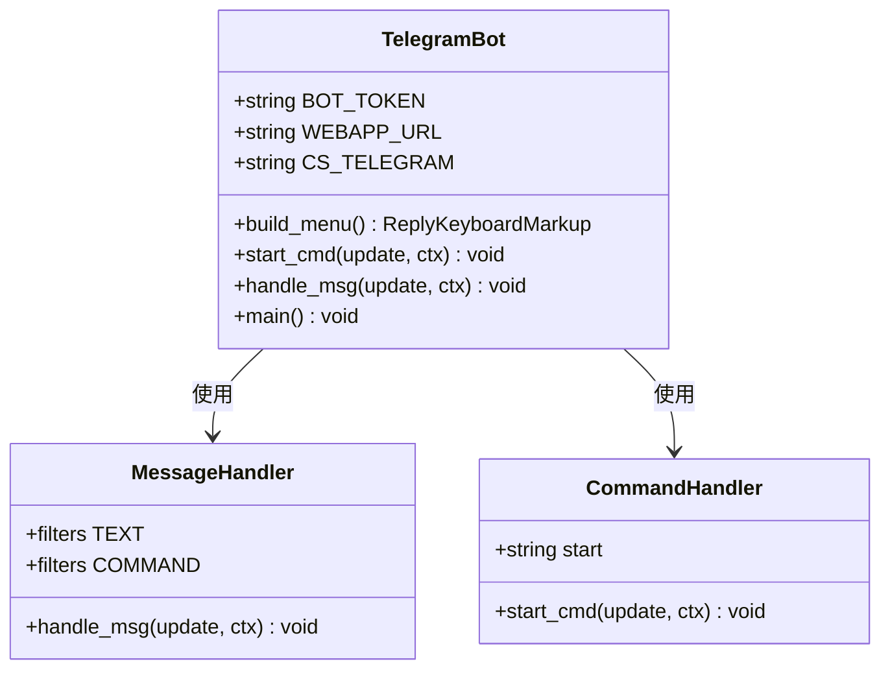
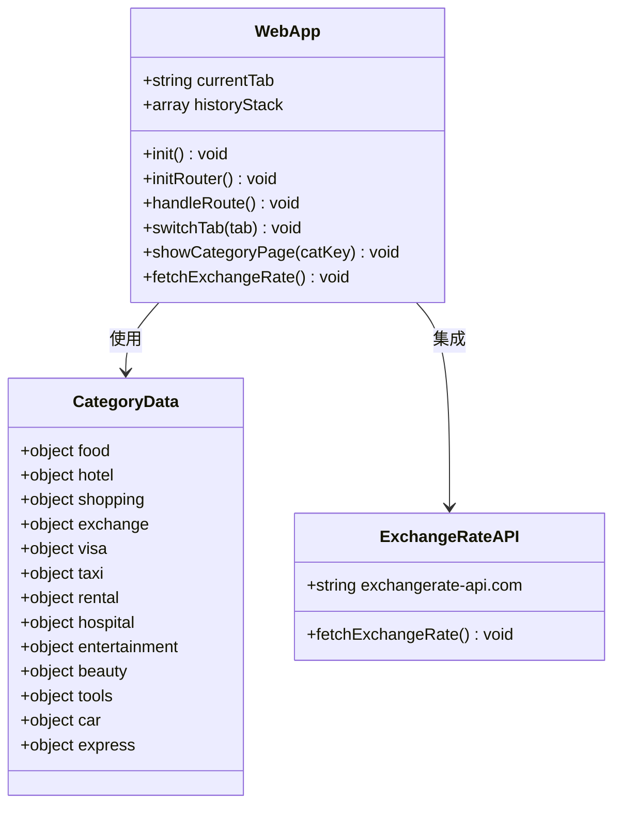
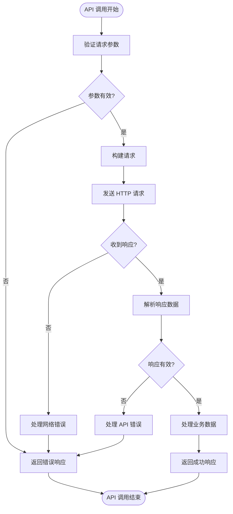
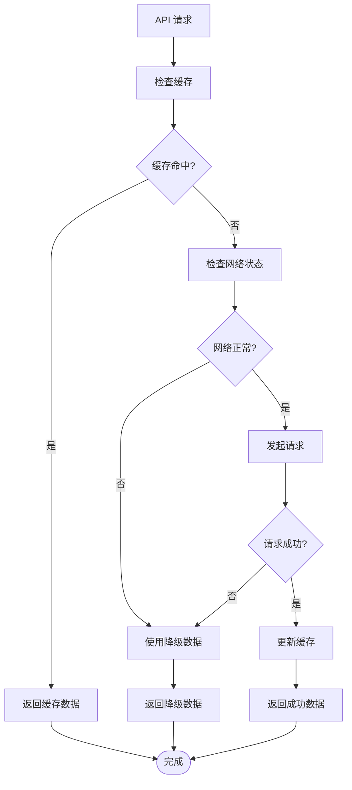

# 第三方服务集成

<cite>
**本文档引用的文件**
- [bot.py](file://bot/bot.py)
- [requirements.txt](file://bot/requirements.txt)
- [index.html](file://webapp/index.html)
- [app.js](file://webapp/js/app.js)
- [style.css](file://webapp/css/style.css)
- [vercel.json](file://vercel.json)
</cite>

## 目录
1. [简介](#简介)
2. [项目结构](#项目结构)
3. [核心组件](#核心组件)
4. [架构概览](#架构概览)
5. [详细组件分析](#详细组件分析)
6. [第三方服务集成指南](#第三方服务集成指南)
7. [安全考虑](#安全考虑)
8. [性能考量](#性能考量)
9. [故障排除指南](#故障排除指南)
10. [结论](#结论)

## 简介

本指南详细说明了如何在现有的 Telegram 机器人和 Web 应用程序中集成第三方服务。当前项目包含一个基于 Python 的 Telegram 机器人和一个基于 HTML/CSS/JavaScript 的 Web 应用程序。本文档提供了集成支付系统（如支付宝、微信支付）、数据分析工具（如 Google Analytics）、推送通知服务等第三方服务的完整实施指南。

## 项目结构

项目采用前后端分离架构，包含以下主要组件：



**图表来源**
- [bot.py:1-88](file://bot/bot.py#L1-L88)
- [index.html:1-145](file://webapp/index.html#L1-L145)
- [app.js:1-87](file://webapp/js/app.js#L1-L87)

**章节来源**
- [bot.py:1-88](file://bot/bot.py#L1-L88)
- [index.html:1-145](file://webapp/index.html#L1-L145)
- [app.js:1-87](file://webapp/js/app.js#L1-L87)
- [vercel.json:1-8](file://vercel.json#L1-L8)

## 核心组件

### Telegram 机器人核心功能

当前 Telegram 机器人实现了基础的消息处理和菜单导航功能：

- **消息处理**：支持文本消息和命令处理
- **键盘按钮**：动态生成分类导航按钮
- **WebApp 集成**：通过 WebAppInfo 集成 Web 应用程序
- **客户服务**：提供在线客服链接

### Web 应用程序核心功能

Web 应用程序提供了完整的用户界面和交互功能：

- **页面路由**：基于 URL hash 的单页应用路由
- **分类导航**：支持 12 种不同类型的本地服务分类
- **实时汇率**：集成汇率查询 API
- **Telegram WebApp 集成**：支持 Telegram 内置 WebApp 功能

**章节来源**
- [bot.py:45-75](file://bot/bot.py#L45-L75)
- [app.js:51-84](file://webapp/js/app.js#L51-L84)

## 架构概览

系统采用客户端-服务器架构，结合 Telegram 生态系统的 WebApp 功能：



**图表来源**
- [bot.py:77-83](file://bot/bot.py#L77-L83)
- [app.js:64-66](file://webapp/js/app.js#L64-L66)

## 详细组件分析

### Telegram 机器人组件分析



**图表来源**
- [bot.py:14-43](file://bot/bot.py#L14-L43)
- [bot.py:45-75](file://bot/bot.py#L45-L75)

### Web 应用程序组件分析



**图表来源**
- [app.js:1-49](file://webapp/js/app.js#L1-L49)
- [app.js:84](file://webapp/js/app.js#L84)

**章节来源**
- [bot.py:1-88](file://bot/bot.py#L1-L88)
- [app.js:1-87](file://webapp/js/app.js#L1-L87)

## 第三方服务集成指南

### 支付系统集成

#### 支付宝集成方案

要在现有系统中集成支付宝支付功能，建议采用以下步骤：

1. **API 配置**
   - 在支付宝开放平台注册开发者账号
   - 创建应用并获取应用 ID
   - 配置私钥和公钥
   - 设置回调地址

2. **后端集成**
   ```python
   # 支付接口示例
   import alipay_sdk
   
   class AlipayService:
       def __init__(self):
           self.client = alipay_sdk.AliPay(
               appid=ALIPAY_APP_ID,
               app_notify_url=ALIPAY_NOTIFY_URL,
               app_private_key_string=PRIVATE_KEY,
               alipay_public_key_string=ALIPAY_PUBLIC_KEY,
               sign_type="RSA2",
               debug=False
           )
       
       def create_order(self, order_data):
           # 创建支付订单
           pass
       
       def verify_payment(self, data):
           # 验证支付结果
           pass
   ```

3. **前端集成**
   - 在 Web 应用中添加支付按钮
   - 调用后端支付接口
   - 处理支付结果回调

#### 微信支付集成方案

1. **配置微信商户号**
   - 注册微信商户平台
   - 获取商户号和 API 密钥
   - 配置支付回调域名

2. **集成流程**
   ```javascript
   // 微信支付调用示例
   function wechatPay(orderId, amount) {
       fetch('/api/wechat/pay', {
           method: 'POST',
           headers: {
               'Content-Type': 'application/json'
           },
           body: JSON.stringify({
               orderId: orderId,
               amount: amount,
               currency: 'CNY'
           })
       })
       .then(response => response.json())
       .then(data => {
           WeixinJSBridge.invoke('getBrandWCPayRequest', data, function(res) {
               if (res.err_msg === "get_brand_wcpay_request:ok") {
                   // 支付成功
               }
           });
       });
   }
   ```

### 数据分析工具集成

#### Google Analytics 4 集成

1. **安装和初始化**
   ```html
   <!-- 在 index.html 中添加 -->
   <script async src="https://www.googletagmanager.com/gtag/js?id=G-XXXXXXXXXX"></script>
   <script>
     window.dataLayer = window.dataLayer || [];
     function gtag(){dataLayer.push(arguments);}
     gtag('js', new Date());
     gtag('config', 'G-XXXXXXXXXX');
   </script>
   ```

2. **事件追踪**
   ```javascript
   // 页面浏览追踪
   function trackPageView(pagePath) {
       gtag('config', 'G-XXXXXXXXXX', {
           page_path: pagePath
       });
   }
   
   // 用户行为追踪
   function trackEvent(action, category, label, value) {
       gtag('event', action, {
           event_category: category,
           event_label: label,
           value: value
       });
   }
   ```

#### Mixpanel 集成

1. **初始化配置**
   ```javascript
   // Mixpanel 初始化
   mixpanel.init('YOUR_PROJECT_TOKEN', {
       debug: false,
       track_pageview: true,
       persistence: 'localStorage'
   });
   ```

2. **用户行为追踪**
   ```javascript
   // 用户注册事件
   mixpanel.track('User Registered', {
       'user_id': userId,
       'registration_date': new Date(),
       'source': 'Telegram Bot'
   });
   
   // 服务使用事件
   mixpanel.track('Service Used', {
       'service_type': serviceType,
       'category': category,
       'timestamp': new Date()
   });
   ```

### 推送通知服务集成

#### Firebase Cloud Messaging (FCM)

1. **前端集成**
   ```javascript
   // FCM 初始化
   const firebaseConfig = {
       apiKey: "YOUR_API_KEY",
       authDomain: "YOUR_PROJECT.firebaseapp.com",
       projectId: "YOUR_PROJECT_ID",
       storageBucket: "YOUR_PROJECT.appspot.com",
       messagingSenderId: "YOUR_SENDER_ID",
       appId: "YOUR_APP_ID"
   };
   
   firebase.initializeApp(firebaseConfig);
   const messaging = firebase.messaging();
   
   // 请求通知权限
   Notification.requestPermission().then(permission => {
       if (permission === 'granted') {
           console.log('Notification permission granted');
           getToken();
       }
   });
   
   // 获取令牌
   function getToken() {
       messaging.getToken().then(currentToken => {
           if (currentToken) {
               // 发送到后端保存
               saveTokenToServer(currentToken);
           }
       });
   }
   ```

2. **后端集成**
   ```python
   import firebase_admin
   from firebase_admin import credentials, messaging
   
   class PushNotificationService:
       def __init__(self):
           cred = credentials.Certificate('path/to/serviceAccountKey.json')
           firebase_admin.initialize_app(cred)
       
       def send_notification(self, device_token, title, body, data=None):
           message = messaging.Message(
               notification=messaging.Notification(
                   title=title,
                   body=body
               ),
               token=device_token,
               data=data or {}
           )
           
           response = messaging.send(message)
           return response
   ```

### API 调用实现方法

#### 请求参数和响应处理



**图表来源**
- [app.js:84](file://webapp/js/app.js#L84)

#### 错误处理机制

```python
# 统一错误处理示例
class APIService:
    def __init__(self):
        self.session = requests.Session()
        self.session.timeout = 30
    
    def make_request(self, url, method='GET', params=None, data=None):
        try:
            response = self.session.request(
                method=method,
                url=url,
                params=params,
                json=data,
                timeout=30
            )
            
            # 检查 HTTP 状态码
            response.raise_for_status()
            
            # 检查响应格式
            if not response.headers.get('content-type', '').startswith('application/json'):
                raise ValueError('Invalid response format')
            
            return response.json()
            
        except requests.exceptions.Timeout:
            raise APIError('Request timeout')
        except requests.exceptions.ConnectionError:
            raise APIError('Connection failed')
        except requests.exceptions.HTTPError as e:
            raise APIError(f'HTTP error {e.response.status_code}')
        except ValueError as e:
            raise APIError(f'JSON parse error: {str(e)}')
        except Exception as e:
            raise APIError(f'Unknown error: {str(e)}')

class APIError(Exception):
    def __init__(self, message):
        self.message = message
        super().__init__(self.message)
```

**章节来源**
- [app.js:84](file://webapp/js/app.js#L84)

## 安全考虑

### 密钥管理

1. **环境变量配置**
   ```python
   # 使用环境变量存储敏感信息
   import os
   
   # Telegram 机器人配置
   BOT_TOKEN = os.environ.get('BOT_TOKEN')
   WEBAPP_URL = os.environ.get('WEBAPP_URL')
   
   # 支付服务配置
   ALIPAY_APP_ID = os.environ.get('ALIPAY_APP_ID')
   ALIPAY_PRIVATE_KEY = os.environ.get('ALIPAY_PRIVATE_KEY')
   WECHAT_MCH_ID = os.environ.get('WECHAT_MCH_ID')
   WECHAT_API_KEY = os.environ.get('WECHAT_API_KEY')
   
   # 数据分析配置
   GOOGLE_ANALYTICS_ID = os.environ.get('GOOGLE_ANALYTICS_ID')
   MIXPANEL_TOKEN = os.environ.get('MIXPANEL_TOKEN')
   ```

2. **密钥轮换策略**
   - 定期更换 API 密钥
   - 使用短期有效的临时密钥
   - 实施密钥撤销机制

### 数据加密

1. **传输层安全**
   - 使用 HTTPS 协议
   - 实施 TLS 1.2+ 加密
   - 验证 SSL 证书

2. **数据存储加密**
   ```python
   from cryptography.fernet import Fernet
   
   class SecureStorage:
       def __init__(self, key=None):
           if key is None:
               self.key = Fernet.generate_key()
           else:
               self.key = key
           self.cipher = Fernet(self.key)
       
       def encrypt_data(self, data):
           return self.cipher.encrypt(data.encode())
       
       def decrypt_data(self, encrypted_data):
           return self.cipher.decrypt(encrypted_data).decode()
   ```

### 访问控制

1. **API 访问控制**
   ```python
   from functools import wraps
   import jwt
   
   def require_api_key(f):
       @wraps(f)
       def decorated_function(*args, **kwargs):
           api_key = request.headers.get('X-API-Key')
           if not api_key or api_key != VALID_API_KEY:
               return jsonify({'error': 'Unauthorized'}), 401
           return f(*args, **kwargs)
       return decorated_function
   
   def require_auth_token(f):
       @wraps(f)
       def decorated_function(*args, **kwargs):
           token = request.headers.get('Authorization')
           if not token or not token.startswith('Bearer '):
               return jsonify({'error': 'Missing token'}), 401
           
           try:
               payload = jwt.decode(token[7:], SECRET_KEY, algorithms=['HS256'])
               request.user_id = payload['user_id']
           except jwt.ExpiredSignatureError:
               return jsonify({'error': 'Token expired'}), 401
           except jwt.InvalidTokenError:
               return jsonify({'error': 'Invalid token'}), 401
           
           return f(*args, **kwargs)
       return decorated_function
   ```

## 性能考量

### 前端性能优化

1. **资源加载优化**
   - 使用 CDN 加速静态资源
   - 实现图片懒加载
   - 压缩和合并 CSS/JS 文件

2. **缓存策略**
   ```javascript
   // Service Worker 缓存
   if ('serviceWorker' in navigator) {
       navigator.serviceWorker.register('/sw.js').then(registration => {
           console.log('SW registered');
       }).catch(error => {
           console.log('SW registration failed');
       });
   }
   
   // 缓存策略
   const CACHE_NAME = 'app-cache-v1';
   const urlsToCache = [
       '/',
       '/index.html',
       '/css/style.css',
       '/js/app.js'
   ];
   ```

### 后端性能优化

1. **异步处理**
   ```python
   import asyncio
   import aiohttp
   
   class AsyncAPIService:
       def __init__(self):
           self.session = aiohttp.ClientSession()
       
       async def fetch_data(self, url):
           async with self.session.get(url) as response:
               return await response.json()
       
       async def batch_fetch(self, urls):
           tasks = [self.fetch_data(url) for url in urls]
           return await asyncio.gather(*tasks)
   ```

2. **连接池管理**
   ```python
   import requests
   from requests.adapters import HTTPAdapter
   from urllib3.util.retry import Retry
   
   def create_session():
       session = requests.Session()
       retry_strategy = Retry(
           total=3,
           backoff_factor=1,
           status_forcelist=[429, 500, 503],
       )
       adapter = HTTPAdapter(
           pool_connections=10,
           pool_maxsize=20,
           max_retries=retry_strategy
       )
       session.mount("http://", adapter)
       session.mount("https://", adapter)
       return session
   ```

## 故障排除指南

### 常见问题诊断

1. **API 调用失败**
   ```python
   import logging
   
   logging.basicConfig(level=logging.INFO)
   logger = logging.getLogger(__name__)
   
   def debug_api_call(url, params, response):
       logger.info(f"API Call: {url}")
       logger.info(f"Parameters: {params}")
       logger.info(f"Status Code: {response.status_code}")
       logger.info(f"Response: {response.text[:200]}...")
       
       if response.status_code >= 400:
           logger.error(f"API Error: {response.status_code}")
           logger.error(f"Error Details: {response.json()}")
   ```

2. **网络连接问题**
   ```python
   import socket
   import time
   
   def check_network_connectivity(host="8.8.8.8", port=53, timeout=3):
       try:
           socket.setdefaulttimeout(timeout)
           socket.socket(socket.AF_INET, socket.SOCK_STREAM).connect((host, port))
           return True
       except Exception as ex:
           return False
   
   def retry_with_backoff(func, max_retries=5, base_delay=1):
       for i in range(max_retries):
           try:
               return func()
           except Exception as e:
               if i == max_retries - 1:
                   raise e
               delay = base_delay * (2 ** i) + random.uniform(0, 1)
               time.sleep(delay)
   ```

### 降级策略



**图表来源**
- [app.js:84](file://webapp/js/app.js#L84)

### 监控和日志记录最佳实践

1. **结构化日志**
   ```python
   import json
   from datetime import datetime
   
   class StructuredLogger:
       def __init__(self, name):
           self.name = name
       
       def log_event(self, event_type, data=None, level='INFO'):
           log_entry = {
               'timestamp': datetime.utcnow().isoformat(),
               'service': self.name,
               'event_type': event_type,
               'level': level,
               'data': data or {}
           }
           print(json.dumps(log_entry))
   
   logger = StructuredLogger('third-party-integration')
   logger.log_event('payment_initiated', {
       'order_id': 'ORD-123',
       'amount': 100.00,
       'currency': 'CNY'
   })
   ```

2. **性能监控**
   ```javascript
   // 性能指标收集
   function collectPerformanceMetrics() {
       if (performance && performance.timing) {
           const timing = performance.timing;
           const metrics = {
               navigationStart: timing.navigationStart,
               loadEventEnd: timing.loadEventEnd,
               domContentLoadedEventEnd: timing.domContentLoadedEventEnd,
               firstPaint: getFirstPaintTime(),
               firstContentfulPaint: getFCP()
           };
           
           // 发送到监控服务
           sendMetricsToMonitoring(metrics);
       }
   }
   
   function getFirstPaintTime() {
       const perfData = performance.getEntriesByType("paint");
       const firstPaintEntry = perfData.find(entry => entry.name === "first-paint");
       return firstPaintEntry ? firstPaintEntry.startTime : 0;
   }
   ```

**章节来源**
- [bot.py:6](file://bot/bot.py#L6)
- [app.js:84](file://webapp/js/app.js#L84)

## 结论

本指南提供了在现有 Telegram 机器人和 Web 应用程序中集成第三方服务的完整实施方案。通过采用模块化的架构设计、严格的错误处理机制、完善的安全措施和性能优化策略，可以确保第三方服务的稳定集成和可靠运行。

关键要点包括：
- 采用分层架构设计，明确各组件职责
- 实施统一的错误处理和重试机制
- 重视数据安全和隐私保护
- 建立完善的监控和日志体系
- 制定详细的故障排除和降级策略

通过遵循这些指导原则，可以成功集成支付系统、数据分析工具和推送通知服务，为用户提供更加丰富和便捷的服务体验。