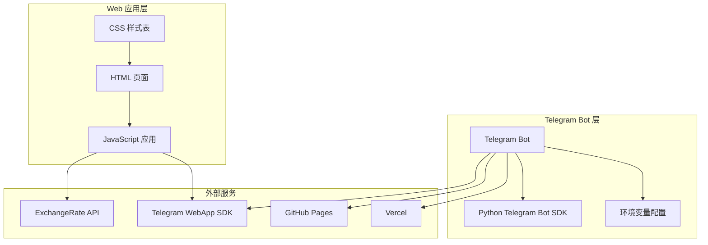

# 故障排除与常见问题

<cite>
**本文档引用的文件**
- [bot.py](file://bot/bot.py)
- [requirements.txt](file://bot/requirements.txt)
- [index.html](file://webapp/index.html)
- [app.js](file://webapp/js/app.js)
- [style.css](file://webapp/css/style.css)
- [vercel.json](file://vercel.json)
- [deploy.yml](file://.github/workflows/deploy.yml)
</cite>

## 目录
1. [简介](#简介)
2. [项目架构概览](#项目架构概览)
3. [Bot 启动问题排查](#bot-启动问题排查)
4. [消息响应问题排查](#消息响应问题排查)
5. [WebApp 加载问题排查](#webapp-加载问题排查)
6. [按钮点击问题排查](#按钮点击问题排查)
7. [Web 应用问题排查](#web-应用问题排查)
8. [部署问题排查](#部署问题排查)
9. [调试工具使用指南](#调试工具使用指南)
10. [性能问题诊断](#性能问题诊断)
11. [预防性维护建议](#预防性维护建议)
12. [应急处理方案](#应急处理方案)
13. [结论](#结论)

## 简介

本指南旨在帮助开发者和运维人员快速识别和解决木姐同城生活助手 Telegram Bot 及其配套 Web 应用在开发、测试和生产环境中可能遇到的各种问题。该系统由 Python Telegram Bot 和前端 Web 应用组成，通过 Telegram WebApp 协议实现跨平台的消息交互功能。

## 项目架构概览

系统采用分层架构设计，包含以下核心组件：



**图表来源**
- [bot.py:1-88](file://bot/bot.py#L1-L88)
- [index.html:1-145](file://webapp/index.html#L1-L145)
- [app.js:1-87](file://webapp/js/app.js#L1-L87)

**章节来源**
- [bot.py:1-88](file://bot/bot.py#L1-L88)
- [index.html:1-145](file://webapp/index.html#L1-L145)
- [app.js:1-87](file://webapp/js/app.js#L1-L87)

## Bot 启动问题排查

### 常见启动问题及解决方案

#### 1. Bot Token 配置错误

**问题症状：**
- 启动时报错显示 token 无效
- 日志中出现认证失败信息

**排查步骤：**
1. 检查环境变量是否正确设置
2. 验证 Bot Token 的格式和有效性
3. 确认 Token 来自正确的 BotFather 创建的机器人

**解决方案：**
```bash
# 设置环境变量
export BOT_TOKEN="your_bot_token_here"
# 或在 Windows 中
set BOT_TOKEN=your_bot_token_here
```

#### 2. 依赖包安装问题

**问题症状：**
- 启动时报 ImportError
- 模块找不到错误

**排查步骤：**
1. 检查 requirements.txt 文件完整性
2. 验证 Python 版本兼容性
3. 确认网络连接正常

**解决方案：**
```bash
pip install -r bot/requirements.txt
```

#### 3. 端口占用问题

**问题症状：**
- 启动时提示端口被占用
- 连接超时错误

**排查步骤：**
1. 检查是否有其他进程占用端口
2. 修改默认端口配置
3. 使用 netstat 命令检查端口状态

**章节来源**
- [bot.py:77-88](file://bot/bot.py#L77-L88)
- [requirements.txt:1-3](file://bot/requirements.txt#L1-L3)

## 消息响应问题排查

### 文本消息处理问题

#### 1. 客服按钮响应异常

**问题症状：**
- 点击客服按钮无响应
- 弹出链接失败

**排查步骤：**
1. 检查 CS_TELEGRAM 变量配置
2. 验证 Telegram 链接格式
3. 测试链接在浏览器中的可用性

**解决方案：**
```python
# 更新客服链接
CS_TELEGRAM = "https://t.me/your_username"
```

#### 2. 菜单按钮点击无响应

**问题症状：**
- 菜单按钮点击无效
- WebApp URL 加载失败

**排查步骤：**
1. 检查 WEBAPP_URL 环境变量
2. 验证 WebApp URL 格式
3. 确认 WebApp 已正确部署

**解决方案：**
```python
# 设置正确的 WebApp URL
WEBAPP_URL = "https://your-domain.com/webapp"
```

**章节来源**
- [bot.py:61-75](file://bot/bot.py#L61-L75)
- [bot.py:14-42](file://bot/bot.py#L14-L42)

## WebApp 加载问题排查

### 页面加载异常

#### 1. 页面空白问题

**问题症状：**
- WebApp 页面完全空白
- 控制台出现 JavaScript 错误

**排查步骤：**
1. 检查 Telegram WebApp SDK 加载
2. 验证 DOM 元素是否存在
3. 检查 JavaScript 错误日志

**解决方案：**
```javascript
// 确保 Telegram WebApp 初始化
function initTelegramWebApp(){
    if(window.Telegram && window.Telegram.WebApp) {
        var tg = window.Telegram.WebApp;
        tg.ready();
        tg.expand();
        // 添加错误处理
        try {
            tg.initDataUnsafe.user;
        } catch(e) {
            console.error("Telegram WebApp 初始化失败:", e);
        }
    }
}
```

#### 2. 路由跳转异常

**问题症状：**
- 点击导航按钮页面不跳转
- URL 变化但内容不变

**排查步骤：**
1. 检查 hashchange 事件监听器
2. 验证路由处理函数
3. 确认页面元素存在

**解决方案：**
```javascript
function handleRoute() {
    var hash = window.location.hash.replace("#","") || "";
    var parts = hash.split("/").filter(Boolean);
    
    // 添加调试信息
    console.log("当前路由:", hash);
    console.log("路由部分:", parts);
    
    if(parts.length === 0) {
        switchTab("home");
    } else if(parts[0] === "category" && parts[1]) {
        showCategoryPage(parts[1]);
    } else if(parts[0] === "search") {
        showPage("search");
    } else {
        switchTab(parts[0]);
    }
}
```

**章节来源**
- [index.html:1-145](file://webapp/index.html#L1-L145)
- [app.js:51-87](file://webapp/js/app.js#L51-L87)

## 按钮点击问题排查

### 用户交互问题

#### 1. 导航按钮无响应

**问题症状：**
- 底部导航按钮点击无效
- 页面切换功能失效

**排查步骤：**
1. 检查 switchTab 函数实现
2. 验证页面元素 ID
3. 确认事件绑定是否成功

**解决方案：**
```javascript
function switchTab(tab) {
    // 添加参数验证
    if(!tab || !['home', 'errand', 'expose', 'activity', 'profile'].includes(tab)) {
        console.warn("无效的标签:", tab);
        return;
    }
    
    currentTab = tab;
    historyStack = [];
    window.location.hash = "#";
    
    // 添加元素存在性检查
    var pages = document.querySelectorAll(".page");
    if(pages.length === 0) {
        console.error("页面元素不存在");
        return;
    }
    
    // 其余逻辑保持不变...
}
```

#### 2. 商家联系按钮失效

**问题症状：**
- 点击联系商家按钮无反应
- 弹窗或新标签页未打开

**排查步骤：**
1. 检查 contactService 函数
2. 验证外部链接配置
3. 测试 window.open 功能

**解决方案：**
```javascript
function contactService(name) {
    // 添加参数验证和错误处理
    if(!name) {
        console.warn("缺少商家名称");
        return;
    }
    
    if(!CS) {
        console.error("客服链接未配置");
        return;
    }
    
    try {
        var success = window.open(CS, "_blank");
        if(!success) {
            console.warn("弹窗被阻止，尝试直接跳转");
            window.location.href = CS;
        }
    } catch(e) {
        console.error("打开链接失败:", e);
    }
}
```

**章节来源**
- [app.js:72-85](file://webapp/js/app.js#L72-L85)
- [app.js:80-81](file://webapp/js/app.js#L80-L81)

## Web 应用问题排查

### 页面显示问题

#### 1. 样式错乱问题

**问题症状：**
- 页面布局异常
- 字体显示问题
- 主题颜色不正确

**排查步骤：**
1. 检查 CSS 变量定义
2. 验证 Telegram 主题变量
3. 确认媒体查询响应式设计

**解决方案：**
```css
/* 添加主题变量回退值 */
body.tg-theme {
    --primary: var(--tg-theme-button-color, #ff6b35);
    --bg: var(--tg-theme-bg-color, #f5f5f5);
    --text: var(--tg-theme-text-color, #333);
    --text-light: var(--tg-theme-hint-color, #999);
}

/* 添加字体回退机制 */
body {
    font-family: -apple-system, BlinkMacSystemFont, "Segoe UI", 
                "PingFang SC", "Hiragino Sans GB", 
                "Microsoft YaHei", sans-serif;
}
```

#### 2. 数据加载失败

**问题症状：**
- 汇率数据不显示
- 商家信息加载失败
- 页面内容为空白

**排查步骤：**
1. 检查 API 请求状态
2. 验证 JSON 数据格式
3. 确认网络连接正常

**解决方案：**
```javascript
function fetchExchangeRate() {
    const cnyEl = document.getElementById("rateCnyMmk");
    const usdEl = document.getElementById("rateUsdMmk");
    
    // 添加请求超时和重试机制
    const timeoutPromise = new Promise((_, reject) => 
        setTimeout(() => reject(new Error('请求超时')), 10000)
    );
    
    const apiPromises = [
        Promise.race([
            fetch("https://api.exchangerate-api.com/v4/latest/CNY"),
            timeoutPromise
        ]),
        Promise.race([
            fetch("https://api.exchangerate-api.com/v4/latest/USD"),
            timeoutPromise
        ])
    ];
    
    Promise.all(apiPromises)
        .then(responses => Promise.all(responses.map(r => r.json())))
        .then(dataArray => {
            dataArray.forEach((data, index) => {
                const element = index === 0 ? cnyEl : usdEl;
                const rate = data.rates && data.rates.MMK;
                
                if(rate && element) {
                    element.textContent = "1 : " + Math.round(rate);
                } else if(element) {
                    element.textContent = "1 : 加载失败";
                }
            });
        })
        .catch(error => {
            console.error("获取汇率失败:", error);
            // 提供默认值
            if(cnyEl) cnyEl.textContent = "1 : 约580";
            if(usdEl) usdEl.textContent = "1 : 约4200";
        });
}
```

**章节来源**
- [style.css:1-80](file://webapp/css/style.css#L1-L80)
- [app.js:84](file://webapp/js/app.js#L84)

## 部署问题排查

### GitHub Pages 部署问题

#### 1. 部署流程失败

**问题症状：**
- GitHub Actions 工作流执行失败
- 页面无法访问
- 部署状态显示错误

**排查步骤：**
1. 检查工作流权限配置
2. 验证输出目录设置
3. 确认分支保护规则

**解决方案：**
```yaml
# 检查 GitHub Pages 配置
name: Deploy to GitHub Pages
on:
  push:
    branches: [ main ]
  workflow_dispatch:

jobs:
  deploy:
    runs-on: ubuntu-latest
    steps:
      - name: Checkout
        uses: actions/checkout@v4
        
      - name: Setup Pages
        uses: actions/configure-pages@v4
        
      - name: Upload artifact
        uses: actions/upload-pages-artifact@v3
        with:
          path: 'webapp'  # 确保路径正确
          
      - name: Deploy to GitHub Pages
        uses: actions/deploy-pages@v4
```

#### 2. Vercel 构建错误

**问题症状：**
- Vercel 构建失败
- 输出目录配置错误
- 重写规则导致路由问题

**排查步骤：**
1. 检查 vercel.json 配置
2. 验证构建命令设置
3. 确认静态资源路径

**解决方案：**
```json
{
  "buildCommand": null,
  "outputDirectory": "webapp",
  "rewrites": [
    {
      "source": "/(.*)", 
      "destination": "/$1" 
    }
  ]
}
```

#### 3. 环境变量配置问题

**问题症状：**
- Bot 无法启动
- WebApp URL 404
- API 调用失败

**排查步骤：**
1. 检查环境变量设置
2. 验证变量名一致性
3. 确认变量作用域

**解决方案：**
```python
# 在 bot.py 中添加环境变量验证
import os

BOT_TOKEN = os.environ.get("BOT_TOKEN")
if not BOT_TOKEN:
    raise ValueError("请设置 BOT_TOKEN 环境变量")

WEBAPP_URL = os.environ.get("WEBAPP_URL")
if not WEBAPP_URL:
    raise ValueError("请设置 WEBAPP_URL 环境变量")
```

**章节来源**
- [deploy.yml:1-31](file://.github/workflows/deploy.yml#L1-L31)
- [vercel.json:1-8](file://vercel.json#L1-L8)
- [bot.py:9-11](file://bot/bot.py#L9-L11)

## 调试工具使用指南

### 浏览器开发者工具

#### 1. 控制台调试

**操作步骤：**
1. 按 F12 打开开发者工具
2. 切换到 Console 标签
3. 查看 JavaScript 错误和警告
4. 使用 console.log() 输出调试信息

**常用调试命令：**
```javascript
// 检查路由状态
console.log("当前路由:", window.location.hash);
console.log("路由处理函数:", typeof handleRoute);

// 检查元素状态
console.log("页面元素:", document.querySelectorAll('.page'));
console.log("导航元素:", document.querySelectorAll('.nav-item'));

// 检查数据状态
console.log("分类数据:", C);
console.log("当前标签:", currentTab);
```

#### 2. 网络请求监控

**操作步骤：**
1. 切换到 Network 标签
2. 刷新页面观察请求
3. 检查 API 响应状态
4. 分析请求头和响应体

**重点关注的请求：**
- ExchangeRate API 请求
- Telegram WebApp SDK 加载
- 静态资源加载

#### 3. 元素检查

**操作步骤：**
1. 使用 Elements 标签检查 DOM 结构
2. 验证 CSS 类名和样式
3. 检查事件监听器绑定
4. 分析响应式布局

### Telegram Bot 测试方法

#### 1. 本地测试

**操作步骤：**
1. 设置环境变量
2. 运行本地 Bot
3. 在 Telegram 中测试命令
4. 验证按钮功能

**测试命令：**
```
/start - 启动 Bot
点击菜单按钮 - 测试 WebApp 加载
点击客服按钮 - 测试外部链接
```

#### 2. 日志分析

**操作步骤：**
1. 检查控制台输出
2. 分析日志级别
3. 识别错误模式
4. 记录问题重现步骤

**日志示例：**
```
INFO: 木姐同城生活助手 Bot 启动中...
INFO: Bot 已启动，等待消息...
ERROR: WebApp URL 加载失败
WARNING: API 请求超时
```

**章节来源**
- [bot.py:6-7](file://bot/bot.py#L6-L7)
- [bot.py:77-88](file://bot/bot.py#L77-L88)

## 性能问题诊断

### 加载性能问题

#### 1. 页面加载缓慢

**诊断步骤：**
1. 使用 Performance 标签分析加载时间
2. 检查资源加载顺序
3. 分析第三方脚本影响
4. 优化图片和静态资源

**优化建议：**
```javascript
// 实现懒加载机制
function lazyLoadImages() {
    const images = document.querySelectorAll('img[data-src]');
    const imageObserver = new IntersectionObserver((entries, observer) => {
        entries.forEach(entry => {
            if (entry.isIntersecting) {
                const img = entry.target;
                img.src = img.dataset.src;
                img.classList.remove('lazy');
                observer.unobserve(img);
            }
        });
    });
    
    images.forEach(img => imageObserver.observe(img));
}
```

#### 2. 内存泄漏检测

**诊断方法：**
1. 使用 Memory 标签监控内存使用
2. 检查事件监听器是否正确移除
3. 分析闭包和全局变量
4. 监控定时器和回调函数

**预防措施：**
```javascript
// 正确清理定时器
function cleanupCarousel() {
    if (carouselInterval) {
        clearInterval(carouselInterval);
        carouselInterval = null;
    }
}

// 清理事件监听器
function removeEventListeners() {
    const navItems = document.querySelectorAll('.nav-item');
    navItems.forEach(item => {
        item.removeEventListener('click', handleClick);
    });
}
```

#### 3. API 调用超时

**诊断步骤：**
1. 检查网络请求超时设置
2. 分析 API 响应时间
3. 实现重试机制
4. 添加缓存策略

**解决方案：**
```javascript
// 实现带重试的 API 调用
async function fetchWithRetry(url, options = {}, retries = 3) {
    for (let i = 0; i < retries; i++) {
        try {
            const response = await fetch(url, options);
            if (!response.ok) {
                throw new Error(`HTTP error! status: ${response.status}`);
            }
            return await response.json();
        } catch (error) {
            console.warn(`请求失败 (尝试 ${i + 1}/${retries}):`, error);
            if (i === retries - 1) throw error;
            await new Promise(resolve => setTimeout(resolve, 1000 * (i + 1)));
        }
    }
}
```

**章节来源**
- [app.js:62](file://webapp/js/app.js#L62)
- [app.js:84](file://webapp/js/app.js#L84)

## 预防性维护建议

### 代码质量保证

#### 1. 错误处理机制

**建议实现：**
```javascript
// 全局错误处理
window.addEventListener('error', function(event) {
    console.error('全局错误:', event.error);
    // 发送错误报告到监控系统
});

// Promise 错误处理
window.addEventListener('unhandledrejection', function(event) {
    console.error('未处理的 Promise 拒绝:', event.reason);
    event.preventDefault();
});
```

#### 2. 性能监控

**建议实现：**
```javascript
// 页面性能监控
function monitorPerformance() {
    if ('performance' in window) {
        const perfData = performance.timing;
        const loadTime = perfData.loadEventEnd - perfData.navigationStart;
        console.log('页面加载时间:', loadTime, 'ms');
        
        // 监控关键渲染指标
        if ('getEntriesByType' in performance) {
            const paintMetrics = performance.getEntriesByType('paint');
            paintMetrics.forEach(metric => {
                console.log(`${metric.name}: ${metric.startTime} ms`);
            });
        }
    }
}
```

#### 3. 安全防护

**建议实现：**
```javascript
// 输入验证和清理
function sanitizeInput(input) {
    const div = document.createElement('div');
    div.textContent = input;
    return div.innerHTML;
}

// CSRF 防护
function addCSRFToken() {
    const token = localStorage.getItem('csrf_token');
    if (token) {
        return { 'X-CSRF-Token': token };
    }
    return {};
}
```

### 部署最佳实践

#### 1. 环境分离

**建议配置：**
- 开发环境：localhost:8000
- 测试环境：test.example.com
- 生产环境：prod.example.com

#### 2. 备份策略

**建议实现：**
```bash
#!/bin/bash
# 自动备份脚本
BACKUP_DIR="/backups"
DATE=$(date +%Y%m%d_%H%M%S)

# 备份数据库
pg_dump your_db > "${BACKUP_DIR}/db_${DATE}.sql"

# 备份静态文件
tar -czf "${BACKUP_DIR}/static_${DATE}.tar.gz" webapp/

# 清理7天前的备份
find ${BACKUP_DIR} -name "*.sql" -mtime +7 -delete
find ${BACKUP_DIR} -name "*.tar.gz" -mtime +7 -delete
```

## 应急处理方案

### 紧急故障响应

#### 1. Bot 服务中断

**应急步骤：**
1. 立即检查服务器状态
2. 验证网络连接
3. 重启 Bot 进程
4. 检查环境变量
5. 发布临时维护通知

**恢复流程：**
```bash
# 检查进程状态
ps aux | grep python

# 重启服务
sudo systemctl restart telegram-bot

# 检查日志
tail -f /var/log/telegram-bot.log
```

#### 2. WebApp 无法访问

**应急步骤：**
1. 检查 CDN 状态
2. 验证域名解析
3. 检查防火墙规则
4. 临时回滚到上一个版本
5. 发布降级方案

**快速修复：**
```javascript
// 降级到本地资源
function loadFallbackResources() {
    const scripts = document.querySelectorAll('script[src]');
    scripts.forEach(script => {
        if (script.src.includes('cdn')) {
            script.src = script.src.replace('cdn', 'local');
        }
    });
}
```

#### 3. 数据库连接失败

**应急步骤：**
1. 检查数据库服务状态
2. 验证连接字符串
3. 重启数据库服务
4. 检查连接池配置
5. 实施读写分离

**临时解决方案：**
```python
# 实现连接重试机制
import time
from functools import wraps

def retry_on_failure(max_retries=3, delay=1):
    def decorator(func):
        @wraps(func)
        def wrapper(*args, **kwargs):
            for attempt in range(max_retries):
                try:
                    return func(*args, **kwargs)
                except Exception as e:
                    if attempt == max_retries - 1:
                        raise e
                    print(f"连接失败，{delay}秒后重试... (尝试 {attempt + 1})")
                    time.sleep(delay)
            return None
        return wrapper
    return decorator
```

### 沟通协调机制

#### 1. 用户通知

**建议实现：**
```python
# 发送维护通知
async def notify_users():
    # 获取所有用户列表
    users = get_all_users()
    
    for user_id in users:
        try:
            await bot.send_message(
                chat_id=user_id,
                text="系统正在维护中，预计需要 30 分钟。请稍后再试。",
                parse_mode="Markdown"
            )
        except Exception as e:
            print(f"通知发送失败 {user_id}: {e}")
```

#### 2. 团队协作

**建议流程：**
1. 建立紧急联系群组
2. 制定故障升级流程
3. 准备备用联系方式
4. 定期进行应急演练

**章节来源**
- [bot.py:77-88](file://bot/bot.py#L77-L88)
- [app.js:86](file://webapp/js/app.js#L86)

## 结论

本故障排除指南涵盖了木姐同城生活助手项目从 Bot 启动到 Web 应用部署的完整问题排查流程。通过系统性的诊断方法、详细的解决方案和预防性维护建议，可以有效提升系统的稳定性和用户体验。

关键要点：
- 建立完善的日志记录和监控体系
- 实施多层次的错误处理和重试机制
- 定期进行性能优化和安全检查
- 制定详细的应急响应预案
- 建立团队协作和沟通机制

建议定期回顾和更新此文档，以适应系统演进和新的技术挑战。