# 服务分类系统

<cite>
**本文档引用的文件**
- [index.html](file://webapp/index.html)
- [app.js](file://webapp/js/app.js)
- [style.css](file://webapp/css/style.css)
- [bot.py](file://bot/bot.py)
- [requirements.txt](file://bot/requirements.txt)
- [vercel.json](file://vercel.json)
</cite>

## 目录
1. [简介](#简介)
2. [项目结构](#项目结构)
3. [核心组件](#核心组件)
4. [架构概览](#架构概览)
5. [详细组件分析](#详细组件分析)
6. [依赖分析](#依赖分析)
7. [性能考虑](#性能考虑)
8. [故障排除指南](#故障排除指南)
9. [结论](#结论)
10. [附录](#附录)

## 简介

服务分类系统是一个基于 Telegram WebApp 的本地生活服务平台，为用户提供木姐地区的各类服务信息。系统采用前后端分离架构，前端使用纯 HTML、CSS 和 JavaScript 构建响应式 Web 应用，后端通过 Python Telegram Bot 提供菜单导航和 WebApp 集成。

该系统的核心功能包括：
- 多类别服务分类展示（美食、酒店、购物、换汇等）
- 动态菜单生成机制
- 商家信息管理
- 实时汇率查询
- 用户交互和导航

## 项目结构

项目采用模块化组织结构，主要分为以下部分：

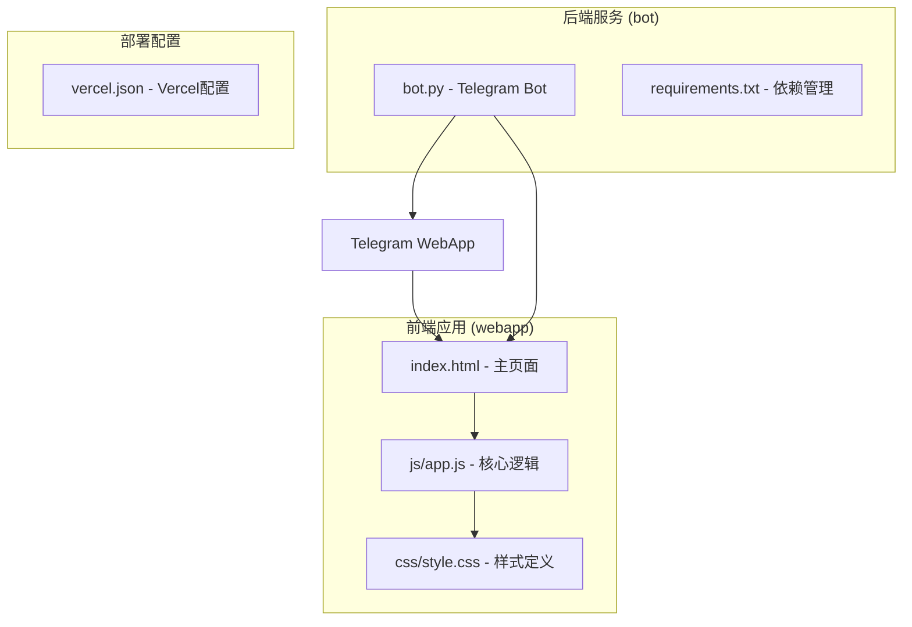

**图表来源**
- [index.html:1-145](file://webapp/index.html#L1-L145)
- [app.js:1-87](file://webapp/js/app.js#L1-L87)
- [bot.py:1-88](file://bot/bot.py#L1-L88)

**章节来源**
- [index.html:1-145](file://webapp/index.html#L1-L145)
- [app.js:1-87](file://webapp/js/app.js#L1-L87)
- [style.css:1-80](file://webapp/css/style.css#L1-L80)
- [bot.py:1-88](file://bot/bot.py#L1-L88)
- [vercel.json:1-8](file://vercel.json#L1-L8)

## 核心组件

### 数据结构设计

系统采用统一的数据结构来管理所有服务分类信息：

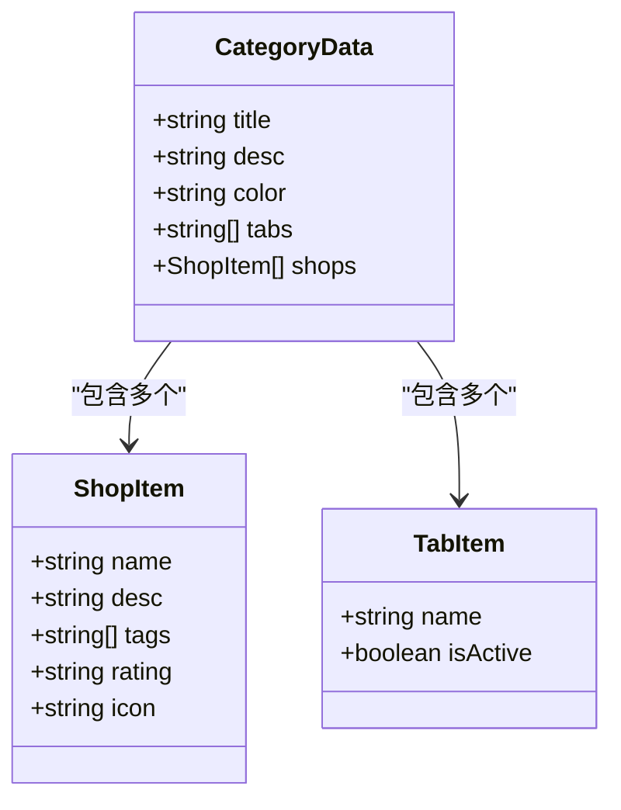

**图表来源**
- [app.js:1-49](file://webapp/js/app.js#L1-L49)

每个分类包含以下关键属性：
- **分类标识符**: 唯一的服务类型代码（如 food、hotel、shopping）
- **标题配置**: 显示在页面顶部的分类标题和描述
- **颜色编码**: 渐变背景色，用于视觉识别
- **标签系统**: 二级分类标签，支持多级筛选
- **商家数据**: 具体的服务提供商信息

**章节来源**
- [app.js:1-49](file://webapp/js/app.js#L1-L49)

### 导航系统

系统采用基于 URL Hash 的单页应用导航机制：

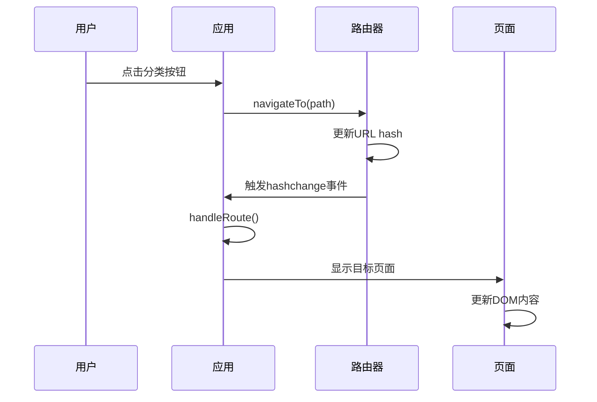

**图表来源**
- [app.js:64-76](file://webapp/js/app.js#L64-L76)
- [app.js:68-70](file://webapp/js/app.js#L68-L70)

**章节来源**
- [app.js:64-76](file://webapp/js/app.js#L64-L76)
- [app.js:68-70](file://webapp/js/app.js#L68-L70)

## 架构概览

系统采用客户端路由和服务器端集成的混合架构：

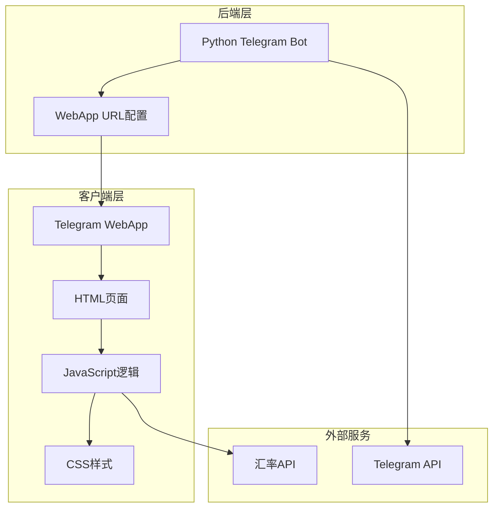

**图表来源**
- [bot.py:9-11](file://bot/bot.py#L9-L11)
- [app.js:84](file://webapp/js/app.js#L84)

系统特点：
- **响应式设计**: 支持移动端和桌面端访问
- **离线缓存**: 静态资源可缓存，提升加载速度
- **实时数据**: 汇率等数据通过 API 实时更新
- **无缝集成**: 与 Telegram WebApp 完美集成

**章节来源**
- [bot.py:9-11](file://bot/bot.py#L9-L11)
- [app.js:84](file://webapp/js/app.js#L84)

## 详细组件分析

### 分类页面渲染流程

分类页面的渲染采用渐进增强的方式，从数据获取到 DOM 更新的完整过程如下：

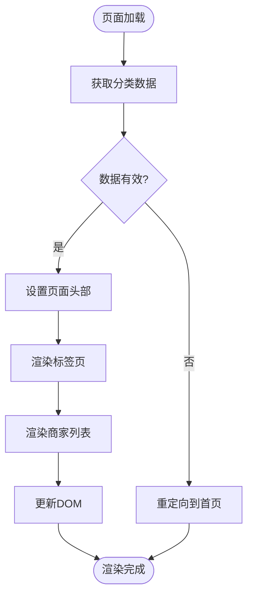

**图表来源**
- [app.js:76](file://webapp/js/app.js#L76)
- [app.js:78](file://webapp/js/app.js#L78)

渲染流程的关键步骤：
1. **数据验证**: 检查分类键是否存在
2. **头部设置**: 更新页面标题和背景色
3. **标签渲染**: 创建可切换的分类标签
4. **商家渲染**: 生成每个商家的卡片组件
5. **交互绑定**: 绑定点击事件和样式

**章节来源**
- [app.js:76](file://webapp/js/app.js#L76)
- [app.js:78](file://webapp/js/app.js#L78)

### 商家信息管理系统

商家信息采用标准化的数据模型：

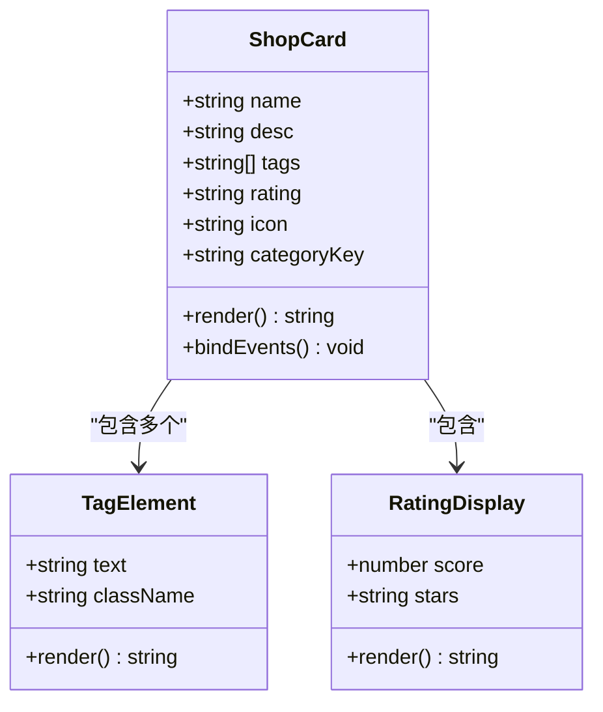

**图表来源**
- [app.js:78](file://webapp/js/app.js#L78)

商家信息的展示特性：
- **评分系统**: 星级评分显示
- **标签系统**: 多维度分类标签
- **图标标识**: 服务类型的视觉标识
- **交互设计**: 点击联系商家功能

**章节来源**
- [app.js:78](file://webapp/js/app.js#L78)

### 动态菜单生成机制

Telegram Bot 通过动态构建键盘菜单来集成 WebApp：

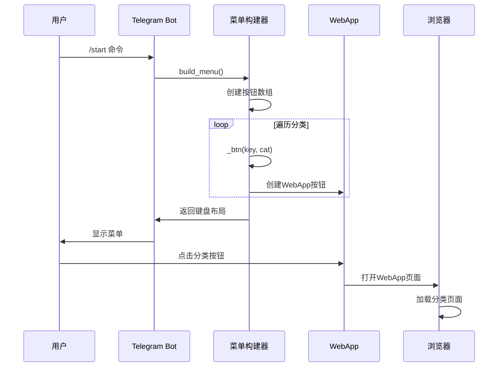

**图表来源**
- [bot.py:18-42](file://bot/bot.py#L18-L42)
- [bot.py:14-15](file://bot/bot.py#L14-L15)

菜单生成的关键特性：
- **动态构建**: 根据分类数量动态调整布局
- **WebApp集成**: 每个按钮直接链接到对应的分类页面
- **响应式布局**: 自适应不同屏幕尺寸
- **国际化支持**: 使用 Unicode 符号和中文文本

**章节来源**
- [bot.py:18-42](file://bot/bot.py#L18-L42)
- [bot.py:14-15](file://bot/bot.py#L14-L15)

### 样式系统和主题设计

系统采用 CSS 变量和渐变色方案来实现统一的主题设计：

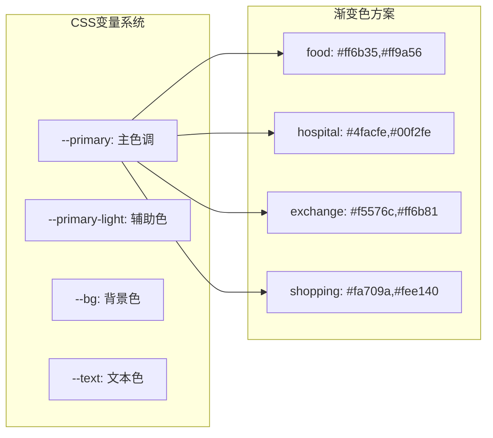

**图表来源**
- [style.css:1-80](file://webapp/css/style.css#L1-L80)
- [app.js:1-49](file://webapp/js/app.js#L1-L49)

样式系统的特点：
- **主题一致性**: 所有页面共享统一的颜色方案
- **响应式设计**: 支持不同设备的适配
- **动画效果**: 平滑的过渡和交互反馈
- **可访问性**: 良好的对比度和可读性

**章节来源**
- [style.css:1-80](file://webapp/css/style.css#L1-L80)

## 依赖分析

### 外部依赖关系

系统的主要依赖关系如下：

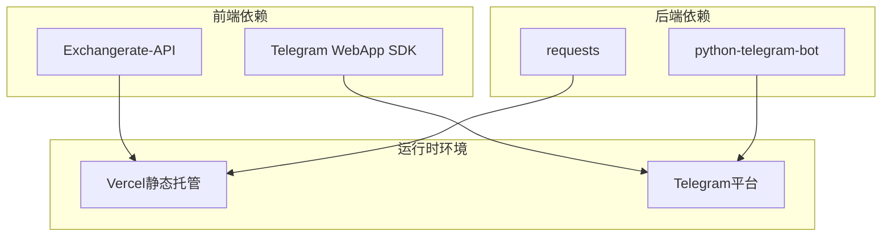

**图表来源**
- [requirements.txt:1-3](file://bot/requirements.txt#L1-L3)
- [app.js:84](file://webapp/js/app.js#L84)

### 内部模块依赖

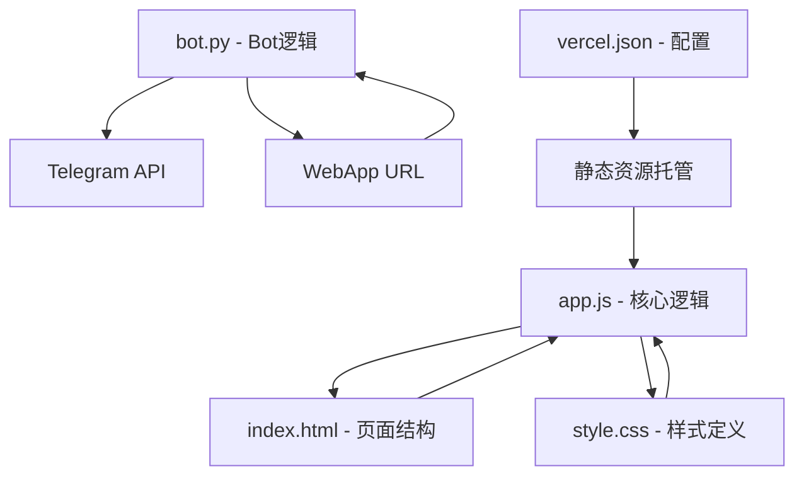

**图表来源**
- [app.js:1-87](file://webapp/js/app.js#L1-L87)
- [bot.py:1-88](file://bot/bot.py#L1-L88)
- [vercel.json:1-8](file://vercel.json#L1-L8)

**章节来源**
- [requirements.txt:1-3](file://bot/requirements.txt#L1-L3)
- [vercel.json:1-8](file://vercel.json#L1-L8)

## 性能考虑

### 加载性能优化

系统采用多种策略来优化加载性能：

1. **静态资源优化**
   - CSS 和 JavaScript 文件压缩
   - 图片资源使用渐变背景减少体积
   - CDN 加速静态资源访问

2. **内存管理**
   - 轮播图自动清理定时器
   - 历史栈长度限制
   - DOM 元素复用策略

3. **网络请求优化**
   - 汇率数据缓存机制
   - 异步加载避免阻塞
   - 错误处理降级方案

### 运行时性能

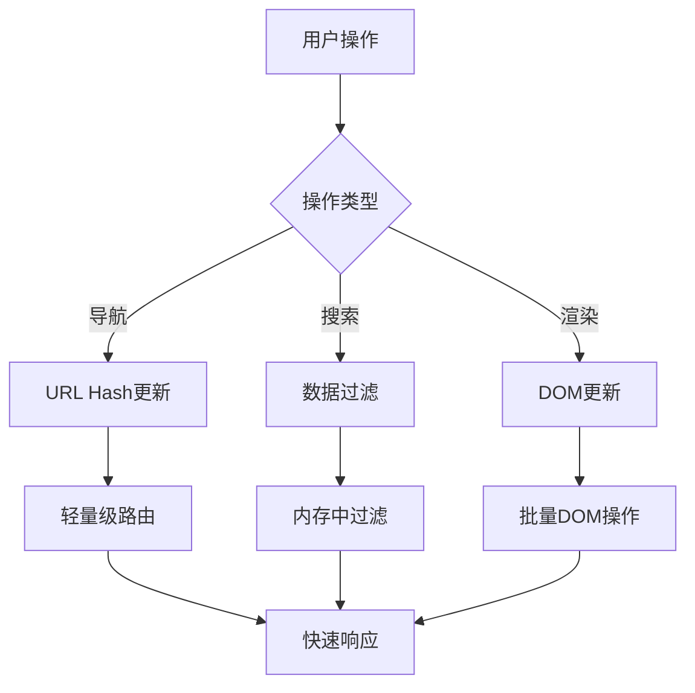

**图表来源**
- [app.js:64-76](file://webapp/js/app.js#L64-L76)
- [app.js:82](file://webapp/js/app.js#L82)

## 故障排除指南

### 常见问题及解决方案

#### 1. 分类页面无法显示

**症状**: 点击分类按钮后页面空白或显示错误

**可能原因**:
- 分类键不存在于数据结构中
- URL Hash 路由解析失败
- DOM 元素未正确初始化

**解决方法**:
- 检查分类键是否在数据结构中定义
- 验证路由处理函数的逻辑
- 确认 DOM 元素的选择器正确性

#### 2. 商家信息不显示

**症状**: 分类页面显示为空白或只有标题

**可能原因**:
- 商家数据格式不正确
- 渲染函数调用失败
- 样式冲突导致元素隐藏

**解决方法**:
- 验证商家数据的 JSON 结构
- 检查渲染函数的参数传递
- 使用浏览器开发者工具检查样式

#### 3. Telegram 集成问题

**症状**: Bot 按钮无法正常工作或无法打开 WebApp

**可能原因**:
- WebApp URL 配置错误
- Bot Token 配置问题
- 网络连接异常

**解决方法**:
- 验证 WEBAPP_URL 环境变量设置
- 检查 Bot Token 的有效性
- 确认网络连接和域名解析

**章节来源**
- [app.js:64-76](file://webapp/js/app.js#L64-L76)
- [app.js:78](file://webapp/js/app.js#L78)
- [bot.py:9-11](file://bot/bot.py#L9-L11)

## 结论

服务分类系统是一个功能完整、架构清晰的本地生活服务平台。系统的主要优势包括：

1. **模块化设计**: 前后端分离，职责明确
2. **响应式架构**: 支持多设备访问
3. **用户体验**: 流畅的交互和视觉反馈
4. **可扩展性**: 易于添加新的服务分类

系统在性能、可维护性和用户体验方面都达到了较高水平，为类似的生活服务平台提供了良好的参考模板。

## 附录

### 扩展新服务分类指南

#### 1. 添加新的分类数据

在数据结构中添加新的分类定义：

```javascript
// 在 C 对象中添加新的分类
newCategory:{title:"新分类标题",desc:"分类描述",color:"linear-gradient(135deg,#color1,#color2)",tabs:["全部","子分类1","子分类2"],shops:[/* 商家数据 */]}
```

#### 2. 更新 Telegram 菜单

在 Bot 中添加新的菜单按钮：

```python
# 在 build_menu 函数中添加新按钮
_btn("\U00000000 新分类", "new_category_key"),
```

#### 3. 自定义样式

根据需要调整 CSS 变量或新增样式规则：

```css
/* 在 :root 中添加新的颜色变量 */
--new-category-primary: #your-color;

/* 为新分类添加特定样式 */
.page[data-category="new_category"] .category-banner {
    background: linear-gradient(135deg, var(--new-category-primary), var(--new-category-secondary));
}
```

#### 4. 配置部署

更新部署配置以确保新功能正常工作：

```json
{
  "buildCommand": null,
  "outputDirectory": "webapp",
  "rewrites": [
    { "source": "/(.*)", "destination": "/$1" }
  ]
}
```

### 最佳实践建议

1. **数据一致性**: 确保所有分类的数据格式保持一致
2. **性能监控**: 定期检查页面加载时间和内存使用情况
3. **用户体验**: 保持界面响应速度和交互流畅性
4. **错误处理**: 完善的错误处理和降级方案
5. **测试覆盖**: 为关键功能编写单元测试和集成测试