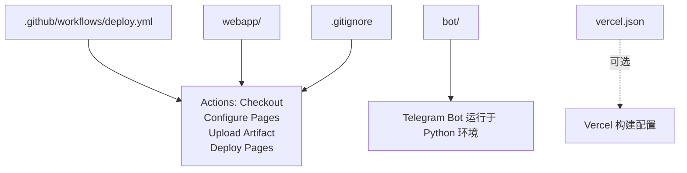
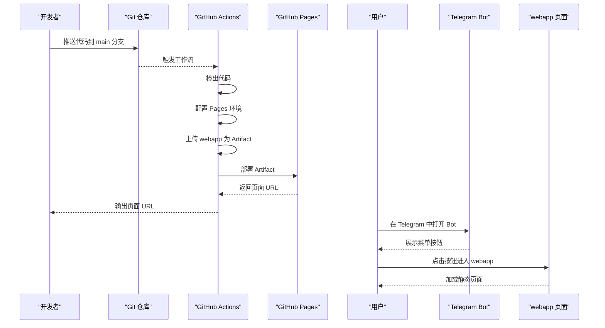
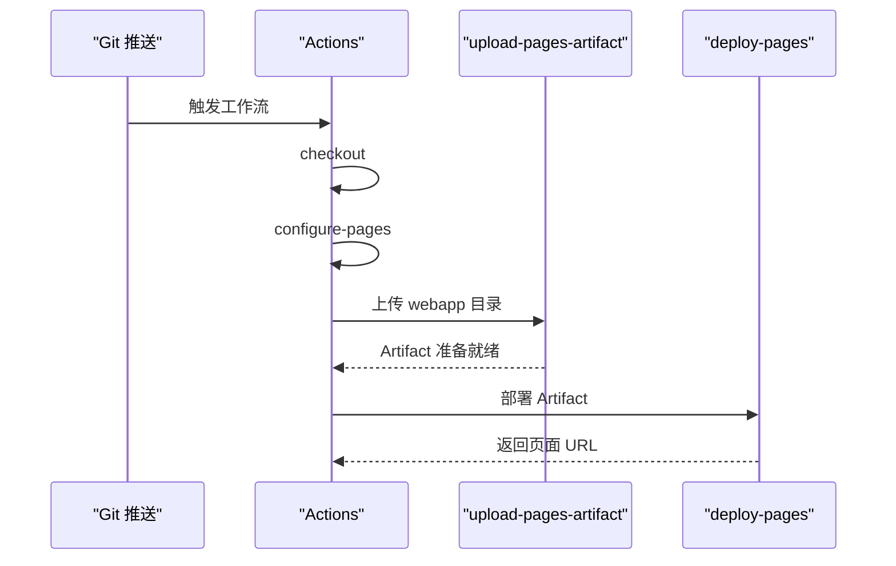
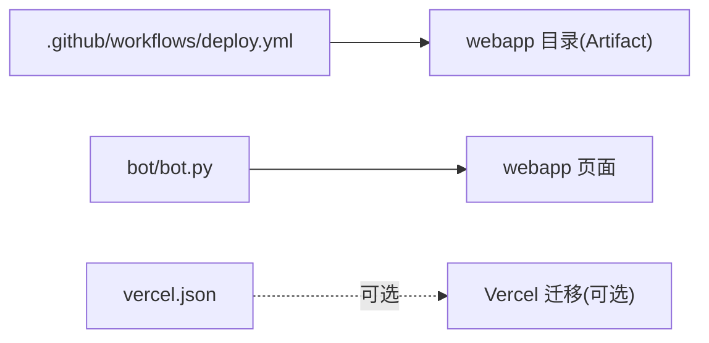

# GitHub Pages 部署

<cite>
**本文引用的文件**
- [.github/workflows/deploy.yml](file://.github/workflows/deploy.yml)
- [vercel.json](file://vercel.json)
- [webapp/index.html](file://webapp/index.html)
- [webapp/css/style.css](file://webapp/css/style.css)
- [webapp/js/app.js](file://webapp/js/app.js)
- [bot/bot.py](file://bot/bot.py)
- [bot/requirements.txt](file://bot/requirements.txt)
- [.gitignore](file://.gitignore)
</cite>

## 目录
1. [简介](#简介)
2. [项目结构](#项目结构)
3. [核心组件](#核心组件)
4. [架构总览](#架构总览)
5. [详细组件分析](#详细组件分析)
6. [依赖关系分析](#依赖关系分析)
7. [性能考虑](#性能考虑)
8. [故障排查指南](#故障排查指南)
9. [结论](#结论)
10. [附录](#附录)

## 简介
本项目是一个基于 Telegram WebApp 的静态网站（webapp），通过 GitHub Actions 自动化部署到 GitHub Pages。工作流在代码推送至主分支或手动触发时，执行以下流程：
- 检出代码
- 配置 GitHub Pages 环境
- 将 webapp 目录作为静态资源上传为 Pages Artifact
- 部署到 GitHub Pages 并输出访问链接

此外，项目还包含一个 Telegram Bot，用于引导用户访问该 WebApp。本部署文档将围绕 GitHub Actions 工作流配置、CI/CD 流程、Artifact 上传、环境变量管理、域名绑定与 SSL、部署验证、常见问题排查以及本地测试与预览进行系统性说明。

## 项目结构
仓库采用按功能分层的组织方式：
- .github/workflows：存放 GitHub Actions 工作流定义
- webapp：静态前端资源（HTML、CSS、JS）
- bot：Telegram Bot 源码及依赖
- vercel.json：可选的 Vercel 构建配置（当前仓库未使用 Vercel）
- .gitignore：忽略文件与目录



图表来源
- [.github/workflows/deploy.yml:1-31](file://.github/workflows/deploy.yml#L1-L31)
- [webapp/index.html:1-145](file://webapp/index.html#L1-L145)
- [bot/bot.py:1-88](file://bot/bot.py#L1-L88)
- [vercel.json:1-8](file://vercel.json#L1-L8)

章节来源
- [.github/workflows/deploy.yml:1-31](file://.github/workflows/deploy.yml#L1-L31)
- [webapp/index.html:1-145](file://webapp/index.html#L1-L145)
- [bot/bot.py:1-88](file://bot/bot.py#L1-L88)
- [vercel.json:1-8](file://vercel.json#L1-L8)
- [.gitignore:1-9](file://.gitignore#L1-L9)

## 核心组件
- GitHub Actions 工作流：定义触发条件、权限、并发策略与部署步骤
- webapp 静态站点：包含 HTML、CSS、JS，作为 Pages Artifact 上传
- Telegram Bot：通过按钮跳转至 GitHub Pages 上的 webapp
- vercel.json：当前仓库未启用 Vercel，但保留了配置以备迁移

章节来源
- [.github/workflows/deploy.yml:1-31](file://.github/workflows/deploy.yml#L1-L31)
- [webapp/index.html:1-145](file://webapp/index.html#L1-L145)
- [webapp/css/style.css:1-80](file://webapp/css/style.css#L1-L80)
- [webapp/js/app.js:1-87](file://webapp/js/app.js#L1-L87)
- [bot/bot.py:1-88](file://bot/bot.py#L1-L88)
- [vercel.json:1-8](file://vercel.json#L1-L8)

## 架构总览
下图展示了从代码提交到页面上线的端到端流程，以及与 Telegram Bot 的交互关系。



图表来源
- [.github/workflows/deploy.yml:1-31](file://.github/workflows/deploy.yml#L1-L31)
- [bot/bot.py:18-42](file://bot/bot.py#L18-L42)
- [webapp/index.html:1-145](file://webapp/index.html#L1-L145)

## 详细组件分析

### GitHub Actions 工作流配置
- 触发条件
  - push 到 main 分支
  - workflow_dispatch 手动触发
- 权限设置
  - contents: read（读取仓库内容）
  - pages: write（写入 Pages）
  - id-token: write（用于身份令牌）
- 并发控制
  - group: "pages"
  - cancel-in-progress: false（不取消进行中的部署）
- Job 步骤
  - actions/checkout@v4：检出代码
  - actions/configure-pages@v4：配置 Pages 环境
  - actions/upload-pages-artifact@v3：上传 webapp 目录为 Artifact
  - actions/deploy-pages@v4：部署到 GitHub Pages

```mermaid
flowchart TD
Start(["工作流启动"]) --> Trigger{"触发类型"}
Trigger --> |push(main)| Build["检出代码"]
Trigger --> |workflow_dispatch| Build
Build --> Configure["配置 Pages 环境"]
Configure --> Upload["上传 webapp 为 Artifact"]
Upload --> Deploy["部署到 GitHub Pages"]
Deploy --> Output["输出页面 URL"]
Output --> End(["完成"])
```

图表来源
- [.github/workflows/deploy.yml:1-31](file://.github/workflows/deploy.yml#L1-L31)

章节来源
- [.github/workflows/deploy.yml:1-31](file://.github/workflows/deploy.yml#L1-L31)

### CI/CD 流程详解
- 代码提交触发：当向 main 分支推送时，自动运行工作流
- 自动构建：无需编译，直接使用 webapp 目录
- 静态文件上传：将 webapp 目录作为 Artifact 上传
- 页面部署：使用 GitHub Pages 服务托管静态资源



图表来源
- [.github/workflows/deploy.yml:19-31](file://.github/workflows/deploy.yml#L19-L31)

章节来源
- [.github/workflows/deploy.yml:1-31](file://.github/workflows/deploy.yml#L1-L31)

### Artifact 上传配置
- 上传路径：webapp
- 作用：将静态资源打包为 Pages Artifact，供后续部署使用

章节来源
- [.github/workflows/deploy.yml:24-28](file://.github/workflows/deploy.yml#L24-L28)

### 环境变量管理
- Telegram Bot 使用环境变量 BOT_TOKEN 和 WEBAPP_URL
- 建议在 GitHub 仓库 Secrets 中配置 BOT_TOKEN
- WEBAPP_URL 默认值指向 GitHub Pages 上的 webapp 路径，可在 Bot 配置中调整

章节来源
- [bot/bot.py:9-11](file://bot/bot.py#L9-L11)
- [bot/requirements.txt:1-3](file://bot/requirements.txt#L1-L3)

### GitHub Pages 域名绑定与 SSL
- 绑定自定义域名：在仓库 Settings -> Pages 中配置自定义域名
- SSL 证书：GitHub Pages 提供免费 SSL 证书，无需额外配置
- 注意：若使用自定义域名，确保 DNS 记录正确指向 GitHub Pages

章节来源
- [.github/workflows/deploy.yml:15-17](file://.github/workflows/deploy.yml#L15-L17)

### Telegram Bot 与 WebApp 集成
- Bot 菜单按钮通过 WebAppInfo 指向 webapp 的 URL
- 当用户点击按钮时，直接打开 GitHub Pages 上的 webapp
- 若需要本地调试，可将 WEBAPP_URL 指向本地地址或临时域名

章节来源
- [bot/bot.py:18-42](file://bot/bot.py#L18-L42)
- [bot/bot.py:9-11](file://bot/bot.py#L9-L11)

### 静态资源结构与加载
- webapp/index.html：入口页面，包含样式与脚本引用
- webapp/css/style.css：样式文件
- webapp/js/app.js：前端逻辑与路由、轮播、汇率等

章节来源
- [webapp/index.html:1-145](file://webapp/index.html#L1-L145)
- [webapp/css/style.css:1-80](file://webapp/css/style.css#L1-L80)
- [webapp/js/app.js:1-87](file://webapp/js/app.js#L1-L87)

## 依赖关系分析
- 工作流对 webapp 的依赖：webapp 目录是 Artifact 的唯一来源
- Bot 对 Pages 的依赖：通过按钮链接到 webapp
- vercel.json：当前仓库未启用 Vercel，但保留配置以便未来迁移



图表来源
- [.github/workflows/deploy.yml:24-28](file://.github/workflows/deploy.yml#L24-L28)
- [bot/bot.py:18-42](file://bot/bot.py#L18-L42)
- [vercel.json:1-8](file://vercel.json#L1-L8)

章节来源
- [.github/workflows/deploy.yml:1-31](file://.github/workflows/deploy.yml#L1-L31)
- [bot/bot.py:1-88](file://bot/bot.py#L1-L88)
- [vercel.json:1-8](file://vercel.json#L1-L8)

## 性能考虑
- 静态资源优化：压缩 CSS/JS、合并文件、启用缓存头
- CDN 加速：GitHub Pages 本身具备全球分发能力，结合浏览器缓存可提升访问速度
- 资源懒加载：图片与非首屏内容可延迟加载
- 减少重定向：保持路径简洁，避免不必要的重写规则
- 前端性能：合理使用虚拟滚动、防抖与节流，减少 DOM 操作

## 故障排查指南
- 工作流失败
  - 检查触发条件是否匹配（main 分支推送或手动触发）
  - 查看权限设置是否包含 pages: write 与 id-token: write
  - 确认 Artifact 路径是否为 webapp
- Pages 无法访问
  - 检查 Pages 设置中的源分支与目录
  - 确认自定义域名 DNS 解析正常
  - 查看 Pages 日志定位错误
- Bot 无法打开 WebApp
  - 检查 WEBAPP_URL 是否正确指向 Pages 地址
  - 确认 Bot 的按钮链接格式无误
- 本地开发与预览
  - 使用本地服务器预览 webapp（如 http-server、Live Server）
  - 将 WEBAPP_URL 指向本地地址进行调试
  - 使用浏览器开发者工具检查网络请求与控制台错误

章节来源
- [.github/workflows/deploy.yml:1-31](file://.github/workflows/deploy.yml#L1-L31)
- [bot/bot.py:9-11](file://bot/bot.py#L9-L11)
- [.gitignore:1-9](file://.gitignore#L1-L9)

## 结论
本项目通过 GitHub Actions 实现了从代码提交到 GitHub Pages 的自动化部署，配合 Telegram Bot 提供了良好的用户体验。工作流配置简洁明确，Artifact 上传与 Pages 部署流程清晰。建议在生产环境中：
- 使用自定义域名并启用 HTTPS
- 优化静态资源与前端性能
- 在 GitHub Secrets 中妥善管理敏感配置
- 定期审查工作流日志与 Pages 访问情况

## 附录

### 部署配置清单
- 工作流文件：.github/workflows/deploy.yml
- Artifact 上传路径：webapp
- Pages 环境权限：contents: read、pages: write、id-token: write
- 触发条件：push(main)、workflow_dispatch
- 环境变量：BOT_TOKEN（在仓库 Secrets 中配置）、WEBAPP_URL（默认指向 Pages）

章节来源
- [.github/workflows/deploy.yml:1-31](file://.github/workflows/deploy.yml#L1-L31)
- [bot/bot.py:9-11](file://bot/bot.py#L9-L11)

### 本地测试与预览流程
- 安装依赖（Bot）
  - 使用 requirements.txt 安装 python-telegram-bot 与 requests
- 本地预览 webapp
  - 使用任意静态服务器启动 webapp 目录
  - 在浏览器中打开页面，确认功能正常
- 调试 Bot
  - 在本地运行 bot/bot.py，使用本地 WEBAPP_URL 进行测试
  - 通过 Telegram 机器人测试账号验证按钮跳转

章节来源
- [bot/requirements.txt:1-3](file://bot/requirements.txt#L1-L3)
- [bot/bot.py:77-88](file://bot/bot.py#L77-L88)
- [.gitignore:1-9](file://.gitignore#L1-L9)