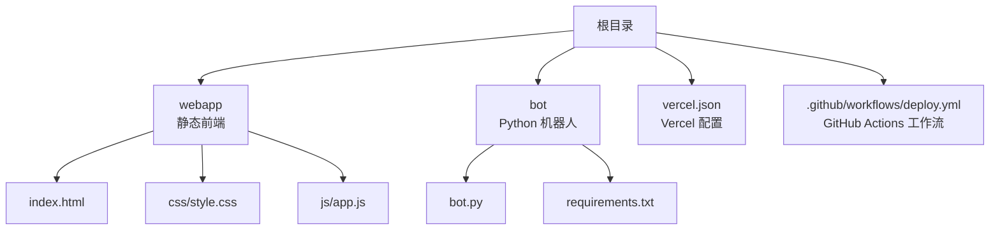
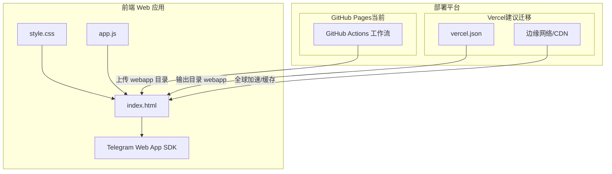
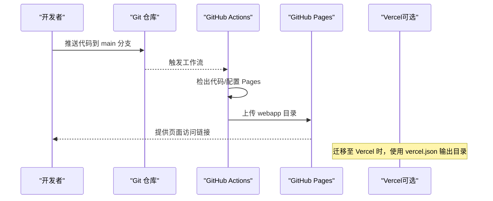
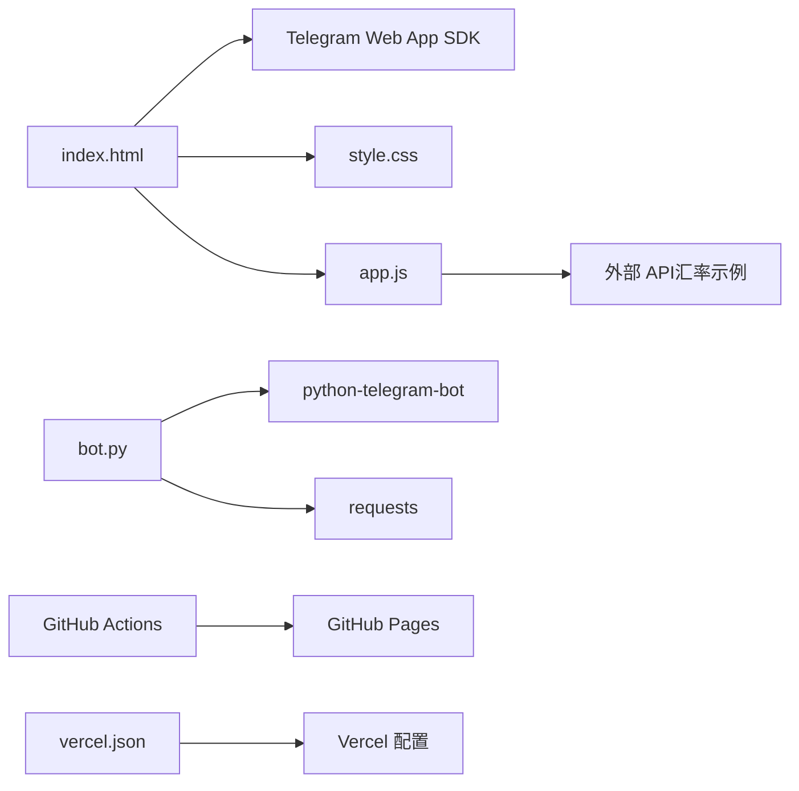

# Vercel 部署

<cite>
**本文引用的文件**
- [vercel.json](file://vercel.json)
- [.github/workflows/deploy.yml](file://.github/workflows/deploy.yml)
- [bot/bot.py](file://bot/bot.py)
- [bot/requirements.txt](file://bot/requirements.txt)
- [webapp/index.html](file://webapp/index.html)
- [webapp/css/style.css](file://webapp/css/style.css)
- [webapp/js/app.js](file://webapp/js/app.js)
- [.gitignore](file://.gitignore)
</cite>

## 目录
1. [简介](#简介)
2. [项目结构](#项目结构)
3. [核心组件](#核心组件)
4. [架构总览](#架构总览)
5. [详细组件分析](#详细组件分析)
6. [依赖关系分析](#依赖关系分析)
7. [性能考虑](#性能考虑)
8. [故障排查指南](#故障排查指南)
9. [结论](#结论)
10. [附录](#附录)

## 简介
本项目是一个结合 Telegram 机器人与前端 Web 应用的同城生活助手应用。前端 Web 应用采用静态页面（HTML/CSS/JS），通过 Telegram Web App SDK 在 Telegram 内嵌环境中运行；后端使用 Python 机器人框架处理用户消息与交互。当前仓库包含一个用于描述 Vercel 部署行为的配置文件，以及一个 GitHub Actions 工作流用于将静态资源部署到 GitHub Pages。本文档围绕 vercel.json 配置、部署流程、环境变量、重定向规则、多环境策略、边缘网络与 CDN 加速、监控与性能分析、域名与 HTTPS 等主题展开，帮助读者在 Vercel 或类似平台上完成稳定高效的部署。

## 项目结构
该项目采用“前端静态站点 + 后端机器人”的分层组织方式：
- 前端静态站点位于 webapp 目录，包含 HTML、CSS、JS 与资源文件
- 后端机器人位于 bot 目录，包含 Python 脚本与依赖清单
- 根目录包含 vercel.json（Vercel 部署配置）与 GitHub Actions 工作流文件
- .gitignore 用于忽略不必要的文件

图表来源
- [vercel.json](file://vercel.json)
- [.github/workflows/deploy.yml](file://.github/workflows/deploy.yml)
- [bot/bot.py](file://bot/bot.py)
- [bot/requirements.txt](file://bot/requirements.txt)
- [webapp/index.html](file://webapp/index.html)
- [webapp/css/style.css](file://webapp/css/style.css)
- [webapp/js/app.js](file://webapp/js/app.js)

章节来源
- [vercel.json](file://vercel.json)
- [.github/workflows/deploy.yml](file://.github/workflows/deploy.yml)
- [bot/bot.py](file://bot/bot.py)
- [bot/requirements.txt](file://bot/requirements.txt)
- [webapp/index.html](file://webapp/index.html)
- [webapp/css/style.css](file://webapp/css/style.css)
- [webapp/js/app.js](file://webapp/js/app.js)

## 核心组件
- vercel.json：定义构建命令、输出目录、重定向规则等部署参数
- GitHub Actions 工作流：定义自动化部署流程（当前部署至 GitHub Pages）
- 前端 Web 应用：基于 Telegram Web App SDK 的单页应用，支持路由切换与主题适配
- 机器人后端：基于 Python Telegram Bot 框架，读取环境变量，提供菜单与消息处理逻辑

章节来源
- [vercel.json](file://vercel.json)
- [.github/workflows/deploy.yml](file://.github/workflows/deploy.yml)
- [webapp/index.html](file://webapp/index.html)
- [webapp/js/app.js](file://webapp/js/app.js)
- [bot/bot.py](file://bot/bot.py)

## 架构总览
下图展示了前端 Web 应用与 Telegram Web App SDK 的交互关系，以及 GitHub Actions 的部署路径（当前工作流部署到 GitHub Pages）。若迁移到 Vercel，可直接以 webapp 作为输出目录进行静态托管。

图表来源
- [vercel.json](file://vercel.json)
- [.github/workflows/deploy.yml](file://.github/workflows/deploy.yml)
- [webapp/index.html](file://webapp/index.html)
- [webapp/css/style.css](file://webapp/css/style.css)
- [webapp/js/app.js](file://webapp/js/app.js)

## 详细组件分析

### vercel.json 配置详解
- 构建设置
  - 构建命令：null（表示无需构建步骤，直接使用现有静态资源）
  - 输出目录：webapp（Vercel 将以此目录作为静态站点根目录）
- 重定向规则
  - 通配符重写：将所有路径重写到对应静态文件或保持原路径
  - 适用于 SPA 单页应用的路由回退场景，确保刷新或直接访问深层路由时仍能正确加载页面

章节来源
- [vercel.json](file://vercel.json)

### GitHub Actions 工作流（当前部署到 GitHub Pages）
- 触发条件：推送至 main 分支或手动触发
- 步骤概览：
  - 检出代码
  - 配置 Pages 环境
  - 上传 webapp 目录为工件
  - 部署到 GitHub Pages
- 环境变量与权限：工作流声明了对 Pages 的写入权限与 ID 令牌写入权限，便于部署

章节来源
- [.github/workflows/deploy.yml](file://.github/workflows/deploy.yml)

### 前端 Web 应用（webapp）
- 页面结构：包含首页、跑腿、曝光、活动、我的、分类、搜索等页面
- 路由机制：基于 URL hash 的 SPA 路由，支持返回栈与页面切换动画
- 主题适配：检测 Telegram Web App 环境并注入主题变量，实现深浅色适配
- 交互功能：轮播图、分类导航、搜索、汇率查询、联系客服等
- 资源组织：样式与脚本分别位于 css 与 js 子目录，入口为 index.html

章节来源
- [webapp/index.html](file://webapp/index.html)
- [webapp/css/style.css](file://webapp/css/style.css)
- [webapp/js/app.js](file://webapp/js/app.js)

### 机器人后端（bot）
- 功能概述：启动 Telegram Bot，响应 /start 命令与文本消息，提供分类菜单与客服链接
- 环境变量：
  - BOT_TOKEN：机器人令牌
  - WEBAPP_URL：Web 应用地址（用于生成 WebApp 按钮）
- 依赖：python-telegram-bot 与 requests

章节来源
- [bot/bot.py](file://bot/bot.py)
- [bot/requirements.txt](file://bot/requirements.txt)

### 部署流程（从仓库到平台）
- 本地开发完成后，推送代码至主分支
- GitHub Actions 自动执行工作流，将 webapp 目录打包并部署到 GitHub Pages
- 若迁移到 Vercel，可直接使用 vercel.json 中的输出目录配置，无需额外构建命令

图表来源
- [.github/workflows/deploy.yml](file://.github/workflows/deploy.yml)
- [vercel.json](file://vercel.json)

## 依赖关系分析
- 前端依赖
  - Telegram Web App SDK：在 Telegram 内嵌环境中初始化主题与扩展
  - 样式与脚本：通过 index.html 引入，实现页面布局与交互逻辑
- 后端依赖
  - python-telegram-bot：处理 Telegram 消息与命令
  - requests：用于外部 API 请求（如汇率接口）
- 部署依赖
  - vercel.json：定义静态站点输出目录与重定向规则
  - GitHub Actions：定义自动化部署流程

图表来源
- [webapp/index.html](file://webapp/index.html)
- [webapp/js/app.js](file://webapp/js/app.js)
- [bot/bot.py](file://bot/bot.py)
- [bot/requirements.txt](file://bot/requirements.txt)
- [.github/workflows/deploy.yml](file://.github/workflows/deploy.yml)
- [vercel.json](file://vercel.json)

章节来源
- [webapp/index.html](file://webapp/index.html)
- [webapp/js/app.js](file://webapp/js/app.js)
- [bot/bot.py](file://bot/bot.py)
- [bot/requirements.txt](file://bot/requirements.txt)
- [.github/workflows/deploy.yml](file://.github/workflows/deploy.yml)
- [vercel.json](file://vercel.json)

## 性能考虑
- 静态资源优化
  - 使用 CDN 加速：Vercel 边缘网络可就近分发静态资源，降低延迟
  - 启用缓存策略：合理设置缓存头与版本化资源，减少重复下载
- 前端性能
  - 路由懒加载：对于大型分类数据，可按需加载以减少首屏体积
  - 图片与字体优化：压缩图片、使用现代格式（如 WebP）、预加载关键字体
- API 调用
  - 外部 API（如汇率）应设置超时与降级策略，避免阻塞页面渲染
- 机器人性能
  - 使用异步处理与连接池，避免阻塞主线程
  - 对频繁请求的接口进行本地缓存与限流

## 故障排查指南
- 页面无法加载或路由异常
  - 检查 vercel.json 的重定向规则是否覆盖目标路径
  - 确认输出目录与实际构建产物一致
- Telegram Web App 主题不生效
  - 确认 Telegram Web App SDK 已正确引入且初始化
  - 检查页面是否在 Telegram 内嵌环境中打开
- GitHub Pages 部署失败
  - 检查工作流权限与工件路径是否指向 webapp
  - 确认 Pages 已启用并允许 GitHub Actions 访问
- 机器人无法接收消息
  - 检查 BOT_TOKEN 是否正确配置
  - 确认网络可达性与代理设置（如需）

章节来源
- [vercel.json](file://vercel.json)
- [webapp/index.html](file://webapp/index.html)
- [webapp/js/app.js](file://webapp/js/app.js)
- [.github/workflows/deploy.yml](file://.github/workflows/deploy.yml)
- [bot/bot.py](file://bot/bot.py)

## 结论
本项目具备良好的静态前端与后端分离架构，适合在 Vercel 上进行静态托管与边缘加速。通过 vercel.json 的简单配置即可实现 SPA 路由回退与 CDN 加速。当前仓库的工作流已实现自动化部署至 GitHub Pages，若迁移至 Vercel 可进一步提升全球访问性能与稳定性。建议在生产环境中完善环境变量管理、监控与错误追踪，并根据业务增长逐步优化前端性能与 API 调用策略。

## 附录

### 多环境部署策略（建议）
- 开发环境
  - 使用本地开发服务器或临时域名进行调试
  - 禁用或简化缓存策略，便于快速迭代
- 测试环境
  - 使用独立的测试域名与测试数据库
  - 启用基础监控与日志记录
- 生产环境
  - 使用稳定域名与 HTTPS
  - 启用全站缓存与边缘缓存
  - 配置健康检查与自动回滚

### Vercel 部署要点（建议）
- 构建与输出
  - 构建命令设为 null（无需构建）
  - 输出目录设为 webapp
- 重定向与 SPA
  - 添加通配符重写规则，确保深层路由正常工作
- 环境变量
  - 在 Vercel 控制台配置 BOT_TOKEN、WEBAPP_URL 等敏感信息
  - 使用环境别名区分不同环境变量
- 域名与 HTTPS
  - 绑定自定义域名并开启自动 HTTPS
  - 配置 DNS 记录与 SSL 证书
- 监控与分析
  - 启用访问日志与错误追踪
  - 设置性能指标与告警阈值

### 域名绑定与 HTTPS（步骤建议）
- 在 Vercel 控制台添加自定义域名
- 配置 DNS 记录（A/AAAA/CNAME），指向 Vercel 提供的地址
- 等待 DNS 生效与证书签发
- 在控制台确认域名状态与证书有效期