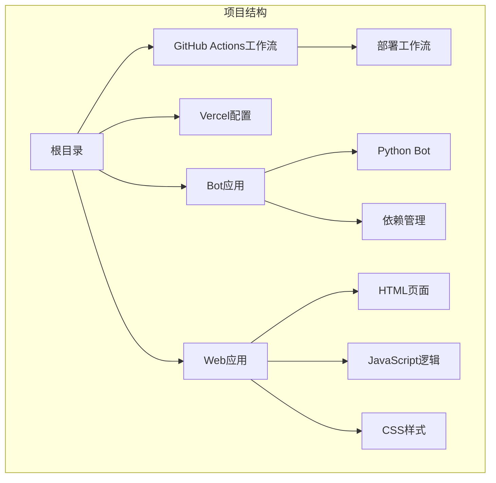
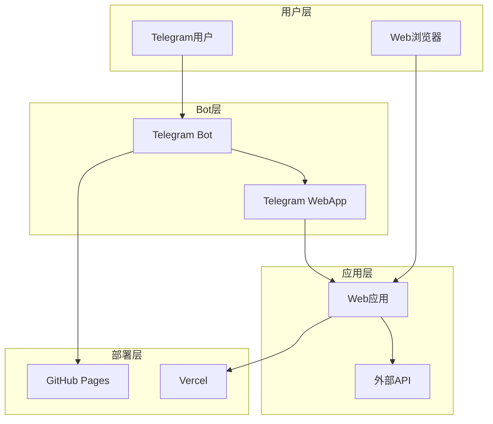
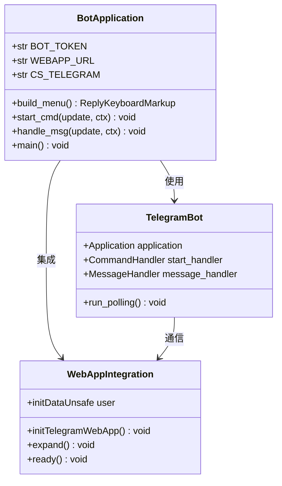
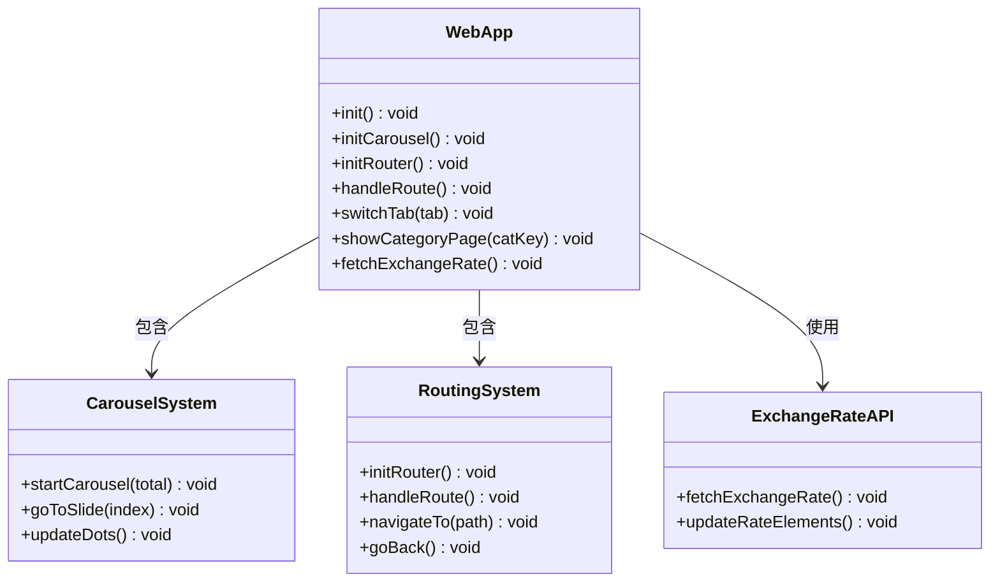
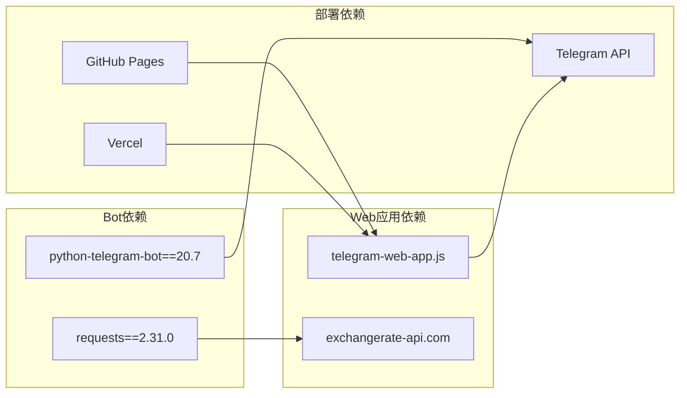

# 故障排除与常见问题

<cite>
**本文档引用的文件**
- [deploy.yml](file://.github/workflows/deploy.yml)
- [vercel.json](file://vercel.json)
- [bot.py](file://bot/bot.py)
- [requirements.txt](file://bot/requirements.txt)
- [index.html](file://webapp/index.html)
- [app.js](file://webapp/js/app.js)
- [style.css](file://webapp/css/style.css)
- [.gitignore](file://.gitignore)
</cite>

## 目录
1. [简介](#简介)
2. [项目结构](#项目结构)
3. [核心组件](#核心组件)
4. [架构概览](#架构概览)
5. [详细组件分析](#详细组件分析)
6. [依赖关系分析](#依赖关系分析)
7. [性能考虑](#性能考虑)
8. [故障排除指南](#故障排除指南)
9. [结论](#结论)

## 简介

本指南针对木姐同城生活助手项目的常见部署和运行时问题提供系统性的故障排除方法。该项目包含一个 Telegram Bot 和一个 Web 应用，支持 GitHub Pages 部署和 Vercel 部署两种方式。文档涵盖了从基础设施配置到应用层问题的完整排查流程。

## 项目结构

项目采用模块化设计，主要分为三个核心部分：

**图表来源**
- [deploy.yml:1-31](file://.github/workflows/deploy.yml#L1-L31)
- [vercel.json:1-8](file://vercel.json#L1-L8)

**章节来源**
- [deploy.yml:1-31](file://.github/workflows/deploy.yml#L1-L31)
- [vercel.json:1-8](file://vercel.json#L1-L8)

## 核心组件

### Telegram Bot 组件
- **Bot 核心功能**：提供用户交互界面，支持多种生活服务导航
- **WebApp 集成**：通过 Telegram WebApp API 实现原生体验
- **环境配置**：支持通过环境变量配置 Bot Token 和 WebApp URL

### Web 应用组件
- **响应式设计**：支持移动端和桌面端访问
- **路由系统**：基于 URL Hash 的单页应用路由
- **数据展示**：分类服务展示和实时汇率查询
- **交互功能**：轮播图、标签切换、搜索功能

**章节来源**
- [bot.py:1-88](file://bot/bot.py#L1-L88)
- [app.js:1-87](file://webapp/js/app.js#L1-L87)

## 架构概览

**图表来源**
- [bot.py:9-11](file://bot/bot.py#L9-L11)
- [index.html:8-9](file://webapp/index.html#L8-L9)
- [vercel.json:2-3](file://vercel.json#L2-L3)

## 详细组件分析

### Bot 应用架构

**图表来源**
- [bot.py:77-83](file://bot/bot.py#L77-L83)
- [app.js:54-54](file://webapp/js/app.js#L54-L54)

**章节来源**
- [bot.py:1-88](file://bot/bot.py#L1-L88)

### Web 应用架构

**图表来源**
- [app.js:51-84](file://webapp/js/app.js#L51-L84)

**章节来源**
- [app.js:1-87](file://webapp/js/app.js#L1-L87)

## 依赖关系分析

### 外部依赖

**图表来源**
- [requirements.txt:1-3](file://bot/requirements.txt#L1-L3)
- [index.html:9-9](file://webapp/index.html#L9-L9)
- [vercel.json:1-8](file://vercel.json#L1-L8)

**章节来源**
- [requirements.txt:1-3](file://bot/requirements.txt#L1-L3)

## 性能考虑

### 响应式设计优化
- 最大宽度限制：480px
- 触摸友好的按钮尺寸
- 适当的内边距和间距
- 渐变背景色减少纯色块

### JavaScript 性能优化
- 防抖处理（3500ms 轮播间隔）
- DOM 元素缓存
- 事件委托模式
- 条件渲染优化

## 故障排除指南

### GitHub Pages 部署问题

#### 常见问题1：部署权限不足
**症状**：部署过程中出现权限错误
**解决方案**：
1. 检查 GitHub Actions 工作流中的权限配置
2. 确认 `permissions` 字段包含必要的权限
3. 验证 Pages 服务的访问令牌配置

**章节来源**
- [deploy.yml:6-12](file://.github/workflows/deploy.yml#L6-L12)

#### 常见问题2：构建路径错误
**症状**：页面无法正确显示内容
**解决方案**：
1. 检查 `upload-pages-artifact` 步骤中的路径配置
2. 确认路径指向正确的 `webapp` 目录
3. 验证目录结构是否符合预期

**章节来源**
- [deploy.yml:24-27](file://.github/workflows/deploy.yml#L24-L27)

#### 常见问题3：静态资源加载失败
**症状**：CSS、JavaScript 文件 404 错误
**解决方案**：
1. 检查 HTML 中的资源路径是否正确
2. 验证相对路径在不同部署环境下的有效性
3. 确认文件权限设置

### Vercel 构建错误

#### 常见问题1：构建命令配置错误
**症状**：Vercel 构建失败或输出目录不正确
**解决方案**：
1. 检查 `buildCommand` 配置（当前设置为 null）
2. 确认 `outputDirectory` 指向 `webapp`
3. 验证重写规则配置

**章节来源**
- [vercel.json:2-6](file://vercel.json#L2-L6)

#### 常见问题2：环境变量缺失
**症状**：运行时出现配置错误
**解决方案**：
1. 在 Vercel 控制台添加必要的环境变量
2. 配置 `BOT_TOKEN` 和 `WEBAPP_URL`
3. 设置环境变量的作用域

### Telegram Bot 相关问题

#### 问题1：Bot API 连接失败
**症状**：Bot 无法启动或接收消息
**诊断步骤**：
1. 检查 `BOT_TOKEN` 环境变量配置
2. 验证 Telegram Bot API 可访问性
3. 查看日志中的连接错误信息

**章节来源**
- [bot.py:9-9](file://bot/bot.py#L9-L9)

#### 问题2：消息接收异常
**症状**：Bot 无法处理用户消息
**解决方案**：
1. 检查消息处理器注册
2. 验证消息过滤器配置
3. 确认异步处理逻辑

**章节来源**
- [bot.py:61-74](file://bot/bot.py#L61-L74)

#### 问题3：WebApp 集成问题
**症状**：WebApp 无法正常加载
**诊断步骤**：
1. 检查 Telegram WebApp API 加载
2. 验证 `initDataUnsafe` 数据完整性
3. 确认主题颜色和尺寸适配

**章节来源**
- [app.js:54-54](file://webapp/js/app.js#L54-L54)

### Web 应用运行时错误

#### 问题1：JavaScript 错误
**症状**：页面功能异常或完全无法加载
**排查步骤**：
1. 打开浏览器开发者工具
2. 检查控制台错误信息
3. 验证关键函数调用
4. 检查 DOM 元素是否存在

**章节来源**
- [app.js:51-84](file://webapp/js/app.js#L51-L84)

#### 问题2：CSS 样式问题
**症状**：页面布局错乱或样式不生效
**解决方案**：
1. 检查 CSS 变量定义
2. 验证媒体查询配置
3. 确认响应式断点设置
4. 检查 z-index 层级

**章节来源**
- [style.css:1-80](file://webapp/css/style.css#L1-L80)

#### 问题3：响应式布局异常
**症状**：移动端显示效果不佳
**诊断方法**：
1. 使用浏览器设备模拟器测试
2. 检查视口配置
3. 验证触摸事件处理
4. 测试不同屏幕尺寸

**章节来源**
- [index.html:4-5](file://webapp/index.html#L4-L5)

### 网络连接问题

#### 问题1：API 调用失败
**症状**：汇率数据无法加载
**解决方案**：
1. 检查外部 API 可访问性
2. 验证 CORS 配置
3. 实现错误回退机制
4. 添加请求超时处理

**章节来源**
- [app.js:84-84](file://webapp/js/app.js#L84-L84)

#### 问题2：第三方服务不可用
**症状**：外部服务调用超时或返回错误
**处理方案**：
1. 实现重试机制
2. 添加降级策略
3. 设置合理的超时时间
4. 提供用户友好的错误提示

### 调试工具使用指南

#### 浏览器开发者工具
1. **Elements 面板**：检查 HTML 结构和 CSS 样式
2. **Console 面板**：查看 JavaScript 错误和警告
3. **Network 面板**：监控 API 请求和响应
4. **Sources 面板**：设置断点调试 JavaScript 代码

#### 日志分析方法
1. **Bot 日志**：检查 Telegram Bot 的运行状态
2. **Web 应用日志**：监控 JavaScript 异常
3. **部署日志**：分析构建和部署过程
4. **API 调用日志**：跟踪外部服务交互

#### 性能问题定位技巧
1. **内存泄漏检测**：使用 Performance 面板分析内存使用
2. **渲染性能分析**：检查重绘和回流情况
3. **网络性能优化**：分析资源加载时间
4. **JavaScript 执行时间**：识别性能瓶颈

### 问题反馈和升级流程

#### 问题分类和优先级
1. **紧急问题**：Bot 完全不可用、核心功能失效
2. **高优先级**：用户体验严重受影响的功能缺陷
3. **中等优先级**：UI 显示问题、轻微功能异常
4. **低优先级**：微小的视觉调整、文档改进

#### 升级流程
1. **问题记录**：详细描述问题现象和重现步骤
2. **影响评估**：确定问题影响范围和严重程度
3. **修复开发**：实现修复方案并进行测试
4. **部署验证**：在测试环境中验证修复效果
5. **生产发布**：部署到生产环境并监控效果

#### 沟通机制
1. **用户反馈**：通过 Bot 或网站收集用户意见
2. **团队协作**：使用项目管理工具跟踪问题进展
3. **版本发布**：定期发布更新和修复补丁
4. **社区支持**：维护社区论坛和技术支持渠道

## 结论

本故障排除指南提供了针对木姐同城生活助手项目从基础设施到应用层的完整问题解决框架。通过系统性的诊断方法、详细的排查步骤和标准化的升级流程，可以有效解决大部分部署和运行时问题。

关键要点包括：
- 建立完善的监控和日志体系
- 制定标准化的故障排除流程
- 实施预防性维护措施
- 建立有效的用户反馈机制
- 持续优化性能和用户体验

建议定期回顾和更新故障排除流程，结合实际使用情况不断改进问题解决效率。