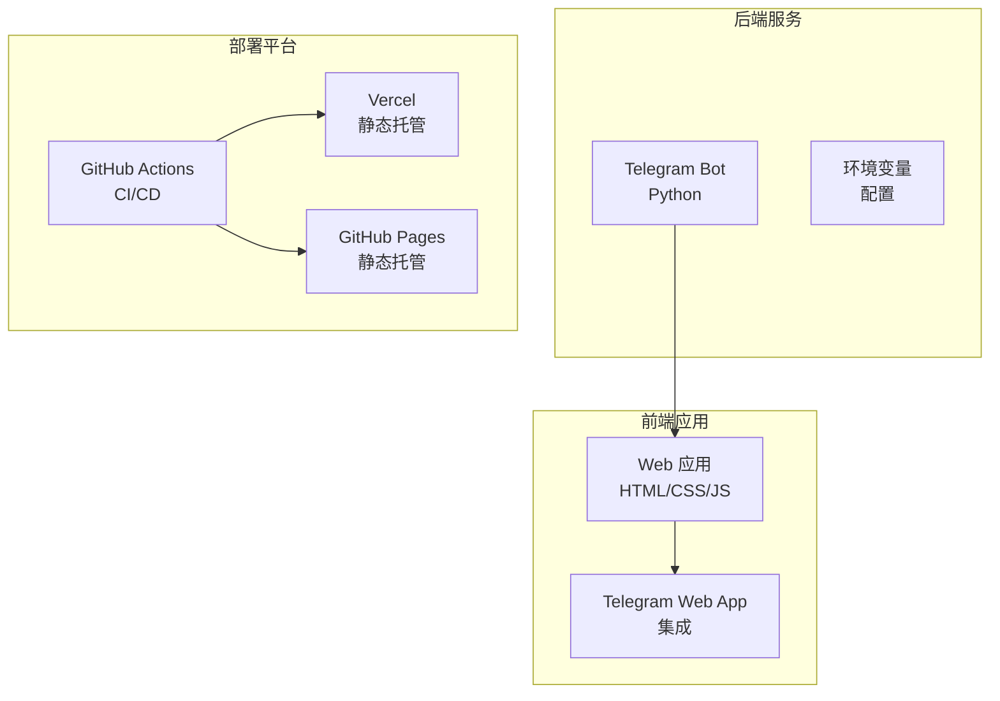
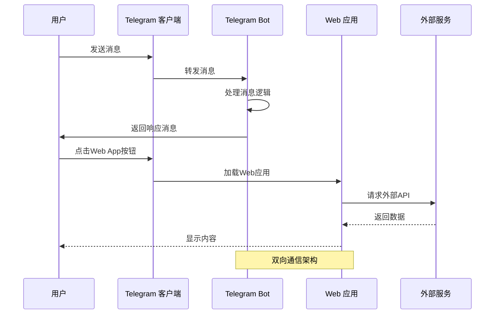
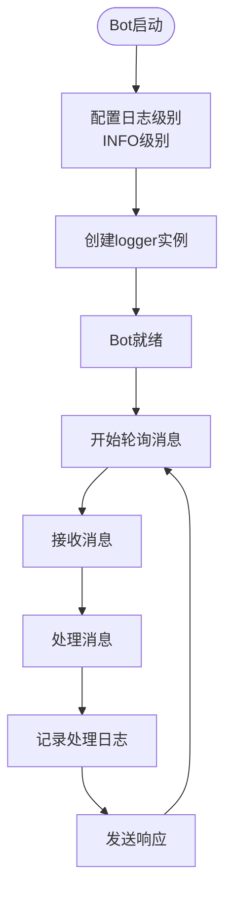
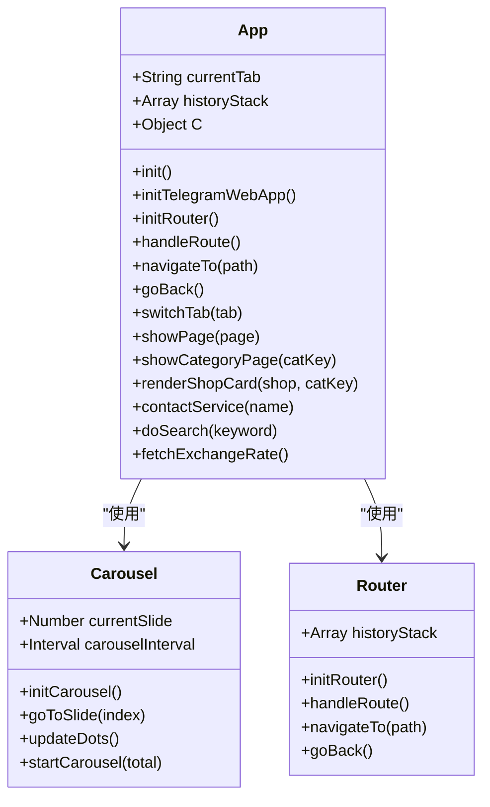
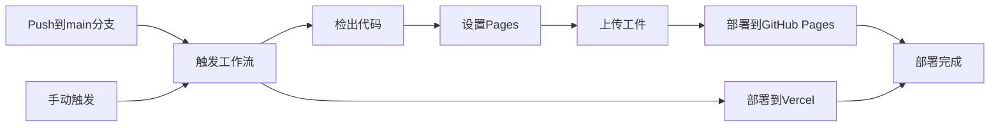
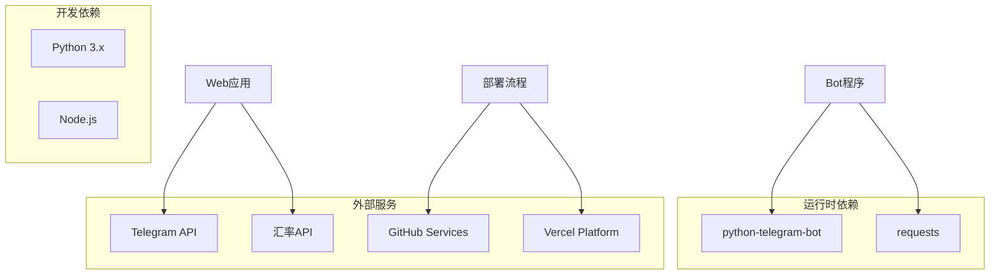

# 监控与日志

<cite>
**本文档引用的文件**
- [bot.py](file://bot/bot.py)
- [app.js](file://webapp/js/app.js)
- [deploy.yml](file://.github/workflows/deploy.yml)
- [vercel.json](file://vercel.json)
- [requirements.txt](file://bot/requirements.txt)
- [index.html](file://webapp/index.html)
- [style.css](file://webapp/css/style.css)
</cite>

## 目录
1. [简介](#简介)
2. [项目结构](#项目结构)
3. [核心组件](#核心组件)
4. [架构概览](#架构概览)
5. [详细组件分析](#详细组件分析)
6. [依赖关系分析](#依赖关系分析)
7. [性能考虑](#性能考虑)
8. [故障排除指南](#故障排除指南)
9. [结论](#结论)
10. [附录](#附录)

## 简介

本项目是一个集成了 Telegram Bot 和 Web 应用的综合服务平台，主要为用户提供木姐地区的本地生活服务信息。系统采用 Python Telegram Bot 框架构建后端服务，使用纯前端技术栈构建 Web 应用，并通过 GitHub Actions 进行自动化部署。

当前系统在监控和日志管理方面相对基础，主要依赖于 Python 标准库的日志功能和浏览器控制台。本文档旨在为该系统设计一套完整的监控与日志管理方案，包括消息处理日志、错误日志、性能指标收集，以及前端监控策略。

## 项目结构

该项目采用模块化组织方式，主要分为三个核心部分：



**图表来源**
- [bot.py:1-88](file://bot/bot.py#L1-L88)
- [app.js:1-87](file://webapp/js/app.js#L1-L87)
- [deploy.yml:1-31](file://.github/workflows/deploy.yml#L1-L31)

**章节来源**
- [bot.py:1-88](file://bot/bot.py#L1-L88)
- [app.js:1-87](file://webapp/js/app.js#L1-L87)
- [deploy.yml:1-31](file://.github/workflows/deploy.yml#L1-L31)

## 核心组件

### Telegram Bot 核心功能

系统的核心是基于 Python Telegram Bot 框架构建的机器人，提供以下主要功能：

- **启动命令处理**：响应 `/start` 命令，向用户展示欢迎信息和功能菜单
- **消息处理**：处理用户发送的文本消息，提供相应的服务引导
- **键盘按钮导航**：提供分类服务的快捷按钮，包括美食、酒店、购物等
- **客户服务连接**：提供在线客服联系方式

### Web 应用前端架构

前端应用采用单页应用(SPA)架构，使用纯 JavaScript 实现路由管理和页面切换：

- **模块化设计**：所有功能封装在一个立即执行函数中，避免全局污染
- **路由系统**：基于 URL hash 实现页面导航和历史管理
- **数据驱动界面**：使用预定义的数据结构渲染不同类别的服务信息
- **响应式设计**：支持移动端和桌面端访问

### 部署基础设施

系统采用多平台部署策略：

- **GitHub Actions**：自动化 CI/CD 流程，支持手动触发和分支推送触发
- **Vercel 部署**：生产环境静态网站托管
- **GitHub Pages**：备用部署选项和版本回滚

**章节来源**
- [bot.py:45-83](file://bot/bot.py#L45-L83)
- [app.js:51-86](file://webapp/js/app.js#L51-L86)
- [deploy.yml:14-31](file://.github/workflows/deploy.yml#L14-L31)

## 架构概览

系统整体架构采用客户端-服务器分离模式，结合 Telegram Web App 的原生特性：



**图表来源**
- [bot.py:61-74](file://bot/bot.py#L61-L74)
- [app.js:54-84](file://webapp/js/app.js#L54-L84)

### 数据流分析

系统中的主要数据流包括：

1. **消息处理流程**：用户消息 → Telegram → Bot → 处理 → 响应
2. **Web 应用加载流程**：用户访问 → Web App 初始化 → 数据获取 → 页面渲染
3. **外部服务集成**：Web 应用 → 外部 API → 实时数据

**章节来源**
- [bot.py:61-83](file://bot/bot.py#L61-L83)
- [app.js:51-86](file://webapp/js/app.js#L51-L86)

## 详细组件分析

### Bot 组件监控策略

#### 当前日志实现分析

系统目前使用 Python 标准库的 logging 模块，但配置相对简单：



**图表来源**
- [bot.py:6-7](file://bot/bot.py#L6-L7)
- [bot.py:77-83](file://bot/bot.py#L77-L83)

#### 建议的改进措施

1. **增强日志配置**：
   - 使用结构化日志格式(JSON)
   - 添加日志级别区分(错误、警告、信息)
   - 实现日志轮转和保留策略

2. **消息处理监控**：
   ```python
   # 建议的消息处理日志格式
   message_log = {
       "timestamp": datetime.now().isoformat(),
       "message_id": update.message.id,
       "user_id": update.effective_user.id,
       "username": update.effective_user.username,
       "text": update.message.text,
       "processing_time": processing_duration,
       "status": "success/error",
       "error_details": error_message
   }
   ```

3. **性能指标收集**：
   - 消息处理延迟统计
   - 用户活跃度指标
   - 错误率监控

**章节来源**
- [bot.py:6-7](file://bot/bot.py#L6-L7)
- [bot.py:77-83](file://bot/bot.py#L77-L83)

### Web 应用前端监控

#### 当前前端实现分析

前端应用采用模块化设计，主要功能包括：



**图表来源**
- [app.js:1-87](file://webapp/js/app.js#L1-L87)

#### 建议的前端监控方案

1. **页面性能监控**：
   - 使用 Performance API 监测页面加载时间
   - 记录关键资源加载时间
   - 监测首屏渲染时间

2. **用户行为追踪**：
   ```javascript
   // 建议的行为追踪事件
   const userEvents = [
       {
           event_type: "page_view",
           page: currentPage,
           timestamp: Date.now(),
           user_agent: navigator.userAgent
       },
       {
           event_type: "button_click",
           button_id: elementId,
           page: currentPage,
           timestamp: Date.now()
       }
   ];
   ```

3. **错误报告机制**：
   - 全局异常捕获
   - 自定义错误事件上报
   - 用户反馈收集

**章节来源**
- [app.js:51-86](file://webapp/js/app.js#L51-L86)

### 部署状态监控

#### GitHub Actions 工作流监控

当前工作流配置相对简单，主要关注部署状态：



**图表来源**
- [deploy.yml:14-31](file://.github/workflows/deploy.yml#L14-L31)

#### 建议的部署监控改进

1. **健康检查机制**：
   - 添加部署后健康检查
   - 实现自动回滚策略
   - 监控部署成功率

2. **多环境部署**：
   - 开发、测试、生产环境分离
   - 环境间配置管理
   - 逐步部署策略

**章节来源**
- [deploy.yml:1-31](file://.github/workflows/deploy.yml#L1-L31)

## 依赖关系分析

系统的主要依赖关系如下：



**图表来源**
- [requirements.txt:1-3](file://bot/requirements.txt#L1-L3)
- [deploy.yml:1-31](file://.github/workflows/deploy.yml#L1-L31)

### 依赖风险评估

1. **外部服务依赖**：
   - 汇率 API 可能出现不可用情况
   - Telegram API 限制和配额
   - 第三方服务的稳定性

2. **技术栈风险**：
   - Python 版本兼容性
   - Node.js 环境要求
   - 浏览器兼容性

**章节来源**
- [requirements.txt:1-3](file://bot/requirements.txt#L1-L3)
- [app.js:84](file://webapp/js/app.js#L84)

## 性能考虑

### 当前性能状况分析

系统在性能方面的现状：

1. **Bot 性能**：
   - 使用轮询方式处理消息，可能影响响应速度
   - 缺少异步处理优化
   - 日志记录可能影响性能

2. **Web 应用性能**：
   - 单页应用架构减少页面跳转开销
   - 外部 API 调用可能成为性能瓶颈
   - 图片和资源加载优化空间

### 建议的性能优化方案

1. **Bot 性能优化**：
   - 实现异步消息处理
   - 添加消息队列机制
   - 优化日志写入频率

2. **Web 应用性能优化**：
   - 实现缓存策略
   - 优化图片和资源加载
   - 减少不必要的 DOM 操作

3. **监控指标建议**：
   - 响应时间监控
   - 内存使用监控
   - 并发用户数监控

## 故障排除指南

### 常见问题诊断

#### Bot 相关问题

1. **消息处理失败**：
   - 检查环境变量配置
   - 验证 Telegram Token 有效性
   - 查看日志中的错误信息

2. **Web App 加载问题**：
   - 确认 WebApp URL 配置正确
   - 检查网络连接状态
   - 验证 Telegram Web App 集成

#### Web 应用问题

1. **页面显示异常**：
   - 检查浏览器控制台错误
   - 验证 CSS 样式加载
   - 确认 JavaScript 文件完整性

2. **外部服务调用失败**：
   - 检查 API 密钥配置
   - 验证网络连接
   - 查看 API 响应状态

### 建议的调试方法

1. **日志分析**：
   - 实施结构化日志格式
   - 添加错误堆栈跟踪
   - 设置日志级别过滤

2. **性能分析**：
   - 使用浏览器开发者工具
   - 监控网络请求性能
   - 分析内存使用情况

**章节来源**
- [bot.py:6-7](file://bot/bot.py#L6-L7)
- [app.js:51-86](file://webapp/js/app.js#L51-L86)

## 结论

当前系统在监控和日志管理方面相对基础，主要依赖于 Python 标准库的日志功能和浏览器控制台。为了提升系统的可观测性和可靠性，建议实施以下改进：

1. **建立完整的日志体系**：包括结构化日志、性能指标收集、错误追踪
2. **实现前端监控**：页面性能监控、用户行为追踪、错误报告机制
3. **完善部署监控**：健康检查、自动回滚、多环境管理
4. **建立告警机制**：基于阈值的自动告警、通知渠道配置

这些改进将显著提升系统的可维护性和用户体验，为未来的功能扩展奠定坚实基础。

## 附录

### 推荐的监控工具和最佳实践

#### 日志管理工具
- **ELK Stack**：Elasticsearch + Logstash + Kibana
- **Fluentd**：日志收集和转发
- **Prometheus**：监控指标收集和告警

#### 前端监控工具
- **Sentry**：错误追踪和性能监控
- **Google Analytics**：用户行为分析
- **Lighthouse**：性能审计

#### 最佳实践建议
1. **日志格式标准化**：统一 JSON 格式，包含时间戳、级别、服务名、请求ID
2. **日志分级管理**：DEBUG/INFO/WARNING/ERROR 四级分类
3. **敏感信息脱敏**：避免记录密码、Token 等敏感信息
4. **日志轮转策略**：按大小和时间进行轮转，设置合理的保留期