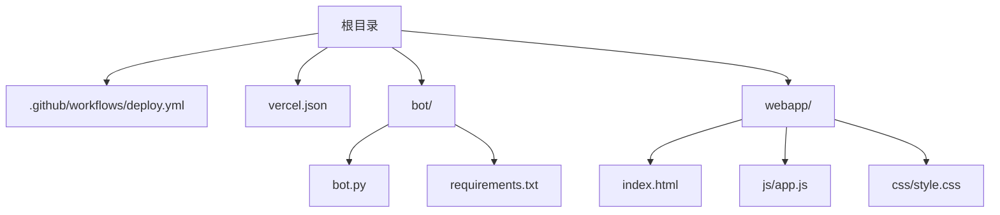
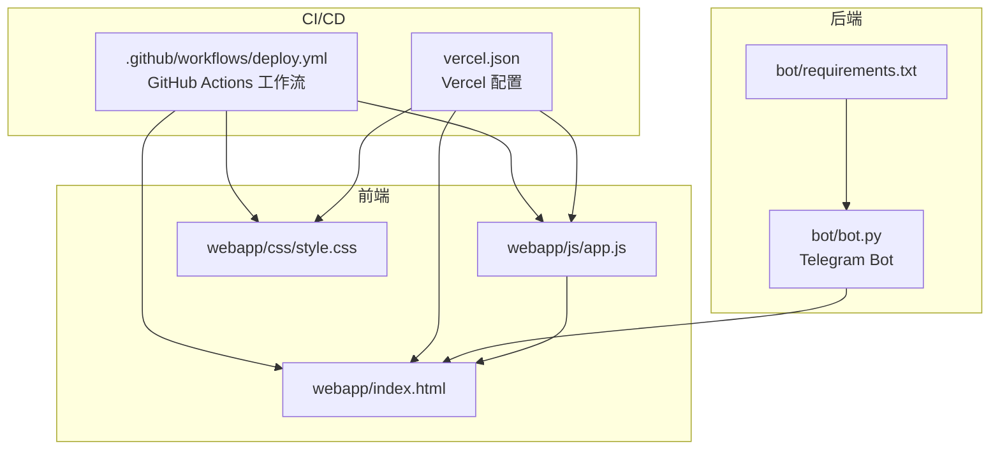
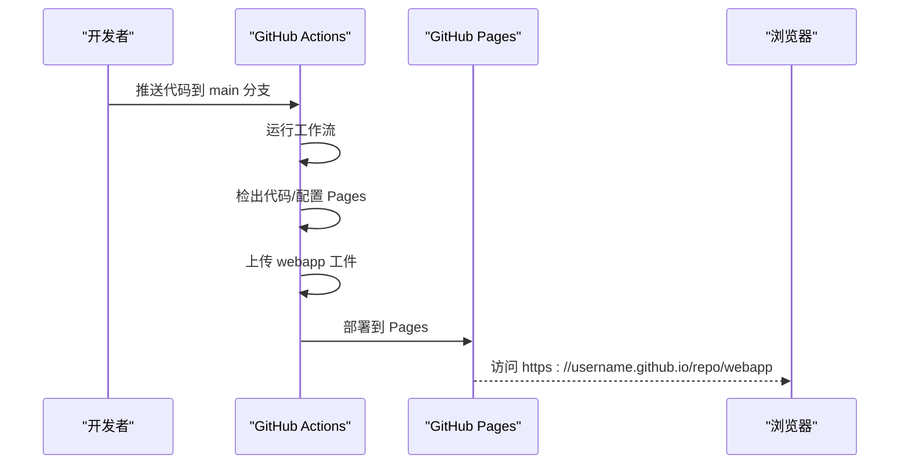
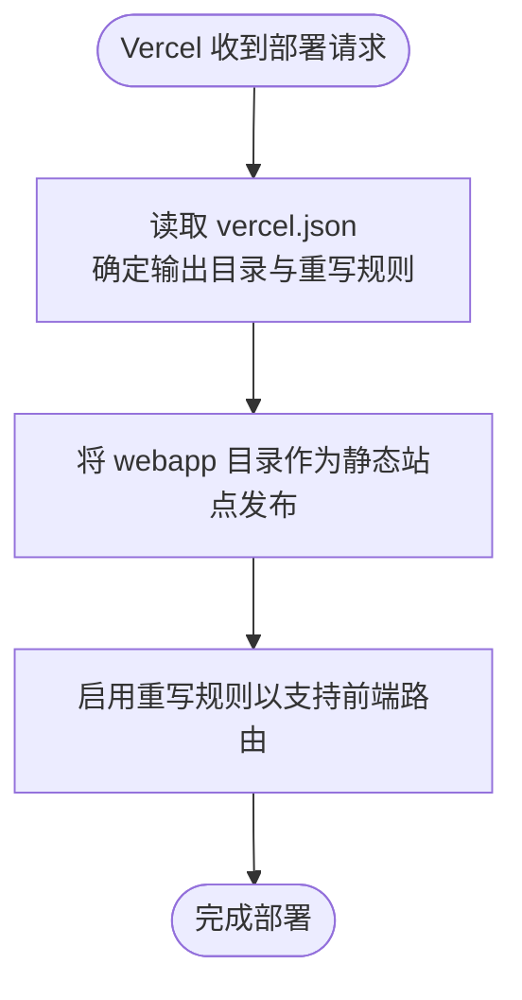
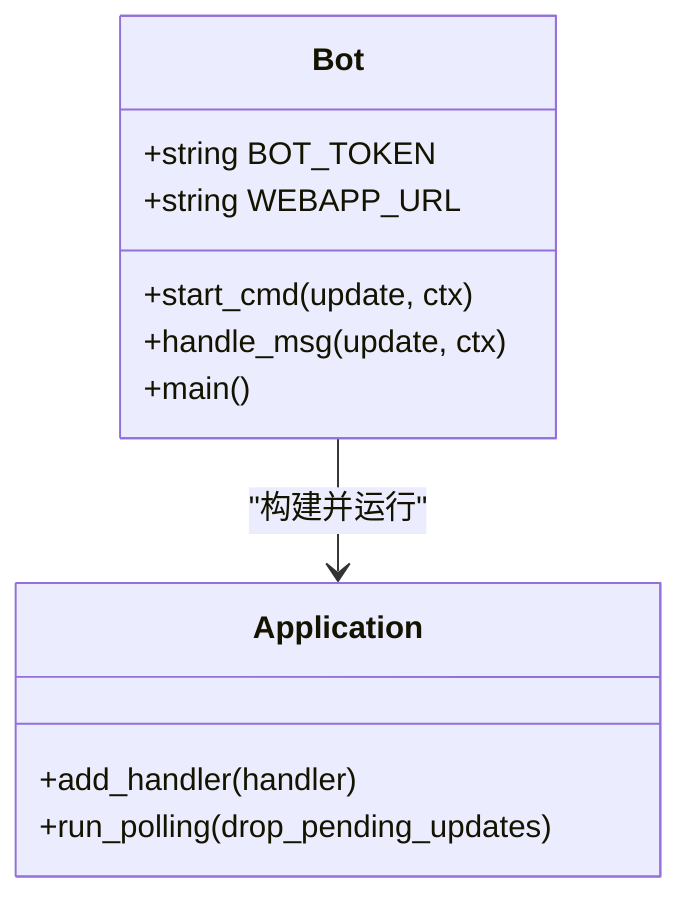
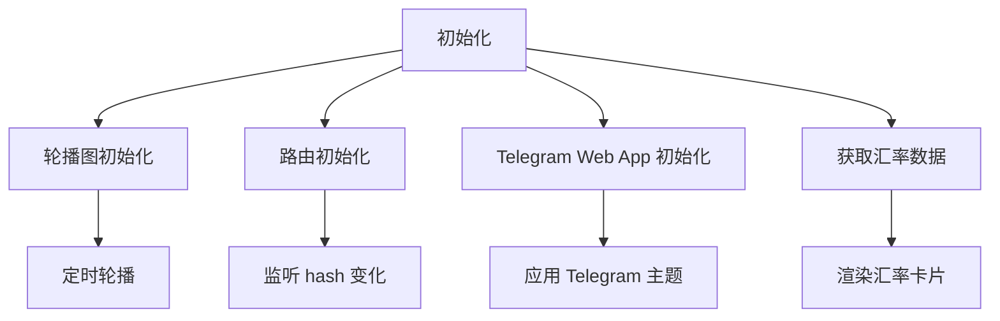
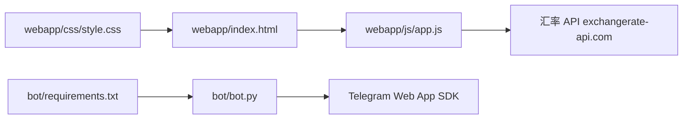

# 部署与运维

<cite>
**本文引用的文件**
- [.github/workflows/deploy.yml](file://.github/workflows/deploy.yml)
- [vercel.json](file://vercel.json)
- [bot/bot.py](file://bot/bot.py)
- [bot/requirements.txt](file://bot/requirements.txt)
- [webapp/index.html](file://webapp/index.html)
- [webapp/js/app.js](file://webapp/js/app.js)
- [webapp/css/style.css](file://webapp/css/style.css)
- [.gitignore](file://.gitignore)
</cite>

## 目录
1. [简介](#简介)
2. [项目结构](#项目结构)
3. [核心组件](#核心组件)
4. [架构总览](#架构总览)
5. [详细组件分析](#详细组件分析)
6. [依赖关系分析](#依赖关系分析)
7. [性能考虑](#性能考虑)
8. [故障排除指南](#故障排除指南)
9. [结论](#结论)
10. [附录](#附录)

## 简介
本项目是一个结合 Telegram Bot 与静态 Web 应用的同城生活助手系统，包含：
- Telegram Bot：负责消息交互、菜单导航与客服入口
- 静态 Web 应用：提供分类浏览、搜索、汇率查询、活动与曝光等功能
- 自动化部署：支持 GitHub Pages 与 Vercel 两种部署方式，配合 CI/CD 工作流实现代码提交即发布

本部署与运维文档将覆盖以下内容：
- GitHub Pages 与 Vercel 的部署配置与 CI/CD 工作流
- 环境变量管理与域名绑定
- 自动部署流程（代码提交触发、构建过程、发布策略）
- 本地部署与生产环境部署指南（服务器配置、SSL 证书、反向代理）
- 监控与日志管理（Telegram Bot 日志记录、Web 应用性能监控、错误追踪）
- 故障排除（常见部署问题、网络连接问题、API 调用失败）
- 备份策略、版本回滚、安全加固建议

## 项目结构
项目采用“功能分层 + 静态资源分离”的组织方式：
- 根目录包含 CI/CD 工作流与平台配置文件
- bot 目录包含 Telegram Bot 的 Python 实现与依赖
- webapp 目录包含前端静态资源（HTML、CSS、JS）

图表来源
- [.github/workflows/deploy.yml:1-31](file://.github/workflows/deploy.yml#L1-L31)
- [vercel.json:1-8](file://vercel.json#L1-L8)
- [bot/bot.py:1-88](file://bot/bot.py#L1-L88)
- [bot/requirements.txt:1-3](file://bot/requirements.txt#L1-L3)
- [webapp/index.html:1-145](file://webapp/index.html#L1-L145)
- [webapp/js/app.js:1-87](file://webapp/js/app.js#L1-L87)
- [webapp/css/style.css:1-80](file://webapp/css/style.css#L1-L80)

章节来源
- [.github/workflows/deploy.yml:1-31](file://.github/workflows/deploy.yml#L1-L31)
- [vercel.json:1-8](file://vercel.json#L1-L8)
- [bot/bot.py:1-88](file://bot/bot.py#L1-L88)
- [bot/requirements.txt:1-3](file://bot/requirements.txt#L1-L3)
- [webapp/index.html:1-145](file://webapp/index.html#L1-L145)
- [webapp/js/app.js:1-87](file://webapp/js/app.js#L1-L87)
- [webapp/css/style.css:1-80](file://webapp/css/style.css#L1-L80)

## 核心组件
- GitHub Pages 自动部署工作流：在主分支推送或手动触发时，构建 webapp 并上传至 Pages
- Vercel 配置：指定输出目录与重写规则，适配前端路由
- Telegram Bot：读取环境变量 BOT_TOKEN 与 WEBAPP_URL，启动长轮询监听消息
- 前端应用：基于 Telegram Web App SDK，提供分类、搜索、汇率查询、活动与曝光等页面

章节来源
- [.github/workflows/deploy.yml:13-31](file://.github/workflows/deploy.yml#L13-L31)
- [vercel.json:1-8](file://vercel.json#L1-L8)
- [bot/bot.py:77-88](file://bot/bot.py#L77-L88)
- [webapp/index.html:1-145](file://webapp/index.html#L1-L145)

## 架构总览
整体架构由“前端静态站点 + Telegram Bot + CI/CD”构成，Bot 通过内嵌 WebApp 方式调用前端页面，前端通过外部 API 获取实时汇率数据。

图表来源
- [.github/workflows/deploy.yml:1-31](file://.github/workflows/deploy.yml#L1-L31)
- [vercel.json:1-8](file://vercel.json#L1-L8)
- [bot/bot.py:1-88](file://bot/bot.py#L1-L88)
- [bot/requirements.txt:1-3](file://bot/requirements.txt#L1-L3)
- [webapp/index.html:1-145](file://webapp/index.html#L1-L145)
- [webapp/js/app.js:1-87](file://webapp/js/app.js#L1-L87)
- [webapp/css/style.css:1-80](file://webapp/css/style.css#L1-L80)

## 详细组件分析

### GitHub Pages 自动部署工作流
- 触发条件：主分支推送或手动触发
- 权限：读取内容、写入 Pages、令牌签发
- 步骤：检出代码、配置 Pages、上传 webapp 目录工件、部署到 GitHub Pages
- 输出：环境变量 environment.url 指向生成的 Pages 地址

图表来源
- [.github/workflows/deploy.yml:13-31](file://.github/workflows/deploy.yml#L13-L31)

章节来源
- [.github/workflows/deploy.yml:1-31](file://.github/workflows/deploy.yml#L1-L31)

### Vercel 部署配置
- 输出目录：webapp
- 重写规则：将所有路径映射到前端路由，便于 SPA 路由
- 构建命令：显式设为 null（使用默认构建行为）

图表来源
- [vercel.json:1-8](file://vercel.json#L1-L8)

章节来源
- [vercel.json:1-8](file://vercel.json#L1-L8)

### Telegram Bot 组件
- 环境变量：
  - BOT_TOKEN：Bot 认证令牌
  - WEBAPP_URL：前端 WebApp 的基础 URL
- 功能：
  - /start 命令与键盘菜单
  - 文本消息处理与客服入口
  - 启动时初始化并进入轮询模式

图表来源
- [bot/bot.py:77-88](file://bot/bot.py#L77-L88)

章节来源
- [bot/bot.py:1-88](file://bot/bot.py#L1-L88)
- [bot/requirements.txt:1-3](file://bot/requirements.txt#L1-L3)

### 前端 Web 应用
- 页面结构：首页、跑腿、曝光、活动、我的、分类、搜索
- 交互逻辑：底部导航切换、分类标签筛选、返回按钮、搜索热词
- 数据来源：实时汇率 API（exchangerate-api.com）
- 主题适配：Telegram Web App SDK 主题变量

图表来源
- [webapp/js/app.js:51-84](file://webapp/js/app.js#L51-L84)

章节来源
- [webapp/index.html:1-145](file://webapp/index.html#L1-L145)
- [webapp/js/app.js:1-87](file://webapp/js/app.js#L1-L87)
- [webapp/css/style.css:1-80](file://webapp/css/style.css#L1-L80)

## 依赖关系分析
- bot/requirements.txt 指定 Telegram Bot 与 HTTP 客户端依赖
- 前端通过 Telegram Web App SDK 与外部汇率 API 交互
- CI/CD 仅针对 webapp 目录进行构建与发布

图表来源
- [bot/requirements.txt:1-3](file://bot/requirements.txt#L1-L3)
- [bot/bot.py:1-88](file://bot/bot.py#L1-L88)
- [webapp/index.html:1-145](file://webapp/index.html#L1-L145)
- [webapp/js/app.js:1-87](file://webapp/js/app.js#L1-L87)
- [webapp/css/style.css:1-80](file://webapp/css/style.css#L1-L80)

章节来源
- [bot/requirements.txt:1-3](file://bot/requirements.txt#L1-L3)
- [bot/bot.py:1-88](file://bot/bot.py#L1-L88)
- [webapp/index.html:1-145](file://webapp/index.html#L1-L145)
- [webapp/js/app.js:1-87](file://webapp/js/app.js#L1-L87)
- [webapp/css/style.css:1-80](file://webapp/css/style.css#L1-L80)

## 性能考虑
- 前端性能
  - 使用固定最大宽度与轻量级动画，减少重排重绘
  - 图片与图标采用背景渐变与 SVG，降低体积
  - 轮播图定时器按需清理，避免内存泄漏
- API 调用
  - 汇率接口采用异步请求，失败时降级显示默认值
  - 避免重复请求，合理缓存结果
- 部署性能
  - GitHub Pages 与 Vercel 均为静态托管，无需服务器实例，响应速度快
  - 通过重写规则支持 SPA 路由，减少 404 重定向

章节来源
- [webapp/css/style.css:1-80](file://webapp/css/style.css#L1-L80)
- [webapp/js/app.js:51-84](file://webapp/js/app.js#L51-L84)

## 故障排除指南
- GitHub Pages 部署失败
  - 检查工作流权限与 Pages 设置是否开启
  - 确认 webapp 目录存在且包含必要文件
  - 查看工作流日志定位具体步骤错误
- Vercel 部署异常
  - 确认 vercel.json 中 outputDirectory 指向 webapp
  - 检查重写规则是否正确，避免路由冲突
- Bot 无法启动
  - 确认 BOT_TOKEN 环境变量已设置
  - 检查网络连通性与 Telegram API 可达性
- 前端页面空白或路由异常
  - 检查 Telegram Web App SDK 是否加载成功
  - 确认 WEBAPP_URL 与实际部署地址一致
- 汇率数据未刷新
  - 检查外网访问权限与 API 可用性
  - 查看控制台错误与网络面板

章节来源
- [.github/workflows/deploy.yml:1-31](file://.github/workflows/deploy.yml#L1-L31)
- [vercel.json:1-8](file://vercel.json#L1-L8)
- [bot/bot.py:9-11](file://bot/bot.py#L9-L11)
- [webapp/js/app.js:51-84](file://webapp/js/app.js#L51-L84)

## 结论
本项目通过 GitHub Pages 与 Vercel 提供稳定的静态托管方案，并结合 Telegram Bot 实现消息交互与 WebApp 内嵌体验。借助 CI/CD 工作流，实现了从代码提交到发布的自动化流程。建议在生产环境中进一步完善监控与日志、安全加固与备份策略，确保系统的稳定性与可维护性。

## 附录

### 环境变量清单
- BOT_TOKEN：Telegram Bot 认证令牌
- WEBAPP_URL：前端 WebApp 的基础 URL

章节来源
- [bot/bot.py:9-11](file://bot/bot.py#L9-L11)

### 本地部署指南
- 准备工作
  - 安装 Python 与 pip
  - 安装依赖：参考 requirements.txt
- 运行 Bot
  - 设置环境变量 BOT_TOKEN
  - 运行 bot.py 启动 Bot
- 运行前端
  - 使用本地静态服务器（如 http-server）启动 webapp 目录
  - 在 Telegram Bot 中设置 WebApp URL 指向本地地址
- 注意事项
  - 本地开发时，WEBAPP_URL 需指向本地地址
  - 如需 HTTPS，可使用内网穿透工具或自签名证书

章节来源
- [bot/requirements.txt:1-3](file://bot/requirements.txt#L1-L3)
- [bot/bot.py:77-88](file://bot/bot.py#L77-L88)
- [webapp/index.html:1-145](file://webapp/index.html#L1-L145)

### 生产环境部署指南
- GitHub Pages
  - 在仓库 Settings > Pages 中启用 Pages，选择工作流产物
  - 确认工作流权限与输出目录
- Vercel
  - 将项目导入 Vercel，确认 outputDirectory 为 webapp
  - 配置重写规则以支持前端路由
- SSL 与域名
  - GitHub Pages：通过自定义域名与 GitHub 提供的 DNS 记录配置
  - Vercel：通过域名管理添加自定义域名并配置 DNS
- 反向代理
  - 若使用自有服务器，可在 Nginx/Apache 上配置静态站点根目录为 webapp
  - 对于 Bot，建议使用反向代理将 /bot/<token> 映射到 Bot 服务端口

章节来源
- [.github/workflows/deploy.yml:1-31](file://.github/workflows/deploy.yml#L1-L31)
- [vercel.json:1-8](file://vercel.json#L1-L8)

### 监控与日志管理
- Bot 日志
  - 使用 Python logging 模块记录启动与消息处理
  - 建议集成日志收集服务（如 syslog、云函数日志）
- Web 应用性能监控
  - 使用浏览器性能面板与网络面板监测资源加载
  - 关注路由切换与 API 请求耗时
- 错误追踪
  - 前端：捕获 Promise 拒绝与全局错误事件
  - 后端：Bot 中增加 try/catch 与错误上报

章节来源
- [bot/bot.py:6-7](file://bot/bot.py#L6-L7)
- [webapp/js/app.js:51-84](file://webapp/js/app.js#L51-L84)

### 备份策略与版本回滚
- 备份
  - 备份源码与配置文件（.github/workflows/deploy.yml、vercel.json）
  - 备份 Telegram Bot 的配置与密钥
- 回滚
  - GitHub Pages：回退到上一个工作流产物
  - Vercel：回滚到上一个稳定版本或使用 Git 分支回滚
- 安全加固
  - 限制 BOT_TOKEN 存储与访问范围
  - 使用 HTTPS 与最小权限原则
  - 定期轮换密钥与检查访问日志

章节来源
- [.github/workflows/deploy.yml:1-31](file://.github/workflows/deploy.yml#L1-L31)
- [vercel.json:1-8](file://vercel.json#L1-L8)
- [bot/bot.py:9-11](file://bot/bot.py#L9-L11)