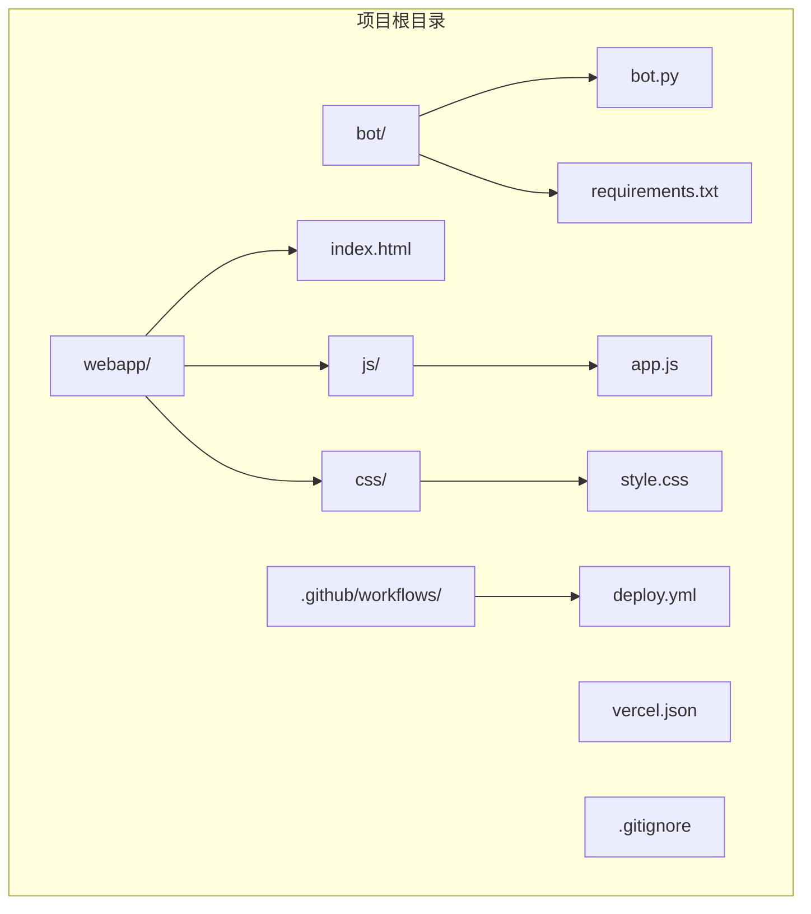
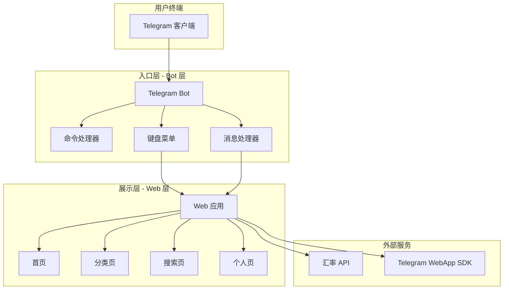
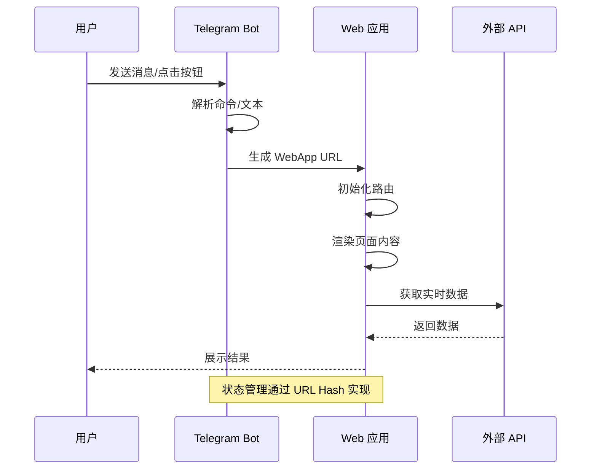
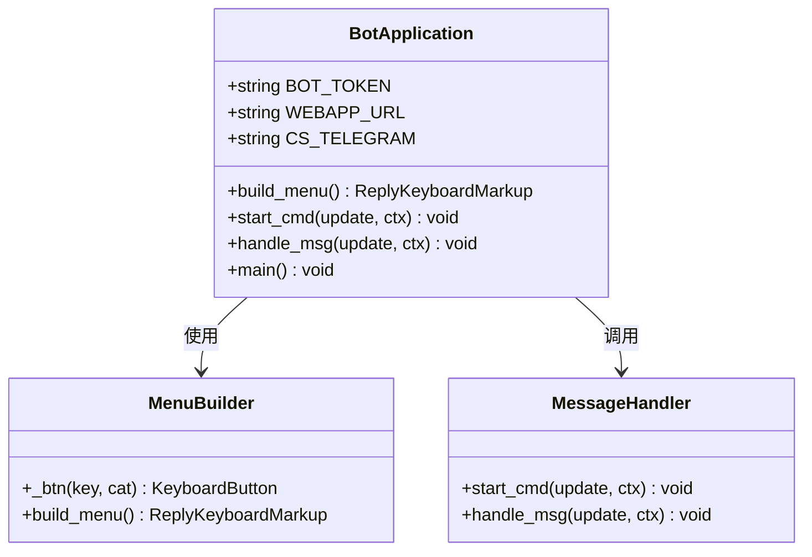
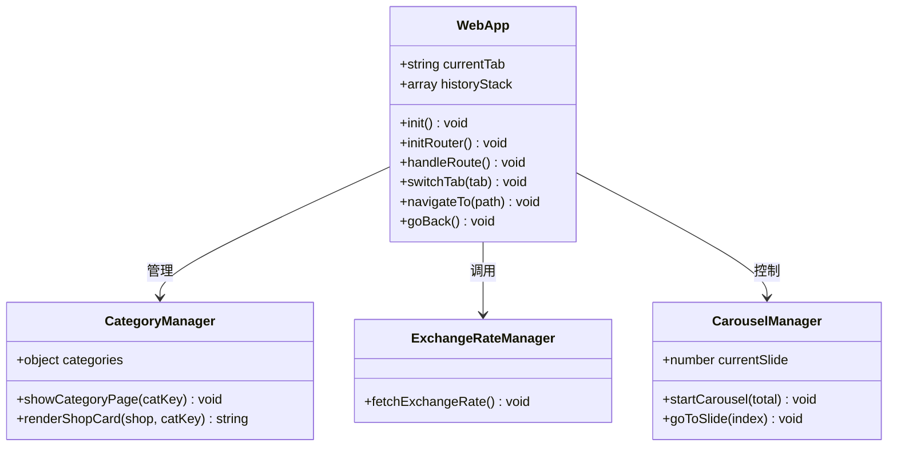
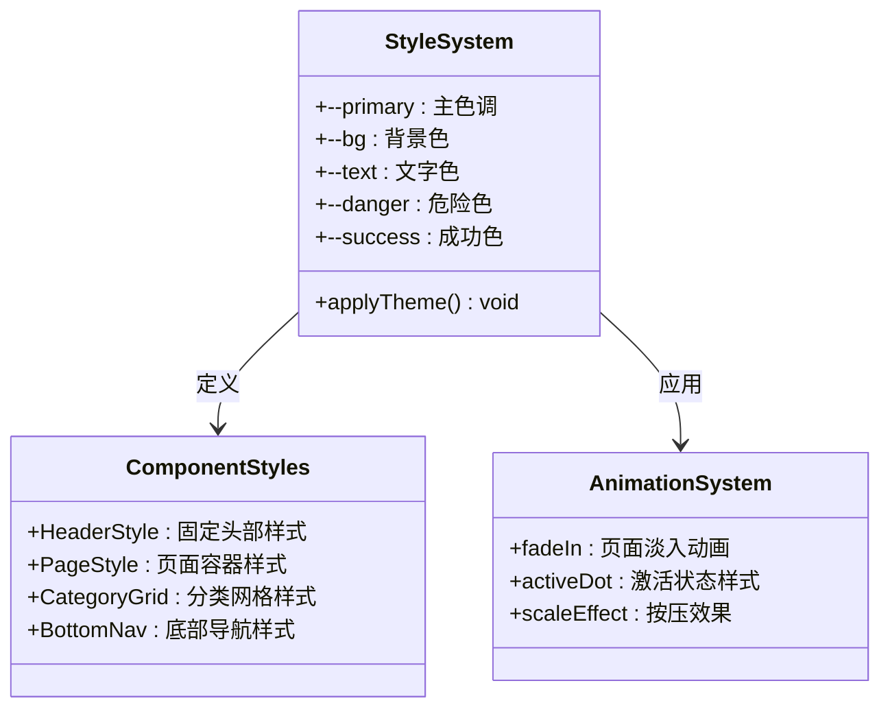
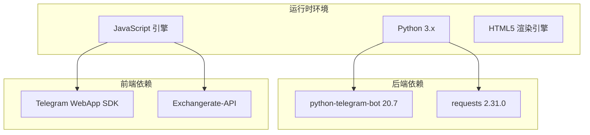
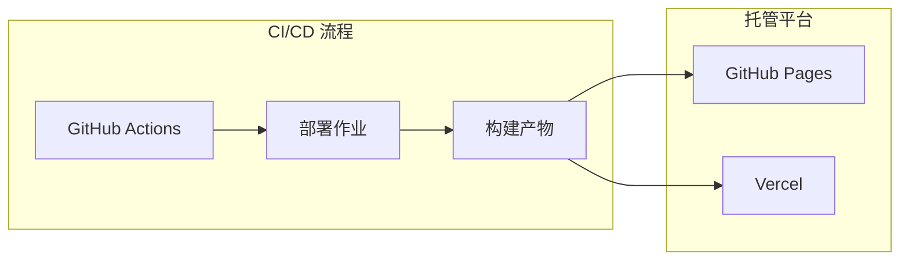

# 技术架构

<cite>
**本文档引用的文件**
- [bot.py](file://bot/bot.py)
- [requirements.txt](file://bot/requirements.txt)
- [index.html](file://webapp/index.html)
- [app.js](file://webapp/js/app.js)
- [style.css](file://webapp/css/style.css)
- [vercel.json](file://vercel.json)
- [deploy.yml](file://.github/workflows/deploy.yml)
- [.gitignore](file://.gitignore)
</cite>

## 目录
1. [简介](#简介)
2. [项目结构](#项目结构)
3. [核心组件](#核心组件)
4. [架构总览](#架构总览)
5. [详细组件分析](#详细组件分析)
6. [依赖关系分析](#依赖关系分析)
7. [性能考虑](#性能考虑)
8. [故障排除指南](#故障排除指南)
9. [结论](#结论)

## 简介
本项目是一个基于 Telegram Bot 的同城生活服务平台，采用前后端分离架构设计：
- 入口层：Telegram Bot（Python + python-telegram-bot）
- 展示层：Web 应用（HTML5 + JavaScript + CSS3）
- 部署层：静态网站托管（GitHub Pages/Vercel）

系统通过 Bot 作为用户交互入口，引导用户进入 Web 应用进行功能浏览和操作，实现了轻量化 Bot 和富交互 Web 应用的有机结合。

## 项目结构
项目采用模块化目录结构，清晰分离 Bot 逻辑和 Web 应用资源：

**图表来源**
- [bot.py:1-88](file://bot/bot.py#L1-L88)
- [index.html:1-145](file://webapp/index.html#L1-L145)
- [app.js:1-87](file://webapp/js/app.js#L1-L87)
- [style.css:1-80](file://webapp/css/style.css#L1-L80)

**章节来源**
- [bot.py:1-88](file://bot/bot.py#L1-L88)
- [index.html:1-145](file://webapp/index.html#L1-L145)
- [app.js:1-87](file://webapp/js/app.js#L1-L87)
- [style.css:1-80](file://webapp/css/style.css#L1-L80)
- [vercel.json:1-8](file://vercel.json#L1-L8)
- [deploy.yml:1-31](file://.github/workflows/deploy.yml#L1-L31)

## 核心组件
系统由三个核心层次构成，每层职责明确、边界清晰：

### Bot 层（入口层）
- **职责**：用户交互、消息处理、导航引导
- **技术栈**：Python + python-telegram-bot
- **功能特性**：命令处理、键盘菜单、WebApp 集成

### Web 层（展示层）
- **职责**：数据展示、用户界面、交互逻辑
- **技术栈**：HTML5 + JavaScript + CSS3
- **功能特性**：路由导航、动态内容、响应式设计

### 部署层（托管层）
- **职责**：静态资源托管、CDN 加速
- **技术栈**：GitHub Pages/Vercel
- **功能特性**：自动部署、版本控制、缓存优化

**章节来源**
- [bot.py:14-43](file://bot/bot.py#L14-L43)
- [index.html:1-145](file://webapp/index.html#L1-L145)
- [app.js:51-86](file://webapp/js/app.js#L51-L86)

## 架构总览
系统采用前后端分离的三层架构模式，通过 Telegram Bot 作为统一入口，实现用户流量的分流和功能引导。

**图表来源**
- [bot.py:45-74](file://bot/bot.py#L45-L74)
- [index.html:12-141](file://webapp/index.html#L12-L141)
- [app.js:51-86](file://webapp/js/app.js#L51-L86)

### 数据流与状态管理
系统采用事件驱动的数据流模式，Bot 层负责用户输入的接收和路由，Web 层负责状态管理和视图渲染。

**图表来源**
- [bot.py:14-43](file://bot/bot.py#L14-L43)
- [app.js:64-76](file://webapp/js/app.js#L64-L76)

## 详细组件分析

### Bot 组件分析
Bot 层是整个系统的核心入口，负责用户交互和消息处理。

**图表来源**
- [bot.py:14-43](file://bot/bot.py#L14-L43)
- [bot.py:45-74](file://bot/bot.py#L45-L74)

#### 核心功能实现
- **菜单构建**：动态生成包含 12 个功能类别的键盘菜单
- **命令处理**：支持 `/start` 命令初始化会话
- **消息路由**：根据用户输入进行智能路由
- **WebApp 集成**：通过 WebAppInfo 实现与 Web 应用的无缝连接

**章节来源**
- [bot.py:14-43](file://bot/bot.py#L14-L43)
- [bot.py:45-74](file://bot/bot.py#L45-L74)

### Web 应用组件分析
Web 应用采用单页应用架构，通过 URL Hash 实现页面切换。

**图表来源**
- [app.js:51-86](file://webapp/js/app.js#L51-L86)
- [app.js:76-78](file://webapp/js/app.js#L76-L78)

#### 功能特性
- **路由系统**：基于 URL Hash 的 SPA 路由实现
- **分类管理**：14 类服务的统一数据结构管理
- **轮播组件**：自动轮播的首页横幅展示
- **搜索功能**：基于关键词的智能搜索和跳转
- **Telegram 集成**：完整的 WebApp SDK 集成

**章节来源**
- [app.js:51-86](file://webapp/js/app.js#L51-L86)
- [index.html:12-141](file://webapp/index.html#L12-L141)

### 样式系统分析
CSS 采用现代化的变量系统和响应式设计。

**图表来源**
- [style.css:1-80](file://webapp/css/style.css#L1-L80)

**章节来源**
- [style.css:1-80](file://webapp/css/style.css#L1-L80)

## 依赖关系分析

### 技术栈依赖
系统采用轻量级但功能完备的技术栈组合：

**图表来源**
- [requirements.txt:1-3](file://bot/requirements.txt#L1-L3)
- [index.html](file://webapp/index.html#L9)

### 部署依赖

**图表来源**
- [deploy.yml:14-31](file://.github/workflows/deploy.yml#L14-L31)
- [vercel.json:1-8](file://vercel.json#L1-L8)

**章节来源**
- [requirements.txt:1-3](file://bot/requirements.txt#L1-L3)
- [deploy.yml:1-31](file://.github/workflows/deploy.yml#L1-L31)
- [vercel.json:1-8](file://vercel.json#L1-L8)

## 性能考虑
系统在设计时充分考虑了性能优化：

### 前端性能优化
- **静态资源**：纯静态 HTML/CSS/JS，无需服务器端渲染
- **缓存策略**：浏览器缓存 + CDN 加速
- **按需加载**：仅在需要时加载 JavaScript 和 CSS
- **响应式设计**：适配移动端和桌面端

### 后端性能优化
- **轻量级框架**：python-telegram-bot 提供高效的异步处理
- **内存管理**：无状态设计，避免内存泄漏
- **网络优化**：直接调用外部 API，减少中间层

## 故障排除指南

### Bot 相关问题
- **Token 配置错误**：检查环境变量 `BOT_TOKEN` 设置
- **WebApp URL 错误**：确认 `WEBAPP_URL` 指向正确的部署地址
- **消息处理异常**：检查日志输出，确认消息过滤器配置

### Web 应用相关问题
- **路由失效**：检查 URL Hash 变更监听是否正常工作
- **样式加载失败**：确认 CSS 文件路径正确
- **API 请求失败**：检查网络连接和 API 可用性

### 部署相关问题
- **构建失败**：检查 `vercel.json` 配置和文件权限
- **静态资源缺失**：确认 `webapp` 目录结构完整
- **CDN 缓存问题**：清除浏览器缓存和 CDN 缓存

**章节来源**
- [bot.py:6-11](file://bot/bot.py#L6-L11)
- [app.js:82-84](file://webapp/js/app.js#L82-L84)
- [deploy.yml:20-31](file://.github/workflows/deploy.yml#L20-L31)

## 结论
wyszbot 项目成功实现了基于 Telegram Bot 的同城生活服务平台，采用了合理的前后端分离架构设计。Bot 层专注于用户交互和导航，Web 层专注于数据展示和用户体验，两者通过 WebApp 技术实现无缝集成。

### 架构优势
- **技术栈简洁**：Python + JavaScript 的组合既保证了开发效率又保持了性能
- **部署简单**：静态网站托管降低了运维复杂度
- **扩展性强**：模块化的代码结构便于功能扩展
- **用户体验佳**：响应式设计和流畅的交互体验

### 技术选型理由
- **Bot 层**：python-telegram-bot 提供了稳定可靠的 Telegram API 封装
- **Web 层**：原生 JavaScript + HTML5 + CSS3 确保了最佳的兼容性和性能
- **部署层**：GitHub Pages/Vercel 提供了免费且稳定的托管服务

该架构为类似的服务平台提供了良好的参考模板，既满足了功能需求，又保持了技术实现的简洁性和可维护性。