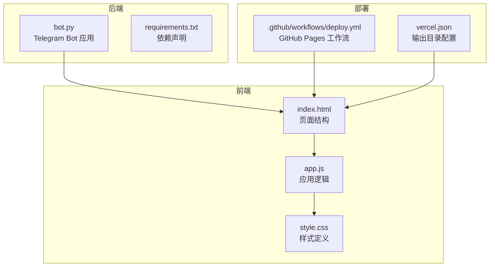
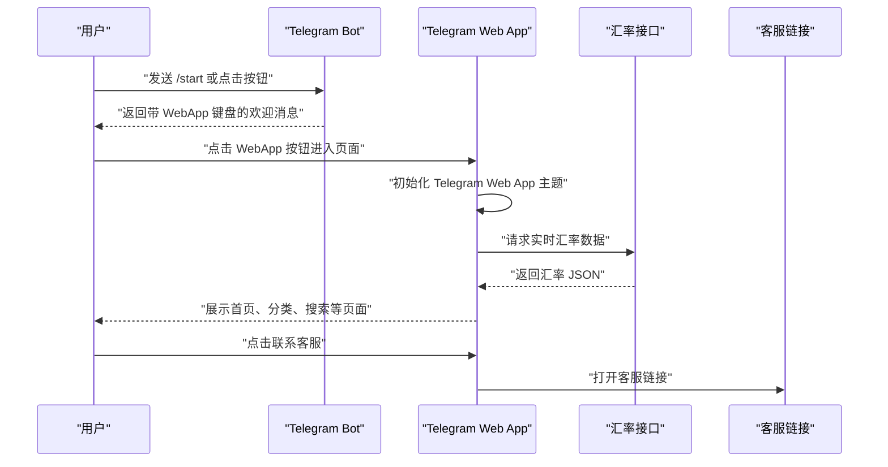
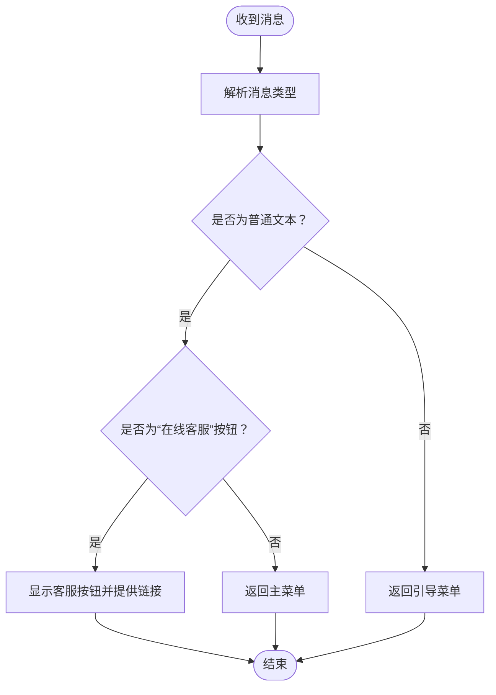
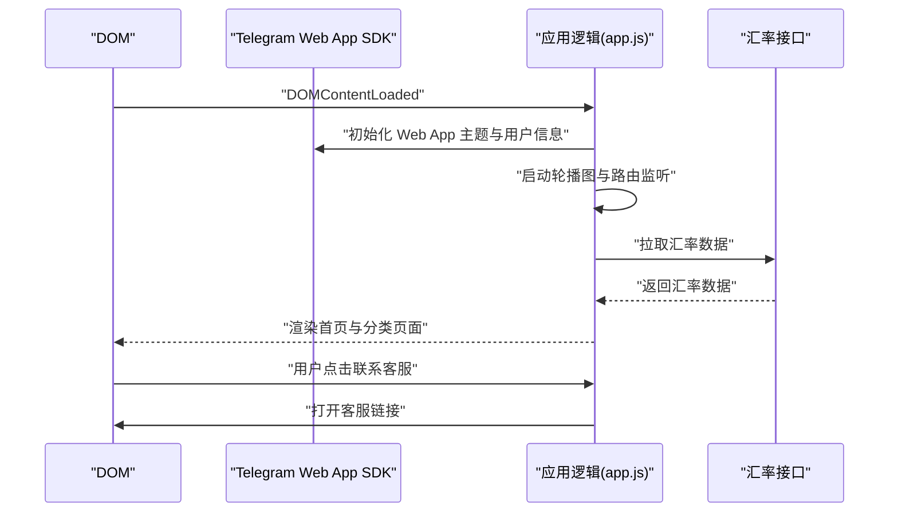
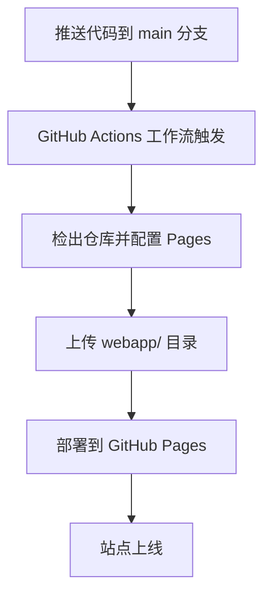
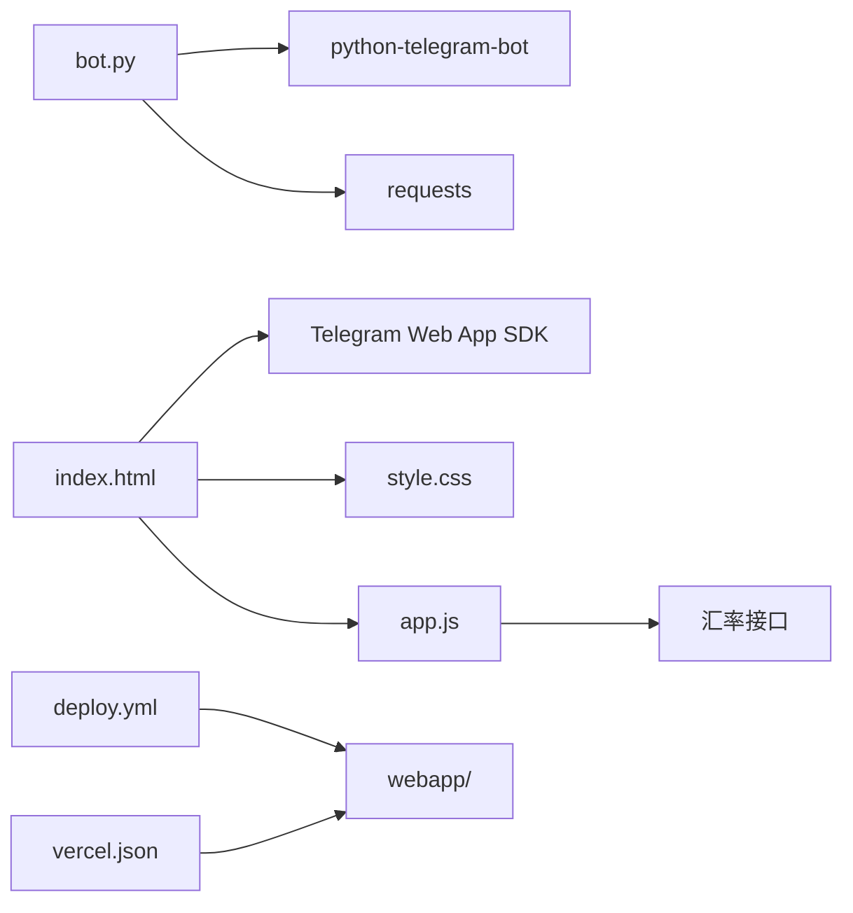

# 技术栈选择

<cite>
**本文引用的文件**
- [bot.py](file://bot/bot.py)
- [requirements.txt](file://bot/requirements.txt)
- [index.html](file://webapp/index.html)
- [app.js](file://webapp/js/app.js)
- [style.css](file://webapp/css/style.css)
- [vercel.json](file://vercel.json)
- [deploy.yml](file://.github/workflows/deploy.yml)
</cite>

## 目录
1. [引言](#引言)
2. [项目结构](#项目结构)
3. [核心组件](#核心组件)
4. [架构总览](#架构总览)
5. [详细组件分析](#详细组件分析)
6. [依赖关系分析](#依赖关系分析)
7. [性能考量](#性能考量)
8. [故障排查指南](#故障排查指南)
9. [结论](#结论)
10. [附录](#附录)

## 引言
本技术栈选择文档围绕 wyszbot 项目的整体技术组合展开，重点解释后端采用 Python + python-telegram-bot 的优势，以及前端采用 HTML5 + JavaScript + CSS3 的选择原因。文档从开发效率、性能表现、维护成本、团队技能匹配度等维度进行权衡，并对替代方案进行对比，给出版本兼容性与升级路径建议，帮助读者全面理解该技术栈在本项目中的适用性与局限性。

## 项目结构
项目采用前后端分离的组织方式：
- 后端（Telegram Bot）：位于 bot/ 目录，使用 python-telegram-bot 构建消息处理与键盘交互逻辑，通过环境变量读取机器人令牌与 WebApp URL。
- 前端（Telegram Web App）：位于 webapp/ 目录，包含 HTML 页面、纯 JS 逻辑与 CSS 样式，通过 Telegram 官方 Web App SDK 进行主题与交互适配。
- 部署配置：GitHub Actions 工作流负责将 webapp/ 目录打包并部署至 GitHub Pages；Vercel 配置用于将 webapp/ 作为静态站点输出目录。

图表来源
- [bot.py:1-88](file://bot/bot.py#L1-L88)
- [requirements.txt:1-3](file://bot/requirements.txt#L1-L3)
- [index.html:1-145](file://webapp/index.html#L1-L145)
- [app.js:1-87](file://webapp/js/app.js#L1-L87)
- [style.css:1-80](file://webapp/css/style.css#L1-L80)
- [deploy.yml:1-31](file://.github/workflows/deploy.yml#L1-L31)
- [vercel.json:1-8](file://vercel.json#L1-L8)

章节来源
- [bot.py:1-88](file://bot/bot.py#L1-L88)
- [requirements.txt:1-3](file://bot/requirements.txt#L1-L3)
- [index.html:1-145](file://webapp/index.html#L1-L145)
- [app.js:1-87](file://webapp/js/app.js#L1-L87)
- [style.css:1-80](file://webapp/css/style.css#L1-L80)
- [deploy.yml:1-31](file://.github/workflows/deploy.yml#L1-L31)
- [vercel.json:1-8](file://vercel.json#L1-L8)

## 核心组件
- 后端核心：基于 python-telegram-bot 的异步应用，注册 /start 命令处理器与文本消息处理器，构建自定义键盘并支持 WebApp 内嵌跳转。
- 前端核心：单页应用（SPA）风格，使用哈希路由实现页面切换，集成 Telegram Web App SDK 完成主题扩展与用户信息展示，内嵌轮播图、分类导航、搜索与联系客服等功能。
- 部署核心：GitHub Actions 将 webapp/ 目录上传为静态站点，Vercel 配置确保正确输出 webapp/ 并保留路径重写规则。

章节来源
- [bot.py:45-83](file://bot/bot.py#L45-L83)
- [index.html:1-145](file://webapp/index.html#L1-L145)
- [app.js:51-86](file://webapp/js/app.js#L51-L86)
- [deploy.yml:14-31](file://.github/workflows/deploy.yml#L14-L31)
- [vercel.json:1-8](file://vercel.json#L1-L8)

## 架构总览
整体架构由 Telegram 机器人作为入口，引导用户进入 Telegram Web App。Web App 通过哈希路由管理页面，调用 Telegram Web App SDK 获取用户上下文并渲染主题，同时通过外部 API 获取实时汇率数据，最终通过外部链接联系客服。

图表来源
- [bot.py:14-42](file://bot/bot.py#L14-L42)
- [index.html:9-18](file://webapp/index.html#L9-L18)
- [app.js:51-86](file://webapp/js/app.js#L51-L86)

章节来源
- [bot.py:45-83](file://bot/bot.py#L45-L83)
- [index.html:9-18](file://webapp/index.html#L9-L18)
- [app.js:51-86](file://webapp/js/app.js#L51-L86)

## 详细组件分析

### 后端组件分析（Python + python-telegram-bot）
- 设计要点
  - 使用 Application.builder 构建应用实例，注册命令与消息处理器，实现启动引导与文本消息分发。
  - 自定义键盘采用 ReplyKeyboardMarkup，结合 WebAppInfo 实现内嵌页面跳转，提升用户体验。
  - 通过环境变量读取机器人令牌与 WebApp URL，便于多环境部署与配置隔离。
- 数据流
  - 接收消息 -> 解析用户输入 -> 判断是否为“在线客服”按钮 -> 返回相应键盘或引导菜单。
- 性能与可维护性
  - 异步处理模型适合高并发消息场景；模块化函数（如 build_menu）便于扩展与测试。
- 可能的优化方向
  - 引入中间件统一日志与错误处理；将键盘文案与路由映射抽象为配置文件以降低硬编码耦合。

图表来源
- [bot.py:61-74](file://bot/bot.py#L61-L74)

章节来源
- [bot.py:1-88](file://bot/bot.py#L1-L88)
- [requirements.txt:1-3](file://bot/requirements.txt#L1-L3)

### 前端组件分析（HTML5 + JavaScript + CSS3）
- 设计要点
  - 单页应用（SPA）模式，基于哈希路由切换页面，避免全站刷新。
  - 集成 Telegram Web App SDK，自动扩展高度并应用主题色，增强原生体验。
  - 内置轮播图、分类网格、搜索栏、联系客服按钮等常用 UI 组件。
- 数据流
  - 初始化 -> 轮播图自动播放 -> 哈希路由监听 -> 页面切换 -> 渲染内容 -> 触发外部链接。
- 性能与可维护性
  - 使用 CSS 变量与响应式布局，适配移动端；JavaScript 采用立即执行函数封装全局状态，减少命名污染。
- 可能的优化方向
  - 将静态数据抽取为独立模块或外部 JSON，便于动态更新；引入轻量级模板引擎或虚拟 DOM 以提升渲染性能。

图表来源
- [index.html:9-18](file://webapp/index.html#L9-L18)
- [app.js:51-86](file://webapp/js/app.js#L51-L86)

章节来源
- [index.html:1-145](file://webapp/index.html#L1-L145)
- [app.js:1-87](file://webapp/js/app.js#L1-L87)
- [style.css:1-80](file://webapp/css/style.css#L1-L80)

### 部署组件分析（GitHub Pages + Vercel）
- 设计要点
  - GitHub Actions 在 main 分支推送时自动构建并上传 webapp/ 目录至 GitHub Pages。
  - Vercel 配置将 webapp/ 作为输出目录，保留路径重写规则，确保 SPA 路由正常工作。
- 可靠性与可维护性
  - 自动化部署流程降低人为失误；静态站点具备高可用与低运维成本优势。

图表来源
- [deploy.yml:14-31](file://.github/workflows/deploy.yml#L14-L31)
- [vercel.json:1-8](file://vercel.json#L1-L8)

章节来源
- [deploy.yml:1-31](file://.github/workflows/deploy.yml#L1-L31)
- [vercel.json:1-8](file://vercel.json#L1-L8)

## 依赖关系分析
- 后端依赖
  - python-telegram-bot：提供异步应用框架、更新处理与键盘构建能力。
  - requests：用于 HTTP 请求（如外部 API 调用）。
- 前端依赖
  - Telegram Web App SDK：通过 CDN 引入，提供主题、用户信息与扩展能力。
  - 外部汇率 API：用于实时汇率展示。
- 部署依赖
  - GitHub Pages：托管静态资源。
  - Vercel：作为输出目录与路径重写配置的补充。

图表来源
- [bot.py:1-88](file://bot/bot.py#L1-L88)
- [requirements.txt:1-3](file://bot/requirements.txt#L1-L3)
- [index.html:9-18](file://webapp/index.html#L9-L18)
- [app.js:84-86](file://webapp/js/app.js#L84-L86)
- [deploy.yml:24-27](file://.github/workflows/deploy.yml#L24-L27)
- [vercel.json](file://vercel.json#L3)

章节来源
- [bot.py:1-88](file://bot/bot.py#L1-L88)
- [requirements.txt:1-3](file://bot/requirements.txt#L1-L3)
- [index.html:9-18](file://webapp/index.html#L9-L18)
- [app.js:84-86](file://webapp/js/app.js#L84-L86)
- [deploy.yml:24-27](file://.github/workflows/deploy.yml#L24-L27)
- [vercel.json:1-8](file://vercel.json#L1-L8)

## 性能考量
- 后端性能
  - 异步模型适合高并发消息处理；建议在生产环境中启用进程池与连接复用，避免阻塞操作。
  - 键盘构建与消息回复应尽量减少重复计算，必要时引入缓存策略。
- 前端性能
  - 静态资源通过 CDN 加速；轮播图采用 CSS 动画，避免频繁 DOM 操作。
  - 汇率接口调用应设置超时与重试机制，避免阻塞页面渲染。
- 部署性能
  - GitHub Pages 与 Vercel 均为静态托管，具备高可用与全球加速能力；建议开启压缩与缓存头以优化加载速度。

## 故障排查指南
- Telegram Web App 无法加载主题或扩展
  - 检查是否正确引入 Telegram Web App SDK，并确认初始化顺序。
  - 确认页面已添加 tg-theme 类以应用主题变量。
- 消息未触发预期行为
  - 核对命令处理器与消息处理器注册顺序，确保过滤器匹配正确。
  - 检查环境变量是否正确注入（机器人令牌与 WebApp URL）。
- 汇率数据未显示
  - 检查外部 API 是否可达，确认跨域与网络策略。
  - 若 API 不可用，需降级为默认值并提示用户。
- 部署后页面空白或路由异常
  - 确认 GitHub Pages 上传了 webapp/ 目录。
  - 检查 Vercel 输出目录与路径重写配置是否一致。

章节来源
- [index.html:9-18](file://webapp/index.html#L9-L18)
- [app.js:51-86](file://webapp/js/app.js#L51-L86)
- [bot.py:77-83](file://bot/bot.py#L77-L83)
- [deploy.yml:24-27](file://.github/workflows/deploy.yml#L24-L27)
- [vercel.json:1-8](file://vercel.json#L1-L8)

## 结论
本项目采用 Python + python-telegram-bot 作为后端，配合 HTML5 + JavaScript + CSS3 构建 Telegram Web App 前端，形成“消息入口 + 内嵌页面”的完整体验。该技术栈在以下方面具有优势：
- 开发效率：后端异步模型与前端 SPA 模式均易于快速迭代。
- 性能表现：静态托管与 CDN 加速，前端动画与路由切换流畅。
- 维护成本：前后端解耦、自动化部署、依赖简洁。
- 团队技能匹配度：Python 生态成熟、Telegram Web App SDK 易用、前端技术栈通用。

局限性与改进建议：
- 后端功能集中在单一文件，建议拆分为模块化结构与配置化路由。
- 前端静态数据与 UI 组件可进一步抽象，便于多语言与主题扩展。
- 部署流程可结合 CI/CD 最佳实践，增加测试与预览分支。

## 附录

### 技术栈版本兼容性与升级路径
- Python 与 python-telegram-bot
  - 当前依赖版本：python-telegram-bot==20.7，requests==2.31.0。
  - 升级建议：遵循官方发布说明，逐步升级至最新稳定版；关注异步 API 变更与键盘/消息处理接口的兼容性。
- Telegram Web App SDK
  - 通过 CDN 引入，版本随 Telegram 更新；建议在本地保留版本号并在更新前做兼容性测试。
- 前端构建与部署
  - GitHub Pages：保持 Actions 工作流与输出目录一致。
  - Vercel：确保输出目录与路径重写规则与 webapp/ 对齐。

章节来源
- [requirements.txt:1-3](file://bot/requirements.txt#L1-L3)
- [index.html](file://webapp/index.html#L9)
- [deploy.yml:24-27](file://.github/workflows/deploy.yml#L24-L27)
- [vercel.json:1-8](file://vercel.json#L1-L8)