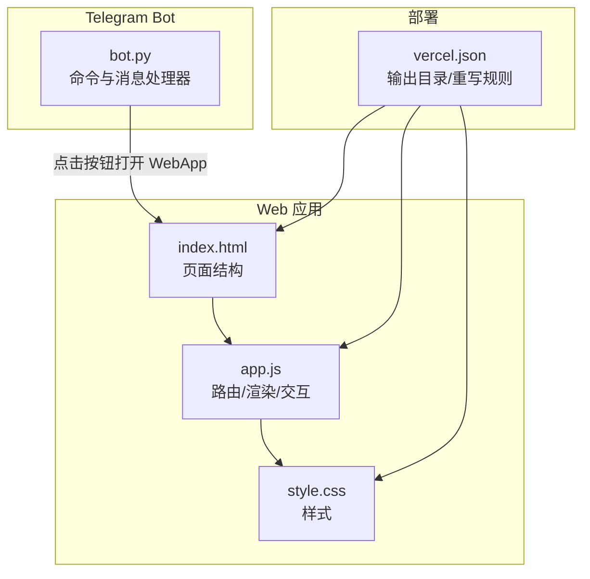
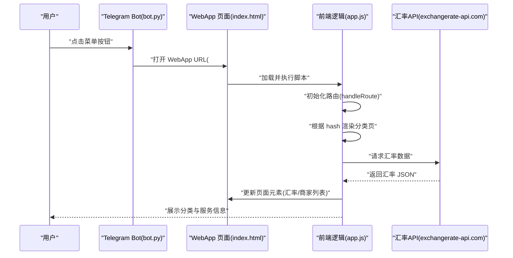
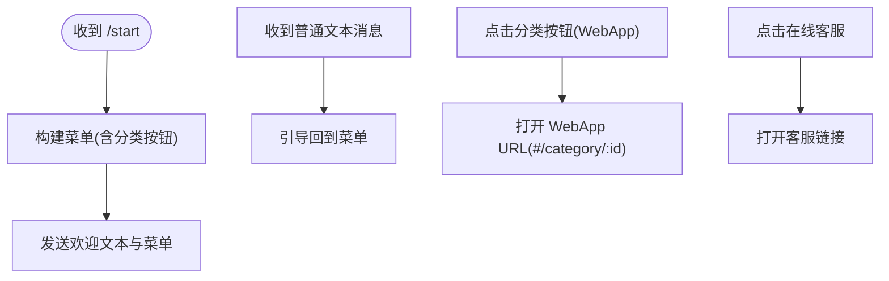
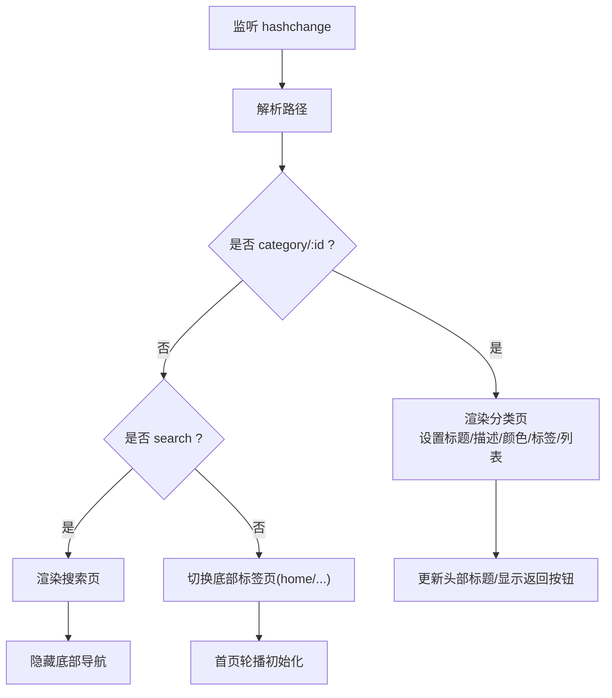
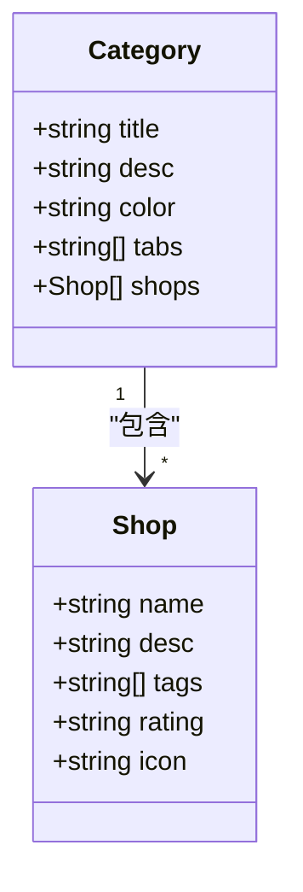
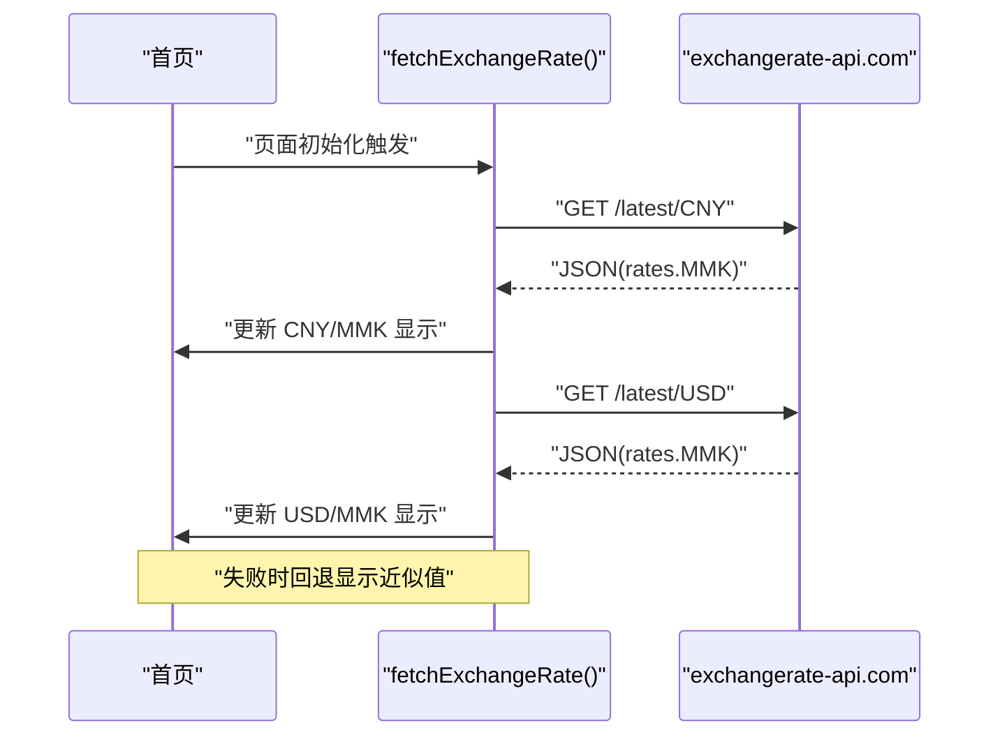
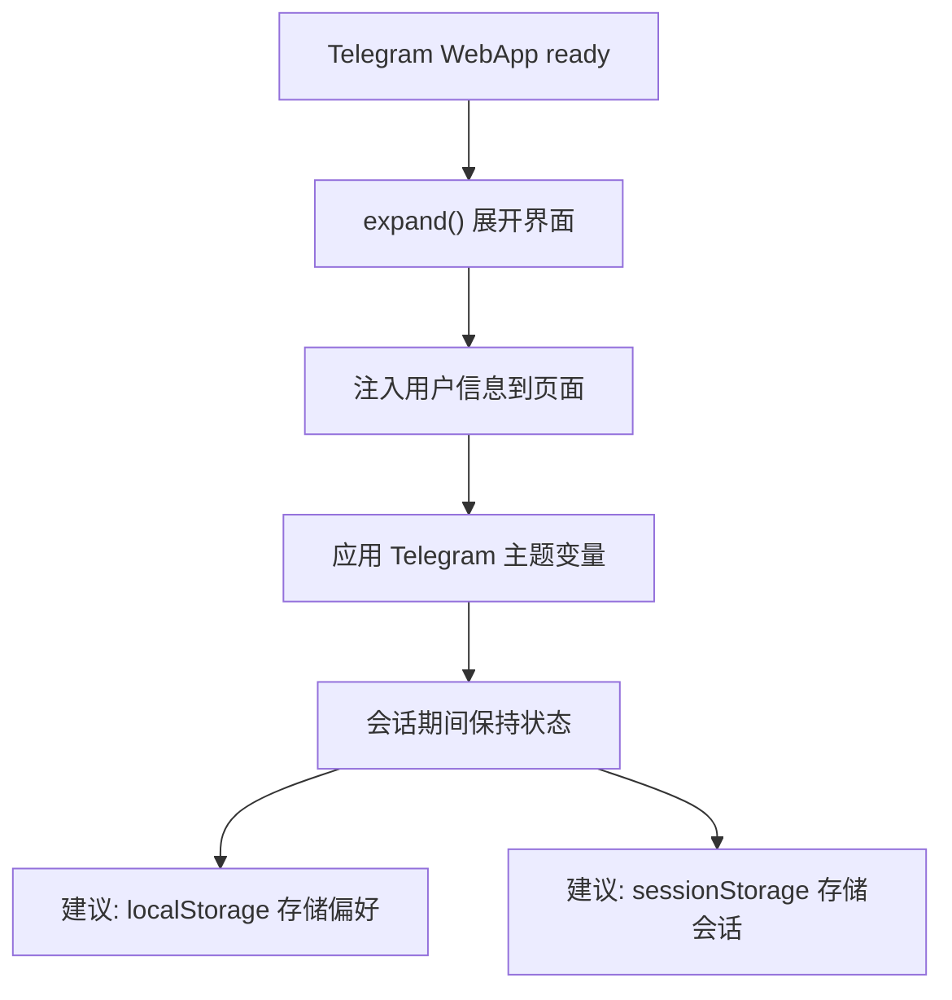
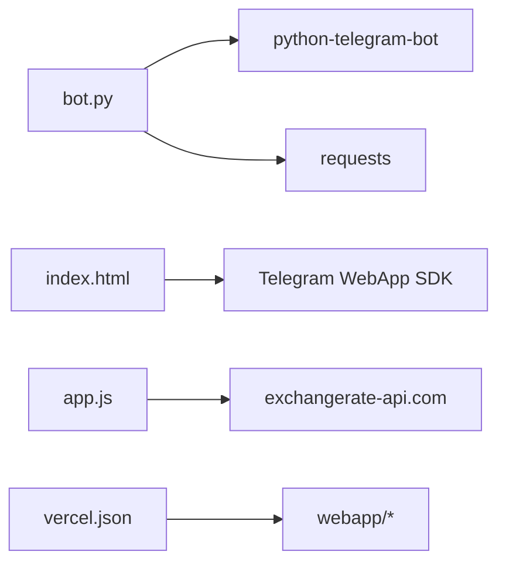

# 数据流设计

<cite>
**本文引用的文件**
- [bot.py](file://bot/bot.py)
- [requirements.txt](file://bot/requirements.txt)
- [index.html](file://webapp/index.html)
- [app.js](file://webapp/js/app.js)
- [style.css](file://webapp/css/style.css)
- [vercel.json](file://vercel.json)
</cite>

## 目录
1. [简介](#简介)
2. [项目结构](#项目结构)
3. [核心组件](#核心组件)
4. [架构总览](#架构总览)
5. [详细组件分析](#详细组件分析)
6. [依赖关系分析](#依赖关系分析)
7. [性能考量](#性能考量)
8. [故障排查指南](#故障排查指南)
9. [结论](#结论)

## 简介
本文件面向 wyszbot 项目的数据流设计，聚焦以下目标：
- 用户输入数据从 Telegram Bot 进入，经由菜单解析与路由处理，最终在 Web 应用中呈现；
- 服务分类数据的结构设计与字段作用（标题、描述、颜色、标签、商家列表等）；
- 外部 API 数据（汇率）的获取与缓存策略；
- 用户会话数据的管理方式（聊天记录与用户偏好存储）；
- 提供数据流图与时序图，帮助开发者理解数据在系统中的流转过程。

## 项目结构
项目采用“Telegram Bot + 静态 Web 应用”的轻量架构：
- Telegram Bot 负责接收用户消息、生成菜单按钮并通过 WebApp 打开静态页面；
- Web 应用通过前端路由与本地数据渲染页面内容；
- 部署于 Vercel，静态资源直接托管。

图表来源
- [bot.py:14-42](file://bot/bot.py#L14-L42)
- [index.html:1-145](file://webapp/index.html#L1-L145)
- [app.js:51-86](file://webapp/js/app.js#L51-L86)
- [vercel.json:1-8](file://vercel.json#L1-L8)

章节来源
- [bot.py:1-88](file://bot/bot.py#L1-L88)
- [index.html:1-145](file://webapp/index.html#L1-L145)
- [app.js:1-87](file://webapp/js/app.js#L1-L87)
- [vercel.json:1-8](file://vercel.json#L1-L8)

## 核心组件
- Telegram Bot（bot.py）
  - 负责启动、注册命令与消息处理器；
  - 构建键盘菜单，使用 WebApp 打开指定路径；
  - 响应“在线客服”等特殊按钮。
- Web 应用（webapp/*）
  - 首页、分类页、搜索页、个人中心等页面；
  - 前端路由基于 URL hash；
  - 内置服务分类数据与汇率接口调用；
  - 通过 Telegram WebApp SDK 注入用户信息。
- 部署配置（vercel.json）
  - 输出目录为 webapp；
  - 重写规则支持单页应用路由。

章节来源
- [bot.py:45-83](file://bot/bot.py#L45-L83)
- [index.html:21-140](file://webapp/index.html#L21-L140)
- [app.js:51-86](file://webapp/js/app.js#L51-L86)
- [vercel.json:1-8](file://vercel.json#L1-L8)

## 架构总览
下图展示了从用户输入到页面渲染的总体数据流。

图表来源
- [bot.py:14-42](file://bot/bot.py#L14-L42)
- [index.html:118-124](file://webapp/index.html#L118-L124)
- [app.js:64-78](file://webapp/js/app.js#L64-L78)
- [app.js:84](file://webapp/js/app.js#L84)

## 详细组件分析

### Telegram Bot 数据入口与菜单路由
- 菜单构建
  - 使用 WebApp 键盘按钮打开 WebApp，并携带分类参数；
  - 支持“首页”、“服务分类”、“客服”等入口。
- 命令与消息处理
  - /start 命令发送欢迎文本与菜单；
  - 文本消息默认引导回菜单；
  - “在线客服”按钮跳转至客服链接。
- 环境变量
  - BOT_TOKEN、WEBAPP_URL 用于运行时配置；
  - 客服链接常量用于客服跳转。

图表来源
- [bot.py:45-74](file://bot/bot.py#L45-L74)
- [bot.py:14-42](file://bot/bot.py#L14-L42)

章节来源
- [bot.py:14-42](file://bot/bot.py#L14-L42)
- [bot.py:45-74](file://bot/bot.py#L45-L74)

### Web 应用前端路由与页面渲染
- 路由机制
  - 基于 URL hash 的简单 SPA 路由；
  - 支持 home、errand、expose、activity、profile、category/:id、search 等路径；
  - 切换标签页时清空历史栈，避免返回错位。
- 页面结构
  - 首页包含轮播、搜索栏、分类网格、热门推荐与汇率卡片；
  - 分类页包含分类标题/描述/颜色、标签页与商家列表；
  - 搜索页包含热门标签与输入框。
- 交互行为
  - 点击“联系商家”打开客服链接；
  - 点击“查看更多”进入对应分类；
  - 点击轮播点切换轮播图。

图表来源
- [app.js:64-78](file://webapp/js/app.js#L64-L78)
- [index.html:118-131](file://webapp/index.html#L118-L131)

章节来源
- [index.html:21-140](file://webapp/index.html#L21-L140)
- [app.js:51-86](file://webapp/js/app.js#L51-L86)

### 服务分类数据结构设计
- 结构概览
  - 以分类键（如 food、hotel、exchange 等）为根；
  - 每个分类包含：标题、描述、颜色、标签数组、商家列表；
  - 商家对象包含：名称、描述、标签数组、评分、图标。
- 字段作用
  - 标题/描述：用于分类页头部展示；
  - 颜色：用于分类页横幅与卡片背景渐变；
  - 标签：用于分类页标签页筛选；
  - 商家列表：用于渲染服务卡片与联系按钮。
- 示例字段路径
  - 分类根：[app.js:1-49](file://webapp/js/app.js#L1-L49)
  - 标题/描述/颜色：[app.js:1-6](file://webapp/js/app.js#L1-L6)
  - 标签数组：[app.js:1-6](file://webapp/js/app.js#L1-L6)
  - 商家列表：[app.js:1-6](file://webapp/js/app.js#L1-L6)

图表来源
- [app.js:1-6](file://webapp/js/app.js#L1-L6)

章节来源
- [app.js:1-6](file://webapp/js/app.js#L1-L6)

### 外部 API 数据（汇率）获取与缓存策略
- 获取流程
  - 首页加载时调用汇率接口，分别请求 CNY 与 USD 对 MMK 的汇率；
  - 解析响应 JSON，提取 rates.MMK 并更新页面元素；
  - 请求失败时回退显示近似值。
- 缓存策略
  - 当前实现未显式设置缓存头或本地持久化；
  - 建议在生产环境增加：
    - 浏览器缓存控制（Cache-Control/ETag）；
    - 本地存储（localStorage/sessionStorage）短期缓存；
    - 服务端代理缓存（如 Vercel Edge Functions）以减少跨域请求与重复调用。

图表来源
- [app.js:84](file://webapp/js/app.js#L84)

章节来源
- [app.js:84](file://webapp/js/app.js#L84)

### 用户会话数据管理
- Telegram WebApp 注入
  - 初始化时读取用户信息（如 first_name），并注入到页面；
  - 通过 Telegram WebApp SDK 设置主题与扩展界面。
- 本地存储
  - 当前实现未见持久化存储用户偏好或聊天记录；
  - 建议：
    - 使用 localStorage 存储用户偏好（如上次访问分类、搜索历史）；
    - 使用 sessionStorage 管理会话内状态（如当前页面、历史栈）；
    - 若需要长期记录，可考虑服务端会话（需额外后端）。

图表来源
- [app.js:54](file://webapp/js/app.js#L54)

章节来源
- [app.js:54](file://webapp/js/app.js#L54)

## 依赖关系分析
- 外部依赖
  - Python Telegram Bot：负责消息处理与 WebApp 菜单；
  - requests：HTTP 请求（在当前实现中未直接使用，但已声明）。
- 前端依赖
  - Telegram WebApp SDK：用于注入用户信息与主题；
  - exchangerate-api.com：实时汇率接口。
- 部署依赖
  - Vercel：静态站点托管，输出目录为 webapp。

图表来源
- [requirements.txt:1-3](file://bot/requirements.txt#L1-L3)
- [index.html:9](file://webapp/index.html#L9)
- [app.js:84](file://webapp/js/app.js#L84)
- [vercel.json:1-8](file://vercel.json#L1-L8)

章节来源
- [requirements.txt:1-3](file://bot/requirements.txt#L1-L3)
- [index.html:9](file://webapp/index.html#L9)
- [app.js:84](file://webapp/js/app.js#L84)
- [vercel.json:1-8](file://vercel.json#L1-L8)

## 性能考量
- 前端性能
  - 使用 CSS 动画与渐变背景，避免复杂 JS 动画；
  - 图片资源建议使用现代格式与懒加载（当前为内联渐变背景）。
- 网络性能
  - 汇率接口仅在首页加载时调用，建议增加缓存与错误回退；
  - 可考虑合并请求或使用服务端代理以减少跨域与重复请求。
- 移动端体验
  - 使用 Telegram WebApp SDK 自动适配界面高度与主题；
  - 导航与卡片交互使用触摸友好的尺寸与反馈。

## 故障排查指南
- Telegram Bot 无法启动
  - 检查 BOT_TOKEN 是否正确配置；
  - 确认网络可达性与代理设置。
- WebApp 无法打开
  - 检查 WEBAPP_URL 是否指向正确的部署地址；
  - 确认 Vercel 部署输出目录为 webapp。
- 分类页不显示
  - 检查 URL hash 是否为 #/category/:id；
  - 确认分类键存在于本地数据结构中。
- 汇率不更新
  - 检查网络连通性与 API 可用性；
  - 查看控制台错误与回退逻辑是否生效。
- 用户信息未显示
  - 确认 Telegram WebApp SDK 已加载；
  - 检查 initDataUnsafe.user 是否存在。

章节来源
- [bot.py:9-11](file://bot/bot.py#L9-L11)
- [vercel.json:3](file://vercel.json#L3)
- [app.js:64-78](file://webapp/js/app.js#L64-L78)
- [app.js:84](file://webapp/js/app.js#L84)
- [app.js:54](file://webapp/js/app.js#L54)

## 结论
wyszbot 采用“Bot + 静态 Web 应用”的轻量架构，数据流清晰且易于扩展。当前实现以本地数据与外部 API 为主，具备良好的移动端体验与可维护性。建议在生产环境中增强：
- 外部 API 的缓存与错误处理；
- 用户偏好与会话数据的本地持久化；
- 服务端代理以优化网络与安全性。