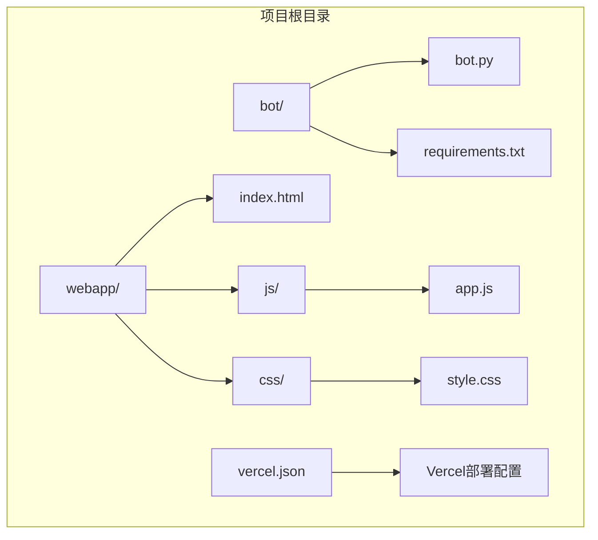
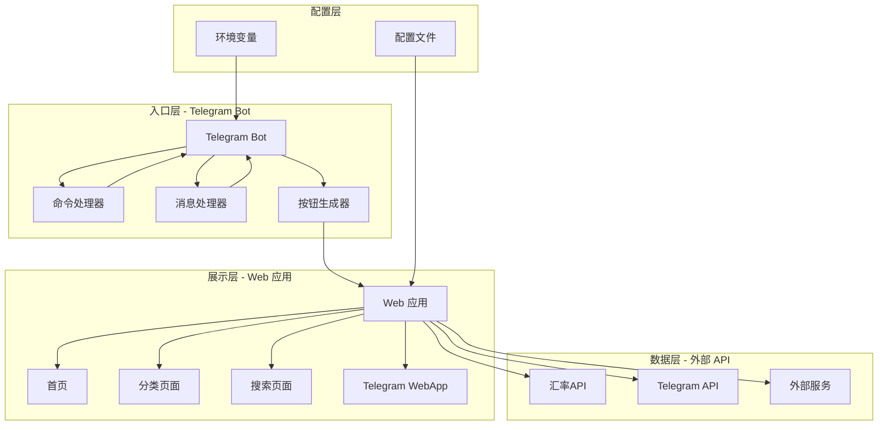
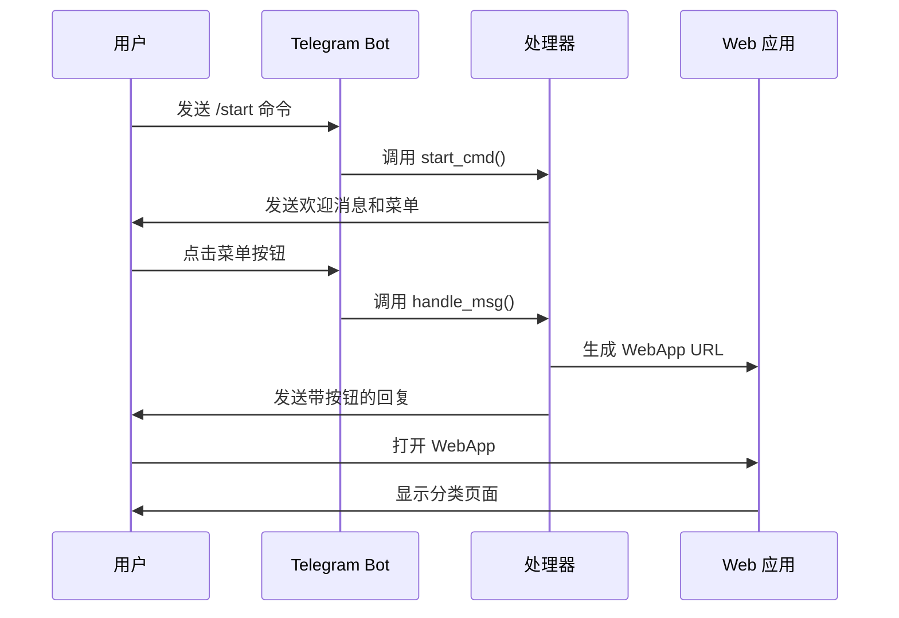
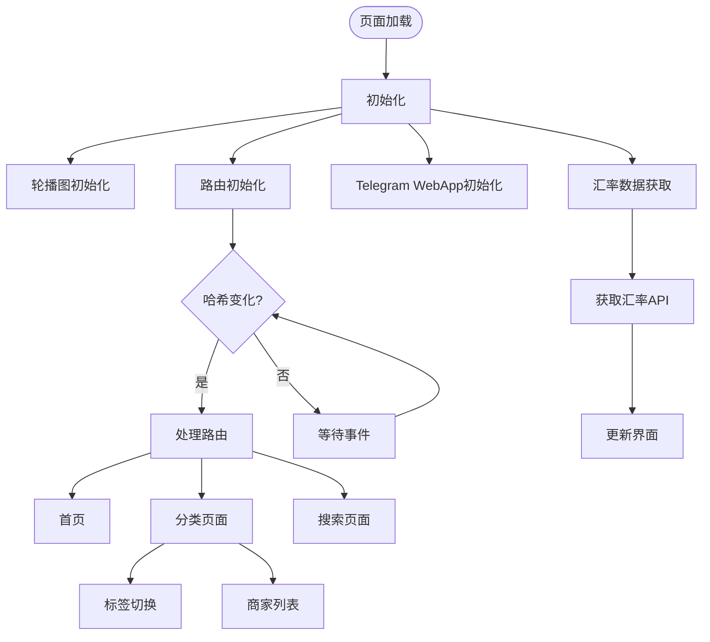
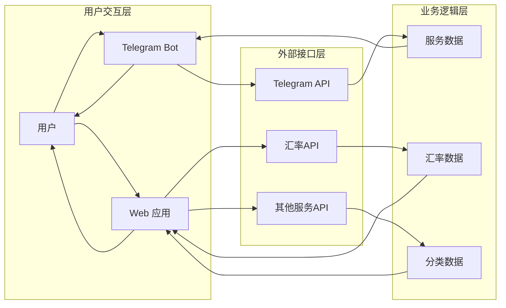
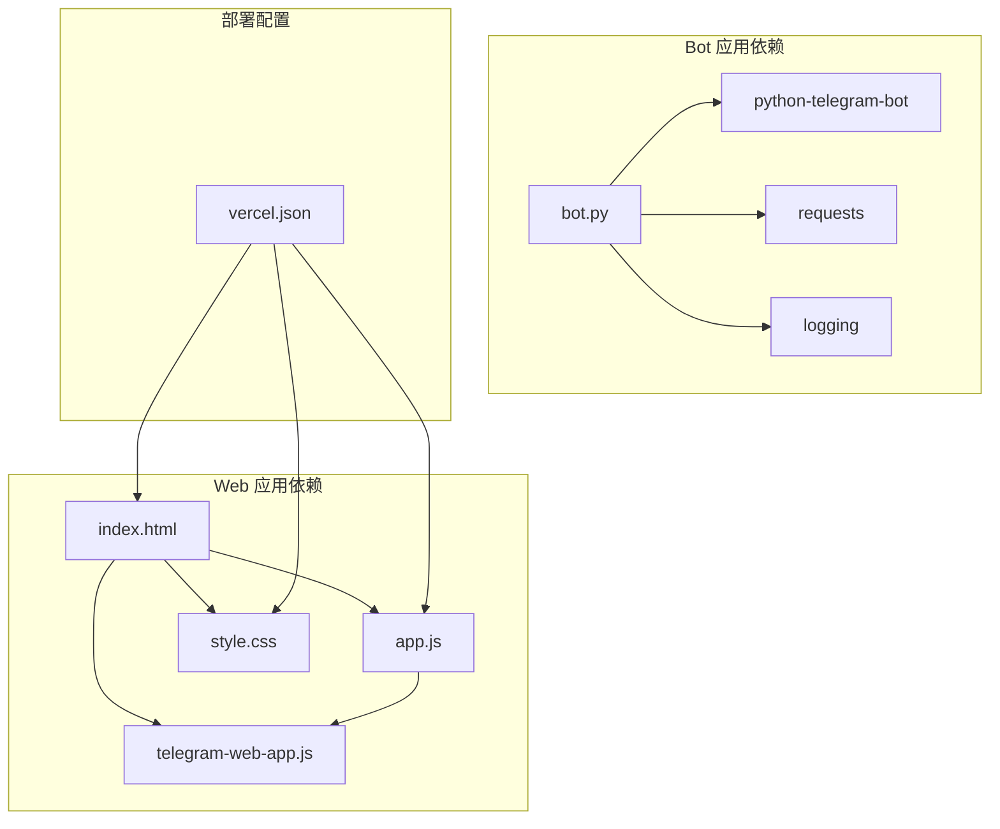

# 整体架构设计

<cite>
**本文档引用的文件**
- [bot.py](file://bot/bot.py)
- [requirements.txt](file://bot/requirements.txt)
- [index.html](file://webapp/index.html)
- [app.js](file://webapp/js/app.js)
- [style.css](file://webapp/css/style.css)
- [vercel.json](file://vercel.json)
</cite>

## 目录
1. [简介](#简介)
2. [项目结构](#项目结构)
3. [核心组件](#核心组件)
4. [架构概览](#架构概览)
5. [详细组件分析](#详细组件分析)
6. [依赖关系分析](#依赖关系分析)
7. [性能考虑](#性能考虑)
8. [故障排除指南](#故障排除指南)
9. [结论](#结论)

## 简介

wyszbot 是一个基于 Telegram 的木姐同城生活助手应用，采用三层架构设计模式。该项目通过 Telegram Bot 作为消息入口和控制器，Web 应用作为数据展示和用户交互界面，实现了完整的前后端分离架构。系统通过模块化组织方式，将 Bot 应用程序、Web 应用程序、配置管理和环境变量进行清晰分离，为用户提供便捷的生活服务查询和导航功能。

## 项目结构

项目采用清晰的模块化组织结构，主要分为三个核心部分：

**图表来源**
- [bot.py:1-88](file://bot/bot.py#L1-L88)
- [index.html:1-145](file://webapp/index.html#L1-L145)
- [app.js:1-87](file://webapp/js/app.js#L1-L87)
- [style.css:1-80](file://webapp/css/style.css#L1-L80)
- [vercel.json:1-8](file://vercel.json#L1-L8)

**章节来源**
- [bot.py:1-88](file://bot/bot.py#L1-L88)
- [index.html:1-145](file://webapp/index.html#L1-L145)
- [app.js:1-87](file://webapp/js/app.js#L1-L87)
- [style.css:1-80](file://webapp/css/style.css#L1-L80)
- [vercel.json:1-8](file://vercel.json#L1-L8)

## 核心组件

### Bot 应用程序组件

Bot 应用程序是整个系统的消息入口和控制器，负责处理用户的 Telegram 交互请求。其核心功能包括：

- **启动命令处理**：响应 `/start` 命令，向用户发送欢迎信息和功能菜单
- **消息路由**：根据用户输入内容进行智能路由和处理
- **键盘按钮生成**：动态生成包含 WebApp 链接的键盘按钮
- **客户服务连接**：提供在线客服联系方式

### Web 应用程序组件

Web 应用程序作为数据展示和用户交互界面，提供丰富的用户体验：

- **多页面导航**：首页、跑腿服务、曝光台、活动、个人中心等页面
- **分类浏览**：按服务类型分类展示商家和服务信息
- **实时汇率**：集成外部汇率 API 获取实时汇率数据
- **搜索功能**：支持关键词搜索和热门标签搜索
- **Telegram WebApp 集成**：原生支持 Telegram WebApp 框架

### 配置管理组件

系统通过环境变量和配置文件实现灵活的配置管理：

- **环境变量配置**：Bot Token 和 WebApp URL 的动态配置
- **Vercel 部署配置**：自动化的静态网站托管配置
- **主题定制**：CSS 变量系统支持主题定制

**章节来源**
- [bot.py:45-83](file://bot/bot.py#L45-L83)
- [index.html:1-145](file://webapp/index.html#L1-L145)
- [app.js:1-87](file://webapp/js/app.js#L1-L87)
- [vercel.json:1-8](file://vercel.json#L1-L8)

## 架构概览

系统采用三层架构设计，实现了清晰的职责分离和模块化组织：

**图表来源**
- [bot.py:77-83](file://bot/bot.py#L77-L83)
- [index.html:1-145](file://webapp/index.html#L1-L145)
- [app.js:82-84](file://webapp/js/app.js#L82-L84)

### 架构特点

1. **前后端分离**：Bot 专注于消息处理，Web 应用专注于数据展示
2. **模块化设计**：每个组件职责明确，便于维护和扩展
3. **环境解耦**：通过环境变量实现配置的灵活管理
4. **响应式设计**：支持移动端和桌面端访问

## 详细组件分析

### Bot 组件详细分析

Bot 组件采用事件驱动架构，通过回调函数处理不同的用户交互场景：

**图表来源**
- [bot.py:45-74](file://bot/bot.py#L45-L74)
- [bot.py:14-42](file://bot/bot.py#L14-L42)

#### 关键实现特性

- **动态菜单生成**：根据服务类型动态生成键盘按钮
- **WebApp 集成**：通过 WebAppInfo 实现与 Web 应用的无缝连接
- **客户服务支持**：提供在线客服链接按钮
- **国际化支持**：支持中文界面和表情符号

**章节来源**
- [bot.py:14-42](file://bot/bot.py#L14-L42)
- [bot.py:45-74](file://bot/bot.py#L45-L74)

### Web 应用组件详细分析

Web 应用采用单页应用(SPA)架构，通过哈希路由实现页面切换：

**图表来源**
- [app.js:51-66](file://webapp/js/app.js#L51-L66)
- [app.js:76-78](file://webapp/js/app.js#L76-L78)

#### 核心功能模块

1. **首页展示模块**：
   - 轮播图展示热门服务
   - 分类网格快速导航
   - 实时汇率卡片
   - 热门推荐列表

2. **分类浏览模块**：
   - 动态分类页面生成
   - 标签筛选功能
   - 商家信息展示
   - 联系商家功能

3. **搜索模块**：
   - 关键词搜索
   - 热门标签推荐
   - 搜索结果导航

4. **Telegram WebApp 集成模块**：
   - 用户信息获取
   - 主题适配
   - 原生功能支持

**章节来源**
- [index.html:21-124](file://webapp/index.html#L21-L124)
- [app.js:51-84](file://webapp/js/app.js#L51-L84)
- [style.css:1-80](file://webapp/css/style.css#L1-L80)

### 数据流分析

系统中的数据流向体现了清晰的层次结构：

**图表来源**
- [bot.py:9-11](file://bot/bot.py#L9-L11)
- [app.js:82-84](file://webapp/js/app.js#L82-L84)

**章节来源**
- [bot.py:9-11](file://bot/bot.py#L9-L11)
- [app.js:82-84](file://webapp/js/app.js#L82-L84)

## 依赖关系分析

系统采用模块化依赖管理，确保各组件间的松耦合：

**图表来源**
- [requirements.txt:1-3](file://bot/requirements.txt#L1-L3)
- [vercel.json:1-8](file://vercel.json#L1-L8)

### 外部依赖分析

1. **Telegram Bot 框架**：提供完整的 Telegram API 封装
2. **HTTP 客户端**：用于外部 API 调用
3. **Telegram WebApp SDK**：提供原生移动应用体验
4. **静态资源托管**：通过 Vercel 实现 CDN 加速

**章节来源**
- [requirements.txt:1-3](file://bot/requirements.txt#L1-L3)
- [vercel.json:1-8](file://vercel.json#L1-L8)

## 性能考虑

### 前端性能优化

1. **懒加载策略**：仅在需要时加载相关模块
2. **缓存机制**：利用浏览器缓存减少重复加载
3. **响应式设计**：优化移动端性能表现
4. **CDN 加速**：通过 Vercel 提供全球加速

### 后端性能优化

1. **异步处理**：Bot 使用异步模式提高并发处理能力
2. **连接池管理**：合理管理外部 API 连接
3. **错误重试机制**：对外部服务调用进行重试处理
4. **日志监控**：通过日志系统监控性能指标

## 故障排除指南

### 常见问题及解决方案

1. **Bot 无法启动**
   - 检查 BOT_TOKEN 环境变量配置
   - 验证网络连接和代理设置
   - 查看日志输出定位具体错误

2. **WebApp 页面显示异常**
   - 确认 WEBAPP_URL 环境变量正确配置
   - 检查 Vercel 部署状态和域名解析
   - 验证 Telegram WebApp SDK 加载情况

3. **汇率数据获取失败**
   - 检查外部汇率 API 可用性
   - 验证网络连接和防火墙设置
   - 实现降级策略提供默认值

4. **按钮点击无响应**
   - 检查 WebApp URL 格式是否正确
   - 验证 Telegram WebApp 配置
   - 确认按钮事件绑定正常

**章节来源**
- [bot.py:77-83](file://bot/bot.py#L77-L83)
- [app.js:82-84](file://webapp/js/app.js#L82-L84)

## 结论

wyszbot 项目成功实现了基于 Telegram 的同城生活助手应用，采用了清晰的三层架构设计和模块化组织方式。通过 Bot 作为消息入口和控制器，Web 应用作为数据展示和用户交互界面，系统实现了高效的前后端分离架构。

### 主要优势

1. **架构清晰**：三层架构设计使系统职责分明，易于维护和扩展
2. **用户体验优秀**：通过 Telegram WebApp 提供原生应用体验
3. **部署简单**：基于 Vercel 的静态网站托管，部署和维护成本低
4. **性能优异**：合理的缓存策略和 CDN 加速提升访问速度

### 技术亮点

1. **模块化设计**：各组件职责明确，便于独立开发和测试
2. **环境解耦**：通过环境变量实现配置的灵活管理
3. **响应式设计**：支持多终端访问，用户体验一致
4. **国际化支持**：支持多语言界面和表情符号

该架构设计为类似的应用开发提供了良好的参考模板，特别是在 Telegram 生态系统中的应用开发方面具有重要的借鉴意义。