# 组件交互机制

<cite>
**本文档引用的文件**
- [bot.py](file://bot/bot.py)
- [index.html](file://webapp/index.html)
- [app.js](file://webapp/js/app.js)
- [style.css](file://webapp/css/style.css)
- [vercel.json](file://vercel.json)
</cite>

## 目录
1. [简介](#简介)
2. [项目架构概览](#项目架构概览)
3. [核心组件分析](#核心-components)
4. [架构交互图](#架构交互图)
5. [详细组件分析](#详细组件分析)
6. [路由系统与菜单映射](#路由系统与菜单映射)
7. [数据流分析](#数据流分析)
8. [性能考虑](#性能考虑)
9. [故障排除指南](#故障排除指南)
10. [结论](#结论)

## 简介

wyszbot 是一个基于 Telegram Bot 和 Web 应用的综合服务平台，旨在为用户提供木姐地区的同城生活服务。该项目实现了 Bot 与 Web 应用之间的无缝集成，通过 Telegram WebApp 技术实现原生应用级别的用户体验。

系统的核心特点：
- **Bot 层**：基于 Python Telegram Bot API 构建，提供智能对话和菜单导航
- **Web 应用层**：单页面应用（SPA），支持 Hash 路由和响应式设计
- **集成机制**：通过 WebAppInfo 实现 Bot 按钮到 Web 应用的直接跳转
- **数据管理**：内置服务数据结构，支持实时汇率查询和动态内容加载

## 项目架构概览

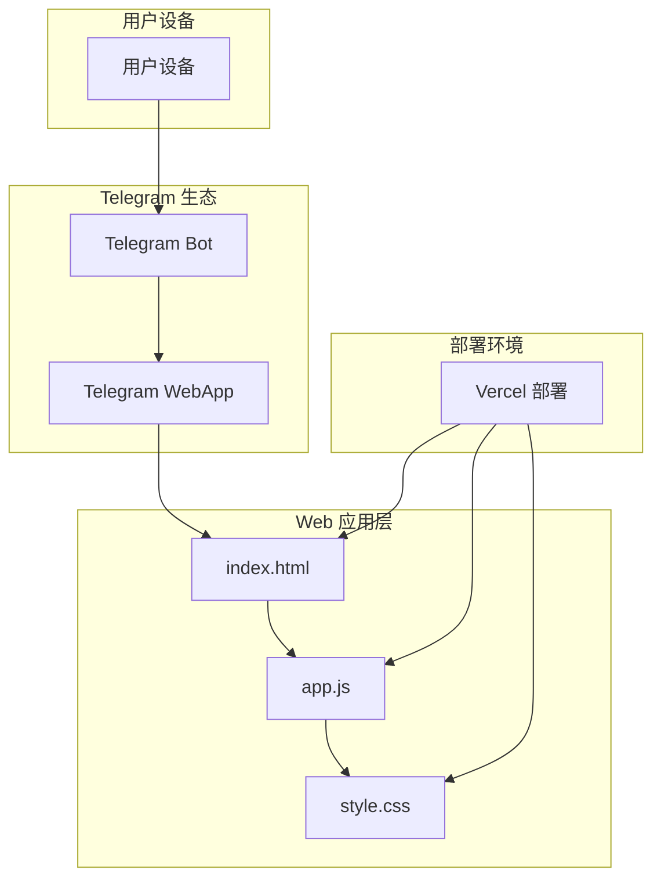

**图表来源**
- [bot.py:1-88](file://bot/bot.py#L1-L88)
- [index.html:1-145](file://webapp/index.html#L1-L145)
- [app.js:1-87](file://webapp/js/app.js#L1-L87)
- [vercel.json:1-8](file://vercel.json#L1-L8)

## 核心组件分析

### Bot 组件

Bot 组件是整个系统的控制中心，负责用户交互和菜单生成：

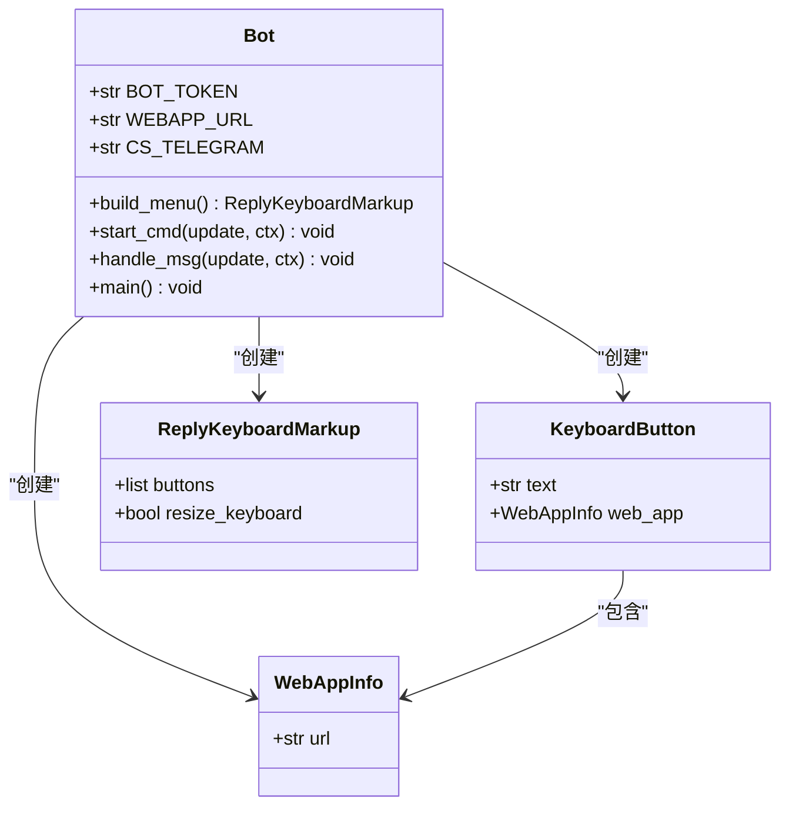

**图表来源**
- [bot.py:14-42](file://bot/bot.py#L14-L42)
- [bot.py:45-74](file://bot/bot.py#L45-L74)

### Web 应用组件

Web 应用采用模块化设计，包含多个功能页面：

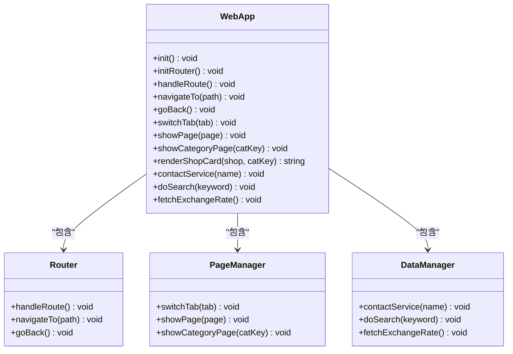

**图表来源**
- [app.js:51-86](file://webapp/js/app.js#L51-L86)

**章节来源**
- [bot.py:1-88](file://bot/bot.py#L1-L88)
- [app.js:1-87](file://webapp/js/app.js#L1-L87)

## 架构交互图

### 完整交互流程

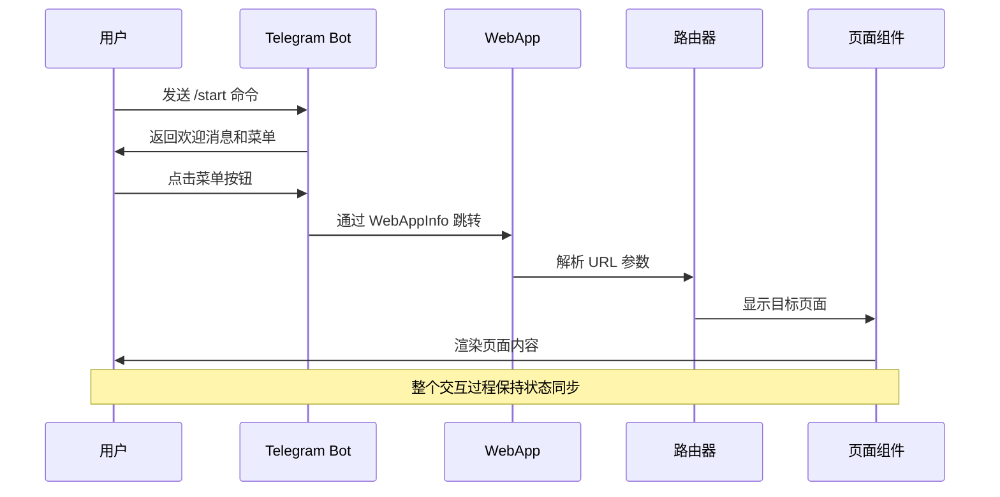

**图表来源**
- [bot.py:45-58](file://bot/bot.py#L45-L58)
- [app.js:64-76](file://webapp/js/app.js#L64-L76)

### 按钮点击处理流程

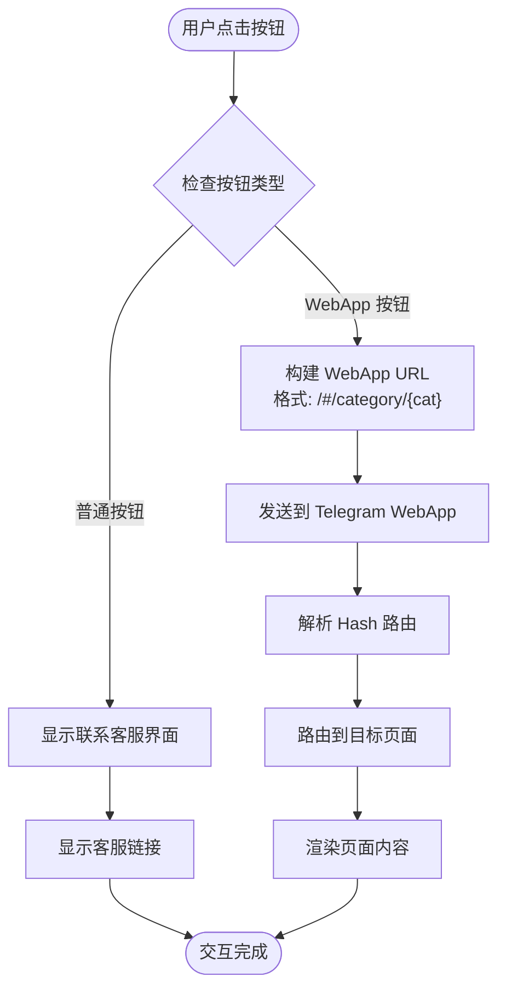

**图表来源**
- [bot.py:14-42](file://bot/bot.py#L14-L42)
- [app.js:64-76](file://webapp/js/app.js#L64-L76)

## 详细组件分析

### Bot 层消息处理流程

Bot 层实现了完整的消息处理机制：

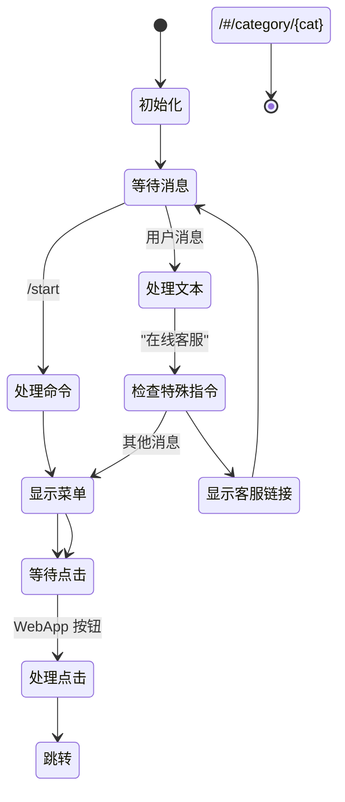

**图表来源**
- [bot.py:45-74](file://bot/bot.py#L45-L74)

### Web 应用路由系统

Web 应用采用 Hash 路由实现 SPA 导航：

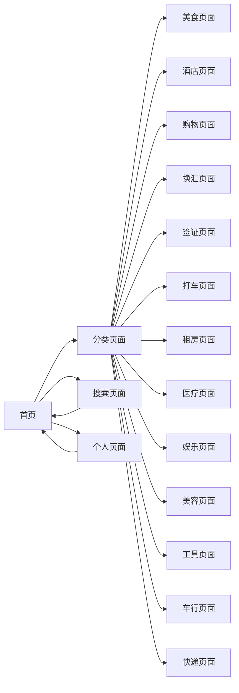

**图表来源**
- [app.js:64-76](file://webapp/js/app.js#L64-L76)
- [index.html:118-124](file://webapp/index.html#L118-L124)

**章节来源**
- [bot.py:45-74](file://bot/bot.py#L45-L74)
- [app.js:64-76](file://webapp/js/app.js#L64-L76)

## 路由系统与菜单映射

### 菜单到路由的映射关系

| Bot 菜单 | WebApp 路由 | 页面类型 |
|---------|------------|----------|
| 🌐 网页版 | `/` | 首页 |
| 🍜 美食 | `/#/category/food` | 分类页面 |
| 🏨 酒店 | `/#/category/hotel` | 分类页面 |
| 🛒 购物 | `/#/category/shopping` | 分类页面 |
| 💱 换汇 | `/#/category/exchange` | 分类页面 |
| 📋 签证 | `/#/category/visa` | 分类页面 |
| 🚕 打车 | `/#/category/taxi` | 分类页面 |
| 🏠 租赁 | `/#/category/rental` | 分类页面 |
| 🏥 医院 | `/#/category/hospital` | 分类页面 |
| 🎮 娱乐 | `/#/category/entertainment` | 分类页面 |
| 💆 美容 | `/#/category/beauty` | 分类页面 |
| 🔧 工具 | `/#/category/tools` | 分类页面 |
| 🚗 车行 | `/#/category/car` | 分类页面 |
| 📦 快递 | `/#/category/express` | 分类页面 |

### 路由参数传递机制

Web 应用通过 URL Hash 参数实现页面状态传递：

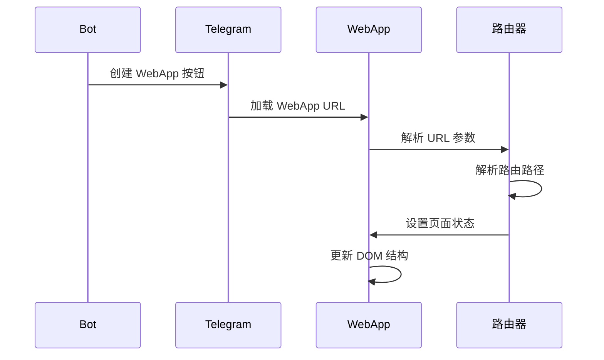

**图表来源**
- [bot.py:14-15](file://bot/bot.py#L14-L15)
- [app.js:64-66](file://webapp/js/app.js#L64-L66)

**章节来源**
- [bot.py:14-42](file://bot/bot.py#L14-L42)
- [app.js:64-76](file://webapp/js/app.js#L64-L76)

## 数据流分析

### 内置数据结构

Web 应用使用 JSON 数据结构存储服务信息：

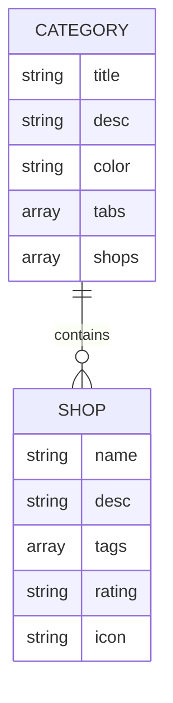

**图表来源**
- [app.js:1-49](file://webapp/js/app.js#L1-L49)

### 数据传递机制

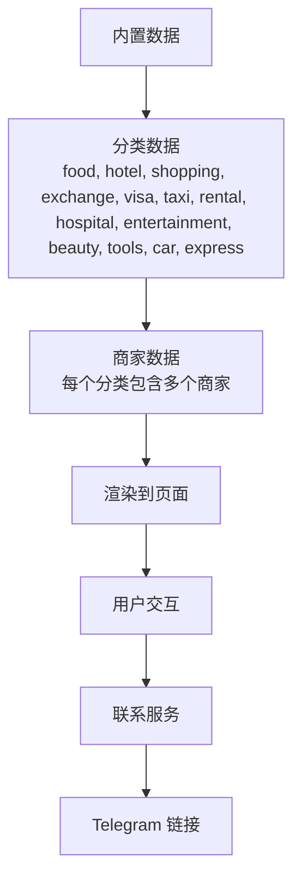

**图表来源**
- [app.js:1-49](file://webapp/js/app.js#L1-L49)

**章节来源**
- [app.js:1-49](file://webapp/js/app.js#L1-L49)

## 性能考虑

### 优化策略

1. **懒加载机制**：页面按需加载，减少初始加载时间
2. **缓存策略**：汇率数据定期缓存，避免频繁请求
3. **响应式设计**：适配不同屏幕尺寸，提升用户体验
4. **事件委托**：使用事件委托减少内存占用

### 性能监控

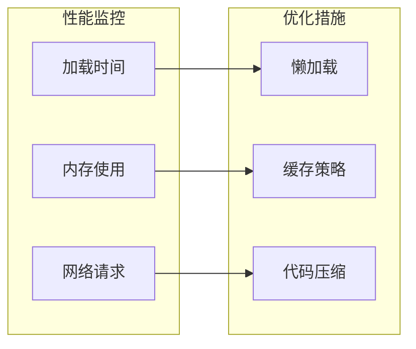

## 故障排除指南

### 常见问题及解决方案

| 问题类型 | 症状 | 解决方案 |
|---------|------|----------|
| Bot 无法启动 | 启动失败或报错 | 检查 BOT_TOKEN 环境变量配置 |
| WebApp 无法加载 | 页面空白或错误 | 检查 WEBAPP_URL 配置和网络连接 |
| 菜单按钮无效 | 点击无反应 | 验证 WebAppInfo URL 格式 |
| 路由跳转失败 | 页面无法正确显示 | 检查 Hash 路由解析逻辑 |
| 数据加载失败 | 商家信息不显示 | 验证内置数据结构完整性 |

### 调试方法

1. **Bot 调试**：启用日志记录，检查消息处理流程
2. **WebApp 调试**：使用浏览器开发者工具检查路由和数据绑定
3. **网络调试**：监控 API 请求和响应状态

**章节来源**
- [bot.py:6-7](file://bot/bot.py#L6-L7)
- [app.js:51-54](file://webapp/js/app.js#L51-L54)

## 结论

wyszbot 项目成功实现了 Telegram Bot 与 Web 应用的深度集成，通过以下关键机制确保了良好的用户体验：

1. **统一的交互模式**：Bot 按钮到 WebApp 的无缝跳转
2. **灵活的路由系统**：基于 Hash 的 SPA 路由实现
3. **模块化的数据管理**：清晰的分类和商家数据结构
4. **响应式的界面设计**：适配移动端的用户体验

该系统为用户提供了一个功能完整、操作流畅的同城生活服务平台，展示了现代 Web 技术与 Telegram 生态系统的完美结合。