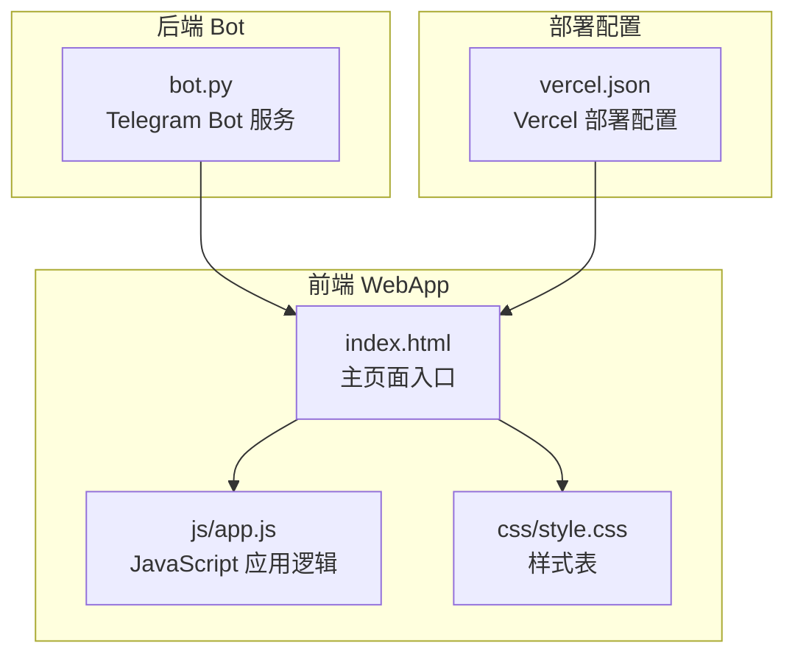
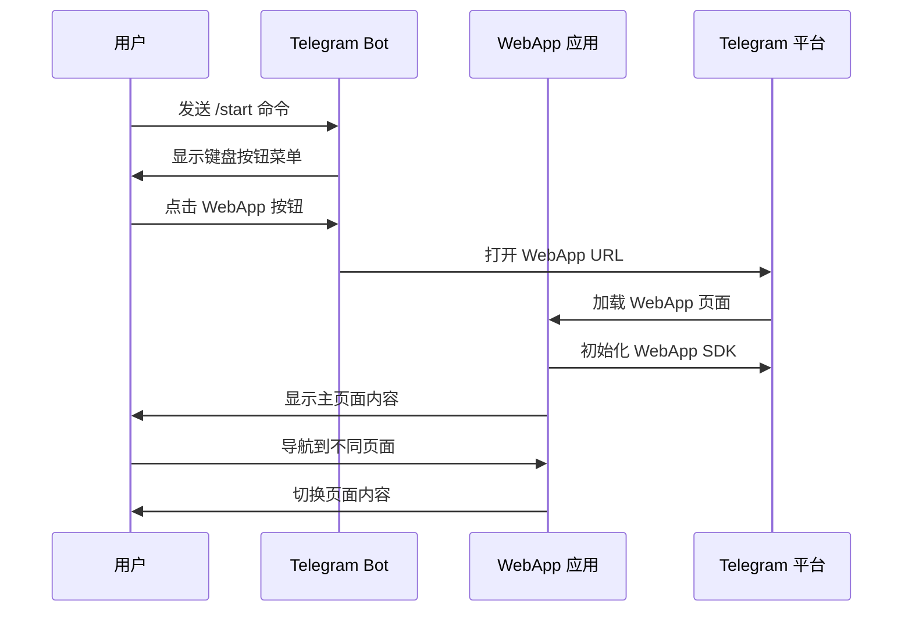
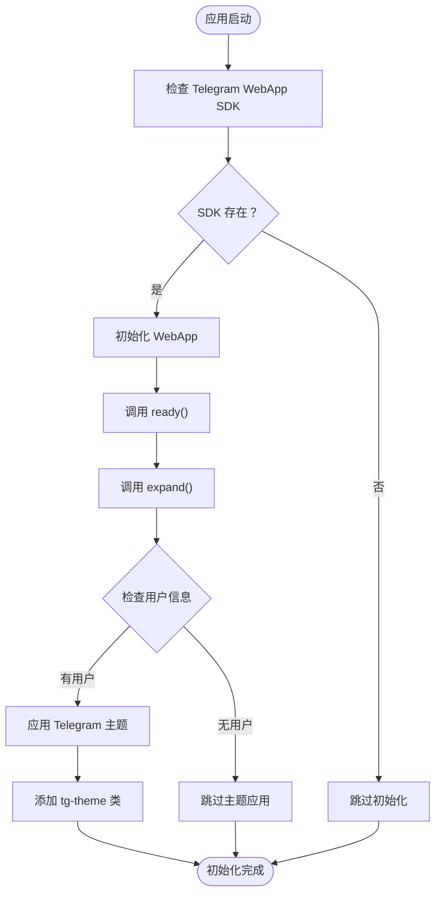
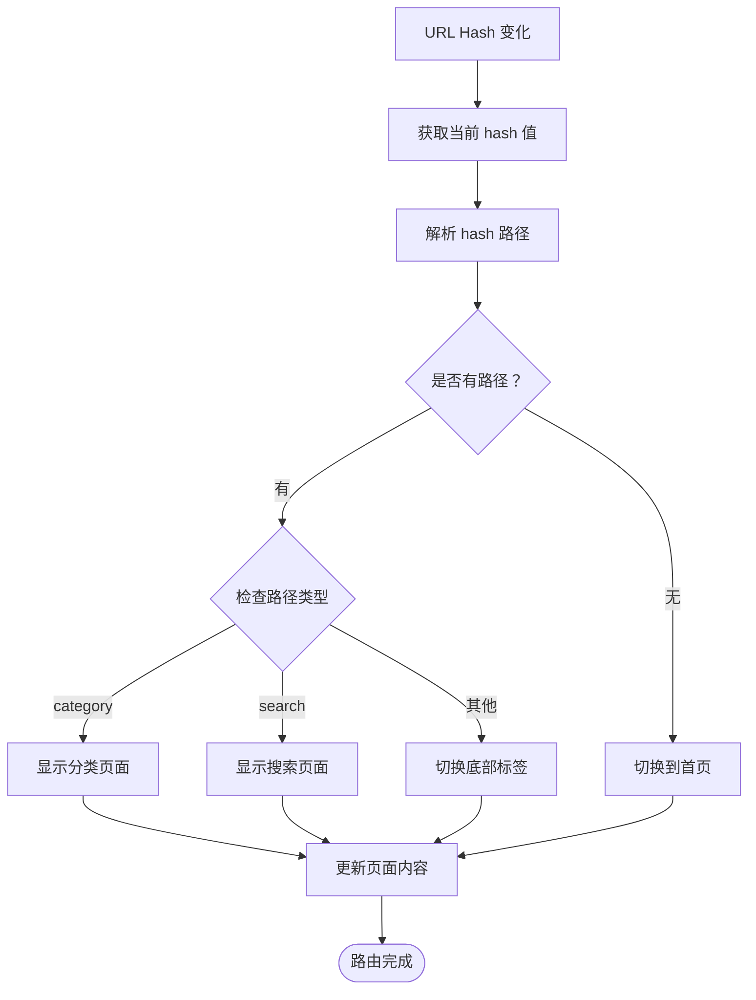
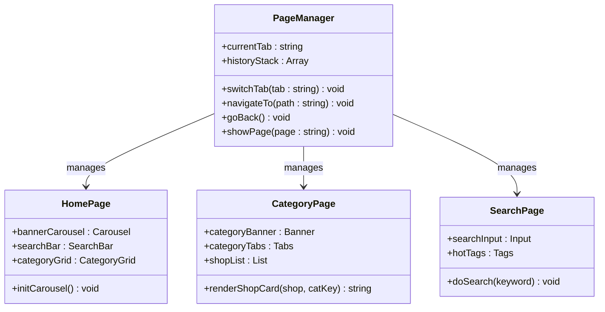
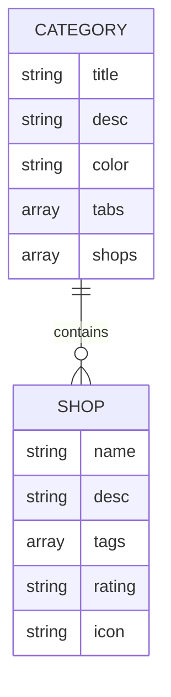
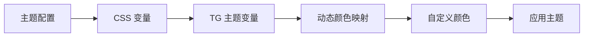
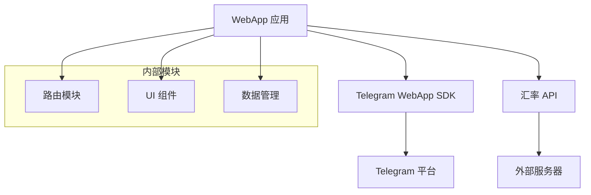
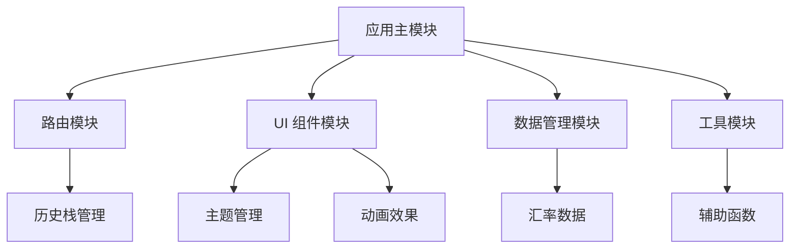
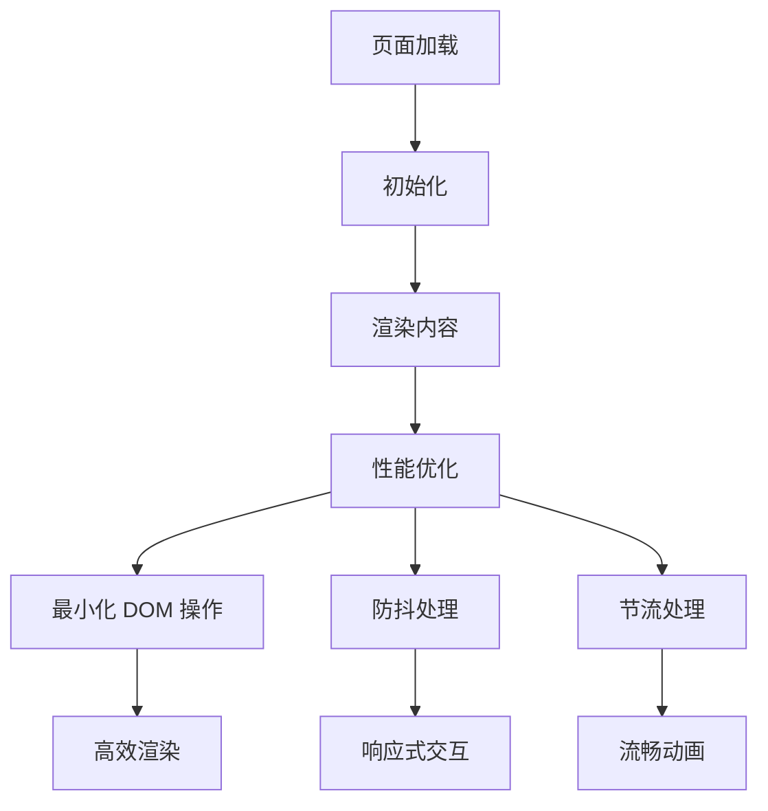

# WebApp 集成

<cite>
**本文档引用的文件**
- [index.html](file://webapp/index.html)
- [app.js](file://webapp/js/app.js)
- [style.css](file://webapp/css/style.css)
- [bot.py](file://bot/bot.py)
- [vercel.json](file://vercel.json)
</cite>

## 目录
1. [简介](#简介)
2. [项目结构](#项目结构)
3. [核心组件](#核心组件)
4. [架构概览](#架构概览)
5. [详细组件分析](#详细组件分析)
6. [依赖关系分析](#依赖关系分析)
7. [性能考虑](#性能考虑)
8. [故障排除指南](#故障排除指南)
9. [结论](#结论)

## 简介

wyszbot 是一个基于 Telegram WebApp SDK 的移动应用，为用户提供木姐地区的同城生活服务。该项目实现了完整的 SPA（单页应用程序）架构，通过 Hash 路由实现页面切换，并深度集成了 Telegram 生态系统，包括 WebApp SDK、Bot 交互和 Telegram 主题支持。

该应用提供了美食推荐、酒店住宿、购物指南、换汇服务、签证办理、交通出行等全方位的生活服务功能，通过直观的界面设计和流畅的用户体验为用户提供便捷的服务查找和联系功能。

## 项目结构

项目采用清晰的分层结构，主要包含 WebApp 前端应用和 Telegram Bot 后端服务：

**图表来源**
- [index.html:1-145](file://webapp/index.html#L1-L145)
- [app.js:1-87](file://webapp/js/app.js#L1-L87)
- [style.css:1-80](file://webapp/css/style.css#L1-L80)
- [bot.py:1-88](file://bot/bot.py#L1-L88)
- [vercel.json:1-8](file://vercel.json#L1-L8)

**章节来源**
- [index.html:1-145](file://webapp/index.html#L1-L145)
- [app.js:1-87](file://webapp/js/app.js#L1-L87)
- [style.css:1-80](file://webapp/css/style.css#L1-L80)
- [bot.py:1-88](file://bot/bot.py#L1-L88)
- [vercel.json:1-8](file://vercel.json#L1-L8)

## 核心组件

### Telegram WebApp SDK 集成

应用深度集成了 Telegram WebApp SDK，实现了以下功能：

- **主题适配**：自动检测并应用 Telegram 用户的主题颜色
- **用户信息获取**：获取用户基本信息用于个性化展示
- **全屏显示**：扩展应用至全屏模式
- **安全初始化**：确保 WebApp 在 Telegram 环境中正确初始化

### SPA 架构实现

应用采用纯 JavaScript 实现的 SPA 架构，通过以下机制实现页面管理：

- **Hash 路由系统**：使用 URL hash 实现页面导航
- **页面切换动画**：提供淡入效果增强用户体验
- **历史栈管理**：维护页面导航历史记录
- **响应式布局**：适配移动端设备

### 数据管理系统

应用内置了丰富的本地数据结构，支持多种服务类型：

- **分类数据**：美食、酒店、购物、换汇、签证等服务分类
- **商户信息**：每个分类下的具体商户详情
- **汇率数据**：实时汇率查询功能
- **轮播图系统**：动态内容展示

**章节来源**
- [app.js:51-87](file://webapp/js/app.js#L51-L87)
- [style.css:1-80](file://webapp/css/style.css#L1-L80)

## 架构概览

整个系统采用前后端分离架构，通过 Telegram Bot 作为入口点，引导用户访问 WebApp：

**图表来源**
- [bot.py:45-58](file://bot/bot.py#L45-L58)
- [app.js:51-54](file://webapp/js/app.js#L51-L54)

## 详细组件分析

### WebApp SDK 集成组件

#### 初始化流程

**图表来源**
- [app.js:51-54](file://webapp/js/app.js#L51-L54)

#### 主题系统

应用实现了动态主题适配机制，通过 CSS 变量和 Telegram 主题变量的映射：

- **主色调**：从 `--tg-theme-button-color` 获取
- **背景色**：从 `--tg-theme-bg-color` 获取  
- **文字色**：从 `--tg-theme-text-color` 和 `--tg-theme-hint-color` 获取

**章节来源**
- [app.js:51-54](file://webapp/js/app.js#L51-L54)
- [style.css:79-80](file://webapp/css/style.css#L79-L80)

### Hash 路由系统

#### 路由解析机制

**图表来源**
- [app.js:64-66](file://webapp/js/app.js#L64-L66)

#### 页面切换动画

应用实现了平滑的页面切换动画效果：

- **淡入动画**：新页面显示时的淡入效果
- **过渡时间**：0.3秒的动画持续时间
- **位移效果**：配合透明度变化的位移动画

**章节来源**
- [app.js:64-72](file://webapp/js/app.js#L64-L72)
- [style.css:7-8](file://webapp/css/style.css#L7-L8)

### 页面管理系统

#### 页面结构设计

应用采用模块化的页面设计，每个页面都有明确的功能定位：

- **首页 (home)**：展示轮播图、搜索框、分类网格
- **跑腿服务 (errand)**：提供同城跑腿服务
- **曝光台 (expose)**：用户举报和曝光功能
- **活动页面 (activity)**：同城活动信息展示
- **个人中心 (profile)**：用户个人信息和设置
- **分类页面 (category)**：具体服务类型的详细列表
- **搜索页面 (search)**：全局搜索功能

#### 页面切换机制

**图表来源**
- [app.js:72-78](file://webapp/js/app.js#L72-L78)
- [index.html:22-131](file://webapp/index.html#L22-L131)

**章节来源**
- [index.html:22-131](file://webapp/index.html#L22-L131)
- [app.js:72-78](file://webapp/js/app.js#L72-L78)

### 数据管理系统

#### 本地数据结构

应用使用 JSON 结构存储所有服务数据：

**图表来源**
- [app.js:1-49](file://webapp/js/app.js#L1-L49)

#### 数据访问模式

应用实现了高效的数据访问模式：

- **分类索引**：通过分类键快速访问数据
- **标签搜索**：支持按标签进行内容过滤
- **评分排序**：按用户评分对内容进行排序

**章节来源**
- [app.js:1-49](file://webapp/js/app.js#L1-L49)
- [app.js:78-82](file://webapp/js/app.js#L78-L82)

### 响应式设计实现

#### 移动端适配

应用采用了全面的移动端适配策略：

- **视口配置**：固定缩放比例，禁止用户缩放
- **最大宽度限制**：限制在 480px 宽度内
- **固定布局**：使用固定宽度和百分比混合布局
- **触摸优化**：针对触摸设备优化交互元素

#### 主题定制系统

**图表来源**
- [style.css:1-3](file://webapp/css/style.css#L1-L3)
- [style.css:79-80](file://webapp/css/style.css#L79-L80)

**章节来源**
- [style.css:1-3](file://webapp/css/style.css#L1-L3)
- [style.css:79-80](file://webapp/css/style.css#L79-L80)

## 依赖关系分析

### 外部依赖

应用的外部依赖关系相对简单，主要依赖于 Telegram WebApp SDK：

**图表来源**
- [index.html](file://webapp/index.html#L9)
- [app.js](file://webapp/js/app.js#L84)

### 内部模块依赖

应用内部模块之间的依赖关系清晰且解耦：

**图表来源**
- [app.js:51-87](file://webapp/js/app.js#L51-L87)

**章节来源**
- [index.html](file://webapp/index.html#L9)
- [app.js:51-87](file://webapp/js/app.js#L51-L87)

## 性能考虑

### 加载优化

应用采用了多项性能优化策略：

- **懒加载机制**：轮播图内容按需加载
- **缓存策略**：汇率数据定期缓存
- **资源压缩**：CSS 和 JavaScript 文件经过压缩
- **CDN 使用**：外部资源通过 CDN 加速

### 运行时优化

**图表来源**
- [app.js:56-62](file://webapp/js/app.js#L56-L62)
- [app.js](file://webapp/js/app.js#L84)

### 内存管理

应用实现了良好的内存管理机制：

- **定时器清理**：轮播图定时器自动清理
- **事件监听器**：页面切换时清理事件监听
- **DOM 元素复用**：避免重复创建 DOM 元素
- **垃圾回收**：及时释放不需要的对象引用

## 故障排除指南

### 常见问题诊断

#### WebApp 初始化失败

**症状**：应用无法正常显示或功能异常

**可能原因**：
- Telegram WebApp SDK 未正确加载
- 网络连接问题
- 浏览器兼容性问题

**解决方案**：
- 检查网络连接状态
- 确认 Telegram 应用版本
- 清除浏览器缓存重新加载

#### 路由跳转异常

**症状**：页面切换不生效或出现空白页面

**可能原因**：
- Hash 路由解析错误
- 页面元素未正确加载
- JavaScript 执行异常

**解决方案**：
- 检查 URL hash 值格式
- 确认页面元素 ID 正确性
- 查看浏览器控制台错误信息

#### 主题显示异常

**症状**：颜色显示不符合预期

**可能原因**：
- Telegram 主题变量获取失败
- CSS 变量映射错误
- 主题切换时机问题

**解决方案**：
- 确认 Telegram WebApp 环境
- 检查 CSS 变量定义
- 验证主题适配逻辑

### 调试技巧

#### 开发者工具使用

- **控制台调试**：使用浏览器开发者工具查看 JavaScript 错误
- **网络监控**：检查 API 请求状态和响应时间
- **性能分析**：使用性能面板分析页面加载和渲染性能
- **元素检查**：验证 DOM 结构和 CSS 样式应用

#### 日志记录

应用实现了基本的日志记录机制：

- **初始化日志**：记录 WebApp 初始化状态
- **路由日志**：跟踪页面导航历史
- **错误日志**：捕获和记录运行时错误

**章节来源**
- [app.js:51-54](file://webapp/js/app.js#L51-L54)
- [app.js:64-72](file://webapp/js/app.js#L64-L72)

## 结论

wyszbot 项目成功实现了基于 Telegram WebApp SDK 的完整移动应用解决方案。通过精心设计的 SPA 架构、高效的 Hash 路由系统和深度的 Telegram 生态集成，为用户提供了流畅、直观的移动应用体验。

### 主要成就

- **完整的 WebApp 集成**：成功集成 Telegram WebApp SDK，实现主题适配和用户信息获取
- **优雅的 SPA 实现**：通过 Hash 路由实现平滑的页面切换和动画效果
- **响应式设计**：全面适配移动端设备，提供优秀的用户体验
- **模块化架构**：清晰的代码结构和职责分离，便于维护和扩展

### 技术亮点

- **主题系统**：动态适配 Telegram 用户主题，提升应用一致性
- **性能优化**：合理的资源管理和内存优化策略
- **错误处理**：完善的错误处理和降级机制
- **兼容性**：良好的浏览器兼容性和设备适配

### 改进建议

未来可以考虑的改进方向：
- **渐进式 Web 应用 (PWA)**：增加离线支持和推送通知
- **状态管理**：引入更复杂的状态管理机制
- **测试覆盖**：增加单元测试和集成测试
- **国际化**：支持多语言界面

该项目为 Telegram 生态系统中的 WebApp 开发提供了优秀的参考实现，展示了如何在有限的约束条件下构建功能丰富、用户体验优秀的移动应用。