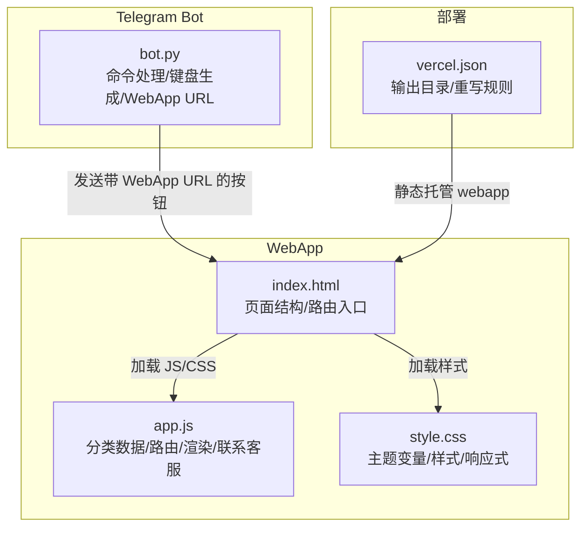
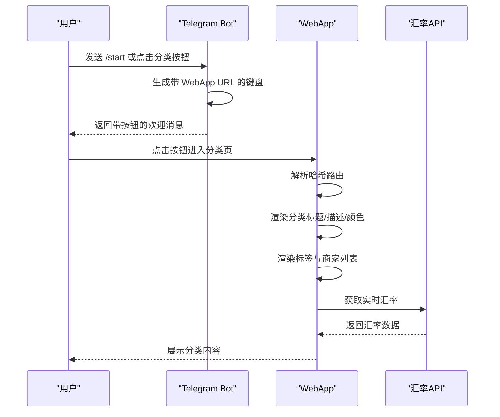
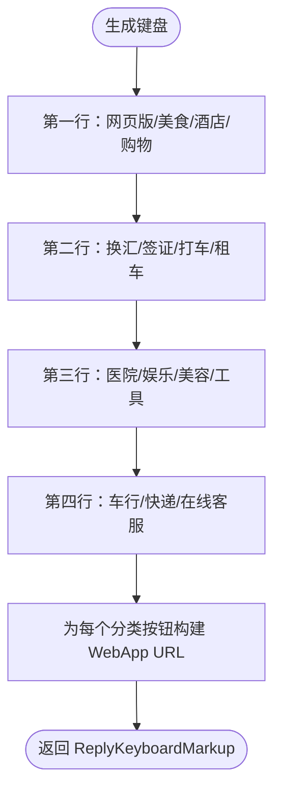
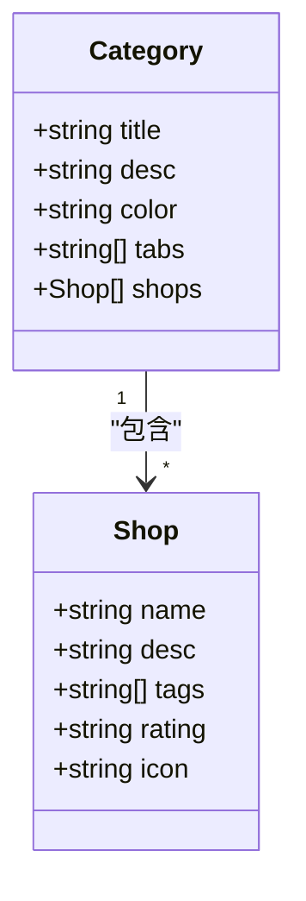
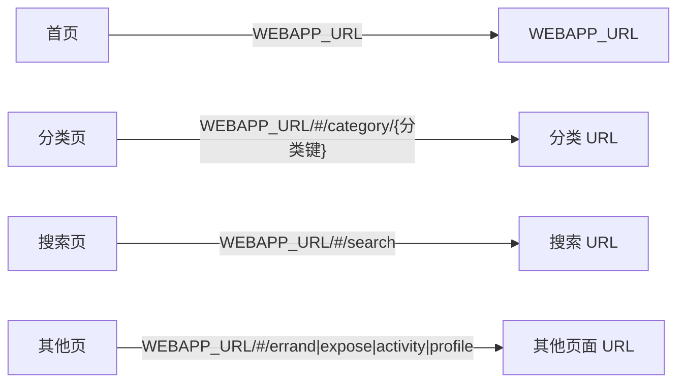
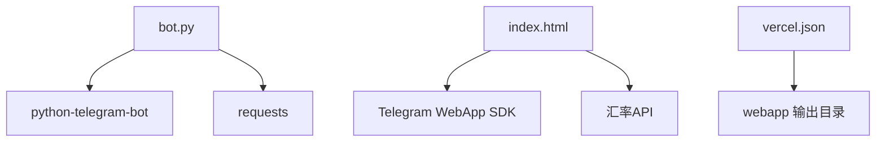

# 服务分类系统

<cite>
**本文档引用的文件**
- [bot.py](file://bot/bot.py)
- [app.js](file://webapp/js/app.js)
- [index.html](file://webapp/index.html)
- [style.css](file://webapp/css/style.css)
- [requirements.txt](file://bot/requirements.txt)
- [vercel.json](file://vercel.json)
</cite>

## 目录
1. [简介](#简介)
2. [项目结构](#项目结构)
3. [核心组件](#核心组件)
4. [架构总览](#架构总览)
5. [详细组件分析](#详细组件分析)
6. [依赖关系分析](#依赖关系分析)
7. [性能考虑](#性能考虑)
8. [故障排除指南](#故障排除指南)
9. [结论](#结论)
10. [附录](#附录)

## 简介
本项目为“木姐同城生活助手”服务分类系统，通过 Telegram 机器人与 WebApp 协同工作，提供12个核心服务分类：美食、住宿、购物、换汇、签证、交通、医疗、娱乐、美容、工具、车行、快递物流。系统采用模块化设计，Bot 负责用户交互与键盘导航，WebApp 提供分类页面、标签筛选、商家展示与实时汇率等功能。本文档将深入解析分类系统的设计理念、数据结构、图标标识、URL 映射关系、键盘布局设计及用户体验优化策略，并提供扩展指南与最佳实践。

## 项目结构
项目采用前后端分离架构：
- Telegram Bot：负责消息处理、菜单生成与 WebApp URL 构建
- WebApp：基于 HTML/CSS/JavaScript 的单页应用，支持路由、分类展示、标签筛选、搜索与联系客服
- 部署配置：使用 Vercel 将 webapp 目录作为静态站点输出

**图表来源**
- [bot.py:14-42](file://bot/bot.py#L14-L42)
- [index.html:1-145](file://webapp/index.html#L1-L145)
- [app.js:1-87](file://webapp/js/app.js#L1-L87)
- [style.css:1-80](file://webapp/css/style.css#L1-L80)
- [vercel.json:1-8](file://vercel.json#L1-L8)

**章节来源**
- [bot.py:1-88](file://bot/bot.py#L1-L88)
- [index.html:1-145](file://webapp/index.html#L1-L145)
- [app.js:1-87](file://webapp/js/app.js#L1-L87)
- [style.css:1-80](file://webapp/css/style.css#L1-L80)
- [vercel.json:1-8](file://vercel.json#L1-L8)

## 核心组件
- Bot 键盘生成器：根据预定义的分类集合生成四行三列的键盘按钮，每个按钮绑定对应的 WebApp URL
- 分类数据模型：在 WebApp 中以对象字典形式存储每个分类的标题、描述、颜色主题、标签数组与商家列表
- 路由与页面切换：通过 URL 哈希路由控制首页、分类页、搜索页等页面显示
- 主题与样式：CSS 变量统一管理主色调与辅助色，支持 Telegram 主题注入
- 联系客服：统一的联系客服入口，支持跳转至 Telegram 客服链接

**章节来源**
- [bot.py:14-42](file://bot/bot.py#L14-L42)
- [app.js:1-87](file://webapp/js/app.js#L1-L87)
- [style.css:1-80](file://webapp/css/style.css#L1-L80)

## 架构总览
系统通过 Bot 的键盘按钮打开 WebApp 对应分类页面，WebApp 内部通过哈希路由切换页面，分类页根据当前分类键值渲染标题、描述、颜色主题、标签与商家卡片。

**图表来源**
- [bot.py:14-42](file://bot/bot.py#L14-L42)
- [app.js:64-84](file://webapp/js/app.js#L64-L84)

**章节来源**
- [bot.py:45-75](file://bot/bot.py#L45-L75)
- [app.js:64-84](file://webapp/js/app.js#L64-L84)

## 详细组件分析

### Bot 键盘与按钮构建机制
- 键盘布局：四行三列，第一行为“网页版”、“美食”、“酒店”、“购物”，第二行为“换汇”、“签证”、“打车”、“租车”，第三行为“医院”、“娱乐”、“美容”、“工具”，第四行为“车行”、“快递”、“在线客服”
- 按钮类型：所有分类按钮均为 WebApp 类型，点击后打开指定分类的 WebApp 页面
- URL 映射：每个按钮的 WebApp URL 为“WEBAPP_URL/#/category/{分类键}”，其中分类键对应 app.js 中的分类对象键
- 客服按钮：单独的“在线客服”按钮用于跳转至 Telegram 客服链接

**图表来源**
- [bot.py:18-42](file://bot/bot.py#L18-L42)

**章节来源**
- [bot.py:14-42](file://bot/bot.py#L14-L42)

### 分类数据结构与组织方式
- 数据容器：app.js 中的 C 对象按分类键组织数据，每个分类包含 title、desc、color、tabs、shops 字段
- 标题与描述：title 为分类标题，desc 为简短描述
- 颜色主题：color 为线性渐变背景，用于分类页横幅与标签激活态
- 标签数组：tabs 定义分类下的标签选项，如“全部”、“中餐”、“缅餐”等
- 商家列表：shops 数组包含商家名称、描述、标签、评分、图标等字段
- 颜色主题系统：CSS 变量 --primary、--primary-light 等统一管理主题色；Telegram 主题注入时可覆盖默认色值

**图表来源**
- [app.js:1-49](file://webapp/js/app.js#L1-L49)

**章节来源**
- [app.js:1-49](file://webapp/js/app.js#L1-L49)
- [style.css:1-80](file://webapp/css/style.css#L1-L80)

### WebApp URL 映射关系
- 首页：WEBAPP_URL
- 分类页：WEBAPP_URL/#/category/{分类键}
- 搜索页：WEBAPP_URL/#/search
- 其他页面：WEBAPP_URL/#/errand、/#/expose、/#/activity、/#/profile

**图表来源**
- [bot.py:10-15](file://bot/bot.py#L10-L15)
- [bot.py:18-42](file://bot/bot.py#L18-L42)
- [app.js:64-68](file://webapp/js/app.js#L64-L68)

**章节来源**
- [bot.py:10-15](file://bot/bot.py#L10-L15)
- [bot.py:18-42](file://bot/bot.py#L18-L42)
- [app.js:64-68](file://webapp/js/app.js#L64-L68)

### 分类按钮构建与图标标识
- 图标来源：Bot 键盘按钮文本包含 Unicode 表情符号，如“🍜”、“🏨”、“🏠”等，直观表达分类含义
- WebApp 分类网格：首页提供 8 个常用分类的网格入口，每个项包含圆形图标与文字标签
- 分类页图标：每个分类页横幅与标签卡片使用分类 color 作为背景渐变，保持视觉一致性

**章节来源**
- [bot.py:19-41](file://bot/bot.py#L19-L41)
- [index.html:38-47](file://webapp/index.html#L38-L47)
- [app.js:76-78](file://webapp/js/app.js#L76-L78)

### 键盘布局设计与用户体验优化
- 布局策略：四行三列，符合移动端拇指可达区域；首行包含“网页版”入口，便于直接访问完整站点
- 交互反馈：按钮点击有缩放动画，提升触控反馈；底部导航栏高亮当前页
- 分类页标签：支持横向滚动，标签激活态突出显示，便于快速筛选
- 搜索集成：首页搜索条与热门标签联动，支持一键跳转到相关分类
- 联系客服：统一的客服入口，避免用户迷失；支持 Telegram WebApp 主题注入

**章节来源**
- [bot.py:18-42](file://bot/bot.py#L18-L42)
- [index.html:134-140](file://webapp/index.html#L134-L140)
- [style.css:18-22](file://webapp/css/style.css#L18-L22)
- [style.css:62-64](file://webapp/css/style.css#L62-L64)
- [app.js:80-84](file://webapp/js/app.js#L80-L84)

### 分类扩展指南
- 添加新分类
  - 在 app.js 的 C 对象中新增分类键，设置 title、desc、color、tabs、shops
  - 在 Bot 键盘生成函数中添加新的按钮，确保 URL 指向“#/category/{新分类键}”
  - 如需首页网格入口，可在 index.html 的 category-grid 中添加对应项
- 修改现有分类属性
  - 更新颜色主题：修改 color 值以统一分类页横幅与标签样式
  - 调整标签：修改 tabs 数组以反映新的筛选维度
  - 商家调整：增删改 shops 列表中的条目，确保 icon 与 rating 合理
- 验证与测试
  - 使用浏览器开发者工具检查哈希路由是否正确跳转
  - 在 Telegram 中验证 Bot 键盘按钮是否能打开对应分类页
  - 测试搜索功能是否能正确匹配新分类的商家名称或标签

**章节来源**
- [app.js:1-49](file://webapp/js/app.js#L1-L49)
- [bot.py:18-42](file://bot/bot.py#L18-L42)
- [index.html:38-47](file://webapp/index.html#L38-L47)

### 响应式布局适配
- 视口配置：meta viewport 设置保证在移动设备上正确缩放
- 主题变量：CSS 变量统一管理颜色与尺寸，支持 Telegram 注入主题色
- 网格布局：首页分类网格使用 CSS Grid，自动适配不同屏幕宽度
- 底部导航：固定定位的底部导航栏在移动端提供一致的操作体验
- 动画与过渡：页面切换与按钮交互使用 CSS 动画，提升流畅度

**章节来源**
- [index.html:4-6](file://webapp/index.html#L4-L6)
- [style.css:1-80](file://webapp/css/style.css#L1-L80)

## 依赖关系分析
- Bot 依赖
  - python-telegram-bot：提供 Telegram Bot SDK，支持命令处理器、消息处理器与键盘构建
  - requests：用于获取实时汇率数据
- WebApp 依赖
  - Telegram WebApp SDK：通过 Telegram WebApp API 注入主题与用户信息
  - 外部汇率 API：调用 exchangerate-api.com 获取实时汇率
- 部署依赖
  - Vercel：将 webapp 目录作为静态站点输出，支持路径重写

**图表来源**
- [requirements.txt:1-3](file://bot/requirements.txt#L1-L3)
- [app.js:84-84](file://webapp/js/app.js#L84-L84)
- [vercel.json:1-8](file://vercel.json#L1-L8)

**章节来源**
- [requirements.txt:1-3](file://bot/requirements.txt#L1-L3)
- [app.js:84-84](file://webapp/js/app.js#L84-L84)
- [vercel.json:1-8](file://vercel.json#L1-L8)

## 性能考虑
- 资源加载
  - 将样式与脚本合并为单一文件，减少请求数量
  - 使用 CSS 变量减少重复颜色定义，降低样式体积
- 路由与渲染
  - 哈希路由避免全页面刷新，提升页面切换速度
  - 分类页仅渲染当前分类内容，减少 DOM 节点数量
- 网络请求
  - 汇率 API 请求失败时提供降级文案，避免长时间等待
  - 搜索功能在前端完成匹配，减少服务器压力
- 移动端优化
  - 使用 touch-friendly 的按钮尺寸与间距
  - 避免复杂的阴影与动画影响滚动性能

## 故障排除指南
- Bot 键盘按钮无法打开 WebApp
  - 检查 WEBAPP_URL 环境变量是否正确设置
  - 确认分类键与 URL 中的分类键一致
- 分类页空白或标签不显示
  - 检查 app.js 中 C 对象的分类键是否存在
  - 确认哈希路由解析逻辑是否正确
- 汇率数据不显示
  - 检查网络连接与外部 API 可用性
  - 查看控制台错误信息，确认跨域与权限问题
- Telegram 主题色不生效
  - 确认 Telegram WebApp SDK 已正确初始化
  - 检查 CSS 变量覆盖逻辑是否被正确执行

**章节来源**
- [bot.py:9-11](file://bot/bot.py#L9-L11)
- [app.js:64-68](file://webapp/js/app.js#L64-L68)
- [app.js:84-84](file://webapp/js/app.js#L84-L84)
- [style.css:79-80](file://webapp/css/style.css#L79-L80)

## 结论
本服务分类系统通过 Bot 与 WebApp 的协同，实现了从入口导航到分类展示再到联系客服的完整闭环。系统采用模块化数据结构与统一的主题变量，具备良好的可扩展性与可维护性。通过合理的键盘布局与响应式设计，提升了移动端用户的操作体验。未来可进一步引入缓存策略、懒加载与国际化支持，以增强性能与全球化能力。

## 附录
- 12个服务分类一览
  - 美食：food
  - 住宿：hotel
  - 购物：shopping
  - 换汇：exchange
  - 签证：visa
  - 交通：taxi
  - 医疗：hospital
  - 娱乐：entertainment
  - 美容：beauty
  - 工具：tools
  - 车行：car
  - 快递物流：express
- 开发与部署建议
  - 使用版本控制管理分类数据变更
  - 在 CI/CD 中加入静态资源校验与部署检查
  - 定期监控外部 API 可用性与性能