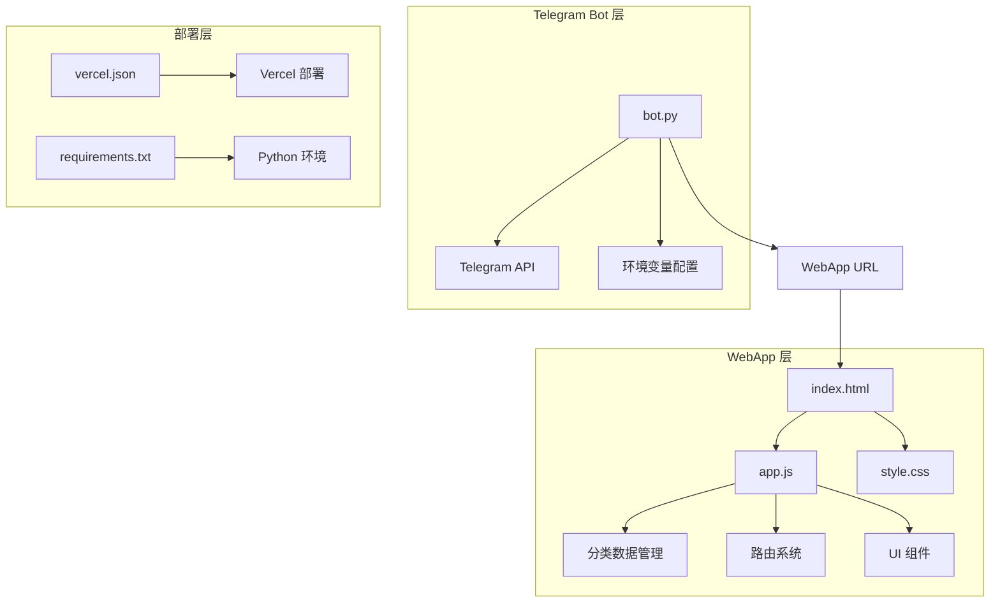
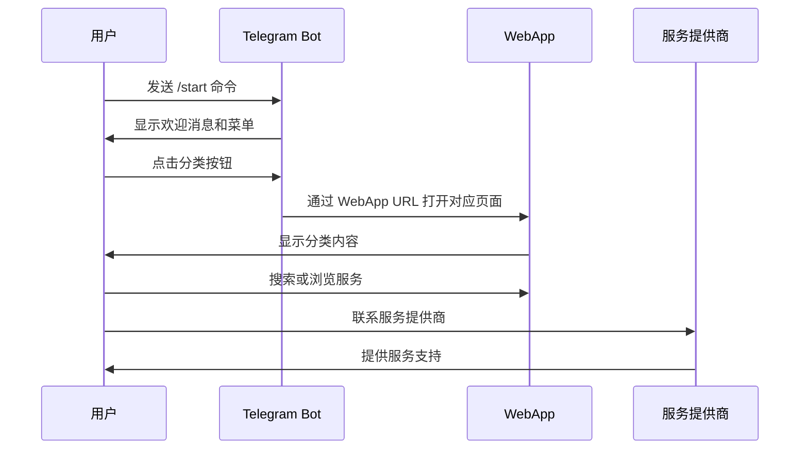
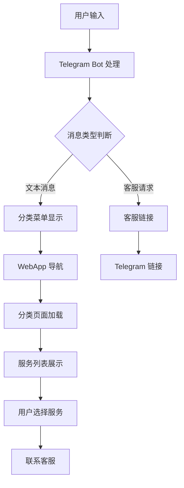
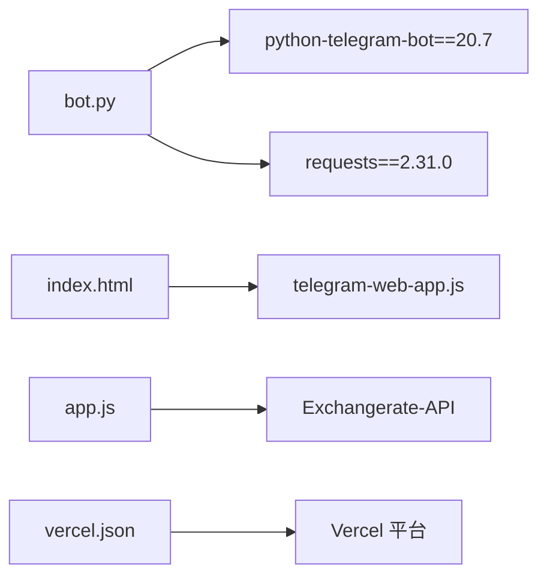
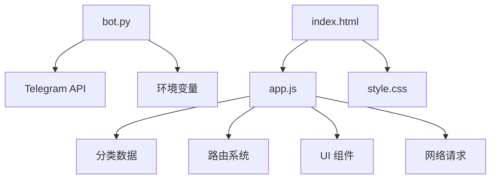

# 核心功能

<cite>
**本文档引用的文件**
- [bot.py](file://bot/bot.py)
- [requirements.txt](file://bot/requirements.txt)
- [index.html](file://webapp/index.html)
- [app.js](file://webapp/js/app.js)
- [style.css](file://webapp/css/style.css)
- [vercel.json](file://vercel.json)
</cite>

## 目录
1. [项目概述](#项目概述)
2. [项目结构](#项目结构)
3. [核心功能模块](#核心功能模块)
4. [架构概览](#架构概览)
5. [详细功能分析](#详细功能分析)
6. [依赖关系分析](#依赖关系分析)
7. [性能考虑](#性能考虑)
8. [故障排除指南](#故障排除指南)
9. [结论](#结论)

## 项目概述

wyszbot 是一个集成 Telegram Bot 和 WebApp 的木姐同城生活助手应用。该项目通过 Telegram 机器人提供便捷的生活服务入口，同时集成了功能丰富的 WebApp，为用户提供全面的本地生活信息服务。

### 主要功能特性

- **12个服务分类系统**：美食、住宿、购物、换汇、签证、交通等全方位生活服务
- **智能菜单导航**：基于 Telegram WebApp 的原生导航体验
- **实时搜索功能**：支持关键词搜索和热门标签推荐
- **在线客服集成**：无缝连接 Telegram 客服渠道
- **响应式 WebApp**：移动端优化的现代化界面设计

## 项目结构

项目采用前后端分离架构，主要分为两个核心部分：

**图表来源**
- [bot.py:1-88](file://bot/bot.py#L1-L88)
- [index.html:1-145](file://webapp/index.html#L1-L145)
- [app.js:1-87](file://webapp/js/app.js#L1-L87)

**章节来源**
- [bot.py:1-88](file://bot/bot.py#L1-L88)
- [index.html:1-145](file://webapp/index.html#L1-L145)
- [vercel.json:1-8](file://vercel.json#L1-L8)

## 核心功能模块

### 1. 服务分类系统

系统提供完整的12个服务分类，覆盖木姐地区居民的日常生活需求：

| 分类 | 图标 | 功能描述 |
|------|------|----------|
| 美食 | 🍜 | 本地餐厅推荐、特色菜品、价格信息 |
| 酒店 | 🏨 | 住宿选择、价格对比、设施介绍 |
| 购物 | 🛒 | 商场指南、特产购买、消费场所 |
| 换汇 | 💱 | 实时汇率、换汇服务、汇率计算 |
| 签证 | 📋 | 签证办理、政策咨询、流程指导 |
| 打车 | 🚕 | 出行服务、包车服务、接送服务 |
| 房租 | 🏠 | 房源信息、租赁条件、价格范围 |
| 医院 | 🏥 | 医疗机构、医疗服务、紧急救助 |
| 娱乐 | 🎮 | 娱乐场所、休闲活动、文化体验 |
| 美容 | 💆 | 美发美甲、美容护理、健康服务 |
| 工具 | 🔧 | 实用工具、翻译服务、计算工具 |
| 车行 | 🚗 | 车辆买卖、维修保养、保险服务 |

### 2. 用户交互功能

#### 菜单导航系统
- **多级菜单结构**：4行×4列的网格布局，支持快速访问
- **WebApp 集成**：每个按钮直接跳转到对应的 WebApp 页面
- **图标标识**：使用 Unicode 字符作为视觉标识，提升识别度

#### 搜索功能
- **智能搜索**：支持按名称和标签搜索
- **热门标签**：提供预设的搜索关键词
- **自动跳转**：搜索结果自动定位到相关分类页面

#### 在线客服
- **一键联系**：专门的客服按钮
- **外部链接**：跳转到 Telegram 客服频道
- **即时响应**：确保用户问题得到及时解决

**章节来源**
- [bot.py:18-42](file://bot/bot.py#L18-L42)
- [app.js:1-49](file://webapp/js/app.js#L1-L49)
- [index.html:38-47](file://webapp/index.html#L38-L47)

## 架构概览

系统采用客户端-服务器架构，通过 Telegram WebApp 提供统一的用户体验：

**图表来源**
- [bot.py:45-58](file://bot/bot.py#L45-L58)
- [app.js:64-76](file://webapp/js/app.js#L64-L76)

### 数据流架构

**图表来源**
- [bot.py:61-74](file://bot/bot.py#L61-L74)
- [app.js:76-82](file://webapp/js/app.js#L76-L82)

## 详细功能分析

### Telegram Bot 核心功能

#### 启动命令处理
Bot 在用户发送 `/start` 命令时，会显示欢迎消息和主菜单。欢迎消息包含项目介绍和功能说明，帮助新用户快速了解 Bot 的能力。

#### 菜单构建系统
通过 `build_menu()` 函数创建4行4列的键盘布局，包含：
- **首页版本按钮**：跳转到 WebApp 主页
- **12个服务分类按钮**：每个按钮都配置了对应的 WebApp URL
- **客服按钮**：提供直接联系客服的功能

#### 消息处理逻辑
Bot 使用条件判断处理不同类型的消息：
- **客服请求**：当用户点击"在线客服"按钮时，显示客服联系方式
- **其他消息**：引导用户使用菜单按钮进行操作

**章节来源**
- [bot.py:45-74](file://bot/bot.py#L45-L74)
- [bot.py:18-42](file://bot/bot.py#L18-L42)

### WebApp 核心功能

#### 路由系统
WebApp 使用哈希路由实现单页应用架构：
- **主页路由**：`/#/` - 显示首页内容
- **分类路由**：`/#/category/:id` - 显示指定分类的服务列表
- **搜索路由**：`/#/search` - 显示搜索页面
- **页面切换**：通过 `navigateTo()` 和 `goBack()` 函数管理页面导航

#### 分类数据管理
所有分类数据都存储在 JavaScript 对象中，包含：
- **分类标题和描述**：用于页面头部显示
- **颜色主题**：每个分类都有独特的渐变色彩
- **标签数组**：用于筛选和分类
- **服务列表**：包含具体的服务提供商信息

#### UI 组件系统
WebApp 采用组件化的界面设计：

##### 首页组件
- **轮播图**：展示热门服务和促销信息
- **搜索栏**：提供全局搜索入口
- **分类网格**：4×3 的服务分类布局
- **汇率卡片**：实时显示人民币对缅币汇率
- **推荐列表**：热门服务推荐

##### 分类页面组件
- **分类头部**：显示分类标题、描述和颜色主题
- **标签筛选**：支持按标签筛选服务
- **服务卡片**：展示服务提供商的详细信息
- **联系按钮**：一键联系服务提供商

##### 其他页面组件
- **跑腿服务**：代购、送件、排队等便民服务
- **曝光台**：不良商家曝光和维权渠道
- **活动页面**：本地文化活动和社区活动
- **个人中心**：用户账户管理和设置

**章节来源**
- [app.js:51-82](file://webapp/js/app.js#L51-L82)
- [index.html:21-140](file://webapp/index.html#L21-L140)

### 用户体验设计

#### 响应式设计
WebApp 采用移动优先的设计理念：
- **最大宽度限制**：限制在 480px 以内，适配手机屏幕
- **弹性布局**：使用 CSS Grid 和 Flexbox 实现自适应布局
- **触摸优化**：按钮和链接都经过触摸友好的尺寸设计

#### 视觉设计
- **色彩系统**：使用暖色调为主，营造温馨的生活服务氛围
- **渐变背景**：每个分类都有独特的渐变色彩主题
- **阴影效果**：使用适度的阴影增强层次感
- **动画效果**：页面切换和元素交互都有流畅的动画过渡

#### 交互设计
- **手势支持**：支持滑动、点击等常见手势
- **状态反馈**：按钮点击有视觉反馈
- **加载指示**：网络请求时显示加载状态
- **错误处理**：网络异常时提供友好的错误提示

**章节来源**
- [style.css:1-80](file://webapp/css/style.css#L1-L80)
- [app.js:56-62](file://webapp/js/app.js#L56-L62)

## 依赖关系分析

### 外部依赖

**图表来源**
- [requirements.txt:1-3](file://bot/requirements.txt#L1-L3)
- [index.html:9](file://webapp/index.html#L9)
- [app.js:84](file://webapp/js/app.js#L84)

### 内部模块依赖

**图表来源**
- [bot.py:1-11](file://bot/bot.py#L1-L11)
- [app.js:1-49](file://webapp/js/app.js#L1-L49)

**章节来源**
- [requirements.txt:1-3](file://bot/requirements.txt#L1-L3)
- [vercel.json:1-8](file://vercel.json#L1-L8)

## 性能考虑

### 前端性能优化

#### 资源加载优化
- **按需加载**：只有当前页面的资源会被加载
- **缓存策略**：合理利用浏览器缓存机制
- **图片优化**：使用渐变背景替代大量图片资源

#### 运行时性能
- **虚拟滚动**：对于大量数据的列表，可以考虑实现虚拟滚动
- **防抖处理**：搜索功能已经内置防抖机制
- **内存管理**：及时清理定时器和事件监听器

### 后端性能优化

#### Bot 性能
- **异步处理**：使用异步函数处理消息，避免阻塞
- **环境变量**：通过环境变量管理配置，便于部署和扩展
- **日志记录**：完善的日志系统便于性能监控和问题排查

#### WebApp 性能
- **静态资源**：通过 Vercel CDN 加速静态资源加载
- **路由优化**：单页应用架构减少页面切换开销
- **数据缓存**：汇率等数据可以缓存一段时间

## 故障排除指南

### 常见问题及解决方案

#### Bot 无法启动
1. **检查环境变量**：确认 `BOT_TOKEN` 和 `WEBAPP_URL` 设置正确
2. **验证 API 权限**：确保 Bot 具有发送消息和使用 WebApp 的权限
3. **查看日志输出**：根据启动日志中的错误信息进行排查

#### WebApp 页面无法加载
1. **检查网络连接**：确认网络连接正常
2. **验证 URL 地址**：确认 WebApp URL 配置正确
3. **清除浏览器缓存**：尝试清除浏览器缓存后重新加载

#### 分类数据显示异常
1. **检查数据格式**：确认分类数据的 JSON 格式正确
2. **验证标签匹配**：确保搜索功能使用的标签格式一致
3. **查看控制台错误**：通过浏览器开发者工具查看 JavaScript 错误

#### 汇率数据获取失败
1. **检查 API 可用性**：确认 Exchangerate-API 服务正常运行
2. **网络连接检查**：验证网络连接和防火墙设置
3. **备用方案**：考虑添加多个汇率 API 作为备用

**章节来源**
- [bot.py:77-83](file://bot/bot.py#L77-L83)
- [app.js:84](file://webapp/js/app.js#L84)

## 结论

wyszbot 项目成功实现了 Telegram Bot 与 WebApp 的深度集成，为用户提供了一站式的同城生活服务解决方案。项目具有以下优势：

### 技术优势
- **架构清晰**：前后端分离设计，职责明确
- **用户体验优秀**：原生 WebApp 提供流畅的移动端体验
- **可扩展性强**：模块化设计便于功能扩展和定制

### 功能完整性
- **覆盖全面**：12个服务分类满足日常生活主要需求
- **交互友好**：直观的菜单导航和搜索功能
- **实时性强**：汇率等数据的实时更新

### 部署便利性
- **简单部署**：通过 Vercel 可以快速部署静态网站
- **成本低廉**：主要依赖免费的第三方服务
- **易于维护**：代码结构清晰，便于后续维护和升级

### 改进建议
1. **数据库集成**：可以考虑添加数据库存储用户偏好和历史记录
2. **推送通知**：实现基于用户的个性化服务推荐
3. **多语言支持**：增加英文等其他语言支持
4. **数据分析**：添加用户行为分析功能，优化服务推荐算法

该项目为同城生活服务平台提供了良好的技术基础和用户体验参考，具有较强的实用价值和发展潜力。