# 用户交互功能

<cite>
**本文档引用的文件**
- [bot.py](file://bot/bot.py)
- [requirements.txt](file://bot/requirements.txt)
- [index.html](file://webapp/index.html)
- [app.js](file://webapp/js/app.js)
- [style.css](file://webapp/css/style.css)
</cite>

## 目录
1. [简介](#简介)
2. [项目结构](#项目结构)
3. [核心组件](#核心组件)
4. [架构概览](#架构概览)
5. [详细组件分析](#详细组件分析)
6. [依赖关系分析](#依赖关系分析)
7. [性能考虑](#性能考虑)
8. [故障排除指南](#故障排除指南)
9. [结论](#结论)

## 简介

wyszbot 是一个基于 Telegram 的木姐同城生活助手机器人，提供了完整的用户交互功能。该项目采用 Telegram Bot 和 WebApp 技术相结合的方式，为用户提供了一个集成了多种本地生活服务的智能助手平台。

该系统的核心特点包括：
- 基于 Telegram 的聊天界面
- 内嵌 WebApp 提供丰富的交互体验
- 多语言支持（中文）
- 表情符号增强用户体验
- 完整的服务导航系统
- 实时数据查询功能

## 项目结构

项目采用前后端分离的架构设计，主要分为两个部分：

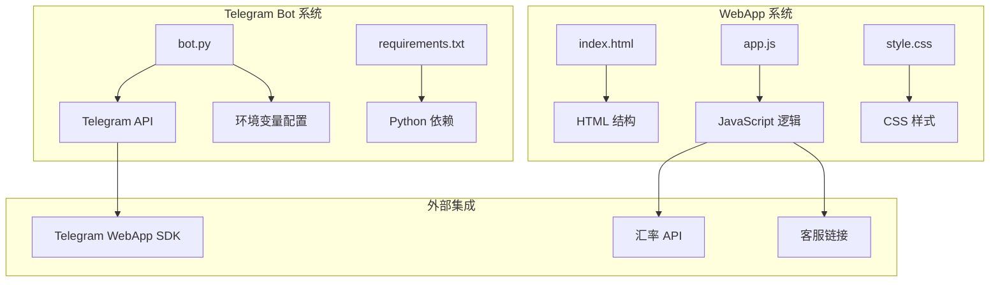

**图表来源**
- [bot.py:1-88](file://bot/bot.py#L1-L88)
- [index.html:1-145](file://webapp/index.html#L1-L145)
- [app.js:1-87](file://webapp/js/app.js#L1-L87)

**章节来源**
- [bot.py:1-88](file://bot/bot.py#L1-L88)
- [index.html:1-145](file://webapp/index.html#L1-L145)
- [app.js:1-87](file://webapp/js/app.js#L1-L87)
- [style.css:1-80](file://webapp/css/style.css#L1-L80)

## 核心组件

### Telegram Bot 核心功能

系统的核心是基于 python-telegram-bot 库构建的 Telegram 机器人，主要包含以下功能模块：

1. **菜单导航系统**：通过键盘按钮提供服务分类导航
2. **欢迎消息系统**：动态生成个性化的欢迎消息
3. **客服连接功能**：提供一键联系客服的便捷通道
4. **消息处理机制**：处理用户输入并提供相应的响应

### WebApp 交互系统

WebApp 部分提供了丰富的前端交互功能：

1. **服务分类展示**：按类别组织各种本地服务
2. **搜索功能**：支持关键词搜索和热门标签
3. **实时数据展示**：显示汇率等实时信息
4. **用户界面设计**：响应式设计，适配移动设备

**章节来源**
- [bot.py:14-43](file://bot/bot.py#L14-L43)
- [bot.py:45-75](file://bot/bot.py#L45-L75)
- [app.js:1-87](file://webapp/js/app.js#L1-L87)

## 架构概览

系统采用客户端-服务器架构，结合 Telegram 的 WebApp 技术：

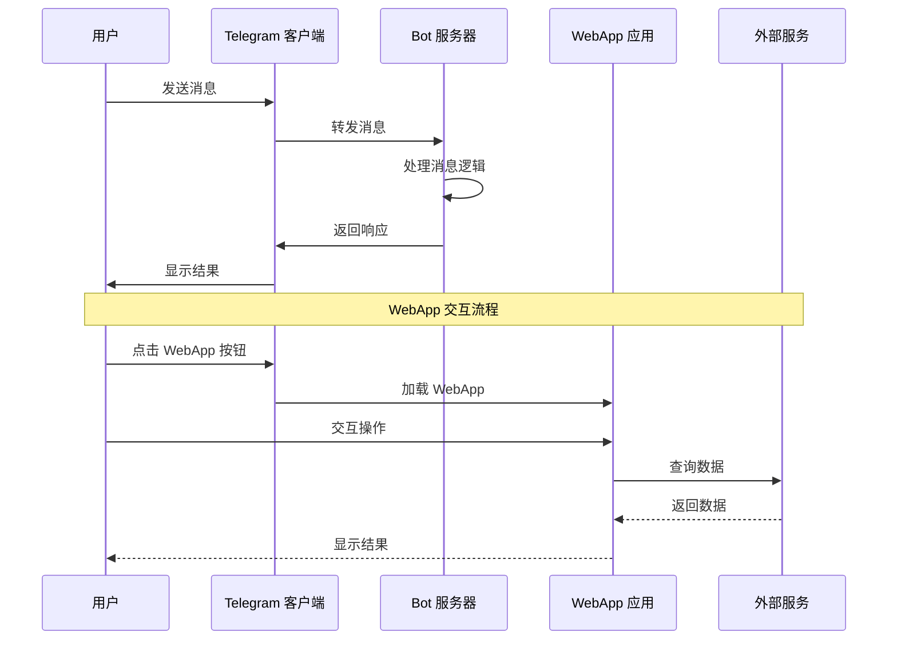

**图表来源**
- [bot.py:77-88](file://bot/bot.py#L77-L88)
- [app.js:51-54](file://webapp/js/app.js#L51-L54)

## 详细组件分析

### 菜单导航系统

菜单导航系统是用户交互的核心，通过 Telegram 的键盘按钮提供直观的服务分类：

#### 菜单构建逻辑

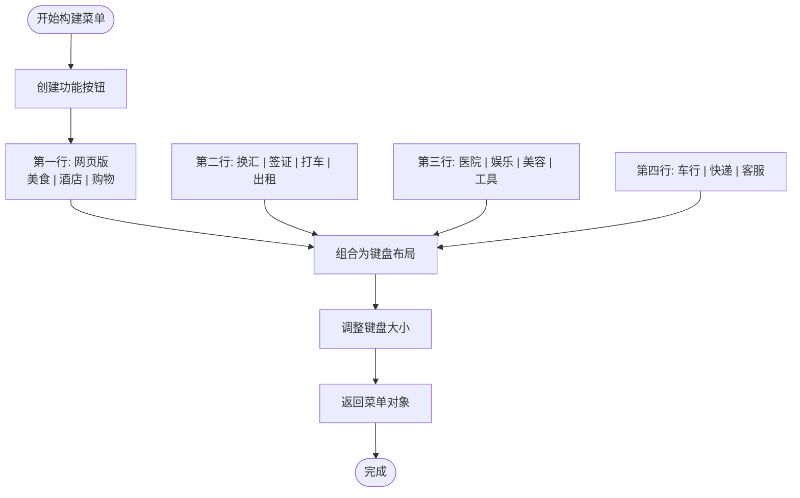

**图表来源**
- [bot.py:18-42](file://bot/bot.py#L18-L42)

菜单系统包含以下功能分类：
- **基础服务**：网页版、美食、酒店、购物
- **金融服务**：换汇、签证
- **出行服务**：打车、房屋租赁
- **生活服务**：医院、娱乐、美容、工具
- **交通服务**：车行、快递
- **客户服务**：在线客服

#### 表情符号使用策略

系统广泛使用表情符号来增强用户体验：
- 使用 🍜、🏨、🛒 等直观的表情符号标识服务类型
- 通过 Unicode 编码确保跨平台兼容性
- 表情符号与服务内容形成视觉关联

**章节来源**
- [bot.py:14-43](file://bot/bot.py#L14-L43)

### 欢迎消息构建逻辑

欢迎消息系统采用动态构建方式，提供个性化的用户问候：

#### 欢迎消息生成流程

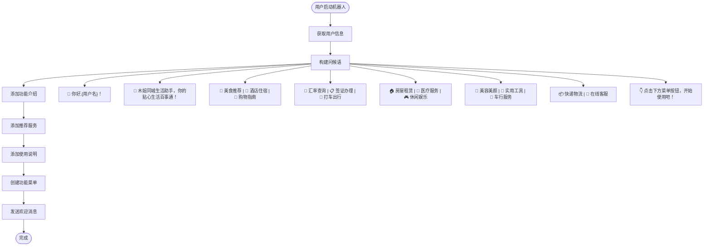

**图表来源**
- [bot.py:45-58](file://bot/bot.py#L45-L58)

欢迎消息的特点：
- **个性化问候**：包含用户的用户名
- **功能介绍**：清晰展示各项服务
- **表情符号增强**：使用相关表情符号提升视觉效果
- **引导性强**：明确指示下一步操作

**章节来源**
- [bot.py:45-58](file://bot/bot.py#L45-L58)

### 搜索功能实现

WebApp 的搜索功能提供了灵活的商品和服务查找方式：

#### 搜索系统架构

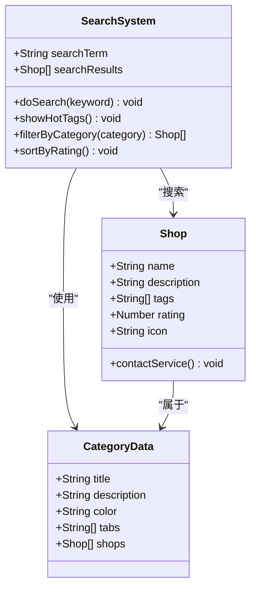

**图表来源**
- [app.js:80-82](file://webapp/js/app.js#L80-L82)
- [app.js:1-49](file://webapp/js/app.js#L1-L49)

搜索功能的关键特性：
- **关键词匹配**：支持名称和标签的模糊搜索
- **热门标签**：提供预设的搜索建议
- **智能跳转**：根据搜索结果自动跳转到对应分类
- **实时反馈**：即时显示搜索结果

**章节来源**
- [app.js:80-82](file://webapp/js/app.js#L80-L82)

### 联系客服流程

客服连接功能提供了便捷的一键联系机制：

#### 客服连接流程

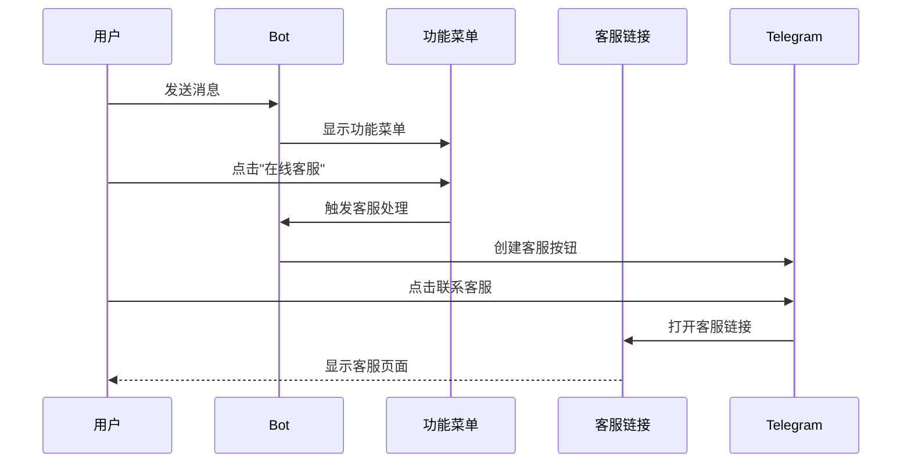

**图表来源**
- [bot.py:61-75](file://bot/bot.py#L61-L75)
- [app.js:80](file://webapp/js/app.js#L80)

客服流程的设计考虑：
- **一键直达**：减少用户操作步骤
- **明确标识**：使用 💬 表情符号标识客服功能
- **可靠连接**：通过 Telegram 的 URL 支持打开外部链接

**章节来源**
- [bot.py:61-75](file://bot/bot.py#L61-L75)
- [app.js:80](file://webapp/js/app.js#L80)

### 用户消息处理机制

系统的消息处理机制采用了事件驱动的方式：

#### 消息处理流程

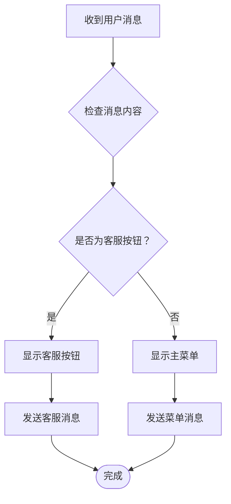

**图表来源**
- [bot.py:61-75](file://bot/bot.py#L61-L75)

消息处理的特点：
- **条件判断**：区分普通消息和特殊按钮
- **上下文保持**：在不同场景下提供合适的响应
- **错误处理**：对未知输入提供友好的提示

**章节来源**
- [bot.py:61-75](file://bot/bot.py#L61-L75)

### 按钮点击响应

WebApp 的按钮点击响应机制提供了流畅的交互体验：

#### 按钮交互流程

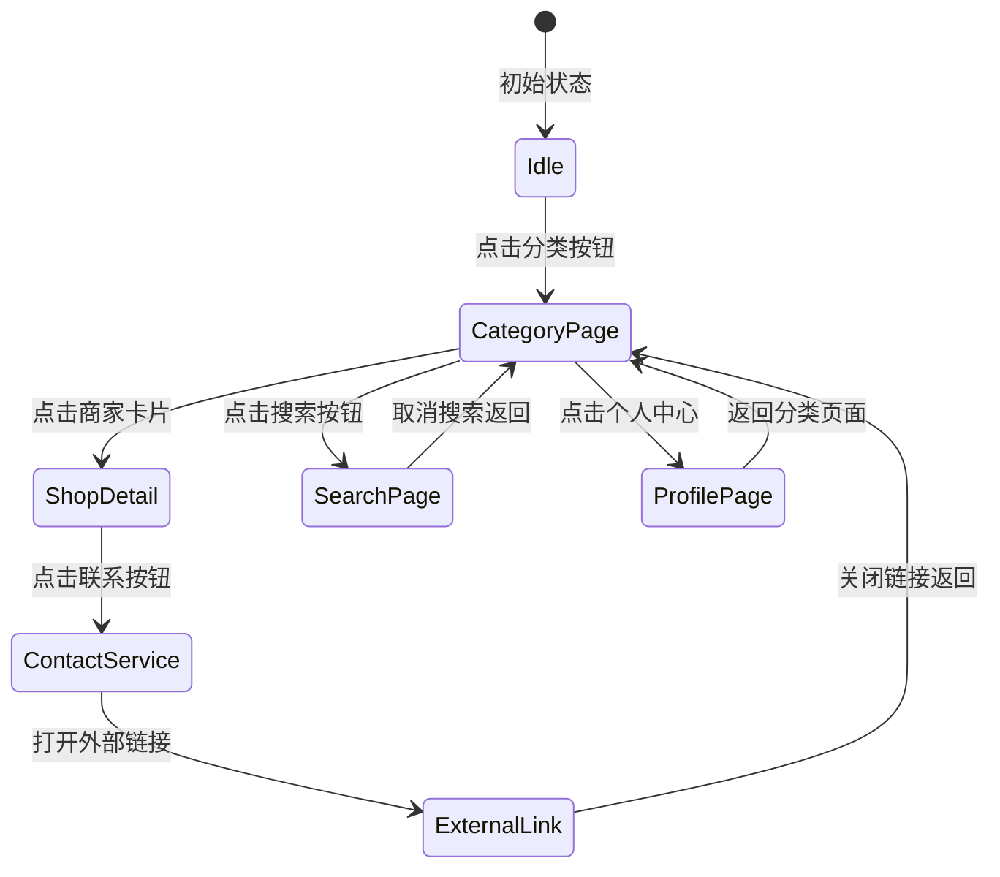

**图表来源**
- [app.js:72-78](file://webapp/js/app.js#L72-L78)
- [app.js:80](file://webapp/js/app.js#L80)

按钮交互的设计原则：
- **一致性**：相同类型的按钮有统一的行为模式
- **可预测性**：用户可以预期按钮的操作结果
- **反馈及时**：提供视觉和触觉反馈确认操作

**章节来源**
- [app.js:72-78](file://webapp/js/app.js#L72-L78)
- [app.js:80](file://webapp/js/app.js#L80)

### 错误消息提示

系统具备基本的错误处理和提示机制：

#### 错误处理策略

虽然当前版本的错误处理相对简单，但系统已经具备了基础的错误检测能力：

- **无效输入处理**：对非预期的消息提供友好的提示
- **客服连接验证**：确保客服链接的有效性
- **菜单状态管理**：维护正确的界面状态

**章节来源**
- [bot.py:70-74](file://bot/bot.py#L70-L74)

### 用户会话管理

系统通过 Telegram 的 WebApp 技术实现了基本的会话管理：

#### 会话管理机制

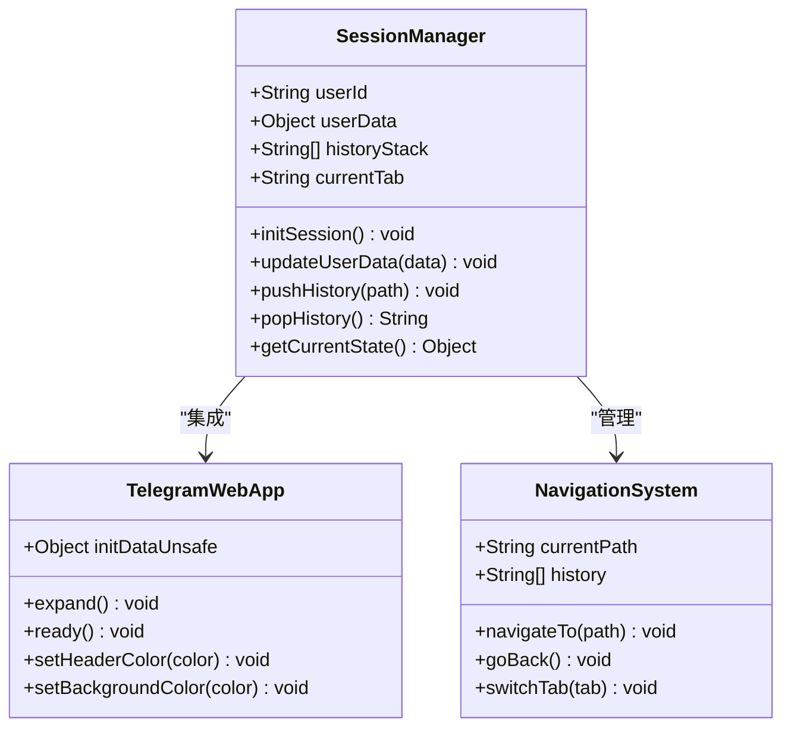

**图表来源**
- [app.js:51-54](file://webapp/js/app.js#L51-L54)
- [app.js:64-70](file://webapp/js/app.js#L64-L70)

会话管理的功能：
- **用户身份识别**：通过 Telegram initDataUnsafe 获取用户信息
- **历史记录管理**：维护页面导航历史
- **状态持久化**：在页面切换时保持必要的状态信息

**章节来源**
- [app.js:51-54](file://webapp/js/app.js#L51-L54)
- [app.js:64-70](file://webapp/js/app.js#L64-L70)

### 多语言支持

系统目前主要支持中文界面，但具备扩展到多语言的能力：

#### 多语言架构

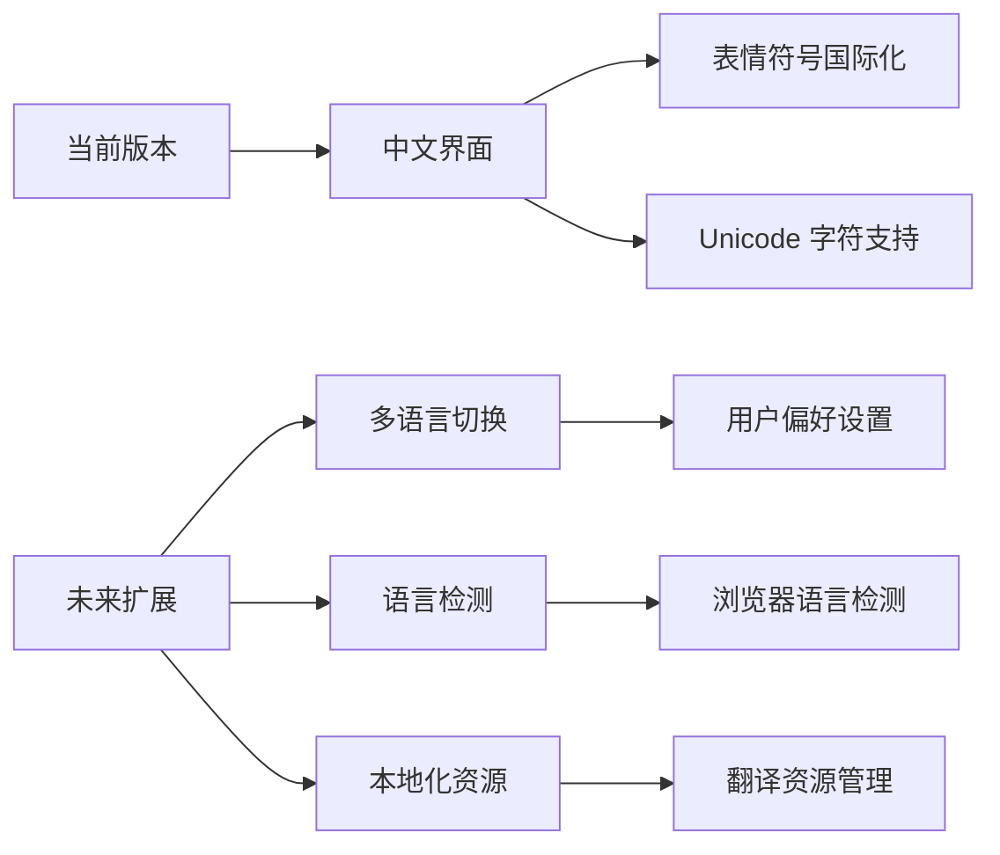

**图表来源**
- [index.html:2](file://webapp/index.html#L2)
- [bot.py:47-56](file://bot/bot.py#L47-L56)

多语言支持的现状和改进方向：
- **现有支持**：完全支持中文字符和表情符号
- **技术基础**：基于 Unicode 的国际化支持
- **扩展潜力**：可以通过配置文件和翻译资源实现多语言

**章节来源**
- [index.html:2](file://webapp/index.html#L2)
- [bot.py:47-56](file://bot/bot.py#L47-L56)

### 个性化推荐功能

系统具备个性化推荐的基础架构：

#### 推荐系统设计

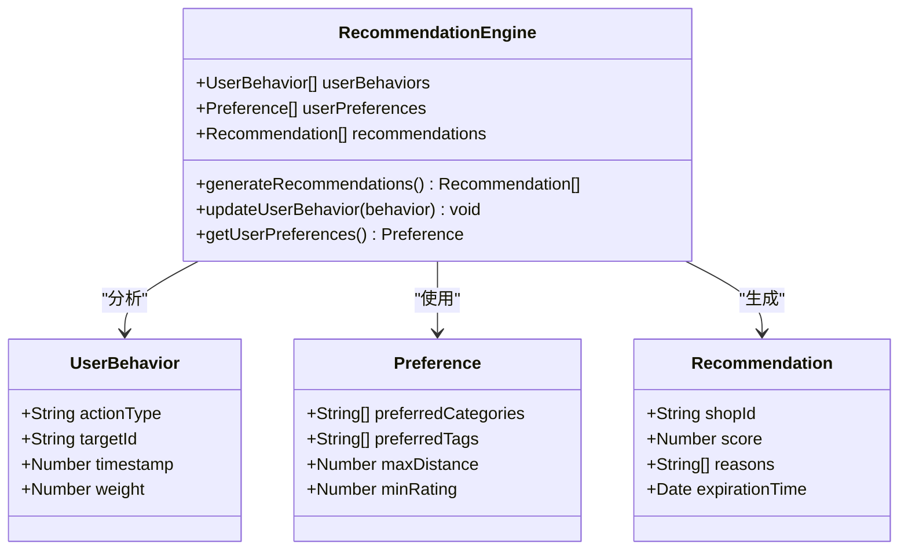

**图表来源**
- [app.js:1-49](file://webapp/js/app.js#L1-L49)

推荐功能的实现基础：
- **用户行为数据**：通过用户交互收集行为数据
- **偏好设置**：基于用户选择建立偏好模型
- **内容匹配**：通过标签和分类进行智能匹配

**章节来源**
- [app.js:1-49](file://webapp/js/app.js#L1-L49)

## 依赖关系分析

系统依赖关系清晰，主要依赖项如下：

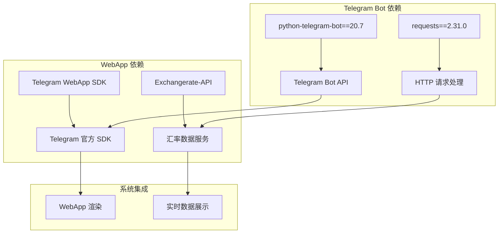

**图表来源**
- [requirements.txt:1-3](file://bot/requirements.txt#L1-L3)
- [app.js:84](file://webapp/js/app.js#L84)

**章节来源**
- [requirements.txt:1-3](file://bot/requirements.txt#L1-L3)
- [app.js:84](file://webapp/js/app.js#L84)

## 性能考虑

系统在设计时考虑了多个性能优化方面：

### 前端性能优化

1. **懒加载机制**：仅在需要时加载页面内容
2. **缓存策略**：利用浏览器缓存减少重复请求
3. **响应式设计**：优化移动端加载速度
4. **图片优化**：使用渐变背景替代大尺寸图片

### 后端性能优化

1. **异步处理**：使用异步函数处理并发请求
2. **内存管理**：合理管理数据结构和缓存
3. **API 限制**：避免频繁调用外部 API
4. **错误恢复**：实现优雅的错误处理机制

## 故障排除指南

### 常见问题及解决方案

#### Telegram Bot 连接问题

**问题症状**：
- Bot 无法接收消息
- 菜单按钮无响应

**解决步骤**：
1. 检查 BOT_TOKEN 环境变量配置
2. 验证 WebApp URL 设置
3. 确认网络连接正常
4. 查看日志输出定位问题

#### WebApp 加载失败

**问题症状**：
- 页面空白或加载缓慢
- 按钮点击无反应

**解决步骤**：
1. 检查网络连接和 DNS 解析
2. 清除浏览器缓存
3. 验证 WebApp URL 可访问性
4. 检查 JavaScript 错误控制台

#### 数据加载问题

**问题症状**：
- 汇率数据不显示
- 商家信息缺失

**解决步骤**：
1. 检查外部 API 服务可用性
2. 验证网络代理设置
3. 查看 API 响应状态码
4. 实现降级策略处理

**章节来源**
- [bot.py:6-11](file://bot/bot.py#L6-L11)
- [app.js:84](file://webapp/js/app.js#L84)

## 结论

wyszbot 项目成功地构建了一个功能完整、用户体验良好的 Telegram 交互系统。系统的主要优势包括：

### 技术优势

1. **架构清晰**：前后端分离的设计便于维护和扩展
2. **用户体验优秀**：表情符号、动画效果提升了交互质量
3. **功能完整**：涵盖了本地生活的各个方面
4. **技术栈成熟**：使用稳定可靠的开源技术

### 设计亮点

1. **多语言支持**：基于 Unicode 的国际化支持
2. **响应式设计**：适配各种移动设备
3. **个性化体验**：动态欢迎消息和用户状态管理
4. **实时数据**：集成汇率等实时信息服务

### 改进建议

1. **增强错误处理**：完善异常情况下的用户提示
2. **扩展多语言**：增加更多语言支持选项
3. **优化性能**：实现更高效的缓存和数据加载策略
4. **增强推荐**：开发更智能的个性化推荐算法

该系统为 Telegram 平台上的本地生活服务应用提供了一个优秀的参考实现，具有良好的扩展性和维护性。