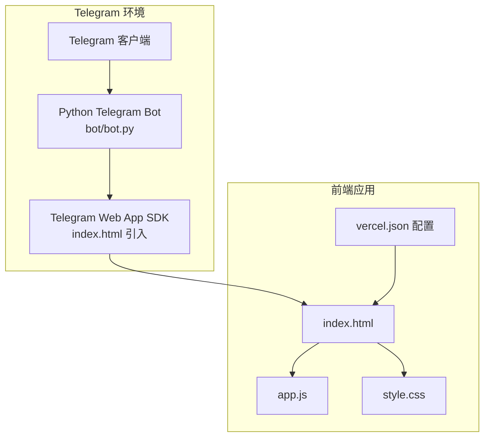
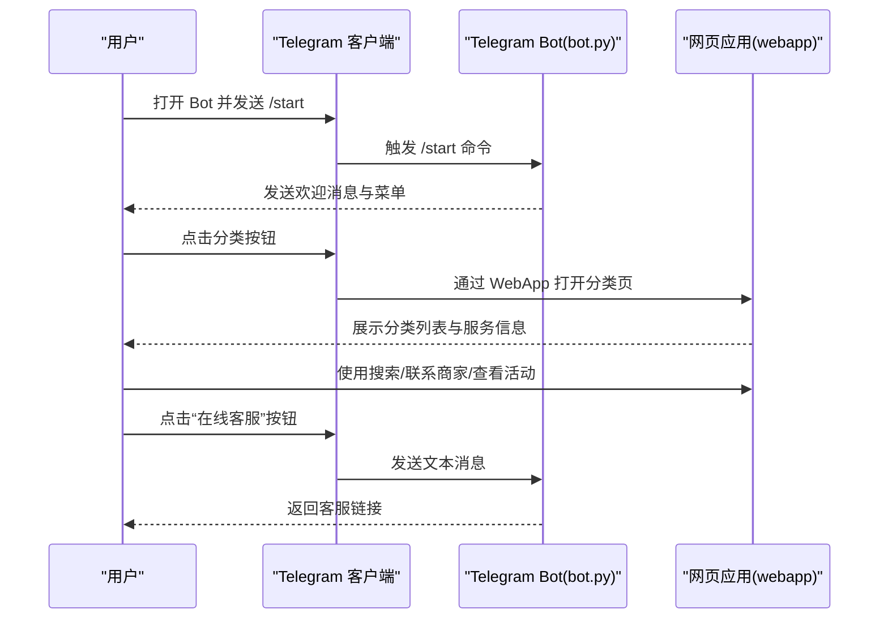
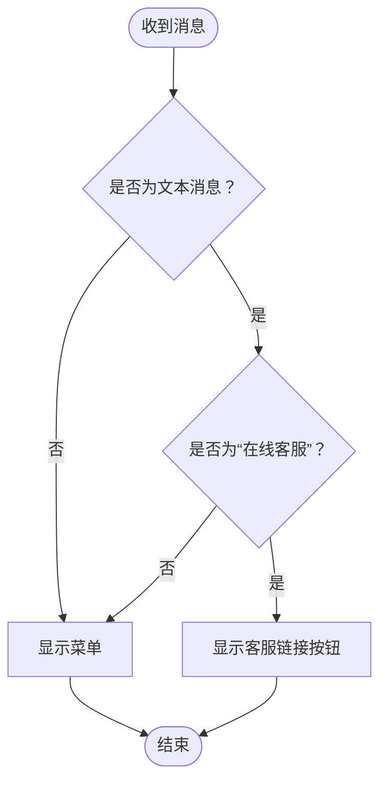
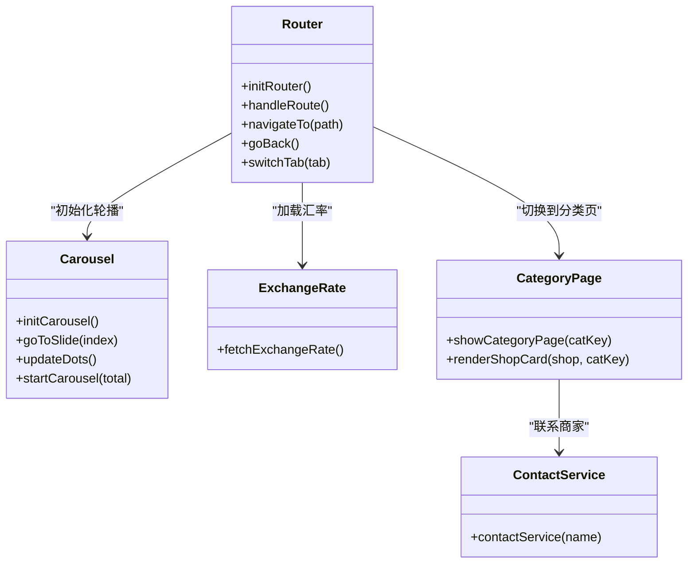
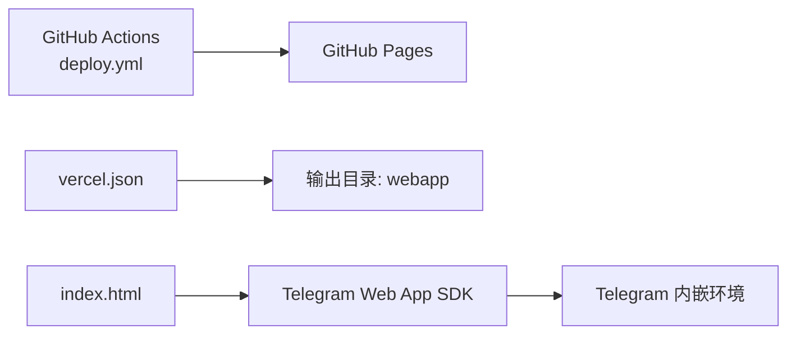
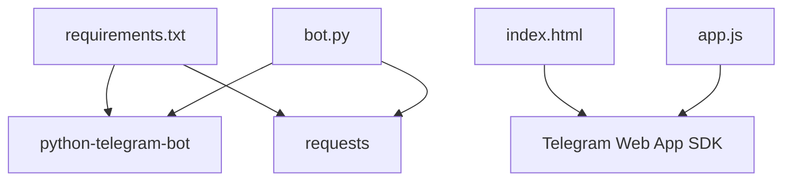

# 目标用户

<cite>
**本文引用的文件**
- [bot.py](file://bot/bot.py)
- [requirements.txt](file://bot/requirements.txt)
- [index.html](file://webapp/index.html)
- [app.js](file://webapp/js/app.js)
- [style.css](file://webapp/css/style.css)
- [vercel.json](file://vercel.json)
- [deploy.yml](file://.github/workflows/deploy.yml)
</cite>

## 目录
1. [简介](#简介)
2. [项目结构](#项目结构)
3. [核心组件](#核心组件)
4. [架构总览](#架构总览)
5. [详细组件分析](#详细组件分析)
6. [依赖分析](#依赖分析)
7. [性能考虑](#性能考虑)
8. [故障排查指南](#故障排查指南)
9. [结论](#结论)
10. [附录](#附录)

## 简介
本项目为“木姐同城生活助手”，面向在缅甸木姐地区生活的华人居民、短期访客与商务人士，提供基于 Telegram 的即时服务入口与网页应用，覆盖餐饮、住宿、购物、换汇、签证、交通、医疗、娱乐、美容、工具、车行、快递物流等高频生活服务场景。项目通过 Telegram Bot 提供菜单导航与客服入口，并在网页应用中以分类浏览、搜索、轮播、实时汇率等功能满足用户的日常查询与应急求助需求。

## 项目结构
项目采用前后端分离架构：
- 前端：静态网页应用（HTML/CSS/JS），托管于 GitHub Pages 或 Vercel（根据配置），通过 Telegram Web App SDK 在 Telegram 内嵌环境中运行。
- 后端：Telegram Bot，负责启动命令、消息处理与键盘菜单生成，点击分类按钮直接打开前端分类页面。

图表来源
- [bot.py:1-88](file://bot/bot.py#L1-L88)
- [index.html:1-145](file://webapp/index.html#L1-L145)
- [app.js:1-87](file://webapp/js/app.js#L1-L87)
- [style.css:1-80](file://webapp/css/style.css#L1-L80)
- [vercel.json:1-8](file://vercel.json#L1-L8)

章节来源
- [bot.py:1-88](file://bot/bot.py#L1-L88)
- [index.html:1-145](file://webapp/index.html#L1-L145)
- [app.js:1-87](file://webapp/js/app.js#L1-L87)
- [style.css:1-80](file://webapp/css/style.css#L1-L80)
- [vercel.json:1-8](file://vercel.json#L1-L8)
- [.github/workflows/deploy.yml:1-31](file://.github/workflows/deploy.yml#L1-L31)

## 核心组件
- Telegram Bot（bot/bot.py）
  - 启动命令与欢迎消息
  - 文本消息处理与键盘菜单
  - 客服链接按钮
- 前端网页应用（webapp/*）
  - 首页轮播、搜索栏、分类网格
  - 分类页（美食、酒店、购物、换汇、签证、车行、快递、医疗、娱乐、美容、工具、租房、车行）
  - 跑腿服务、曝光台、活动、个人中心
  - 实时汇率卡片与热门推荐
  - 底部导航与路由切换
- 部署与环境
  - GitHub Pages 工作流（deploy.yml）
  - Vercel 输出目录配置（vercel.json）

章节来源
- [bot.py:45-75](file://bot/bot.py#L45-L75)
- [index.html:21-140](file://webapp/index.html#L21-L140)
- [app.js:51-84](file://webapp/js/app.js#L51-L84)
- [deploy.yml:13-31](file://.github/workflows/deploy.yml#L13-L31)
- [vercel.json:1-8](file://vercel.json#L1-L8)

## 架构总览
系统由 Telegram Bot 作为入口，用户通过 Bot 的键盘按钮进入前端网页应用的对应分类或功能页。Bot 本身不存储业务数据，仅负责引导与客服通道；前端应用负责展示内容、交互与部分实时数据（如汇率）。

图表来源
- [bot.py:45-75](file://bot/bot.py#L45-L75)
- [index.html:33-47](file://webapp/index.html#L33-L47)
- [app.js:64-76](file://webapp/js/app.js#L64-L76)

## 详细组件分析

### Telegram Bot 组件分析
- 功能职责
  - 启动命令：生成欢迎消息与键盘菜单
  - 文本消息处理：识别“在线客服”并返回客服链接；否则提示使用菜单
  - 键盘按钮：首页网页版、分类按钮（美食、酒店、购物、换汇、签证、打车、租房、医院、娱乐、美容、工具、车行、快递、在线客服）
- 数据与状态
  - 读取环境变量作为 Bot Token 与 WebApp URL
  - 不保存用户状态，所有状态在前端应用中管理
- 错误处理
  - 默认回退提示使用菜单；客服按钮直接跳转外部链接

图表来源
- [bot.py:61-75](file://bot/bot.py#L61-L75)

章节来源
- [bot.py:14-43](file://bot/bot.py#L14-L43)
- [bot.py:45-75](file://bot/bot.py#L45-L75)
- [requirements.txt:1-3](file://bot/requirements.txt#L1-L3)

### 前端网页应用组件分析
- 页面与导航
  - 首页：轮播图、搜索栏、分类网格、实时汇率、热门推荐
  - 分类页：按类别展示服务卡片，支持标签筛选
  - 跑腿页：代购、送件、排队、其他服务
  - 曝光页：不良商家/诈骗信息曝光与“我要曝光”
  - 活动页：同城活动列表与“发布活动”
  - 个人中心：订单、收藏、发布、反馈、关于、联系客服
- 交互与路由
  - 底部导航切换首页/跑腿/曝光/活动/我的
  - Hash 路由驱动页面切换与返回
  - 搜索页支持热门关键词直达
- 实时数据
  - 实时汇率：调用公开汇率接口，展示人民币/美元对缅币汇率
- 主题与适配
  - 支持 Telegram Web App 主题变量，移动端响应式布局

图表来源
- [app.js:51-84](file://webapp/js/app.js#L51-L84)
- [index.html:134-140](file://webapp/index.html#L134-L140)

章节来源
- [index.html:21-140](file://webapp/index.html#L21-L140)
- [app.js:51-84](file://webapp/js/app.js#L51-L84)
- [style.css:1-80](file://webapp/css/style.css#L1-L80)

### 部署与集成点
- GitHub Pages 工作流：自动构建并部署 webapp 目录至 Pages
- Vercel 配置：输出目录为 webapp，重写规则确保前端路由可用
- Telegram Web App SDK：在 index.html 中引入，用于在 Telegram 内嵌环境中运行

图表来源
- [deploy.yml:13-31](file://.github/workflows/deploy.yml#L13-L31)
- [vercel.json:1-8](file://vercel.json#L1-L8)
- [index.html:9](file://webapp/index.html#L9)

章节来源
- [deploy.yml:13-31](file://.github/workflows/deploy.yml#L13-L31)
- [vercel.json:1-8](file://vercel.json#L1-L8)
- [index.html:9](file://webapp/index.html#L9)

## 依赖分析
- 外部依赖
  - python-telegram-bot：Telegram Bot 开发框架
  - requests：HTTP 请求（用于汇率接口）
- 内部耦合
  - Bot 与前端通过 WebApp URL 关联，Bot 负责入口与客服，前端负责内容与交互
  - 前端通过 Telegram Web App SDK 获取用户信息并应用主题

图表来源
- [requirements.txt:1-3](file://bot/requirements.txt#L1-L3)
- [bot.py:1-11](file://bot/bot.py#L1-L11)
- [index.html:9](file://webapp/index.html#L9)
- [app.js:54](file://webapp/js/app.js#L54)

章节来源
- [requirements.txt:1-3](file://bot/requirements.txt#L1-L3)
- [bot.py:1-11](file://bot/bot.py#L1-L11)
- [index.html:9](file://webapp/index.html#L9)
- [app.js:54](file://webapp/js/app.js#L54)

## 性能考虑
- 前端性能
  - 轮播图自动播放与分页点切换，建议控制动画频率与 DOM 更新频率，避免卡顿
  - 分类页渲染大量卡片时，可考虑虚拟滚动或分页加载
  - 搜索与热门标签点击应避免重复请求，增加防抖策略
- 网络性能
  - 汇率接口调用建议缓存结果并在一定时间窗口内复用，减少网络请求
  - 图片与图标尽量使用矢量或轻量资源，优化首屏加载
- 移动端体验
  - 保持底部导航与点击区域尺寸合理，避免误触
  - 适配不同屏幕尺寸，确保文字与图标清晰可读

## 故障排查指南
- Bot 无法启动
  - 检查环境变量是否正确设置（Token 与 WebApp URL）
  - 查看日志输出确认 Bot 是否成功连接
- 键盘按钮无效
  - 确认按钮 URL 与 WebApp URL 一致
  - 检查 Telegram Web App SDK 是否正常加载
- 前端页面空白或路由异常
  - 检查 vercel.json 输出目录配置是否为 webapp
  - 确认 GitHub Pages 工作流已成功部署
- 汇率不更新
  - 检查网络访问与第三方汇率接口可用性
  - 增加错误兜底显示默认值
- 用户无法联系客服
  - 确认“在线客服”按钮逻辑与外部链接有效

章节来源
- [bot.py:77-83](file://bot/bot.py#L77-L83)
- [bot.py:14-43](file://bot/bot.py#L14-L43)
- [index.html:9](file://webapp/index.html#L9)
- [vercel.json:1-8](file://vercel.json#L1-L8)
- [deploy.yml:13-31](file://.github/workflows/deploy.yml#L13-L31)
- [app.js:84](file://webapp/js/app.js#L84)

## 结论
本项目通过 Telegram Bot 与网页应用的组合，为木姐地区的华人居民、短期访客与商务人士提供了便捷的生活服务入口。Bot 负责引导与客服，前端负责内容与交互，整体设计简洁直观，适合移动设备使用。建议后续在用户体验与数据性能方面持续优化，增强用户留存与满意度。

## 附录

### 目标用户画像与使用故事

- 华人居民（长期居住者）
  - 特点：对本地生活服务有稳定需求，关注性价比与信任度
  - 需求：餐饮、住宿、换汇、快递、医疗、娱乐、美容、工具、租房、车行
  - 使用习惯：通过 Bot 快速进入分类页，使用搜索与热门标签定位服务，关注实时汇率与活动
  - 使用场景：日常采购、家庭出行、子女教育、老人就医、节日活动
  - 用户故事：用户在 Bot 中选择“换汇”，进入前端分类页查看信誉良好的换汇点，使用“联系商家”按钮与服务商沟通，同时关注实时汇率变化以把握时机

- 短期访客（旅游/探亲）
  - 特点：停留时间有限，需要快速获取信息与服务
  - 需求：餐饮、住宿、交通、购物、汇率、紧急求助
  - 使用习惯：通过 Bot 进入首页轮播与搜索，优先选择评分高、标签明确的服务
  - 使用场景：初到木姐的适应期、临时需求（如打车、快递）、突发情况（如身体不适）
  - 用户故事：游客在 Bot 中点击“美食”与“酒店”，通过分类页筛选“中餐”与“经济型”，使用“联系商家”快速预订，遇到问题时通过“在线客服”获得帮助

- 商务人士（跨境工作/贸易）
  - 特点：对效率与安全性要求高，关注合规与成本
  - 需求：换汇、签证、快递、车行、医疗、工具（翻译/计算）
  - 使用习惯：通过分类页快速定位专业服务，关注标签与评分，优先选择跨境/专业服务
  - 使用场景：跨境交易、商务接待、紧急事务处理
  - 用户故事：商务人士在 Bot 中选择“换汇”与“快递”，在分类页查看“中缅”相关服务，使用“联系商家”完成交易与物流安排，必要时通过“在线客服”解决争议

- 紧急求助与信息获取
  - 场景：突发疾病、被骗、物品丢失、活动变更
  - 行为：通过 Bot 进入“曝光台”或“在线客服”，在“活动”页面获取最新动态
  - 满足点：快速曝光与求助渠道、实时活动信息、便捷联系

- 用户反馈与改进建议
  - 增强搜索体验：加入智能推荐与历史记录
  - 优化客服流程：在 Bot 中增加常见问题快捷回复
  - 提升数据准确性：定期校验汇率与服务信息
  - 加强安全保障：在“曝光台”中增加举报机制与审核流程