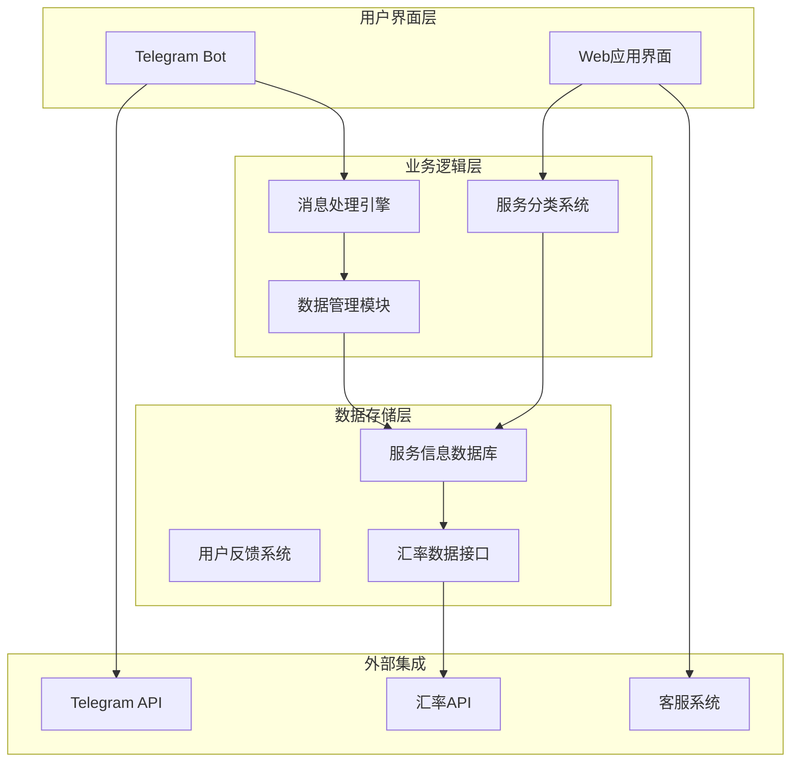
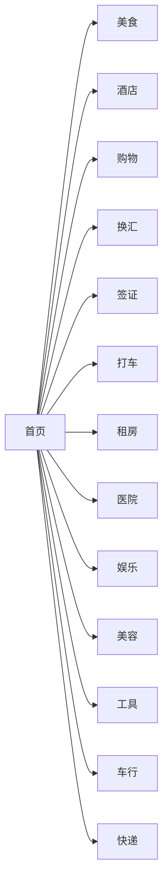
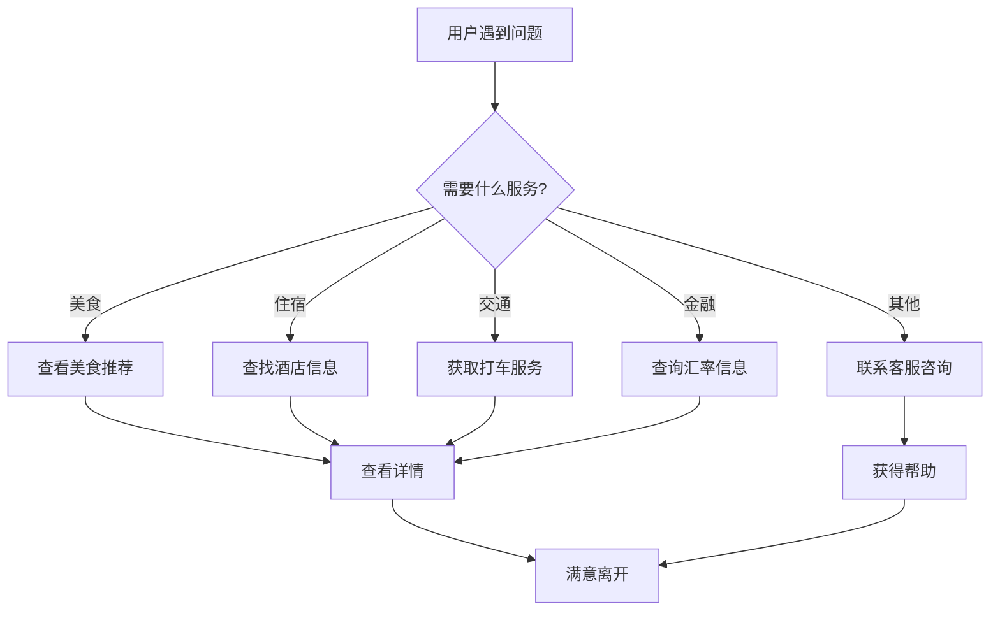
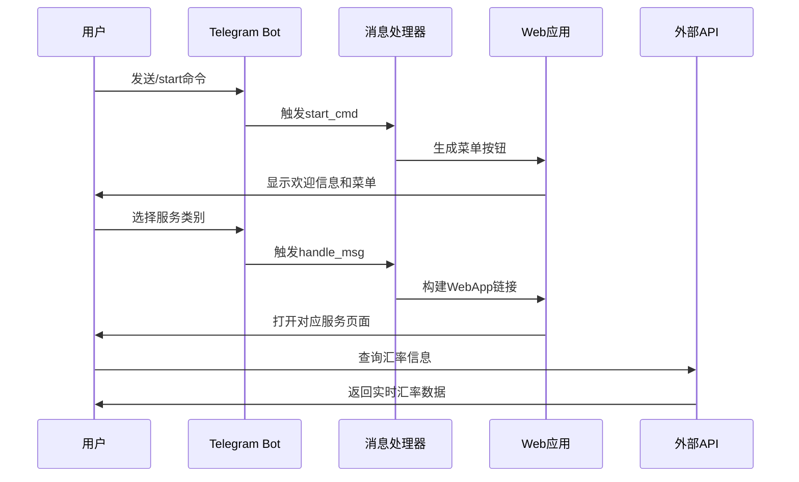

# 项目介绍

<cite>
**本文档引用的文件**
- [bot.py](file://bot/bot.py)
- [requirements.txt](file://bot/requirements.txt)
- [index.html](file://webapp/index.html)
- [app.js](file://webapp/js/app.js)
- [style.css](file://webapp/css/style.css)
- [vercel.json](file://vercel.json)
</cite>

## 目录
1. [项目概述](#项目概述)
2. [核心使命与愿景](#核心使命与愿景)
3. [项目架构设计](#项目架构设计)
4. [核心功能模块](#核心功能模块)
5. [技术创新特色](#技术创新特色)
6. [目标用户分析](#目标用户分析)
7. [社会价值与文化意义](#社会价值与文化意义)
8. [未来发展展望](#未来发展展望)
9. [技术实现细节](#技术实现细节)
10. [结语](#结语)

## 项目概述

wyszbot 是一个专门为在缅甸木姐地区生活的华人社区打造的本地化生活服务平台。该项目通过 Telegram 机器人和 Web 应用程序相结合的方式，为海外华人提供全方位的生活信息服务，包括餐饮美食、住宿交通、金融服务、医疗健康等各个方面的实用信息。

项目采用现代化的技术架构，结合 Telegram 的即时通讯优势和 Web 应用的交互体验，为用户提供无缝的移动服务体验。整个系统以用户体验为中心，注重实用性、易用性和可扩展性。

## 核心使命与愿景

### 核心使命
**为在缅甸木姐地区生活的华人提供便捷、可靠、全面的本地化生活服务信息平台。**

项目致力于解决海外华人在异国他乡面临的各种生活难题，包括：
- 语言沟通障碍：提供中缅双语服务和实时翻译功能
- 生活便利需求：整合各类生活服务信息和联系方式
- 信息服务缺失：建立权威的信息发布和验证机制
- 文化适应困难：促进中缅文化交流，维护华人社区权益

### 发展愿景
- **短期目标**：建立覆盖木姐地区主要生活服务领域的信息平台
- **中期规划**：扩展服务范围至周边地区，增加更多实用功能
- **长期愿景**：发展成为中缅边境地区最具影响力的华人服务平台

## 项目架构设计

### 整体架构图

**架构特点**：
- **双端一体**：同时支持 Telegram 机器人和 Web 应用
- **模块化设计**：各功能模块相对独立，便于维护和扩展
- **数据驱动**：以服务信息为核心的数据结构化管理
- **API 集成**：充分利用外部服务提升用户体验

### 技术栈选择

**前端技术**：
- HTML5 + CSS3 + JavaScript ES6
- 响应式设计，适配移动端设备
- Telegram Web App SDK 集成

**后端技术**：
- Python 3.x + python-telegram-bot
- 异步消息处理机制
- 环境变量配置管理

**部署架构**：
- Web 应用部署在 Vercel 平台
- Telegram 机器人通过环境变量配置
- 数据接口采用 RESTful API 设计

## 核心功能模块

### 1. 服务分类导航系统

项目提供 12 个主要服务类别，每个类别都有专门的页面和功能：

**功能特色**：
- **图标化设计**：每个服务类别配有独特的表情符号标识
- **评分系统**：展示服务质量和用户评价
- **标签筛选**：支持按类型、价格、距离等条件筛选
- **实时更新**：定期更新服务信息和联系方式

### 2. 实时汇率查询功能

集成多个汇率 API，提供实时的中缅汇率信息：

- **人民币兑缅币**：支持 CNY/MMK 实时汇率
- **美元兑缅币**：支持 USD/MMK 实时汇率  
- **自动更新机制**：每间隔时间自动刷新汇率数据
- **异常处理**：网络异常时提供默认汇率值

### 3. 搜索与推荐系统

- **智能搜索**：支持按名称、标签、类型的多维度搜索
- **热门推荐**：根据用户行为和评价生成个性化推荐
- **地理位置**：结合木姐地区的实际位置提供就近服务
- **收藏功能**：用户可以收藏常用服务和商家

### 4. 客服与反馈系统

- **在线客服**：提供即时联系客服的功能
- **问题反馈**：收集用户意见和建议
- **服务曝光**：建立不良商家曝光机制
- **活动发布**：支持用户发布和参与本地活动

## 技术创新特色

### 1. Telegram Web App 集成

项目深度集成了 Telegram Web App SDK，提供了原生应用般的用户体验：

- **沉浸式界面**：全屏显示，无浏览器地址栏干扰
- **主题适配**：自动适配 Telegram 的深色/浅色主题
- **用户信息**：获取 Telegram 用户的基本信息
- **分享功能**：支持内容分享到 Telegram

### 2. 响应式设计优化

针对移动端设备进行了专门优化：
- **触摸友好**：按钮大小和间距适合手指操作
- **手势支持**：支持滑动、点击等常见手势
- **性能优化**：减少资源加载，提升页面响应速度
- **离线缓存**：部分内容支持离线访问

### 3. 数据结构化管理

采用 JSON 格式存储服务数据，便于维护和扩展：
- **统一格式**：所有服务信息遵循相同的数据结构
- **标签系统**：支持多维标签分类和筛选
- **评分机制**：标准化的服务质量评估体系
- **图标关联**：每个服务类别对应独特的视觉标识

## 目标用户分析

### 用户画像特征

**主要用户群体**：
- 在木姐地区居住的华人居民
- 经常往返中缅之间的商务人士
- 刚到木姐的华人新移民
- 有特定生活服务需求的华人

**用户需求痛点**：
- **语言沟通**：中缅语言差异导致的信息获取困难
- **生活便利**：寻找可靠的本地服务和商家
- **信息准确性**：难以区分真实可靠的服务信息
- **社交需求**：缺乏华人社区交流平台

### 用户使用场景

## 社会价值与文化意义

### 对海外华人的服务贡献

**生活便利化**：
- 减少语言和文化差异带来的生活不便
- 提供权威可靠的生活信息服务
- 建立华人社区内部的信息共享机制

**文化传承与交流**：
- 促进中缅两国文化的交流与融合
- 维护华人的文化认同感和归属感
- 提供华人社区活动的组织平台

**经济互助**：
- 支持华人小商户的发展
- 促进华人社区内部的经济合作
- 提供创业和就业信息

### 社会责任体现

**信息真实性保障**：
- 建立信息验证机制，避免虚假信息传播
- 提供用户评价和监督功能
- 及时更新过期或变更的服务信息

**社区建设**：
- 增强华人社区的凝聚力
- 提供紧急情况下的互助渠道
- 促进不同背景华人的相互了解

## 未来发展展望

### 功能扩展计划

**短期目标（3-6个月）**：
- 增加更多服务类别和商家数量
- 优化搜索算法，提升匹配精度
- 添加用户个人中心功能
- 建立服务评价和信誉体系

**中期目标（6-12个月）**：
- 开发移动端原生应用
- 增加语音识别和翻译功能
- 建立线下服务预约系统
- 扩展到其他中缅边境城市

**长期愿景（1-3年）**：
- 成为中缅边境地区最大的华人服务平台
- 建立完整的华人社区生态系统
- 探索商业化运营模式
- 影响更多海外华人社区

### 技术发展方向

**智能化升级**：
- AI 智能推荐算法
- 自然语言处理技术
- 大数据分析用户行为
- 机器学习优化服务质量

**生态化建设**：
- 第三方开发者平台
- 服务提供商入驻系统
- 广告和营销服务
- 金融服务集成

## 技术实现细节

### Telegram 机器人架构

**核心特性**：
- **异步消息处理**：支持高并发的消息处理
- **状态管理**：维护用户对话状态和上下文
- **环境配置**：通过环境变量管理配置参数
- **错误处理**：完善的异常捕获和恢复机制

### Web 应用技术实现

**前端架构**：
- **模块化设计**：JavaScript 采用 IIFE 模式封装
- **事件驱动**：基于事件的页面路由和状态管理
- **DOM 操作**：轻量级的 DOM 操作库
- **CSS 变量**：使用 CSS 自定义属性实现主题切换

**数据管理**：
- **JSON 数据源**：所有服务信息以 JSON 格式存储
- **动态渲染**：根据数据动态生成页面内容
- **本地存储**：支持部分数据的本地缓存
- **API 集成**：实时获取外部数据源信息

### 部署与运维

**部署策略**：
- **静态网站托管**：Web 应用部署在 Vercel 平台
- **环境分离**：开发、测试、生产环境独立配置
- **CDN 加速**：利用 Vercel 的全球 CDN 网络
- **自动部署**：Git 推送触发自动化构建部署

**监控与维护**：
- **日志记录**：详细的系统运行日志
- **性能监控**：页面加载时间和用户行为分析
- **错误追踪**：前端错误自动上报机制
- **数据备份**：定期备份重要数据和服务配置

## 结语

wyszbot 项目不仅是一个技术产品，更是连接中缅两国华人社区的桥梁。它体现了技术服务于人文关怀的理念，通过现代科技手段解决海外华人的实际困难，促进文化交流和社区建设。

项目的成功实施证明了技术创新与社会责任相结合的巨大价值。随着项目的不断发展和完善，相信它能够为更多在异国他乡的华人提供更好的服务，成为他们生活中不可或缺的伙伴。

未来，项目将继续秉承"服务华人、造福社区"的宗旨，不断探索新的技术和模式，为构建更加和谐美好的华人社区贡献力量。