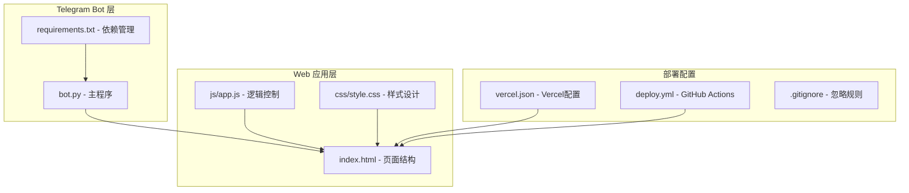
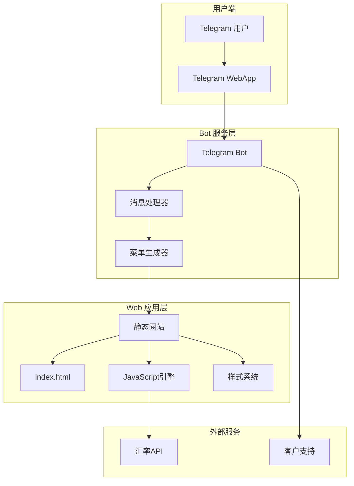
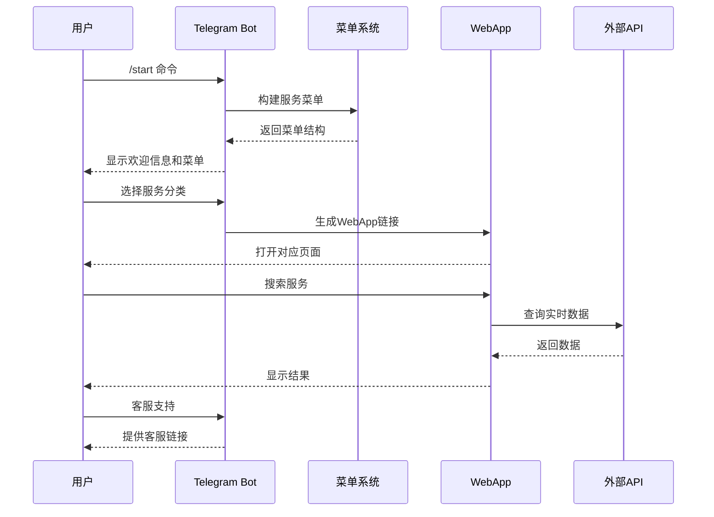
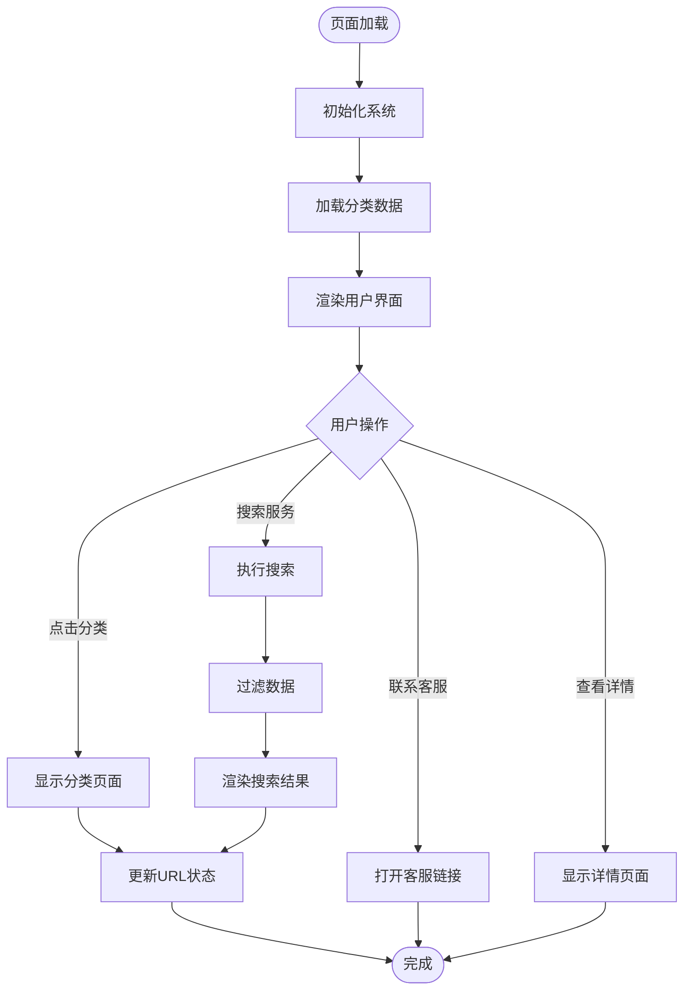
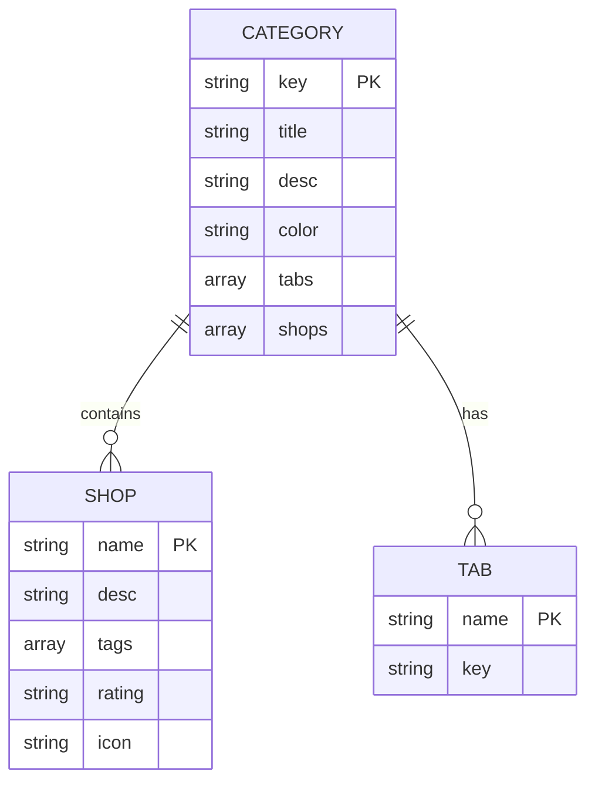
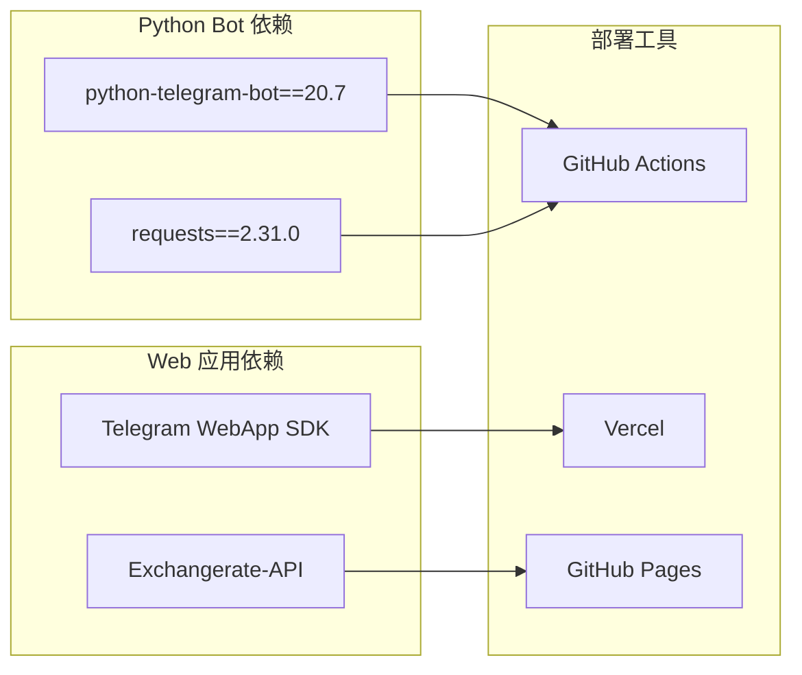
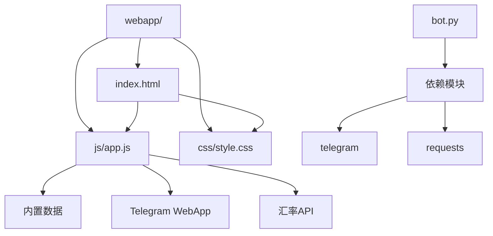

# 项目概述

<cite>
**本文档引用的文件**
- [bot.py](file://bot/bot.py)
- [requirements.txt](file://bot/requirements.txt)
- [index.html](file://webapp/index.html)
- [app.js](file://webapp/js/app.js)
- [style.css](file://webapp/css/style.css)
- [vercel.json](file://vercel.json)
- [deploy.yml](file://.github/workflows/deploy.yml)
- [.gitignore](file://.gitignore)
</cite>

## 目录
1. [项目简介](#项目简介)
2. [项目结构](#项目结构)
3. [核心组件](#核心组件)
4. [架构概览](#架构概览)
5. [详细组件分析](#详细组件分析)
6. [依赖关系分析](#依赖关系分析)
7. [性能考虑](#性能考虑)
8. [故障排除指南](#故障排除指南)
9. [结论](#结论)

## 项目简介

wyszbot 是一个专为在缅甸木姐地区生活的华人社区设计的本地化生活服务平台。该项目通过 Telegram Bot 和 Web 应用相结合的方式，为用户提供全方位的生活服务信息和便利功能。

### 核心目标
- 为木姐地区的华人提供本地化生活服务信息
- 构建便捷的本地服务查询和预约平台
- 提供实时汇率、交通、医疗等实用信息服务
- 建立华人社区互助和信息共享机制

### 目标用户群体
- 在缅甸木姐地区居住的华人居民
- 经常往返中缅边境的商务人士
- 初次到访木姐的华人游客
- 需要了解当地华人服务信息的人群

## 项目结构

项目采用双层架构设计，分为 Telegram Bot 层和 Web 应用层：

**图表来源**
- [bot.py:1-88](file://bot/bot.py#L1-L88)
- [index.html:1-145](file://webapp/index.html#L1-L145)
- [app.js:1-87](file://webapp/js/app.js#L1-L87)

**章节来源**
- [bot.py:1-88](file://bot/bot.py#L1-L88)
- [index.html:1-145](file://webapp/index.html#L1-L145)
- [app.js:1-87](file://webapp/js/app.js#L1-L87)
- [vercel.json:1-8](file://vercel.json#L1-L8)

## 核心组件

### Bot 层组件

Bot 层是整个系统的核心入口，负责与用户交互和路由分发：

#### 主要功能模块
1. **启动命令处理** - 处理 `/start` 命令，向用户发送欢迎信息
2. **菜单构建器** - 动态生成服务分类菜单
3. **消息处理器** - 处理用户文本消息和按钮点击
4. **WebApp 集成** - 通过内嵌 WebApp 提供服务页面

#### 关键特性
- 支持 12 个主要服务分类
- 内置客户支持功能
- 自适应键盘布局
- 多语言友好界面

**章节来源**
- [bot.py:14-43](file://bot/bot.py#L14-L43)
- [bot.py:45-75](file://bot/bot.py#L45-L75)

### Web 应用组件

Web 应用层提供完整的网页版服务体验：

#### 页面结构
1. **首页** - 展示轮播广告、热门推荐、分类导航
2. **分类页面** - 详细的分类服务列表
3. **搜索页面** - 商家和服务搜索功能
4. **跑腿服务** - 同城跑腿服务页面
5. **曝光台** - 不良商家曝光平台
6. **活动页面** - 同城活动信息展示
7. **个人中心** - 用户账户和设置

#### 核心功能
- 响应式设计适配移动设备
- 实时汇率查询功能
- 服务分类导航系统
- 用户交互优化

**章节来源**
- [index.html:21-145](file://webapp/index.html#L21-L145)
- [app.js:1-87](file://webapp/js/app.js#L1-L87)

## 架构概览

项目采用客户端-服务器分离架构，通过 Telegram WebApp 技术实现无缝集成：

**图表来源**
- [bot.py:77-88](file://bot/bot.py#L77-L88)
- [index.html:1-145](file://webapp/index.html#L1-L145)
- [app.js:84-87](file://webapp/js/app.js#L84-L87)

### 技术架构特点

1. **无服务器架构** - 使用 GitHub Pages 和 Vercel 进行托管
2. **静态资源优化** - 所有前端资源均为静态文件
3. **实时数据集成** - 通过 API 获取实时汇率信息
4. **跨平台兼容** - 支持桌面和移动端访问

## 详细组件分析

### Bot 核心流程

**图表来源**
- [bot.py:45-75](file://bot/bot.py#L45-L75)
- [app.js:84-87](file://webapp/js/app.js#L84-L87)

### Web 应用数据流

**图表来源**
- [app.js:51-87](file://webapp/js/app.js#L51-L87)
- [index.html:118-145](file://webapp/index.html#L118-L145)

**章节来源**
- [bot.py:77-88](file://bot/bot.py#L77-L88)
- [app.js:51-87](file://webapp/js/app.js#L51-L87)

### 数据模型设计

项目采用扁平化的数据存储策略，所有服务数据都内置于 JavaScript 文件中：

**图表来源**
- [app.js:1-49](file://webapp/js/app.js#L1-L49)

**章节来源**
- [app.js:1-49](file://webapp/js/app.js#L1-L49)

## 依赖关系分析

### 外部依赖

项目使用了精简但高效的依赖管理策略：

**图表来源**
- [requirements.txt:1-3](file://bot/requirements.txt#L1-L3)
- [deploy.yml:1-31](file://.github/workflows/deploy.yml#L1-L31)

### 内部模块依赖

**图表来源**
- [bot.py:1-10](file://bot/bot.py#L1-L10)
- [index.html:8-9](file://webapp/index.html#L8-L9)

**章节来源**
- [requirements.txt:1-3](file://bot/requirements.txt#L1-L3)
- [deploy.yml:1-31](file://.github/workflows/deploy.yml#L1-L31)

## 性能考虑

### 前端性能优化

1. **静态资源缓存** - 所有前端资源均为静态文件，可充分利用浏览器缓存
2. **响应式设计** - 优化移动端用户体验
3. **懒加载策略** - 图片和内容按需加载
4. **CSS 变量系统** - 统一主题管理和快速样式切换

### 后端性能优化

1. **轻量级架构** - 无数据库依赖，减少服务器负载
2. **API 集成** - 外部 API 处理实时数据，减轻本地计算压力
3. **缓存策略** - WebApp 支持本地缓存机制
4. **CDN 加速** - 通过 GitHub Pages 和 Vercel 提供全球加速

## 故障排除指南

### 常见问题及解决方案

#### Bot 连接问题
- **症状**：Bot 无法接收消息
- **原因**：Token 配置错误或网络连接问题
- **解决**：检查环境变量配置和网络连接

#### WebApp 加载失败
- **症状**：WebApp 页面无法正常显示
- **原因**：URL 配置错误或网络问题
- **解决**：验证 WEBAPP_URL 环境变量设置

#### 汇率数据获取失败
- **症状**：汇率显示异常或空白
- **原因**：外部 API 服务不可用
- **解决**：检查 API 服务状态和网络连接

**章节来源**
- [bot.py:9-11](file://bot/bot.py#L9-L11)
- [app.js:84-87](file://webapp/js/app.js#L84-L87)

## 结论

wyszbot 项目展现了优秀的技术架构设计和用户体验理念。通过简洁而高效的技术栈，成功实现了为特定用户群体提供本地化服务的目标。

### 项目优势

1. **技术选型合理** - 选择了成熟稳定的技术方案
2. **用户体验优秀** - 界面简洁直观，操作流畅
3. **部署简单** - 无需复杂服务器配置即可运行
4. **扩展性强** - 模块化设计便于功能扩展

### 技术亮点

1. **WebApp 集成** - 充分利用 Telegram WebApp 技术
2. **静态化部署** - 降低运维复杂度
3. **响应式设计** - 跨设备兼容性良好
4. **实时数据集成** - 提供准确的实时信息

### 发展建议

1. **数据库迁移** - 随着数据增长考虑引入数据库
2. **用户认证** - 添加用户注册和登录功能
3. **推送通知** - 实现重要信息的主动推送
4. **数据分析** - 添加用户行为分析功能

这个项目为类似本地化服务平台提供了良好的参考模板，展示了如何通过合适的技术选择和设计思路来解决特定场景下的用户需求。